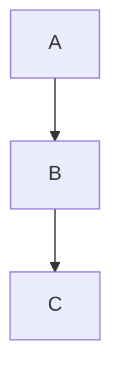

# Markdown Extensions

Cept uses standard Markdown as its primary content format, with a few extensions for rich blocks that go beyond standard Markdown capabilities.

## Standard Markdown

These blocks use standard Markdown syntax:

| Block | Syntax |
| --- | --- |
| Headings | `# `, `## `, `### ` |
| Bold | `**text**` |
| Italic | `*text*` |
| Strikethrough | `~~text~~` |
| Inline code | `` `code` `` |
| Code block | ```` ```lang ``` ```` |
| Bullet list | `- item` or `* item` |
| Numbered list | `1. item` |
| Task list | `- [ ] item` or `- [x] item` |
| Blockquote | `> text` on every line |
| Horizontal rule | `---` |
| Link | `[text](url)` |
| Image | `` |
| Table | Pipe-delimited table syntax |

## Cept Extensions

### Toggles

Toggles use the `> ` prefix with indented content. See the [Toggle Syntax](./toggle-syntax.md) guide for full details.

### Callouts

Callouts use HTML `<div>` tags with data attributes:

```html
<div data-type="callout" data-icon="💡" data-color="default">
  <p>Callout content</p>
</div>
```

### Mermaid Diagrams

Mermaid diagrams use fenced code blocks with the `mermaid` language tag:

````markdown

````

### Math Equations

Math uses LaTeX syntax:

- **Block**: `$$E = mc^2$$`
- **Inline**: `$a^2 + b^2 = c^2$`

## Images

Use standard Markdown image syntax:

```markdown

```

- Alt text is required for all images
- Images render at their natural size, centered, capped at the content width
- Cept does not stretch images to fill the page — small images stay small
- Use GitHub Flavored Markdown (GFM) conventions when standard Markdown is not sufficient

## Design Principles

1. **Standard Markdown first** — Use standard Markdown syntax whenever possible. This is the default for all content that has a natural Markdown representation.
2. **GFM fallback** — When standard Markdown is not sufficient (e.g., tables, task lists, strikethrough), fall back to GitHub Flavored Markdown.
3. **HTML as last resort** — Rich blocks that extend Markdown use HTML with `data-type` attributes. Avoid raw HTML when Markdown or GFM can express the same thing.
4. **Interoperability** — Files can be opened in any Markdown editor; extended blocks render as HTML.
5. **No proprietary format** — Everything is plain text, never binary or opaque.
