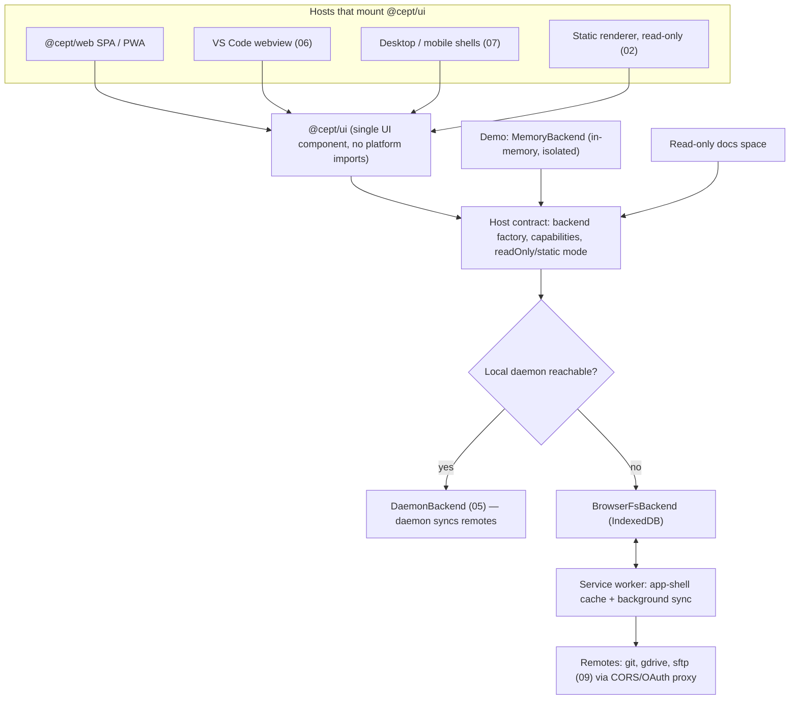
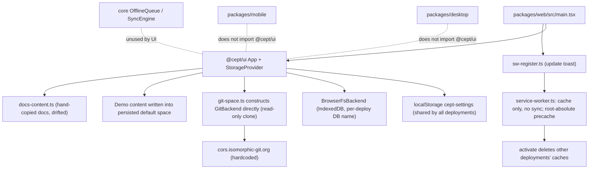
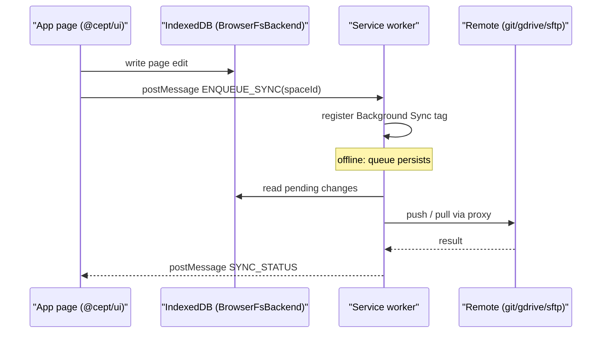

# 01 — Browser app, service worker & PWA

**Status:** Draft, 2026-10-06 · **Area IDs:** `REQ-WEB-NNN`

This spec states the requirements for Cept's browser-facing runtime. That covers the shared UI component (`@cept/ui`), the Vite single-page app that hosts it (`@cept/web`), the service worker, the installable progressive web app (PWA), the demo space, and the GitHub Pages deployment of the app with its read-only docs. Each requirement is checked against the code, the open pull requests and the current documentation as of the date above. Each one records whether it is implemented, whether it is documented as the owner wants, and whether that documentation is accurate.

**Related:**
[Requirements index & traceability matrix](README.md) ·
[02 Static rendering](02-static-rendering.md) ·
[03 Spaces & storage](03-spaces-and-storage.md) ·
[04 Collaboration](04-collaboration.md) ·
[05 CLI & daemon](05-cli-and-daemon.md) ·
[06 VS Code extension](06-vscode-extension.md) ·
[07 Native apps](07-native-apps.md) ·
[08 Editor](08-editor.md) ·
[09 Remotes & auth](09-remotes-and-auth.md) ·
[10 Engineering & CI](10-engineering-and-ci.md) ·
[Original specification](../../SPECIFICATION.md) ·
[TASKS.md](../../../TASKS.md)

---

## 1. Scope & non-goals

### In scope

- `@cept/ui` as the one reusable browser UI component, and its contract with the hosts that mount it.
- `@cept/web`: Vite SPA bootstrap, per-deployment storage namespacing, SPA deep-link fallback.
- The service worker: offline app-shell caching, the update flow, and (as required by the owner) background syncing when no local daemon is present.
- The PWA: manifest, installability, offline editing, and discovery of a local daemon.
- The demo space (in-memory) and how users get into it.
- The GitHub Pages deployment of the app alone (`/cept/app/`), PR previews (`/cept/pr-N/`), and the read-only docs shown inside the app.
- Automated tests of the service worker and PWA against the built bundle.

### Non-goals (covered elsewhere)

| Topic                                                                  | Owner spec                                           |
| ---------------------------------------------------------------------- | ---------------------------------------------------- |
| Static, interface-free rendering of a space; the Cept docs static site | [02-static-rendering.md](02-static-rendering.md)     |
| Storage backends, space model, `space.cept.ya?ml`, nesting             | [03-spaces-and-storage.md](03-spaces-and-storage.md) |
| Yjs / WebRTC co-editing, presence                                      | [04-collaboration.md](04-collaboration.md)           |
| Daemon API and the CLI itself                                          | [05-cli-and-daemon.md](05-cli-and-daemon.md)         |
| VS Code webview host                                                   | [06-vscode-extension.md](06-vscode-extension.md)     |
| Desktop / mobile shells                                                | [07-native-apps.md](07-native-apps.md)               |
| Editor features (WYSIWYG, databases, mermaid, graph)                   | [08-editor.md](08-editor.md)                         |
| Git / GDrive / SFTP remotes, OAuth, CORS proxy                         | [09-remotes-and-auth.md](09-remotes-and-auth.md)     |
| Nx/mise layout, CI scoping, auto-fix workflows                         | [10-engineering-and-ci.md](10-engineering-and-ci.md) |

---

## 2. Requirements summary

Implementation status values: implemented, partial, stubbed, not-started, divergent. Docs status values: documented-as-desired, documented-differently, undocumented. Docs accuracy values: accurate, stale, n/a.

| ID                                                                                  | Requirement                                        | Priority | Impl status | Docs status            | Docs accurate |
| ----------------------------------------------------------------------------------- | -------------------------------------------------- | -------- | ----------- | ---------------------- | ------------- |
| [REQ-WEB-001](#req-web-001--shared-browser-ui-component)                            | Shared browser UI component mounted by every host  | MUST     | partial     | documented-as-desired  | stale         |
| [REQ-WEB-002](#req-web-002--ui-free-of-platform-imports)                            | UI free of platform imports                        | MUST     | partial     | documented-as-desired  | accurate      |
| [REQ-WEB-003](#req-web-003--ui-talks-to-storage-only-through-the-injected-backend)  | UI uses storage only through the injected backend  | MUST     | divergent   | documented-as-desired  | stale         |
| [REQ-WEB-004](#req-web-004--web-spa-boots-fully-functional-on-browser-only-storage) | Web SPA boots on browser-only storage              | MUST     | partial     | documented-as-desired  | stale         |
| [REQ-WEB-005](#req-web-005--service-worker-registered-with-correct-scope)           | Service worker registered at base path             | MUST     | partial     | documented-as-desired  | accurate      |
| [REQ-WEB-006](#req-web-006--service-worker-caches-app-shell-for-offline-use)        | Service worker precaches app shell for offline use | MUST     | partial     | documented-as-desired  | stale         |
| [REQ-WEB-007](#req-web-007--service-worker-handles-syncing)                         | Service worker handles syncing                     | MUST     | not-started | documented-differently | stale         |
| [REQ-WEB-008](#req-web-008--service-worker-update-flow)                             | Service worker update flow                         | SHOULD   | partial     | documented-as-desired  | stale         |
| [REQ-WEB-009](#req-web-009--installable-pwa-manifest)                               | Installable PWA manifest                           | MUST     | partial     | documented-as-desired  | stale         |
| [REQ-WEB-010](#req-web-010--pwa-shares-local-daemon-when-present)                   | PWA shares local daemon when present               | MUST     | not-started | documented-differently | accurate      |
| [REQ-WEB-011](#req-web-011--offline-editing-of-browser-space)                       | Offline editing of browser space                   | MUST     | partial     | documented-as-desired  | stale         |
| [REQ-WEB-012](#req-web-012--demo-space-uses-in-memory-file-storage)                 | Demo space on in-memory storage                    | MUST     | divergent   | documented-differently | stale         |
| [REQ-WEB-013](#req-web-013--demo-entry-points)                                      | Demo entry points (landing, URL, build flag)       | SHOULD   | partial     | documented-differently | stale         |
| [REQ-WEB-014](#req-web-014--demo-reset)                                             | Demo reset                                         | SHOULD   | partial     | documented-as-desired  | accurate      |
| [REQ-WEB-015](#req-web-015--github-pages-deployment-of-just-the-app)                | GitHub Pages deployment of just the app            | MUST     | implemented | documented-as-desired  | stale         |
| [REQ-WEB-016](#req-web-016--pages-deployment-configured-for-demo-space)             | Pages deployment opens the demo space              | MUST     | partial     | documented-differently | stale         |
| [REQ-WEB-017](#req-web-017--read-only-docs-in-the-pages-deployment)                 | Read-only docs in the Pages deployment             | MUST     | partial     | documented-as-desired  | stale         |
| [REQ-WEB-018](#req-web-018--bundled-docs-generated-from-docscontent)                | Bundled docs generated from `docs/content`         | SHOULD   | not-started | undocumented           | n/a           |
| [REQ-WEB-019](#req-web-019--pr-preview-deployments)                                 | PR preview deployments                             | SHOULD   | partial     | documented-as-desired  | stale         |
| [REQ-WEB-020](#req-web-020--per-deployment-storage-isolation)                       | Per-deployment storage isolation                   | MUST     | partial     | undocumented           | n/a           |
| [REQ-WEB-021](#req-web-021--spa-deep-link-fallback-on-pages)                        | SPA deep-link fallback on Pages                    | MUST     | implemented | documented-differently | stale         |
| [REQ-WEB-022](#req-web-022--automated-tests-for-swpwa-on-the-built-bundle)          | Automated SW/PWA tests on the built bundle         | MUST     | partial     | undocumented           | n/a           |
| [REQ-WEB-023](#req-web-023--browser-only-local-folder-spaces)                       | Browser-only local folder spaces                   | SHOULD   | stubbed     | documented-differently | stale         |

Rollup (23 requirements): 2 implemented, 15 partial, 1 stubbed, 3 not-started, 2 divergent.

Verification note (adversarial pass, 2026-10-06): statuses were re-checked against the code at commit `050e03c` and against the live site. A requirement is marked implemented only when its behaviour is wired into the running app and its acceptance criteria hold; where the behaviour exists but tests or other acceptance criteria are missing, it is marked partial.

---

## 3. Architecture

### 3.1 Required architecture

### 3.2 Current architecture (2026-10-06)

### 3.3 Required sync flow when no daemon is present

---

## 4. Requirements

### REQ-WEB-001 — Shared browser UI component

**Statement:** The UI MUST be a single reusable browser component package (`@cept/ui`) that is the only UI implementation, mounted by every host (web/PWA, desktop, mobile, VS Code webview, static renderer).

**Rationale / source:** Owner requirement ("browser component - the UI interface"; the VS Code plugin "uses the same browser component").

**Acceptance criteria:**

- `@cept/ui` exports a documented host contract: a backend or backend factory, a capabilities object, and `readOnly` and `static` modes.
- `@cept/web`, `@cept/desktop`, `@cept/mobile`, the VS Code extension and the static renderer each mount `@cept/ui` and contain no duplicate UI components.
- An Nx dependency-graph check confirms that every host package depends on `@cept/ui`.

**Current state:** partial. [packages/ui/src/index.ts](../../../packages/ui/src/index.ts) exports `App` and `StorageProvider`, and [packages/web/src/main.tsx](../../../packages/web/src/main.tsx) mounts them. A grep for `@cept/ui` in `packages/desktop` and `packages/mobile` finds no matches. No VS Code host or static renderer exists.

**Docs state:** documented-as-desired for web, desktop and mobile, but stale. [platform-support.md](../../content/guides/platform-support.md) (lines 33-50) says "Each platform shell wraps the same `@cept/ui` and `@cept/core` packages", which the desktop and mobile packages do not do. [CLAUDE.md](../../../CLAUDE.md) describes `@cept/ui` as "React components, hooks, stores (no platform deps)", and [docs/SPECIFICATION.md](../../SPECIFICATION.md) has shells share the React app through a `NativeShell` interface. Nothing mentions reuse in VS Code or the static renderer.

**Gap:** Make desktop and mobile mount `@cept/ui`, and define the host contract. See [07-native-apps.md](07-native-apps.md), [06-vscode-extension.md](06-vscode-extension.md) and [02-static-rendering.md](02-static-rendering.md).

### REQ-WEB-002 — UI free of platform imports

**Statement:** `@cept/ui` MUST NOT import platform-specific modules (`electron`, `@capacitor/*`, `node:*`), so it runs unchanged in a browser, a PWA, a webview and native shells.

**Rationale / source:** Existing spec, [CLAUDE.md](../../../CLAUDE.md) Architecture Rule 1.

**Acceptance criteria:**

- An ESLint or Nx module-boundary rule (`platform:none` tag, as in the qontacts monorepo) fails CI on any such import in `packages/ui`.
- A deliberately broken fixture proves that the rule fails.

**Current state:** partial. Direct imports are clean: a grep for `electron`, `@capacitor` and `node:` imports in `packages/ui/src` (tests excluded) finds only TipTap `node:` object keys, no module imports. Transitively, though, `@cept/ui` imports the `@cept/core` barrel, which re-exports `LocalFsBackend` and `GitBackend` ([packages/core/src/index.ts](../../../packages/core/src/index.ts) lines 37-38); [local-fs.ts](../../../packages/core/src/storage/local-fs.ts) (lines 8-10) imports `node:fs` and `node:path`. The web build only succeeds because [packages/web/vite.config.ts](../../../packages/web/vite.config.ts) (lines 11-61) stubs every `node:*` import, so any other host that mounts `@cept/ui` must repeat that workaround. No ESLint or Nx boundary rule exists ([eslint.config.js](../../../eslint.config.js) has no `no-restricted-imports` or `enforce-module-boundaries`).

**Docs state:** documented-as-desired, accurate as to direct imports ([platform-support.md](../../content/guides/platform-support.md) line 49; CLAUDE.md rule 1).

**Gap:** Split platform backends out of the `@cept/core` browser entry point (or add a `browser` export condition), and add the boundary rule. Enforcement belongs to [10-engineering-and-ci.md](10-engineering-and-ci.md).

### REQ-WEB-003 — UI talks to storage only through the injected backend

**Statement:** The browser UI MUST perform all persistence through the injected `StorageBackend` and MUST NOT construct concrete backends itself.

**Rationale / source:** Existing spec, [CLAUDE.md](../../../CLAUDE.md) Architecture Rule 3.

**Acceptance criteria:**

- `packages/ui/src` imports no concrete backend class (`GitBackend`, `BrowserFsBackend`, `WebFsBackend`, `LocalFsBackend`). A lint rule enforces this.
- Remote-space creation goes through a host-supplied factory or service.
- The CORS or OAuth proxy URL is configuration, not a literal in the UI.

**Current state:** divergent. `StorageProvider` takes an injected backend. However, [packages/ui/src/components/storage/git-space.ts](../../../packages/ui/src/components/storage/git-space.ts) (line 8) imports and constructs `GitBackend` and `BrowserFsBackend`. [packages/ui/src/components/App.tsx](../../../packages/ui/src/components/App.tsx) hardcodes `https://cors.isomorphic-git.org` (around lines 363, 467, 987 and 1064). Open [PR #67](https://github.com/nsheaps/cept/pull/67) adds `docs-loader.ts`, which also imports `BrowserFsBackend`.

**Docs state:** documented-as-desired, stale. The rule is written down but the code violates it.

**Gap:** Move remote cloning behind an injected factory supplied by the web host, the service worker or the daemon, and make the proxy configurable. See [09-remotes-and-auth.md](09-remotes-and-auth.md).

### REQ-WEB-004 — Web SPA boots fully functional on browser-only storage

**Statement:** The web app MUST boot to a fully functional state using only browser-local storage (IndexedDB), with no Git, network or filesystem access.

**Rationale / source:** Existing spec ([CLAUDE.md](../../../CLAUDE.md) rule 6; SPECIFICATION 5.10.7). Owner requirement: "locally (browser only)".

**Acceptance criteria:**

- With the network blocked after the bundle loads, a user can create, edit, rename and delete pages, and the changes survive a reload.
- E2E smoke tests cover this path.

**Current state:** partial. The behaviour is wired: [packages/web/src/main.tsx](../../../packages/web/src/main.tsx) (line 15) creates `BrowserFsBackend(getDbName(BASE_URL))`, and [packages/core/src/storage/browser-fs.ts](../../../packages/core/src/storage/browser-fs.ts) uses lightning-fs on IndexedDB. The acceptance tests are missing. [e2e/tests/smoke.spec.ts](../../../e2e/tests/smoke.spec.ts) only checks that the app loads, the landing page, "Try the demo" and "Start writing"; it never reloads, renames or deletes, and never blocks the network. The BDD scenario "Data persists across page reloads" in [features/storage/browser-backend.feature](../../../features/storage/browser-backend.feature) has no step definitions: only `features/example.feature` is loaded, by [features/step-definitions/example.steps.ts](../../../features/step-definitions/example.steps.ts).

**Docs state:** documented-as-desired, stale. [quick-start.md](../../content/getting-started/quick-start.md) (line 11) says "localStorage", and [roadmap.md](../../content/reference/roadmap.md) (line 12) says "Browser storage backend (localStorage)". The storage is actually IndexedDB. (The bundled copy of the quick-start in `docs-content.ts` already says IndexedDB, another sign of drift; see REQ-WEB-018.)

**Gap:** Fix that wording in `docs/content` and the bundled roadmap in `docs-content.ts`, and add a reload-persistence e2e test with the network blocked.

### REQ-WEB-005 — Service worker registered with correct scope

**Statement:** The web build MUST emit a service worker at the deployment base path and register it with a scope equal to that base path, in production, in previews and in local development.

**Rationale / source:** Derived from the owner's service-worker and PWA requirements.

**Acceptance criteria:**

- `dist/service-worker.js` exists at a fixed name.
- `navigator.serviceWorker.controller.scriptURL` equals `${BASE_URL}service-worker.js` on `/cept/app/` and on `/cept/pr-N/`.
- Local `vite preview` registers the service worker. `vite dev` may skip it, but must say so explicitly.

**Current state:** partial. The registration itself is correct: [packages/web/vite.config.ts](../../../packages/web/vite.config.ts) (lines 124-133) adds a `service-worker` rollup input with a fixed, unhashed file name, and [packages/web/src/main.tsx](../../../packages/web/src/main.tsx) (lines 32-34) registers `${BASE_URL}service-worker.js` with the default scope (its own directory). `https://nsheaps.github.io/cept/app/service-worker.js` returns 200 (checked 2026-10-06). Two acceptance criteria fail. In production the worker never reaches `activated` because install fails (REQ-WEB-006), so `navigator.serviceWorker.controller` stays `null`. Under `vite dev` there is no `service-worker.js` to serve, and the registration error is swallowed silently: `main.tsx` passes no `onError` callback to [sw-register.ts](../../../packages/web/src/sw-register.ts) (lines 71-74). The dev behaviour is inferred from the code, not run.

**Docs state:** documented-as-desired, accurate. SPECIFICATION 8.3 names the file `packages/web/src/sw.ts`; the real file is [service-worker.ts](../../../packages/web/src/service-worker.ts), a minor naming drift.

**Gap:** Log or surface registration failures, and say explicitly that dev mode has no service worker. Dev and e2e runs do not exercise the service worker; see REQ-WEB-022.

### REQ-WEB-006 — Service worker caches app shell for offline use

**Statement:** The service worker MUST install successfully and precache the app shell (index, hashed assets, manifest, icons) relative to its base path, so that the app loads offline after the first visit.

**Rationale / source:** Owner requirement (PWA "otherwise uses service worker").

**Acceptance criteria:**

- The precache list is generated from the Vite build manifest and resolved against `self.registration.scope`.
- Cache names include the deployment ID and the build version, and the previous build's caches are removed on activate.
- On a built bundle served under `/cept/app/`, the service worker reaches `activated`, and an offline reload renders the app.

**Current state:** partial. [packages/web/src/service-worker.ts](../../../packages/web/src/service-worker.ts) (lines 49-53) sets `PRECACHE_URLS = ['/', '/index.html', '/manifest.json']`, which are root-absolute. In production `https://nsheaps.github.io/` and `/index.html` return 404. `cache.addAll` rejects on any non-OK response, so install most likely fails in production. This is inferred from Cache API semantics and was not observed in a browser. `STATIC_PATTERNS` of `/^\/assets\//` never matches under the base path; the extension regex still covers `.js` and `.css`. Hashed assets are cached only at runtime.

In addition, the `activate` handler (lines 83-96) deletes every cache whose name is not one of its own three, which includes the caches of other deployments on the same origin (see REQ-WEB-020). The live `service-worker.js` was fetched on 2026-10-06 and contains the same root-absolute precache list.

**Docs state:** documented-as-desired, stale. [platform-support.md](../../content/guides/platform-support.md) (lines 25-31) says "All features work without an internet connection". [roadmap.md](../../content/reference/roadmap.md) (line 28) says "PWA service worker | Done". TASKS T7.3 is checked.

**Gap:** Generate the precache list from the build manifest, resolve it against the scope, version the caches, and add a built-bundle install test (REQ-WEB-022).

### REQ-WEB-007 — Service worker handles syncing

**Statement:** The service worker MUST handle offline caching (precache shell, runtime cache) and queued-write flushing only. Live sync and co-editing run in a SharedWorker (`SyncEngine` in `@cept/core`). The service worker MUST NOT attempt `RTCPeerConnection` or long-lived git operations (SW terminates in ~30 s). Where no SharedWorker is available, a leader tab elected via Web Locks + BroadcastChannel owns the sync loop.

> **Owner direction (D-4+D-5):** SW = offline caching + queued-write flushing; SharedWorker = live sync leadership; `SyncEngine` in `@cept/core`. Proposed refinement on SharedWorker fallback detail pending owner ack.

**Rationale / source:** Owner requirement ("service worker handles syncing").

**Acceptance criteria:**

- A documented `postMessage` protocol between the page and the service worker, covering at least enqueue, status, conflict and auth-required messages.
- The service worker registers a `sync` handler (and `periodicsync` where supported). Where Background Sync is not available, it falls back to replay on `online` and on page load.
- `GitBackend` and `SyncEngine` run in the worker context, against the same lightning-fs IndexedDB store.
- The core `OfflineQueue` is wired in. Edits made offline reach the remote after reconnect, verified by an e2e test against a local git remote.
- If a local daemon is detected (REQ-WEB-010), the service worker does not sync.

**Current state:** not-started. [service-worker.ts](../../../packages/web/src/service-worker.ts) has only `install`, `activate`, `fetch` and `message` handlers. It has no `sync` handler and no remote logic, even though its header comment claims "background sync for pending operations". [packages/core/src/crdt/offline-queue.ts](../../../packages/core/src/crdt/offline-queue.ts) and [packages/core/src/git/sync-engine.ts](../../../packages/core/src/git/sync-engine.ts) exist, but `packages/ui` and `packages/web` do not use them. TASKS P5.4 and P5.10 are unchecked, while T5.8 and T6.5 are checked.

**Docs state:** documented-differently, stale. SPECIFICATION 8.3 gives the service worker only offline and install duties. SPECIFICATION 6.5 defines a `SyncEngine` without saying which context runs it, and the coding guidelines (around line 2766) say to "Use Web Workers for Git operations", not the service worker. The offline page text ("Your changes will sync when reconnected") and [introduction.md](../../content/getting-started/introduction.md) (line 8) both promise sync that does not exist.

**Gap:** The whole sync path: architecture, message protocol, worker-safe git and auth (see [09-remotes-and-auth.md](09-remotes-and-auth.md)), and coordination with CRDT reconciliation (see [04-collaboration.md](04-collaboration.md)). Until it exists, remove the false claims.

### REQ-WEB-008 — Service worker update flow

**Statement:** When a new build is deployed, the app SHOULD detect the waiting service worker, activate it, reload once, and tell the user that a new version is running.

**Rationale / source:** Derived.

**Acceptance criteria:**

- After an update there is exactly one reload (no loop), followed by a visible toast.
- Unit tests cover the `SKIP_WAITING` message, the `controllerchange` reload and the update flag.

**Current state:** partial. The flow is wired: [packages/web/src/sw-register.ts](../../../packages/web/src/sw-register.ts) posts `SKIP_WAITING`, reloads once on `controllerchange` (guarded by a `refreshing` flag) and sets a namespaced session flag, and [packages/web/src/UpdateToast.tsx](../../../packages/web/src/UpdateToast.tsx) shows the version after the reload. The tests do not cover the acceptance criteria: [sw-register.test.ts](../../../packages/web/src/sw-register.test.ts) tests only `consumeUpdateFlag`, that the functions are exported, and the no-`serviceWorker` case; nothing tests the `SKIP_WAITING` message or the `controllerchange` reload. [UpdateToast.test.tsx](../../../packages/web/src/UpdateToast.test.tsx) tests the toast only. In production the flow cannot run, because no worker ever installs (REQ-WEB-006).

**Docs state:** documented-as-desired, stale. [platform-support.md](../../content/guides/platform-support.md) (line 31) says "Auto-update — New versions are cached automatically", which is not true in production while install fails. The toast and the single reload are not described.

**Gap:** Add tests for `SKIP_WAITING` and the `controllerchange` reload, describe the flow in the docs, and fix REQ-WEB-006 so that it takes effect.

### REQ-WEB-009 — Installable PWA manifest

**Statement:** The PWA MUST ship a valid web app manifest whose `start_url`, `scope`, icons and shortcuts resolve under the deployment base path, so that it is installable in desktop and mobile browsers.

**Rationale / source:** Owner requirement ("A progressive web app").

**Acceptance criteria:**

- `start_url` and `scope` are relative (`./`). The 192 px, 512 px and maskable icons exist in `dist/icons/`.
- Every manifest shortcut is handled by the router, or is removed.
- A Lighthouse or equivalent installability audit passes in CI on the preview build.

**Current state:** partial. [packages/web/public/manifest.json](../../../packages/web/public/manifest.json) has `start_url: "/"`, no `scope`, and icons at `/icons/icon-192.png` and `/icons/icon-512.png`. `packages/web/public` has no `icons/` folder, and the live icon URL returns 404. The shortcuts `/?action=new-page` and `/?action=search` have no handler (the only `URLSearchParams` use in `packages/ui/src` is the `?route=` restore in [router.ts](../../../packages/ui/src/router.ts) line 299), and their root-absolute URLs point outside `/cept/app/`. The manifest link in [index.html](../../../packages/web/index.html) is correctly rewritten to `/cept/app/manifest.json`.

**Docs state:** documented-as-desired, stale. [platform-support.md](../../content/guides/platform-support.md) (line 29) promises "Install as app".

**Gap:** Add the icons, make the paths relative, handle or remove the shortcuts, and add an installability audit.

### REQ-WEB-010 — PWA shares local daemon when present

**Statement:** The PWA MUST detect a running local Cept daemon (for example, a localhost endpoint) and delegate storage and sync to it. Otherwise it MUST fall back to sync in the service worker and to browser storage.

**Rationale / source:** Owner requirement ("can share local daemon, otherwise uses service worker").

**Acceptance criteria:**

- Discovery probes a documented endpoint with a short timeout. The result is cached per session, and the UI shows which backend is active.
- Requests from the HTTPS origin to localhost satisfy Private Network Access and CORS, using pairing or token authentication defined in [05-cli-and-daemon.md](05-cli-and-daemon.md).
- A `DaemonBackend` implements `StorageBackend`. When it is active, service-worker sync is disabled.
- Stopping the daemon mid-session degrades gracefully to the browser backend, with a warning shown to the user.

**Current state:** not-started. No daemon, CLI or localhost-discovery code exists, and [main.tsx](../../../packages/web/src/main.tsx) always uses `BrowserFsBackend`.

**Docs state:** documented-differently, accurate as a description of today's code. SPECIFICATION section 2 (line 43) says "Client-only architecture … No server process, no database daemon", and the [README.md](../../../README.md) (line 3) says "Client-only". Both contradict the owner's daemon-sharing requirement.

**Gap:** Depends entirely on the daemon API ([05-cli-and-daemon.md](05-cli-and-daemon.md)).

### REQ-WEB-011 — Offline editing of browser space

**Statement:** Once the app shell is cached, users MUST be able to open and edit browser-stored spaces fully offline, with the edits persisted locally.

**Rationale / source:** Owner requirement (PWA with a service worker).

**Acceptance criteria:**

- A Playwright test against the built bundle calls `context.setOffline(true)`, reloads, edits a page, reloads again and sees the edit.

**Current state:** partial. Edits persist to IndexedDB without network access, through [StorageContext.tsx](../../../packages/ui/src/components/storage/StorageContext.tsx). Loading the app offline depends on REQ-WEB-006, which is likely broken in production. No offline e2e test exists: the specs in `e2e/tests/` are `smoke`, `responsive`, `slash-commands` and `feature-screenshots` only, and none of them, nor any file under `features/`, mentions `offline` or `setOffline`.

**Docs state:** documented-as-desired, stale. [platform-support.md](../../content/guides/platform-support.md) (line 30) and [introduction.md](../../content/getting-started/introduction.md) (line 8) both claim full offline use.

**Gap:** Fix REQ-WEB-006 first, then add the offline e2e test.

### REQ-WEB-012 — Demo space uses in-memory file storage

**Statement:** The demo space MUST run on an in-memory file storage backend that is isolated from the user's persisted spaces and never writes to them. It is discarded or reset on reload.

**Rationale / source:** Owner requirement ("A demo space with in memory file storage").

**Acceptance criteria:**

- `@cept/core` exports a `MemoryBackend` that passes the shared `StorageBackend` conformance tests.
- Opening the demo creates no IndexedDB writes. A test verifies this by checking that `.cept/spaces.json` and the default space are unchanged.
- Reloading the demo returns to the pristine sample content.

**Current state:** divergent. `packages/core/src/storage` contains only `browser-fs`, `web-fs`, `local-fs` and `git-backend`. A `MemoryBackend` class does exist, but only as a test helper in [packages/ui/src/components/storage/test-helpers.ts](../../../packages/ui/src/components/storage/test-helpers.ts) (line 16); no production code uses it. [App.tsx](../../../packages/ui/src/components/App.tsx) (lines 261-283) writes the demo pages into the persisted IndexedDB default space and renames that space "Demo Space". `handleResetDemo` (lines 794-809) and `handleClearAllData` (lines 811-837) overwrite the default space.

**Docs state:** documented-differently, stale. SPECIFICATION 5.10.7 says the demo is a "BrowserFsBackend with sample content". [quick-start.md](../../content/getting-started/quick-start.md) (line 13) says that adding `?demo` lets you try it "without affecting your data". That is false.

**Gap:** Promote the test `MemoryBackend` (or a new one) into `@cept/core` with conformance tests (see [03-spaces-and-storage.md](03-spaces-and-storage.md)), mount the demo on it, and stop writing to the default space.

### REQ-WEB-013 — Demo entry points

**Statement:** Users SHOULD be able to enter the demo through a landing-page action and through a shareable URL (for example `?demo` or `/demo`). Builds MAY make the demo the default through a build-time flag.

**Rationale / source:** Derived from the owner's demo and Pages requirements.

**Acceptance criteria:**

- Loading `${BASE_URL}?demo` (or `/demo`) opens the in-memory demo. An e2e test covers it.
- A `VITE_DEMO_DEFAULT` (or equivalent) build flag replaces hostname sniffing.

**Current state:** partial. [LandingPage.tsx](../../../packages/ui/src/components/landing/LandingPage.tsx) (lines 36-40) has the "Try the demo" button (`data-testid="try-demo"`), wired to `handleResetDemo` in [App.tsx](../../../packages/ui/src/components/App.tsx) (line 1371) and covered by the "try demo enters demo mode with editor" test in [smoke.spec.ts](../../../e2e/tests/smoke.spec.ts) (line 35). [SettingsModal.tsx](../../../packages/ui/src/components/settings/SettingsModal.tsx) (lines 16-29) turns on `showDemoContent` by default when `hostname === 'nsheaps.github.io'`, which also applies to every PR preview. Neither `?demo` nor `CEPT_DEMO_MODE` is implemented, although TASKS T0.12 is checked.

**Docs state:** documented-differently, stale. `?demo` is documented in quick-start.md, and `CEPT_DEMO_MODE` in SPECIFICATION 5.10.7 and 9.1.1.

**Gap:** Implement the URL entry and the build flag, then fix the docs and the T0.12 checkbox.

### REQ-WEB-014 — Demo reset

**Statement:** The UI SHOULD be able to reset the demo space to its pristine sample content.

**Rationale / source:** Derived.

**Acceptance criteria:**

- A Settings action resets the demo. With `MemoryBackend` this is equivalent to a reload, and it never touches other spaces.

**Current state:** partial. `handleResetDemo` in [App.tsx](../../../packages/ui/src/components/App.tsx) (lines 794-809) is wired to the "Recreate Demo Space" action in Settings (`onRecreateDemoSpace`, line 1488) and to the landing page's "Try the demo" button (line 1371). The acceptance criterion "never touches other spaces" fails: reset overwrites the persisted `default` space, which may hold the user's own pages (the code comment says it "Always recreate[s]"). See REQ-WEB-012.

**Docs state:** documented-as-desired, accurate as to the action. [features.md](../../content/guides/features.md) (line 106) lists "recreate demo content" under Data & Cache, and the bundled quick-start in [docs-content.ts](../../../packages/ui/src/components/docs/docs-content.ts) (line 191) says "Go to Settings and click 'Recreate Demo Space' to start fresh". Neither warns that it overwrites the default space.

**Gap:** Re-base reset on `MemoryBackend` so it cannot touch user data.

### REQ-WEB-015 — GitHub Pages deployment of just the app

**Statement:** A CI workflow MUST build only the web app and deploy it to GitHub Pages at a stable path (`nsheaps.github.io/cept/app/`), with the site root redirecting to it.

**Rationale / source:** Owner requirement ("a github pages deployment of just the app").

**Acceptance criteria:**

- The deploy job runs `nx run web:build` (or the equivalent scoped build) rather than building every package.
- `/cept/app/` returns 200 and `/cept/` redirects to it.
- The URL layout (`/app/`, `/pr-N/`, root redirect) is documented.

**Current state:** implemented, with one deviation. The `deploy-web` job in [.github/workflows/cd.yml](../../../.github/workflows/cd.yml) runs on `v*` tags, builds with `VITE_BASE_PATH=/cept/app/`, and publishes `gh-pages:app/` together with [.github/pages/index.html](../../../.github/pages/index.html) and [.github/pages/404.html](../../../.github/pages/404.html). Both URLs are live and return 200. The deviation: the job runs the root `bun run build` (`nx run-many -t build` in [package.json](../../../package.json) line 17), which builds all packages. The preview workflow, by contrast, runs `npx vite build` in `packages/web` only.

**Docs state:** documented-as-desired, stale. The [README.md](../../../README.md) badge links to `/cept/app/`, but SPECIFICATION 8.3 says "Deploy to nsheaps.github.io/cept".

**Gap:** Scope the build to the web app. Deploys run only on release tags, so production can lag `main`; document that.

### REQ-WEB-016 — Pages deployment configured for demo space

**Statement:** The GitHub Pages app deployment MUST be configured at build time to open the demo space by default.

**Rationale / source:** Owner requirement ("set up for the demo space").

**Acceptance criteria:**

- `cd.yml` and `preview-deploy.yml` set an explicit demo build flag. Hostname sniffing is removed.
- A fresh visit to `/cept/app/` opens the in-memory demo (REQ-WEB-012).

**Current state:** partial. The demo is chosen at runtime by checking `hostname === 'nsheaps.github.io'` in [SettingsModal.tsx](../../../packages/ui/src/components/settings/SettingsModal.tsx). Neither workflow passes a flag.

**Docs state:** documented-differently, stale. SPECIFICATION 9.1.1 shows `CEPT_DEMO_MODE: 'true'` in the preview workflow, but [preview-deploy.yml](../../../.github/workflows/preview-deploy.yml) does not set it.

**Gap:** Add the build flag to both workflows. This depends on REQ-WEB-012.

### REQ-WEB-017 — Read-only docs in the Pages deployment

**Statement:** The GitHub Pages app deployment MUST expose Cept's documentation as a read-only space that can be browsed inside the app.

**Rationale / source:** Owner requirement ("a read-only docs site").

**Acceptance criteria:**

- `${BASE_URL}docs` opens a read-only docs space in which every mutation control is disabled.
- Its content matches `docs/content` at the deployed commit (REQ-WEB-018).
- If the docs are also published as a static site, the in-app docs link to it consistently (see [02-static-rendering.md](02-static-rendering.md)).

**Current state:** partial. [router.ts](../../../packages/ui/src/router.ts) (around lines 10-11 and 192-196) routes `/docs` to a read-only `Sidebar` with no-op mutations ([App.tsx](../../../packages/ui/src/components/App.tsx), around lines 1262-1283). The content comes from [docs-content.ts](../../../packages/ui/src/components/docs/docs-content.ts). The bundled content is compiled into the app, so the in-app docs are always read-only. There is no standalone docs site: the `build` script in [docs/package.json](../../package.json) is an `echo`, and `nsheaps.github.io/cept/docs/` returns HTTP 404. In a browser, the site-level [.github/pages/404.html](../../../.github/pages/404.html) then redirects that URL to `/cept/app/?route=/docs/`, which lands on the in-app docs. Open [PR #67](https://github.com/nsheaps/cept/pull/67) turns the docs into a real remote space cloned from GitHub, with the bundled copy as fallback.

**Docs state:** documented-as-desired, stale. The roadmap (line 31) says "Built-in documentation space | Done", and CLAUDE.md lists a Starlight/VitePress `@cept/docs` site that does not exist.

**Gap:** Decide between in-app docs, a static-rendered site, or both. Land or rework PR #67. Make `@cept/docs` build something real, or remove its claim from CLAUDE.md.

### REQ-WEB-018 — Bundled docs generated from `docs/content`

**Statement:** Documentation shipped inside the app SHOULD be generated at build time from `docs/content`, the single source of truth, and never copied by hand.

**Rationale / source:** Derived (owner: docs must be kept up to date).

**Acceptance criteria:**

- The bundled docs come from `import.meta.glob('docs/content/**/*.md', { query: '?raw' })` or from a codegen step.
- A CI check fails if any bundled page differs from its source.

**Current state:** not-started. [docs-content.ts](../../../packages/ui/src/components/docs/docs-content.ts) contains hand-inlined template strings (`MD_INDEX` at line 88 through `MD_ICONS`, which starts at line 874). The bundled `MD_ROADMAP` has already drifted from [roadmap.md](../../content/reference/roadmap.md): the Spec column is missing and rows differ.

**Docs state:** undocumented. The file's header comment (lines 1-3) says it is "Bundled documentation content from docs/content/" and that the branch "is determined at build time via HEAD_BRANCH", which implies an automatic sync that does not happen.

**Gap:** Add the codegen step and the drift check.

### REQ-WEB-019 — PR preview deployments

**Statement:** Every PR SHOULD get an isolated preview deployment of the app (`/cept/pr-N/`) that is removed when the PR closes, optionally with a space for comparing against the live docs.

**Rationale / source:** Existing spec (SPECIFICATION 9.1.1; TASKS T0.11).

**Acceptance criteria:**

- The preview URL is posted as a PR comment and removed on close.
- The live-docs comparison either works or is deleted.

**Current state:** partial. [preview-deploy.yml](../../../.github/workflows/preview-deploy.yml) deploys the preview, comments the URL and cleans up on close. The live-docs comparison is stubbed: [live-docs-content.ts](../../../packages/ui/src/components/docs/live-docs-content.ts) sets `LIVE_DOCS_AVAILABLE = false`, and no workflow invokes [scripts/generate-live-docs.sh](../../../scripts/generate-live-docs.sh).

Previews are live: `nsheaps.github.io/cept/pr-67/`, `pr-69/`, `pr-37/` and `pr-24/` all returned 200 on 2026-10-06.

**Docs state:** documented-as-desired, stale. SPECIFICATION 9.1.1 describes the workflow, but its sample builds with `nx run web:build` and sets `CEPT_DEMO_MODE: "true"`. The real workflow runs `npx vite build` in `packages/web` and sets no demo flag.

**Gap:** Wire up `generate-live-docs.sh` or remove the stub, and update SPECIFICATION 9.1.1.

### REQ-WEB-020 — Per-deployment storage isolation

**Statement:** Deployments that share an origin (production and previews) MUST use isolated IndexedDB, Web Storage and Cache Storage namespaces.

**Rationale / source:** Derived.

**Acceptance criteria:**

- The database names, storage keys and cache names for `/cept/app/` and `/cept/pr-N/` never collide, as verified by unit tests.

**Current state:** partial. The IndexedDB name and the service-worker update flag are namespaced per deployment by [packages/web/src/deploy-namespace.ts](../../../packages/web/src/deploy-namespace.ts) (tested in [deploy-namespace.test.ts](../../../packages/web/src/deploy-namespace.test.ts)), and cache names get the `getDeploymentId` prefix in [service-worker.ts](../../../packages/web/src/service-worker.ts) (lines 33-47). Two leaks remain:

- Web Storage: the settings key `cept-settings` is a fixed, un-namespaced `localStorage` key in [SettingsModal.tsx](../../../packages/ui/src/components/settings/SettingsModal.tsx) (line 31) and [StorageContext.tsx](../../../packages/ui/src/components/storage/StorageContext.tsx) (line 44), so production and every preview share one settings object.
- Cache Storage: the `activate` handler in [service-worker.ts](../../../packages/web/src/service-worker.ts) (lines 83-96) deletes every cache that is not one of its own three names, so activating one deployment's worker deletes the other deployments' caches. The `CLEAR_CACHE` message (lines 165-169) deletes all caches on the origin.

`namespacedCache` in `deploy-namespace.ts` is exported but unused.

**Docs state:** undocumented. It is described only in code comments.

**Gap:** Namespace the UI's `localStorage` keys (the host passes the namespace to `@cept/ui`), limit `activate` and `CLEAR_CACHE` to this deployment's prefix, add tests, and document it.

### REQ-WEB-021 — SPA deep-link fallback on Pages

**Statement:** Deep links such as `/cept/app/s/<space>/<page>` and `/cept/app/docs/<page>` MUST resolve on GitHub Pages through a 404 fallback that restores the route.

**Rationale / source:** Derived.

**Acceptance criteria:**

- An e2e test against the built bundle opens a deep link directly and lands on the right page.

**Current state:** implemented, untested. GitHub Pages serves only the site-root `404.html`, so the one that matters is [.github/pages/404.html](../../../.github/pages/404.html), which `cd.yml` copies to the `gh-pages` root. It routes `/cept/pr-N/…`, `/cept/app/…` and any other `/cept/…` path to `?route=`, and `restoreRoute` in [router.ts](../../../packages/ui/src/router.ts) (line 298 onwards) restores the route, including legacy `#pageId` links. Fetching `https://nsheaps.github.io/cept/app/docs/foo` on 2026-10-06 returned this page. [packages/web/public/404.html](../../../packages/web/public/404.html) (with its base path injected at build time) is copied into `app/404.html`, but Pages never serves it under a sub-path; it only matters for other static hosts.

**Docs state:** documented-differently, stale. [roadmap.md](../../content/reference/roadmap.md) line 48 says "Deep linking (hash-based page URLs) | Done", but the router is path-based, and line 109 lists "Deep linking" as Planned.

**Gap:** Document it and add the e2e test.

### REQ-WEB-022 — Automated tests for SW/PWA on the built bundle

**Statement:** CI MUST test service-worker install, offline load, the update flow and manifest installability against the production build served under a non-root base path.

**Rationale / source:** Derived. Validation-first practice from the sibling qontacts repo.

**Acceptance criteria:**

- A Playwright project serves `vite preview` with `VITE_BASE_PATH=/cept/app/`.
- It asserts service-worker activation, an offline reload, the update toast, deep links and manifest validity.
- `service-worker.test.ts` asserts that precache URLs are relative to the scope.

**Current state:** partial. [service-worker.test.ts](../../../packages/web/src/service-worker.test.ts) checks constants only, and it asserts the buggy root-absolute `PRECACHE_URLS`. [e2e/playwright.config.ts](../../../e2e/playwright.config.ts) starts the Vite dev server at `/`.

**Docs state:** undocumented. SPECIFICATION lists `pwa-offline` and "Offline → Online" test scenarios that do not exist.

**Gap:** Add the built-bundle e2e project (see [10-engineering-and-ci.md](10-engineering-and-ci.md)).

### REQ-WEB-023 — Browser-only local folder spaces

**Statement:** Where the browser supports the File System Access API, the browser app SHOULD let users open a local folder as a space.

**Rationale / source:** Derived from the owner's "locally (browser only)" storage option.

**Acceptance criteria:**

- The add-space wizard offers "Local folder" only when `showDirectoryPicker` exists.
- The folder is opened through `WebFsBackend`, and existing files are not modified until the user edits them (CLAUDE.md rule 11).

**Current state:** stubbed. [packages/core/src/storage/web-fs.ts](../../../packages/core/src/storage/web-fs.ts) (`WebFsBackend`, line 62) exists with tests, but nothing in `packages/ui` or `packages/web` references it or `showDirectoryPicker`. The landing page shows a disabled "Local folder … coming soon" button ([LandingPage.tsx](../../../packages/ui/src/components/landing/LandingPage.tsx) lines 112-117). The "Local" option in [AddSpaceWizardModal.tsx](../../../packages/ui/src/components/settings/AddSpaceWizardModal.tsx) creates another IndexedDB space, not a folder.

**Docs state:** documented-differently, stale. TASKS P2.7 ("Implement LocalFsBackend using File System Access API / Node fs") is checked, but [quick-start.md](../../content/getting-started/quick-start.md) (line 21) says "Local folder … (coming soon)". [platform-support.md](../../content/guides/platform-support.md) (lines 52-60) says web has File System Access support ("Chrome only"), which is not wired.

**Gap:** Wire `WebFsBackend` into the wizard (see [03-spaces-and-storage.md](03-spaces-and-storage.md)).

---

## 5. Conflicts & open questions

Items marked **Decided** have owner direction recorded. Remaining items still need a decision.

1. **Spaces terminology.** **Decided (D-1):** "space" is the canonical term; requirement IDs stay REQ-WS-NNN; protected code identifiers unchanged. The code already uses "space" in most places; remaining "workspace" references in `@cept/core` and SPECIFICATION are tracked in REQ-WS-022 and [03-spaces-and-storage.md](03-spaces-and-storage.md).
2. **Who syncs.** **Decided (D-4+D-5):** Service worker = offline caching + queued-write flushing only (~30 s lifetime; no `RTCPeerConnection`). Live sync leadership runs in a SharedWorker (one per origin), falling back to a leader tab via Web Locks + BroadcastChannel. `SyncEngine` lives in `@cept/core`. Proposed refinement on SharedWorker fallback detail pending owner ack.
3. **Demo storage.** The owner requires an in-memory demo. SPECIFICATION 5.10.7 and TASKS T0.12 say IndexedDB with `CEPT_DEMO_MODE`, and the code writes into the user's default space. Do we confirm `MemoryBackend` and drop demo writes to the default space?
4. **Daemon and "client-only".** **Decided (D-4):** Client-only framing retired; daemon is optional and additive. Browser app works alone. See Conflict 2 above for SW vs SharedWorker responsibilities.
5. **Read-only docs form.** Should the docs be an in-app space (current code, and [PR #67](https://github.com/nsheaps/cept/pull/67)), a static-rendered site, or both? Should the in-app docs clone from GitHub at runtime (PR #67) or be bundled at build time (REQ-WEB-018)?
6. **CORS proxy.** Replace the public `cors.isomorphic-git.org` with the Cloudflare worker proxy in nsheaps/iac? (See [09-remotes-and-auth.md](09-remotes-and-auth.md).)
7. **Deploy cadence.** Production deploys only on `v*` tags. Should `main` deploy continuously to `/cept/app/`?
8. **Stale task checkboxes.** TASKS T7.3, T0.12, T6.5, T5.8 and P2.7 are checked even though the work is broken, missing or not wired. Uncheck them, or move them to continuation tasks?
9. **Desktop runtime.** CLAUDE.md names Electrobun (macOS) and Electron (Windows/Linux), and the owner says only "packaged app". This matters here only because the shells must mount `@cept/ui` (REQ-WEB-001).

---

## 6. Stale documentation to fix

| Location                                                                                                    | Claim                                                                                        | Reality                                                                                           |
| ----------------------------------------------------------------------------------------------------------- | -------------------------------------------------------------------------------------------- | ------------------------------------------------------------------------------------------------- |
| [packages/web/src/service-worker.ts](../../../packages/web/src/service-worker.ts) lines 1-7                 | "background sync for pending operations"                                                     | No `sync` handler exists                                                                          |
| [packages/web/src/service-worker.ts](../../../packages/web/src/service-worker.ts) line 151 (offline page)   | "Your changes will sync when reconnected"                                                    | No sync exists                                                                                    |
| [docs/content/getting-started/quick-start.md](../../content/getting-started/quick-start.md) line 11         | Stored using localStorage                                                                    | IndexedDB through lightning-fs                                                                    |
| [docs/content/getting-started/quick-start.md](../../content/getting-started/quick-start.md) line 13         | `?demo` tries the demo without affecting data                                                | Not implemented; the demo mutates the default space                                               |
| [docs/content/reference/roadmap.md](../../content/reference/roadmap.md) line 12                             | "Browser storage backend (localStorage) — Done"                                              | It is IndexedDB                                                                                   |
| [docs/content/reference/roadmap.md](../../content/reference/roadmap.md) line 28                             | "PWA service worker — Done"                                                                  | Precache targets and icons return 404 in production                                               |
| [docs/content/guides/platform-support.md](../../content/guides/platform-support.md) lines 25-31             | Install as app; all features work offline; auto-update                                       | Precache broken, icons missing, `start_url` is `/`                                                |
| [docs/content/getting-started/introduction.md](../../content/getting-started/introduction.md) line 8        | "Changes sync when you're back online"                                                       | No sync is wired (P5.4 and P5.10 open)                                                            |
| [packages/ui/src/components/docs/docs-content.ts](../../../packages/ui/src/components/docs/docs-content.ts) | "Bundled documentation content from docs/content/"                                           | Copied by hand and drifted (e.g. `MD_ROADMAP`)                                                    |
| [docs/SPECIFICATION.md](../../SPECIFICATION.md) 5.10.7 and 9.1.1                                            | `CEPT_DEMO_MODE` flag                                                                        | Not implemented; not set in preview-deploy.yml                                                    |
| [docs/SPECIFICATION.md](../../SPECIFICATION.md) 8.3                                                         | Deploy to `nsheaps.github.io/cept`; file `sw.ts`                                             | The app is at `/cept/app/` and `/cept/pr-N/`; the file is `service-worker.ts`                     |
| [CLAUDE.md](../../../CLAUDE.md) package table                                                               | `@cept/docs` is a Starlight/VitePress site                                                   | The build is an `echo` stub; `/cept/docs/` returns 404                                            |
| [packages/web/public/manifest.json](../../../packages/web/public/manifest.json)                             | Describes the app as "backed by Git … Collaborative"; `start_url "/"`; icons under `/icons/` | Paths are wrong for `/cept/app/`, the icons are missing, and collaboration and sync are not wired |
| [docs/content/reference/roadmap.md](../../content/reference/roadmap.md) lines 48 and 109                    | Deep linking "hash-based … Done", and also "Planned"                                         | Path-based routing with a Pages 404 fallback                                                      |
| [docs/content/guides/platform-support.md](../../content/guides/platform-support.md) lines 33-50             | Every platform shell wraps the same `@cept/ui`                                               | Desktop and mobile do not import `@cept/ui`                                                       |
| [docs/SPECIFICATION.md](../../SPECIFICATION.md) 9.1.1                                                       | Preview builds with `nx run web:build` and `CEPT_DEMO_MODE`                                  | The workflow runs `npx vite build` and sets no demo flag                                          |
| [TASKS.md](../../../TASKS.md) T0.12, T7.3, T5.8, T6.5, P2.7                                                 | Checked complete                                                                             | Not implemented, broken, or not wired                                                             |

---

## 7. Cross-area dependencies

| This requirement                      | Depends on / affects                                                                                                                   | Sibling spec                                                      |
| ------------------------------------- | -------------------------------------------------------------------------------------------------------------------------------------- | ----------------------------------------------------------------- |
| REQ-WEB-010 (daemon sharing)          | Daemon API, discovery, pairing, Private Network Access                                                                                 | [05-cli-and-daemon.md](05-cli-and-daemon.md) (REQ-CLI-\*)         |
| REQ-WEB-012, REQ-WEB-023              | `MemoryBackend`, `WebFsBackend` wiring, space model, `space.cept.ya?ml`, nesting                                                       | [03-spaces-and-storage.md](03-spaces-and-storage.md) (REQ-WS-\*)  |
| REQ-WEB-003, REQ-WEB-007              | Worker-safe `GitBackend`/`SyncEngine`, auth tokens in a worker, the nsheaps/iac Cloudflare proxy in place of `cors.isomorphic-git.org` | [09-remotes-and-auth.md](09-remotes-and-auth.md) (REQ-AUTH-\*)    |
| REQ-WEB-007                           | Sync must coordinate with Yjs/CRDT reconciliation; presence components are not wired (P5.7, P5.9)                                      | [04-collaboration.md](04-collaboration.md) (REQ-COL-\*)           |
| REQ-WEB-001, REQ-WEB-017              | The static renderer reuses `@cept/ui` in read-only/static mode; a real docs static site                                                | [02-static-rendering.md](02-static-rendering.md) (REQ-SSG-\*)     |
| REQ-WEB-001                           | The VS Code webview mounts `@cept/ui` and shares the daemon                                                                            | [06-vscode-extension.md](06-vscode-extension.md) (REQ-VSC-\*)     |
| REQ-WEB-001                           | Desktop and mobile shells mount `@cept/ui`                                                                                             | [07-native-apps.md](07-native-apps.md) (REQ-APP-\*)               |
| REQ-WEB-001                           | Editor features live inside `@cept/ui`                                                                                                 | [08-editor.md](08-editor.md) (REQ-EDT-\*)                         |
| REQ-WEB-002, REQ-WEB-015, REQ-WEB-022 | Module-boundary lint, Nx-scoped web build, a built-bundle e2e project in CI                                                            | [10-engineering-and-ci.md](10-engineering-and-ci.md) (REQ-ENG-\*) |

**Open PRs touching this area:**

- [PR #67](https://github.com/nsheaps/cept/pull/67): remote spaces, content browsing, docs as a real remote space (`docs-loader.ts`), and a NotFound page. It touches `App.tsx`, `router.ts`, `SpaceManager.ts` and `git-space.ts`, and overlaps REQ-WEB-003, REQ-WEB-017 and REQ-WEB-018.
- [PR #69](https://github.com/nsheaps/cept/pull/69) (licenses, privacy and terms in the About tab), [PR #37](https://github.com/nsheaps/cept/pull/37) (style guide and color swatches) and [PR #24](https://github.com/nsheaps/cept/pull/24) (ZIP import/export) touch the UI but none of this area's core requirements. Their diffs were not inspected in detail.
