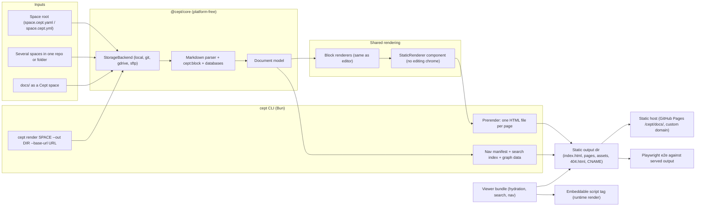
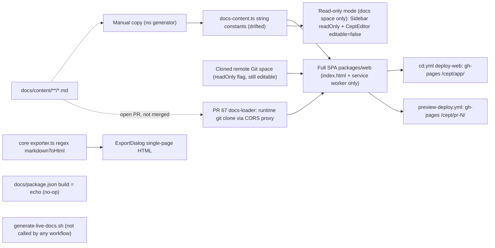

# Requirements: Static Rendered Component & Static Sites

**Status:** Draft, 2026-10-06 · **Area ID prefix:** `REQ-SSG` · **Owner:** nsheaps

> **Scope: Phase 2 (D-26).** All REQ-SSG requirements are Phase 2 (static rendering / SSG / docs site). Nothing in this area ships in Phase 1.

This document sets out the requirements for Cept's **static rendered browser component** and the **static site generation** built on it. The component is "the UI interface sans interface", meaning Cept's page rendering with none of the editing chrome, used for things like a public Notion-style site. Static site generation turns a space into uploadable static assets through a CLI `render` command. Cept's own documentation site has to be built and deployed with that same pipeline so the pipeline gets tested end to end. Every requirement below is checked against the current code, open PRs and current docs, and records the evidence.

**Related:**

- [README.md](README.md): index, architecture overview, traceability matrix
- [01-browser-app-and-pwa.md](01-browser-app-and-pwa.md): the browser component this area reuses (REQ-WEB)
- [03-spaces-and-storage.md](03-spaces-and-storage.md): space roots, nesting, backends (REQ-WS)
- [05-cli-and-daemon.md](05-cli-and-daemon.md): the CLI that hosts `render` (REQ-CLI)
- [08-editor.md](08-editor.md): block renderers, databases, mermaid, GFM, graph (REQ-EDT)
- [09-remotes-and-auth.md](09-remotes-and-auth.md): reading public and private remotes (REQ-AUTH)
- [10-engineering-and-ci.md](10-engineering-and-ci.md): CI, e2e, GitHub Pages deploys (REQ-ENG)
- Existing specs: [docs/SPECIFICATION.md](../../SPECIFICATION.md), [docs/content/reference/roadmap.md](../../content/reference/roadmap.md), [TASKS.md](../../../TASKS.md) (P8.4–P8.7, T9.1)

## Contents

- [1. Scope & non-goals](#1-scope--non-goals)
- [2. Requirements summary](#2-requirements-summary)
- [3. Architecture](#3-architecture)
- [4. Requirements](#4-requirements)
- [5. Conflicts & open questions](#5-conflicts--open-questions)
- [6. Stale documentation](#6-stale-documentation)
- [7. Cross-area dependencies](#7-cross-area-dependencies)

## 1. Scope & non-goals

### In scope

- A **read-only static renderer component** that reuses the editor's block rendering and drops the editing chrome.
- A **separate build artifact** (viewer bundle) for that component.
- A **CLI `render` command** that turns a space root (`space.cept.yaml` / `space.cept.yml`) into a directory of static assets, under a documented output contract.
- Pre-rendered, SEO-friendly HTML, navigation and cross-links, deep links, a search index, subpath hosting and custom domains.
- An optional **embeddable `<script>`** runtime renderer for public Git-backed spaces.
- **Cept's own docs site** generated by that pipeline, deployed as a static site, and e2e-tested in CI, with docs/content as the single source of truth.
- PR previews of static output.

### Non-goals

- Editing, co-editing or authentication in static output. Static output is read-only by construction. Private-remote auth at render time belongs to [09-remotes-and-auth.md](09-remotes-and-auth.md).
- Hosting or CDN choice beyond "any static host". GitHub Pages is the reference target.
- The deployment of the app itself to GitHub Pages and the demo space. Those are covered in [01-browser-app-and-pwa.md](01-browser-app-and-pwa.md) and [10-engineering-and-ci.md](10-engineering-and-ci.md).
- Single-page export (Markdown/HTML/PDF) as a user feature. It is touched here only because it must share the rendering pipeline (REQ-SSG-004).

## 2. Requirements summary

| ID                                                                                           | Requirement                                             | Priority | Impl status | Docs status            | Docs accurate |
| -------------------------------------------------------------------------------------------- | ------------------------------------------------------- | -------- | ----------- | ---------------------- | ------------- |
| [REQ-SSG-001](#req-ssg-001--static-rendered-browser-component-exists)                        | Static rendered browser component exists                | MUST     | partial     | documented-differently | accurate      |
| [REQ-SSG-002](#req-ssg-002--static-renderer-shipped-as-its-own-build-artifact)               | Static renderer shipped as its own build artifact       | MUST     | not-started | documented-as-desired  | accurate      |
| [REQ-SSG-003](#req-ssg-003--full-block-fidelity-in-static-output)                            | Full block fidelity in static output                    | MUST     | partial     | documented-as-desired  | accurate      |
| [REQ-SSG-004](#req-ssg-004--static-rendering-shares-the-editors-rendering-pipeline)          | Static rendering shares the editor's rendering pipeline | MUST     | divergent   | undocumented           | n/a           |
| [REQ-SSG-005](#req-ssg-005--navigation-cross-links-and-deep-links-in-static-site)            | Navigation, cross-links and deep links in static site   | MUST     | partial     | documented-as-desired  | accurate      |
| [REQ-SSG-006](#req-ssg-006--seo-friendly-pre-rendered-html)                                  | SEO-friendly pre-rendered HTML                          | MUST     | not-started | documented-as-desired  | stale         |
| [REQ-SSG-007](#req-ssg-007--cli-render-static-site-command)                                  | CLI "render static site" command                        | MUST     | not-started | undocumented           | n/a           |
| [REQ-SSG-008](#req-ssg-008--static-render-output-contract)                                   | Static render output contract                           | MUST     | not-started | undocumented           | n/a           |
| [REQ-SSG-009](#req-ssg-009--render-input-is-a-space-root)                                    | Render input is a space root, nested spaces included    | MUST     | not-started | undocumented           | n/a           |
| [REQ-SSG-010](#req-ssg-010--embeddable-script-tag--runtime-renderer)                         | Embeddable script tag / runtime renderer                | SHOULD   | not-started | documented-as-desired  | accurate      |
| [REQ-SSG-011](#req-ssg-011--custom-domain-for-published-sites)                               | Custom domain for published sites                       | SHOULD   | not-started | documented-as-desired  | stale         |
| [REQ-SSG-012](#req-ssg-012--read-only-public-viewing-of-git-backed-spaces)                   | Read-only public viewing of Git-backed spaces           | MUST     | partial     | documented-as-desired  | accurate      |
| [REQ-SSG-013](#req-ssg-013--cept-docs-site-is-generated-by-cepts-own-static-site-generation) | Cept docs site generated by Cept's own SSG              | MUST     | divergent   | documented-differently | stale         |
| [REQ-SSG-014](#req-ssg-014--docs-site-deployed-as-a-static-site)                             | Docs site deployed as a static site                     | MUST     | not-started | documented-differently | stale         |
| [REQ-SSG-015](#req-ssg-015--docs-site-deployment-e2e-tests-static-site-generation)           | Docs site deployment e2e-tests static site generation   | MUST     | not-started | undocumented           | n/a           |
| [REQ-SSG-016](#req-ssg-016--single-source-of-truth-for-docs-content)                         | Single source of truth for docs content                 | MUST     | divergent   | undocumented           | n/a           |
| [REQ-SSG-017](#req-ssg-017--pr-previews-of-static-output)                                    | PR previews of static output                            | SHOULD   | partial     | documented-differently | accurate      |
| [REQ-SSG-018](#req-ssg-018--static-output-works-on-subpath-static-hosting)                   | Static output works on subpath static hosting           | MUST     | partial     | undocumented           | n/a           |

**Tally:** implemented 0 · partial 5 · stubbed 0 · not-started 10 · divergent 3.

**Current state in one paragraph:** Cept has no static rendering of a space today. The only read-only view is the built-in "Cept Docs" space, shown inside the full editing SPA (`packages/web`) with editing switched off. Cloned remote Git spaces are flagged `readOnly` in the manifest, but that flag only changes a settings label; their pages open in the normal, editable editor. There is no viewer bundle, no SSR or prerender step, no CLI and no `render` command. Cept's docs are not a static site. They are hand-copied into TypeScript string constants, bundled into the app, and have drifted from `docs/content/`. No workflow deploys docs or a rendered space, and no e2e test covers static generation.

## 3. Architecture

### 3.1 Required architecture

The editor and the static renderer share a single rendering path. The CLI, the docs-site build and the embeddable script all use the same `StaticRenderer` and viewer bundle. The docs-site deploy runs that path in CI and is the dogfooding e2e test.

### 3.2 Current state

Today there are three unconnected ways to turn markdown into HTML: the editor, the regex exporter, and the in-app docs constants. No static output exists.

## 4. Requirements

### REQ-SSG-001 — Static rendered browser component exists

> **Scope: Phase 2 (D-26).** Static rendering / SSG / docs site is Phase 2.

- **Statement:** Cept MUST provide a static/read-only rendering component that shows space pages with the same visual rendering as the editor (same block renderers) and no editing chrome: no toolbars, slash menu or drag handles, no page add/rename/delete, and no settings or space management.
- **Priority:** MUST
- **Source:** handler ("static rendered browser component — the UI interface sans interface for things like a public notion site, but with cept").
- **Acceptance criteria:**
  - A `StaticRenderer` (or equivalent) is exported from a package entry that does not import the app shell (`App.tsx`), settings, storage manager or editing extensions UI.
  - For a given page document, it renders the same DOM structure and CSS classes for blocks as `CeptEditor` does. A visual snapshot comparison between the two passes within a set tolerance.
  - The rendered output contains no contenteditable regions, toolbars, slash menu, drag handles, page CRUD controls, settings, space switcher or app menu.
  - Which chrome is kept is configurable and documented. Navigation sidebar, search and breadcrumbs are each opt-in or opt-out (see [open question 3](#5-conflicts--open-questions)).
  - It can be used with no `StorageBackend` write capability.
- **Current state:** **partial.** The only read-only rendering is a mode inside the full app. [packages/ui/src/components/App.tsx](../../../packages/ui/src/components/App.tsx) (around lines 1262–1336) passes `readOnly` to the sidebar ([packages/ui/src/components/sidebar/Sidebar.tsx](../../../packages/ui/src/components/sidebar/Sidebar.tsx), which hides add/rename/context menu around lines 129, 266, 304, 394). It also sets `editable={false}` on [packages/ui/src/components/editor/CeptEditor.tsx](../../../packages/ui/src/components/editor/CeptEditor.tsx) (lines ~38, 45, 238 hide the inline toolbar) and shows a "Read-only — sourced from docs/" banner. This path is reached only when the built-in docs space is active (`isDocsActive`, App.tsx ~1262, ~1299); `App.tsx` has no other `editable={false}` call, so no user or remote space is ever shown read-only. App chrome stays: settings, space switcher, theme toggle, search and app menu. No standalone component or export exists.
- **Docs state:** documented-differently, accurate. [roadmap.md](../../content/reference/roadmap.md) (lines ~141, 154–161) lists "Read-only public page rendering (similar to public Notion pages)" as Planned, delivered as a "GitHub Pages Renderer" with the "full Cept UI in read-only mode (sidebar, search…)". That keeps more chrome than "sans interface". Not covered in [SPECIFICATION.md](../../SPECIFICATION.md).
- **Gap:** Extract a standalone renderer from `App.tsx`/`CeptEditor` with no app-shell dependencies, and specify the chrome policy.
- **Related:** TASKS P8.4; [PR #67](https://github.com/nsheaps/cept/pull/67) (docs as a remote space, still the full app).

### REQ-SSG-002 — Static renderer shipped as its own build artifact

> **Scope: Phase 2 (D-26).** Static rendering / SSG / docs site is Phase 2.

- **Statement:** The build MUST produce a static-renderer (viewer) bundle separate from the editing SPA. It must leave out editor-only code paths (TipTap editing UI, git write paths, settings UI) so published sites are small and read-only by construction.
- **Priority:** MUST
- **Source:** derived. A deployable form of the handler's "static rendered browser component" needs this.
- **Acceptance criteria:**
  - A separate build entry (a new package such as `packages/static`, or a second Vite entry) emits a viewer bundle.
  - A CI check fails if the viewer bundle imports editing-only modules (checked with an import-graph rule or a bundle-analysis assertion).
  - A size budget for the viewer bundle (gzip) is defined and enforced in CI.
  - The viewer bundle has no write calls to any `StorageBackend`.
- **Current state:** **not-started.** [packages/web/vite.config.ts](../../../packages/web/vite.config.ts) (lines ~124–127) has only two rollup inputs: `main` (index.html) and `service-worker`. No other package produces a viewer bundle.
- **Docs state:** documented-as-desired, accurate. roadmap.md (line ~140) has "GitHub Pages renderer (pre-built JS bundle)" as Planned. [TASKS.md](../../../TASKS.md) P8.4 (line ~250) is unchecked. Also in [.claude/prompts/continue.md](../../../.claude/prompts/continue.md) (lines ~333, 453–456).
- **Gap:** A viewer entry or package, a size budget and a CI build check.
- **Related:** TASKS P8.4.

### REQ-SSG-003 — Full block fidelity in static output

> **Scope: Phase 2 (D-26).** Static rendering / SSG / docs site is Phase 2. Inline database views are Phase 2 as well (D-26, D-36); mermaid renders as on GitHub (D-33).

- **Statement:** Static output MUST render every block type the editor supports, looking the same as in the editor. That includes GFM tables and footnotes, callouts, toggles, mermaid and other fenced-code plugin blocks, math, embeds, and inline database views (read-only).
- **Priority:** MUST
- **Source:** handler. The static component is "the UI interface sans interface", so the editor features listed in [08-editor.md](08-editor.md) carry over.
- **Acceptance criteria:**
  - A block-coverage matrix (block type → static renderer → test) is part of the static-site spec, and every editor block type is in it.
  - Each block type has a fixture page and a snapshot test of the static output.
  - Mermaid blocks render to SVG, at build time or on hydration, and the choice is documented.
  - Inline databases render their configured view read-only, with no edit affordances.
  - Footnotes render as linked references and a footnote section.
- **Current state:** **partial.** There is no static output to check. The closest thing, the in-app read-only view of the docs space, reuses `CeptEditor` with `editable={false}`, so it gets the editor's renderers ([App.tsx](../../../packages/ui/src/components/App.tsx) ~1325–1330). No test covers block rendering in that mode. Whether inline databases and mermaid behave correctly in this mode is **unverified**. The core HTML exporter ([packages/core/src/exporters/exporter.ts](../../../packages/core/src/exporters/exporter.ts), ~113–170) is regex-based. It handles headings, code, bold/italic, links, images, blockquote, hr and unordered lists only. It has no tables, footnotes, ordered lists, mermaid, `cept:block` comments or databases.
- **Docs state:** documented-as-desired, accurate. roadmap.md (~158) promises "all block types rendered in read-only mode" (Planned).
- **Gap:** The coverage matrix, rendering through the editor's renderers, and per-block snapshot tests.
- **Related:** TASKS P8.4.

### REQ-SSG-004 — Static rendering shares the editor's rendering pipeline

> **Scope: Phase 2 (D-26).** Static rendering / SSG / docs site is Phase 2. The single markdown parser and one pipeline in the editor are Phase 1 (D-14, D-15, D-33).

- **Statement:** Static HTML generation MUST use the same parser and rendering code as the browser component. It must not use a separate lightweight converter, so published output cannot drift from in-app rendering.
- **Priority:** MUST
- **Source:** derived from the "static rendered browser component" being the same UI component.
- **Acceptance criteria:**
  - Exactly one markdown → document-model parser is used: [packages/core/src/markdown](../../../packages/core/src/markdown).
  - Static HTML comes from rendering that document model (for example TipTap `generateHTML` or React `renderToString` of `StaticRenderer`). No regex conversion is involved.
  - Single-page HTML export goes through the same path, or the regex exporter is removed.
  - A test renders one fixture through both the editor (read-only) and the static path and asserts equivalent block output.
- **Current state:** **divergent.** `markdownToHtml` in [exporter.ts](../../../packages/core/src/exporters/exporter.ts) (~113) is a standalone regex converter, separate from the parser in `packages/core/src/markdown` and from the UI renderers. Its only runtime consumer is `exportPage` (exporter.ts ~193), which [ExportDialog.tsx](../../../packages/ui/src/components/import-export/ExportDialog.tsx) (~7, ~23) calls for single-page export. The dialog is reachable from the app (`App.tsx` ~930, ~1509), so this divergent path ships to users. Open [PR #24](https://github.com/nsheaps/cept/pull/24) (space ZIP export) adds a raw-file archive and does not touch this HTML path.
- **Docs state:** undocumented. [SPECIFICATION.md](../../SPECIFICATION.md) (~2227) only says "HTML export: render full page with styling".
- **Gap:** Replace or retire the regex exporter.
- **Related:** none.

### REQ-SSG-005 — Navigation, cross-links and deep links in static site

> **Scope: Phase 2 (D-26).** Static rendering / SSG / docs site is Phase 2. Crosslinks are standard GFM links (`[link text](https://example.com)` syntax, with a relative path to the target page); wiki-links are out (D-32), so "wiki-link" in the criteria below does not apply.

- **Statement:** Static output MUST include page-tree navigation and resolve wiki/cross-links between pages to static URLs. Every page MUST have a URL that loads directly on static hosting, including GitHub Pages subpaths.
- **Priority:** MUST
- **Source:** derived (public Notion-like site; links per [08-editor.md](08-editor.md)).
- **Acceptance criteria:**
  - Each page is emitted at a stable slug path (`<base>/<slug>/index.html` or `<base>/<slug>.html`, decided in REQ-SSG-008).
  - Every internal link (wiki-link, relative markdown link, page mention) in the output resolves to an existing output file. A link checker run in CI fails on broken links.
  - Every page URL loads directly without JS routing or a 404 redirect.
  - A navigation tree generated from the space page tree is present on every page, or loaded from the nav manifest.
- **Current state:** **partial**, in-app only. [packages/ui/src/router.ts](../../../packages/ui/src/router.ts) (~10–11, 192–249) provides `/{base}/docs/{pageId}` routes. [.github/pages/404.html](../../../.github/pages/404.html) redirects unknown paths with a `?route=` param for `/cept/pr-N/` and `/cept/app/`. This depends on the SPA and JavaScript. No per-page HTML files exist.
- **Docs state:** documented-as-desired, accurate. roadmap.md (~158) "Sidebar navigation, search".
- **Gap:** Per-page HTML, a nav manifest, link rewriting at render time, a configurable base path and a CI link checker.
- **Related:** [PR #67](https://github.com/nsheaps/cept/pull/67) changes `router.ts`.

### REQ-SSG-006 — SEO-friendly pre-rendered HTML

> **Scope: Phase 2 (D-26).** Static rendering / SSG / docs site is Phase 2.

- **Statement:** Each static page MUST be emitted as pre-rendered HTML with title, description and OpenGraph meta tags. Its content must be readable with JavaScript disabled, and it may be hydrated progressively.
- **Priority:** MUST
- **Source:** derived (public Notion-site-like publishing; TASKS P8.6).
- **Acceptance criteria:**
  - With JS disabled, a Playwright test sees each page's heading and body text in the DOM.
  - Every page has `<title>`, `meta[name=description]`, `og:title`, `og:description`, `og:url` and a canonical link, drawn from page front matter or derived from the content.
  - A `sitemap.xml` is emitted when a base URL is configured.
  - Hydration, when enabled, does not change the visible content (no layout shift beyond a documented threshold).
- **Current state:** **not-started.** The app is a client-rendered SPA (`packages/web/index.html` plus a JS bundle) with no SSR or prerender step. `wrapHtmlDocument` ([exporter.ts](../../../packages/core/src/exporters/exporter.ts) ~174) sets only title and viewport.
- **Docs state:** documented-as-desired, but **stale**. [roadmap.md](../../content/reference/roadmap.md) (~143) lists it as Planned. The in-app copy in [docs-content.ts](../../../packages/ui/src/components/docs/docs-content.ts) (~704–711) leaves this row out.
- **Gap:** A prerender pipeline and a meta-tag contract.
- **Related:** TASKS P8.6.

### REQ-SSG-007 — CLI "render static site" command

> **Scope: Phase 2 (D-26).** Static rendering / SSG / docs site is Phase 2. Static rendering ships in Phase 2 even though the CLI itself is later (D-26); the `render` command or an equivalent build script is delivered with SSG.

- **Statement:** The Cept CLI MUST provide a command (e.g. `cept render <space> --out <dir>`) that turns a space into a directory of static assets ready to upload.
- **Priority:** MUST
- **Source:** handler ("A render static site command to generate the static assets for upload of a space").
- **Acceptance criteria:**
  - `cept render <path-or-remote> --out <dir> [--base-url <url>] [--cname <domain>] [--clean]` exists and is documented in `--help` and in the docs.
  - It runs headless under Bun (no browser), and exits non-zero on render errors, broken links (with `--strict`) or a missing space root.
  - It accepts local paths and any remote supported by the CLI daemon's backends (see [05-cli-and-daemon.md](05-cli-and-daemon.md)).
  - The output satisfies the REQ-SSG-008 contract.
  - It ships as a Bun-compiled binary, following the nsheaps convention (compare `qontacts-server`).
- **Current state:** **not-started.** No CLI package exists. The only `bin` entry in the repo is in [packages/signaling-server/package.json](../../../packages/signaling-server/package.json) (~line 7). There is no render or publish code in `packages/*`.
- **Docs state:** undocumented. It is not in SPECIFICATION.md, roadmap.md or TASKS.md. The roadmap plans a zero-build runtime `<script>` renderer instead (roadmap.md ~157–160).
- **Gap:** A CLI package with a `render` command, plus a spec.
- **Related:** none.

### REQ-SSG-008 — Static render output contract

> **Scope: Phase 2 (D-26).** Static rendering / SSG / docs site is Phase 2.

- **Statement:** The render command's output MUST follow a documented contract. It contains an `index.html` entry, one HTML file per page at a stable slug path, hashed `assets/` (JS, CSS, fonts), copied space attachments, a JSON nav manifest and search index, a `404.html`, and an optional `CNAME`. The base path is configurable. Identical input MUST produce byte-identical output.
- **Priority:** MUST
- **Source:** derived (handler: "generate the static assets for upload of a space").
- **Acceptance criteria:**
  - A spec (proposed: `docs/specs/static-site.md`) defines the output tree, the JSON schemas for `nav.json` and `search-index.json`, slug rules (stable across renames where a page id exists) and base-path rules.
  - Rendering the same fixture space twice gives identical bytes (checked by hash in CI).
  - Attachments referenced by pages are copied, and unreferenced attachments are left out unless a flag includes them.
  - Manifest JSON validates against the published schemas in a unit test.

  Proposed layout (to be confirmed in the spec):

  | Path                             | Purpose                             |
  | -------------------------------- | ----------------------------------- |
  | `index.html`                     | Space home page (prerendered)       |
  | `<slug>/index.html`              | One prerendered page per space page |
  | `assets/*.<hash>.{js,css,woff2}` | Viewer bundle, styles, fonts        |
  | `files/**`                       | Copied attachments                  |
  | `_cept/nav.json`                 | Page tree                           |
  | `_cept/search-index.json`        | Prebuilt search index               |
  | `_cept/graph.json`               | Optional crosslink graph data       |
  | `404.html`                       | Not-found page with nav             |
  | `sitemap.xml`, `CNAME`           | Emitted when base URL / domain set  |

- **Current state:** **not-started.** No generator exists. The closest analogue is the app's `dist/` layout ([vite.config.ts](../../../packages/web/vite.config.ts) ~121–133), which [cd.yml](../../../.github/workflows/cd.yml) and [preview-deploy.yml](../../../.github/workflows/preview-deploy.yml) copy to gh-pages.
- **Docs state:** undocumented. `docs/specs/` holds only database-engine, knowledge-graph, markdown-parser, search, storage-backends and template-system specs.
- **Gap:** A static-site spec and an implementation.
- **Related:** none.

### REQ-SSG-009 — Render input is a space root

> **Scope: Phase 2 (D-26).** Static rendering / SSG / docs site is Phase 2. Nested spaces are later (D-26, D-30). Multiple sibling spaces per repo are in scope (D-30), and `space.cept.yaml` may declare an optional `branch` (D-30).

- **Statement:** The render command MUST accept any space root (marked by `space.cept.yaml` or `space.cept.yml`) on any supported backend. A repo or folder that holds several sibling spaces is rendered one space at a time (or each space to its own output directory). Nested spaces are deferred (D-3).
- **Priority:** MUST
- **Source:** derived (joins the handler's space and CLI requirements; see [03-spaces-and-storage.md](03-spaces-and-storage.md)).
- **Acceptance criteria:**
  - Rendering a directory without `space.cept.ya?ml` fails with a clear error unless `--init`/`--assume-root` is given.
  - Pointing the command at a repo or folder that contains several spaces lists them and requires choosing one (or `--all`, which renders each to `<out>/<slug>/`).
  - The site title comes from the space's `name`; the default base path uses its `slug`. Other render settings are CLI flags until the schema grows (D-3).
- **Current state:** **not-started.** The code has no `space.cept.yaml` concept. The app uses a "spaces" manifest ([packages/ui/src/components/storage/SpaceManager.ts](../../../packages/ui/src/components/storage/SpaceManager.ts)). No renderer exists.
- **Docs state:** undocumented.
- **Gap:** Depends on the space model (cross-area). Nested-space rendering is deferred with REQ-WS-005.
- **Related:** none.

### REQ-SSG-010 — Embeddable script tag / runtime renderer

> **Scope: Phase 2 (D-26).** Static rendering / SSG / docs site is Phase 2.

- **Statement:** Cept SHOULD provide an embeddable `<script>` that renders a public Git-backed space read-only inside any page with no build step. This complements CLI pre-rendering and does not replace it.
- **Priority:** SHOULD
- **Source:** existing spec (roadmap / TASKS P8.5). It fits with the handler's static component.
- **Acceptance criteria:**
  - A single script URL plus a configuration attribute (repo, branch, path) renders the space into a host element.
  - It uses the same viewer bundle as REQ-SSG-002, with no second renderer.
  - It degrades with a visible error when the repo cannot be fetched (CORS, rate limit).
- **Current state:** **not-started.** No embeddable bundle exists. [vite.config.ts](../../../packages/web/vite.config.ts) builds only the app and the service worker.
- **Docs state:** documented-as-desired, accurate. [roadmap.md](../../content/reference/roadmap.md) (~142, 157–160); TASKS.md P8.5 (~251); continue.md (~334).
- **Gap:** A viewer bundle with a loader that fetches markdown from a repo.
- **Related:** TASKS P8.5.

### REQ-SSG-011 — Custom domain for published sites

> **Scope: Phase 2 (D-26).** Static rendering / SSG / docs site is Phase 2. Applies to published sites only; the app itself stays on GitHub Pages with no custom domain, and nsheaps.dev is out of scope (D-27, D-26).

- **Statement:** Published static sites SHOULD support custom domains, through `CNAME` output and absolute-URL configuration.
- **Priority:** SHOULD
- **Source:** existing spec (TASKS P8.7).
- **Acceptance criteria:**
  - `--cname <domain>` (or `space.cept.yaml` `publish.domain`) writes `CNAME` and sets the canonical and OpenGraph URLs.
  - Output rendered for a custom domain at root needs no `/cept/...` prefix.
- **Current state:** **not-started.** There is no CNAME handling. Base paths are hard-coded to `/cept/...` in [cd.yml](../../../.github/workflows/cd.yml) (`VITE_BASE_PATH: /cept/app/`) and [preview-deploy.yml](../../../.github/workflows/preview-deploy.yml).
- **Docs state:** documented-as-desired, but **stale**. roadmap.md (~144) lists it as Planned. The in-app [docs-content.ts](../../../packages/ui/src/components/docs/docs-content.ts) roadmap copy leaves it out.
- **Gap:** A CNAME/base-URL option in the render contract.
- **Related:** TASKS P8.7.

### REQ-SSG-012 — Read-only public viewing of Git-backed spaces

> **Scope: Phase 2 (D-26).** Static rendering / SSG / docs site is Phase 2.

- **Statement:** A public Git-backed space MUST be viewable read-only through the static renderer (CLI output or embed), with the same page tree and content the editor shows.
- **Priority:** MUST
- **Source:** derived (handler: public Notion-site-like; roadmap.md ~161).
- **Acceptance criteria:**
  - `cept render https://github.com/<owner>/<repo>[#branch][:path] --out dir` produces the same page tree as opening that repo in the app.
  - The embed (REQ-SSG-010) renders the same repo with an identical nav tree.
  - It needs no credentials for public repos.
- **Current state:** **partial.** The full app can clone a public remote Git space and browse it: [SpaceManager.ts](../../../packages/ui/src/components/storage/SpaceManager.ts) (~24, ~147 sets `readOnly: true` for cloned remotes) and [AddSpaceWizardModal.tsx](../../../packages/ui/src/components/settings/AddSpaceWizardModal.tsx) (~202). The `readOnly` flag is only read for a settings label ([App.tsx](../../../packages/ui/src/components/App.tsx) ~1117); the sidebar and editor for these spaces stay fully editable, so even the in-app view is not read-only. Nothing offers a public static view.
- **Docs state:** documented-as-desired, accurate. roadmap.md (~161) "Works with any Git-backed Cept space stored in a public repository" (Planned).
- **Gap:** Expose this through the static renderer and the CLI.
- **Related:** [PR #67](https://github.com/nsheaps/cept/pull/67) (remote spaces, content browsing; open, not merged).

### REQ-SSG-013 — Cept docs site is generated by Cept's own static site generation

> **Scope: Phase 2 (D-26).** Static rendering / SSG / docs site is Phase 2.

- **Statement:** Cept's documentation site MUST be built from `docs/` (as a Cept space) by the same render pipeline that users run. It must not use a separate docs framework or hand-bundled constants.
- **Priority:** MUST
- **Source:** handler ("Cept's own docs site is a static site deployment, which e2e tests the static site generation workflow").
- **Acceptance criteria:**
  - `docs/` (or `docs/content/`) contains a `space.cept.yaml`.
  - The `@cept/docs` `build` target runs `cept render` and writes the static output, with no `echo` no-op.
  - No Starlight or VitePress dependency is present, unless the owner overrides this decision (see [open question 1](#5-conflicts--open-questions)).
  - The in-app "Cept Docs" space, if kept, is fed from the same source (REQ-SSG-016).
- **Current state:** **divergent.** [docs/package.json](../../package.json) has `build: "echo 'Documentation site build'"`, and there is no Starlight or VitePress config. Docs reach users as hand-maintained TS string constants in [packages/ui/src/components/docs/docs-content.ts](../../../packages/ui/src/components/docs/docs-content.ts), rendered in-app at `/cept/app/docs`. [PR #67](https://github.com/nsheaps/cept/pull/67) adds a `docs-loader.ts` that clones `docs/content` at runtime and falls back to those constants. That is still runtime rendering in the full app.
- **Docs state:** documented-differently, **stale**. [SPECIFICATION.md](../../SPECIFICATION.md) (~208, ~1639 and §9.5 ~1275–1280) specifies a Starlight/VitePress site deployed to `/cept/docs/` through `docs.yml`. The [CLAUDE.md](../../../CLAUDE.md) package table says "Starlight/VitePress documentation site". [TASKS.md](../../../TASKS.md) (~132) marks T9.1 done although no such site exists. continue.md (~144), "Rendered in app as built-in docs space", is accurate about the mechanism, but its "11 real Markdown docs" count is stale: `docs/content` now holds 14 `.md` files.
- **Gap:** Turn `docs/` into a space, generate it with `cept render` in CI, and remove the `docs-content.ts` duplication (or generate it).
- **Related:** [PR #67](https://github.com/nsheaps/cept/pull/67); TASKS T9.1 (checked although not done).

### REQ-SSG-014 — Docs site deployed as a static site

> **Scope: Phase 2 (D-26).** Static rendering / SSG / docs site is Phase 2.

- **Statement:** CI MUST deploy the generated docs site to static hosting (GitHub Pages) on every main release, at a stable path (e.g. `/cept/docs/`), separately from the app deployment.
- **Priority:** MUST
- **Source:** handler.
- **Acceptance criteria:**
  - A CI job builds the docs with `cept render` and publishes to gh-pages `/cept/docs/` without touching `/cept/app/` or `/cept/pr-N/`.
  - `https://nsheaps.github.io/cept/docs/` and every page URL under it load directly (HTTP 200, no redirect through the SPA 404 router).
  - The root landing ([.github/pages/index.html](../../../.github/pages/index.html)) links to both the app and the docs, rather than only redirecting to the app.
- **Current state:** **not-started.** The `deploy-web` job in [cd.yml](../../../.github/workflows/cd.yml) publishes only `app/`, plus a redirecting `index.html` and `404.html`. `.github/pages/index.html` meta-refreshes to `/cept/app/`. There is no `docs.yml` and no docs deploy job. [.github/pages/404.html](../../../.github/pages/404.html) (~31–37) also sends any other `/cept/...` path to the app with `?route=`, so a `/cept/docs/` URL currently lands in the SPA.
- **Docs state:** documented-differently, **stale**. SPECIFICATION.md §9.5 refers to `.github/workflows/docs.yml`, which does not exist. SPECIFICATION.md (~134) names `release-web.yml`, but the real workflow is `cd.yml`.
- **Gap:** A docs deploy job, and updates to the landing page and the 404 router.
- **Related:** none.

### REQ-SSG-015 — Docs site deployment e2e-tests static site generation

> **Scope: Phase 2 (D-26).** Static rendering / SSG / docs site is Phase 2.

- **Statement:** CI MUST run end-to-end tests against the generated docs site. It builds the site with `cept render`, serves the output statically, and uses Playwright to check page load, navigation, cross-links, block rendering (including mermaid), search, deep links and no-JS/SEO meta. This MUST run on PRs that touch the renderer or the docs.
- **Priority:** MUST
- **Source:** handler.
- **Acceptance criteria:**
  - A Playwright project (e.g. `e2e/static/`) serves the render output with a plain static server under a subpath, and runs:
    - direct load of each page (sampled or all), checking for HTTP 200 and the heading
    - a nav click-through and cross-link resolution
    - mermaid rendered as SVG, plus table and footnote presence
    - a search query that returns the expected page
    - a JS-disabled run where the content is visible and meta tags are present
  - [\_test-e2e.yml](../../../.github/workflows/_test-e2e.yml) (or its successor) runs it, scoped by affected paths per [10-engineering-and-ci.md](10-engineering-and-ci.md).
  - A deliberately broken renderer fixture makes the job fail (proof that the gate works).
- **Current state:** **not-started.** `e2e/tests` holds smoke, responsive, slash-commands and feature-screenshots specs, all run against the SPA. The only docs check is a conditional click on "Cept Docs" in [e2e/tests/feature-screenshots.spec.ts](../../../e2e/tests/feature-screenshots.spec.ts) (~239–246).
- **Docs state:** undocumented.
- **Gap:** A static-output e2e project and CI wiring for it.
- **Related:** none.

### REQ-SSG-016 — Single source of truth for docs content

> **Scope: Phase 2 (D-26).** Static rendering / SSG / docs site is Phase 2. The in-app bundled-docs side is REQ-WEB-018, also Phase 2.

- **Statement:** `docs/content/**/*.md` MUST be the only authored copy of the docs. Any bundled or in-app copy MUST be generated at build time and never maintained by hand.
- **Priority:** MUST
- **Source:** derived (prerequisite for REQ-SSG-013 and for accurate docs).
- **Acceptance criteria:**
  - No hand-written markdown string constants remain in `packages/ui`. Any bundled docs come from a generated file that is either gitignored or carries a "generated, do not edit" header.
  - A CI drift check fails if the generated docs bundle differs from `docs/content`.
  - The page metadata list in `docs/src/index.ts` is generated from, or validated against, the files that actually exist.
- **Current state:** **divergent.** [docs-content.ts](../../../packages/ui/src/components/docs/docs-content.ts) embeds hand-copied markdown that has drifted. Its roadmap (~690–711) lacks the "SEO-friendly server-rendered output" and "Custom domain support" rows found in [roadmap.md](../../content/reference/roadmap.md) (~143–144). [docs/src/index.ts](../../../docs/src/index.ts) `DOC_PAGES` lists slugs that have no files: installation, concepts, editor-basics, databases, git-sync, collaboration, templates, knowledge-graph, import-export, markdown-syntax, storage-backends, database-formulas, api-reference. Nothing outside `docs/src` imports `@cept/docs` or `DOC_PAGES`, so the list is dead metadata.
- **Docs state:** undocumented. The `docs-content.ts` header (~1–3) says the content is "Bundled … from docs/content/", but no generator exists.
- **Gap:** A build-time generator (or the PR #67 runtime clone with a generated fallback), a drift check, and a fixed or regenerated `DOC_PAGES`.
- **Related:** [PR #67](https://github.com/nsheaps/cept/pull/67).

### REQ-SSG-017 — PR previews of static output

> **Scope: Phase 2 (D-26).** Static rendering / SSG / docs site is Phase 2.

- **Statement:** Each PR SHOULD publish a preview of the generated docs/static site next to the app preview, so reviewers can check changes to static rendering.
- **Priority:** SHOULD
- **Source:** derived.
- **Acceptance criteria:**
  - [preview-deploy.yml](../../../.github/workflows/preview-deploy.yml) also publishes `cept render docs/` output to `/cept/pr-N/docs/` and adds that link to its PR comment.
  - Preview cleanup on PR close removes both the app and the docs preview.
  - `scripts/generate-live-docs.sh` is either wired into a workflow or deleted together with `live-docs-content.ts`.
- **Current state:** **partial.** preview-deploy.yml builds and deploys the SPA to gh-pages `/cept/pr-N/` and comments the URL. [scripts/generate-live-docs.sh](../../../scripts/generate-live-docs.sh) is not called by any workflow, so [live-docs-content.ts](../../../packages/ui/src/components/docs/live-docs-content.ts) stays a stub with `LIVE_DOCS_AVAILABLE = false`. Nothing in `packages/` imports that module either, so the feature would stay dead even if the script ran. There is no static-site preview.
- **Docs state:** documented-differently, accurate. SPECIFICATION.md §9.1.1 (~1127–1213) documents app previews only.
- **Gap:** Add the render output to preview deploys, and wire up or remove the live-docs script.
- **Related:** none.

### REQ-SSG-018 — Static output works on subpath static hosting

> **Scope: Phase 2 (D-26).** Static rendering / SSG / docs site is Phase 2.

- **Statement:** Render output MUST work both at the root and under a subpath (e.g. `https://nsheaps.github.io/cept/docs/`), with a configurable base URL and a 404 fallback.
- **Priority:** MUST
- **Source:** derived.
- **Acceptance criteria:**
  - `--base-url` (or `space.cept.yaml`) controls every emitted URL: assets, links, manifest paths and canonical.
  - The e2e suite (REQ-SSG-015) runs the output under both a subpath and root.
  - The `404.html` in the output shows navigation and does not depend on the app's SPA router.
- **Current state:** **partial**, SPA only. `VITE_BASE_PATH` is set in [cd.yml](../../../.github/workflows/cd.yml) and [preview-deploy.yml](../../../.github/workflows/preview-deploy.yml). A post-build plugin in [vite.config.ts](../../../packages/web/vite.config.ts) (~64) injects the base into 404.html, and [.github/pages/404.html](../../../.github/pages/404.html) routes `/cept/pr-N` and `/cept/app`. Nothing covers rendered spaces.
- **Docs state:** undocumented.
- **Gap:** A base-URL option in the render contract, plus tests at subpath and root.
- **Related:** none.

## 5. Conflicts & open questions

The owner needs to decide these:

1. **How the docs site is built.** **Timing decided (D-26):** Phase 2; the approach is not yet decided. The handler wants Cept's own SSG to generate the docs, as a dogfooding e2e test. SPECIFICATION.md (~208, §11.1 ~1639) and CLAUDE.md say Starlight or VitePress. The code bundles hand-copied markdown into the SPA, and [PR #67](https://github.com/nsheaps/cept/pull/67) moves to a runtime git clone. That makes three approaches. **Proposed:** Cept SSG only, and drop Starlight/VitePress from the spec.
2. **What kind of renderer.** **Timing decided (D-26):** Phase 2. The handler wants a CLI `render` that produces uploadable static assets. roadmap.md (~154–161) and continue.md (~453–456) specify a zero-build runtime `<script>` renderer. TASKS P8.6 adds "SEO-friendly server-rendered output" as a third model. **Proposed:** CLI pre-render with optional hydration as the primary model (MUST), and the embed as a secondary model (SHOULD, REQ-SSG-010).
3. **How much chrome the static component keeps.** The handler says "sans interface". roadmap.md (~158) says "full Cept UI in read-only mode (sidebar, search…)". **Proposed:** no editing or app chrome. Navigation sidebar, search and breadcrumbs are each opt-in through config, and on by default for the docs site.
4. **Where the docs deploy.** **Timing decided (D-26):** Phase 2. SPECIFICATION.md §9.5 says `/cept/docs/` through `docs.yml`. Today docs live only inside the app at `/cept/app/docs`, and `/cept/` redirects to `/cept/app/`. Should the in-app "Cept Docs" space remain once the static docs site exists, and if so, should it read the static output or `docs/content`?
5. **Workflow names.** **Timing decided (D-26):** Phase 2. SPECIFICATION.md (~134) names `release-web.yml`, but the real deploy is the `deploy-web` job in `cd.yml` (triggered by `v*` tags). Should docs deploy on release tags only, or on every push to main? The handler's wording ("on every main release") is ambiguous.
6. **Terminology.** The handler says "spaces" with a `space.cept.ya?ml` root. Code and docs say "spaces" (`SpaceManager.ts`, `DOCS_SPACE_INFO`, "Add a read-only space"). Is this a rename, and how do existing spaces migrate (see [03-spaces-and-storage.md](03-spaces-and-storage.md))?
7. **Nested spaces in output.** **Decided (D-26, D-30):** nested spaces are later. Deferred with nesting (D-3). When nesting returns: render a child inline under its parent's URL, or as a separate site the parent links to?
8. **TASKS T9.1** is checked as done although no docs site framework exists. Should it be unchecked, or rewritten to match the new direction?
9. **Two HTML pipelines.** **Partly answered (D-14, D-15, D-33):** one markdown pipeline is Phase 1; the static path is Phase 2. The core regex exporter conflicts with the requirement for a single rendering path (REQ-SSG-004). Should single-page HTML export move onto the static renderer, or be removed?
10. **Mermaid in static output:** **Timing decided (D-26):** Phase 2; mermaid must render as on GitHub and is the first fenced-block plugin (D-33). Render to SVG at build time (needs a headless browser or a mermaid SSR approach under Bun), or render on the client at hydration (fails the no-JS requirement for diagrams)?

## 6. Stale documentation

| Location                                                                                                                                                          | Claim                                                                                                                                                                                                       | Reality / fix                                                                                                                                                                                      |
| ----------------------------------------------------------------------------------------------------------------------------------------------------------------- | ----------------------------------------------------------------------------------------------------------------------------------------------------------------------------------------------------------- | -------------------------------------------------------------------------------------------------------------------------------------------------------------------------------------------------- |
| [TASKS.md](../../../TASKS.md) ~132                                                                                                                                | T9.1 "Documentation site setup (Starlight/VitePress)" marked done                                                                                                                                           | No framework is installed and the `docs` build is an `echo`. Uncheck it or reword it to the Cept SSG approach.                                                                                     |
| [CLAUDE.md](../../../CLAUDE.md) package table                                                                                                                     | `@cept/docs` is a "Starlight/VitePress documentation site"                                                                                                                                                  | `docs/` holds markdown plus a metadata TS module. Update the row.                                                                                                                                  |
| [docs/SPECIFICATION.md](../../SPECIFICATION.md) §9.5 ~1273–1281                                                                                                   | `.github/workflows/docs.yml` deploys to `/cept/docs/`                                                                                                                                                       | The workflow does not exist. Rewrite to the REQ-SSG-014 design.                                                                                                                                    |
| [docs/SPECIFICATION.md](../../SPECIFICATION.md) ~134 and §9.3 ~1236                                                                                               | `release-web.yml` deploys GitHub Pages                                                                                                                                                                      | The deploy is the `deploy-web` job in [cd.yml](../../../.github/workflows/cd.yml).                                                                                                                 |
| [docs/SPECIFICATION.md](../../SPECIFICATION.md) §11.1 ~1639                                                                                                       | "Choose [Starlight or VitePress] at implementation time"                                                                                                                                                    | No choice was made. Replace with Cept SSG.                                                                                                                                                         |
| [docs-content.ts](../../../packages/ui/src/components/docs/docs-content.ts) ~690–711                                                                              | Bundled roadmap                                                                                                                                                                                             | Missing the "SEO-friendly server-rendered output" and "Custom domain support for published spaces" rows from [roadmap.md](../../content/reference/roadmap.md) ~143–144. Regenerate it from source. |
| [docs-content.ts](../../../packages/ui/src/components/docs/docs-content.ts) ~1–3                                                                                  | "Bundled … from docs/content/", branch "determined at build time"                                                                                                                                           | It is a hand-maintained copy with no generator. Fix the header or add a generator (REQ-SSG-016).                                                                                                   |
| [docs/src/index.ts](../../../docs/src/index.ts)                                                                                                                   | `DOC_PAGES` lists installation, concepts, editor-basics, databases, git-sync, collaboration, templates, knowledge-graph, import-export, markdown-syntax, storage-backends, database-formulas, api-reference | None of these exist in `docs/content`. Generate the list from the files or delete it.                                                                                                              |
| [live-docs-content.ts](../../../packages/ui/src/components/docs/live-docs-content.ts) and [scripts/generate-live-docs.sh](../../../scripts/generate-live-docs.sh) | A "Docs (Live)" preview feature                                                                                                                                                                             | No workflow calls the script and no code imports the module, so the feature never turns on. Wire it up or remove it.                                                                               |
| [.claude/prompts/continue.md](../../../.claude/prompts/continue.md) ~144                                                                                          | `@cept/docs` has "11 real Markdown docs"                                                                                                                                                                    | `docs/content` has 14 `.md` files.                                                                                                                                                                 |
| [roadmap.md](../../content/reference/roadmap.md) ~154–161                                                                                                         | "GitHub Pages Renderer" is a zero-build drop-in `<script>`                                                                                                                                                  | Differs from the handler's CLI pre-render model. Update once open question 2 is decided.                                                                                                           |

## 7. Cross-area dependencies

| Depends on                       | Why                                                                                                                                                                                                                   | Area / requirements                                                                                                              |
| -------------------------------- | --------------------------------------------------------------------------------------------------------------------------------------------------------------------------------------------------------------------- | -------------------------------------------------------------------------------------------------------------------------------- |
| CLI package and daemon           | `cept render` (REQ-SSG-007/008) needs a CLI, and none exists. It should share the daemon's space and backend loading.                                                                                                 | [05-cli-and-daemon.md](05-cli-and-daemon.md) (REQ-CLI)                                                                           |
| Space model                      | Render input needs the `space.cept.ya?ml` root marker and multi-space discovery (REQ-SSG-009). Both are absent; the code uses a "spaces" manifest.                                                                    | [03-spaces-and-storage.md](03-spaces-and-storage.md) (REQ-WS)                                                                    |
| Storage backends usable headless | Rendering from git, gdrive, sftp or local needs `StorageBackend` implementations that run under Bun/Node, not only in the browser. The PR #67 clone path is browser-side and uses `cors.isomorphic-git.org`.          | [03-spaces-and-storage.md](03-spaces-and-storage.md) (REQ-WS), [09-remotes-and-auth.md](09-remotes-and-auth.md) (REQ-AUTH)       |
| Editor block renderers           | Static fidelity (REQ-SSG-003/004) needs the editor's renderers (mermaid, GFM footnotes and tables, `cept:block`, databases) to work without editing and to be SSR-safe.                                               | [08-editor.md](08-editor.md) (REQ-EDT)                                                                                           |
| Browser component / UI           | `StaticRenderer` is extracted from `App.tsx`/`CeptEditor`. The architecture rules forbid platform imports in `ui` and `core`.                                                                                         | [01-browser-app-and-pwa.md](01-browser-app-and-pwa.md) (REQ-WEB)                                                                 |
| Databases                        | Read-only inline database views and the database storage formats in static output.                                                                                                                                    | [08-editor.md](08-editor.md) (REQ-EDT)                                                                                           |
| Knowledge graph                  | Optional static graph page or crosslink index (`_cept/graph.json`).                                                                                                                                                   | [08-editor.md](08-editor.md) (REQ-EDT)                                                                                           |
| Search                           | A prebuilt search index the static output can use without the app.                                                                                                                                                    | [08-editor.md](08-editor.md) (REQ-EDT), existing [docs/specs/search.md](../search.md)                                            |
| CI / e2e                         | The static-output e2e (REQ-SSG-015), the docs deploy job (REQ-SSG-014), and running only affected tests per PR. [ci.yml](../../../.github/workflows/ci.yml) currently runs everything and does not use `nx affected`. | [10-engineering-and-ci.md](10-engineering-and-ci.md) (REQ-ENG)                                                                   |
| GitHub Pages layout and demo     | The gh-pages layout (`/cept/app`, `/cept/pr-N`, planned `/cept/docs`), the 404 router, and the root redirect in `.github/pages/index.html`.                                                                           | [01-browser-app-and-pwa.md](01-browser-app-and-pwa.md) (REQ-WEB), [10-engineering-and-ci.md](10-engineering-and-ci.md) (REQ-ENG) |
