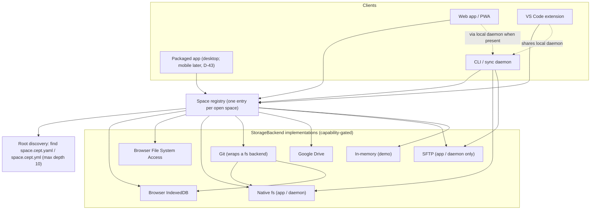
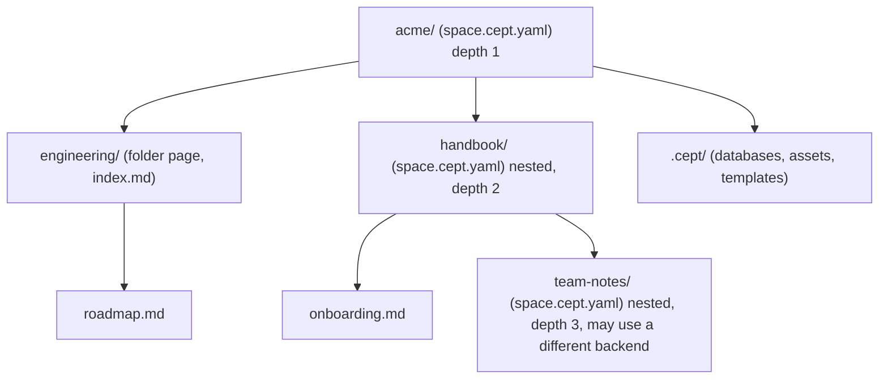
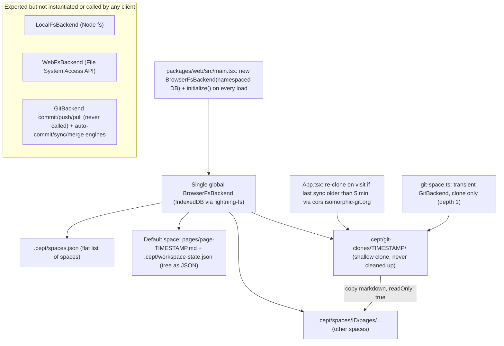

# Requirements: Spaces and storage backends

**Status:** Draft, 2026-10-06

This document sets out what a Cept **space** is: a folder in some filesystem whose root holds a `space.cept.yaml` or `space.cept.yml` marker. It covers how spaces nest (up to 10 levels deep) and which storage backends must be able to hold one: native app filesystem, browser-only storage, Git, Google Drive and SFTP. Every requirement is checked against the code in `packages/*`, the open PRs and issues on `nsheaps/cept`, and the current documentation. Each requirement records whether it is implemented, whether it is documented as desired, and whether that documentation is accurate.

**Related:**

- [Requirements index and traceability matrix](README.md)
- [01 Browser app, service worker and PWA](01-browser-app-and-pwa.md)
- [02 Static rendering](02-static-rendering.md)
- [04 Collaboration](04-collaboration.md)
- [05 CLI and sync daemon](05-cli-and-daemon.md)
- [06 VS Code extension](06-vscode-extension.md)
- [07 Native apps](07-native-apps.md)
- [08 Editor](08-editor.md)
- [09 Remotes and auth](09-remotes-and-auth.md)
- [10 Engineering and CI](10-engineering-and-ci.md)
- Existing feature spec: [docs/specs/storage-backends.md](../storage-backends.md)
- Original spec: [docs/SPECIFICATION.md](../../SPECIFICATION.md) §4.6, §5.10, Appendix F

## Scope and non-goals

**In scope**

- What a space is on disk, and its root marker (`space.cept.yaml` / `space.cept.yml`) with that file's schema.
- Nested spaces and the depth limit.
- The `StorageBackend` abstraction, plus each backend the owner listed: local (app only), local (browser only), Git, Google Drive and SFTP.
- The `.cept/` metadata layout, rules for opening an existing folder safely, switching backends, and terminology.

**Non-goals (covered elsewhere)**

- Authentication flows and the Cloudflare OAuth/CORS proxy: see [09-remotes-and-auth.md](09-remotes-and-auth.md).
- The sync daemon's process model and CLI: see [05-cli-and-daemon.md](05-cli-and-daemon.md).
- Service-worker sync scheduling: see [01-browser-app-and-pwa.md](01-browser-app-and-pwa.md).
- Real-time co-editing transport: see [04-collaboration.md](04-collaboration.md).
- Page and database file formats, and the HTML fallback: see [08-editor.md](08-editor.md).
- S3 (issue [#55](https://github.com/nsheaps/cept/issues/55)) and URL (issue [#56](https://github.com/nsheaps/cept/issues/56)) backends. The owner did not list them; they are recorded as an open question below.

## Requirements summary

| ID                                                                                          | Requirement                                                             | Priority | Impl status | Docs status            | Docs accurate |
| ------------------------------------------------------------------------------------------- | ----------------------------------------------------------------------- | -------- | ----------- | ---------------------- | ------------- |
| [REQ-WS-001](#req-ws-001--space-is-a-folder-in-a-filesystem)                                | Space is a folder in a filesystem; folder hierarchy mirrors page tree   | MUST     | divergent   | documented-differently | stale         |
| [REQ-WS-002](#req-ws-002--spaceceptyaml--spaceceptyml-marks-the-space-root)                 | `space.cept.yaml` / `space.cept.yml` marks the space root               | MUST     | partial     | documented-differently | n/a           |
| [REQ-WS-003](#req-ws-003--both-yaml-and-yml-extensions-accepted)                            | Both `.yaml` and `.yml` accepted, with defined precedence               | MUST     | partial     | documented             | n/a           |
| [REQ-WS-004](#req-ws-004--spaceceptyaml-schema)                                             | Versioned, documented `space.cept.yaml` schema                          | MUST     | partial     | documented             | accurate      |
| [REQ-WS-005](#req-ws-005--nested-spaces-inside-a-parent-space-deferred)                     | Nested spaces inside a parent space                                     | MAY      | deferred    | undocumented           | n/a           |
| [REQ-WS-006](#req-ws-006--nesting-depth-limit-deferred)                                     | Nesting depth limit                                                     | MAY      | deferred    | undocumented           | n/a           |
| [REQ-WS-007](#req-ws-007--per-space-backend-selection)                                      | Each space bound to its own backend; several open at once               | MUST     | divergent   | documented-differently | stale         |
| [REQ-WS-008](#req-ws-008--common-extensible-storagebackend-interface)                       | Common, extensible `StorageBackend`; capability-gated features          | MUST     | partial     | documented-as-desired  | stale         |
| [REQ-WS-009](#req-ws-009--local-app-only-native-filesystem-backend)                         | Local (app only) native filesystem backend                              | MUST     | stubbed     | documented-as-desired  | stale         |
| [REQ-WS-010](#req-ws-010--native-fs-backend-detects-external-edits)                         | Native-fs backend detects external edits                                | MUST     | stubbed     | documented-as-desired  | accurate      |
| [REQ-WS-011](#req-ws-011--local-browser-only-indexeddb-storage)                             | Local (browser only) IndexedDB storage                                  | MUST     | implemented | documented-as-desired  | stale         |
| [REQ-WS-012](#req-ws-012--local-browser-only-real-folder-access-via-file-system-access-api) | Local (browser only) real folder via File System Access API             | SHOULD   | stubbed     | documented-differently | stale         |
| [REQ-WS-013](#req-ws-013--git-backed-space-cloneread-from-remote)                           | Git-backed space: clone and read                                        | MUST     | partial     | documented-as-desired  | stale         |
| [REQ-WS-014](#req-ws-014--git-backed-space-write-commit-pushpull-sync)                      | Git-backed space: write, commit, push/pull                              | MUST     | stubbed     | documented-as-desired  | stale         |
| [REQ-WS-015](#req-ws-015--google-drive-backend)                                             | Google Drive backend                                                    | MUST     | not-started | undocumented           | n/a           |
| [REQ-WS-016](#req-ws-016--sftp-backend)                                                     | SFTP backend, served through app or daemon                              | MUST     | not-started | undocumented           | n/a           |
| [REQ-WS-017](#req-ws-017--backend-availability-matrix-per-platform)                         | Backend availability matrix per platform; UI offers only available ones | SHOULD   | partial     | documented-differently | stale         |
| [REQ-WS-018](#req-ws-018--cept-metadata-directory-conventions)                              | Documented `.cept/` metadata layout                                     | MUST     | partial     | documented-differently | stale         |
| [REQ-WS-019](#req-ws-019--opening-an-existing-folder-is-non-destructive)                    | Opening an existing folder is non-destructive                           | MUST     | divergent   | documented-as-desired  | accurate      |
| [REQ-WS-020](#req-ws-020--backend-upgradeswitch-path)                                       | Backend upgrade/switch path                                             | SHOULD   | partial     | documented-as-desired  | accurate      |
| [REQ-WS-021](#req-ws-021--detect-git-in-an-opened-folder)                                   | Detect `.git/` in an opened folder                                      | SHOULD   | partial     | documented-as-desired  | accurate      |
| [REQ-WS-022](#req-ws-022--consistent-terminology-space-adopted-d-1)                         | "space" is the canonical term (D-1 decided)                             | MUST     | partial     | documented-differently | stale         |
| [REQ-WS-025](#req-ws-025--legacy-flat-spaces-are-converted-to-folders)                      | Legacy flat spaces are converted to folders, reversibly                 | MUST     | implemented | documented             | accurate      |

Status counts: 2 implemented, 5 partial, 4 stubbed, 6 not-started, 3 divergent, 2 deferred, 1 decided (23 requirements).

## Architecture

### Required architecture



Required on-disk model (illustrative):



### Current state



## Requirements

### REQ-WS-001 — Space is a folder in a filesystem

> **Scope: Phase 1 (D-26).** Includes legacy flat-space migration (D-30). **Decided (D-42):** PR #67 is closed and its ideas are rebuilt here in Phase 1: path-based page ids, README/index files as folder pages, a NotFound page for unresolved page paths, and per-folder `.cept.yaml` (D-41, see REQ-WS-002). Files and folders matched by `ignore:` in a `.cept.yaml` (and dotfiles, `.git/` and `.cept/` by default) are not part of the page tree.

**Statement.** A space MUST be a directory tree in some backing filesystem. Its pages MUST be stored as files whose folder hierarchy matches the space page tree, so other tools can read and edit the folder.

**Source.** Owner: "Spaces being a folder in some file system".

**Acceptance criteria**

- Creating a child page under a parent produces a file inside the parent's folder (for example `parent/child.md`), and the parent becomes a folder page (`parent/index.md` or `parent/README.md`).
- Page identity is derived from the path, not from a timestamp ID. Renaming or moving a page renames or moves the file.
- Deleting `.cept/workspace-state.json`, or any tree cache, and reloading rebuilds the same tree from the directory structure.
- A folder written by hand in an external editor, using nested `.md` files, opens with the same tree.
- A folder containing `README.md` or `index.md` shows that file as the folder page (D-42); a folder without one shows a generated listing of its children. If both exist, the tie-break between them is documented.
- Navigating to a page path that does not resolve renders a NotFound page (D-42), not a blank editor or a silently created page.
- Page ids are the file path relative to the space root, for every backend (local, browser and remote), not only remote spaces (D-42).

**Current state: divergent.**

- `@cept/core` reads and writes a space as a folder tree (`readSpaceTree`, `createPage`, `movePage` and `writePageText` in [packages/core/src/space/tree.ts](../../../packages/core/src/space/tree.ts), Phase 1 plan PR 19). Page ids are paths; `index.md` wins over `README.md` as the folder page, and the loser stays a child page; `ignore:` and nested-space markers are applied. Tests round-trip a fixture folder byte for byte on `MemoryBackend` and `BrowserFsBackend`.
- The app uses it for spaces whose root holds `space.cept.yaml` (PR 20, [packages/ui/src/components/storage/folder-space.ts](../../../packages/ui/src/components/storage/folder-space.ts)). Spaces created with "New space" get that marker, so their sidebar is read from their files and adding, renaming, moving, duplicating and deleting pages change files at their paths. Icons, covers, expanded folders and the sidebar lists stay in the space's own `.cept/workspace-state.json`.
- Page URLs carry the page's path, one URL segment per path segment (`/s/<space>/guides/set%20up.md`; git spaces `/g/<host>/<owner>/<repo>/blob/<branch>/<path>`), parsed by `parseRoute` and `resolveRoute` in [packages/ui/src/router.ts](../../../packages/ui/src/router.ts) (PR 22). A path that resolves to no route, space or page shows `NotFoundPage` ([packages/ui/src/components/shared/NotFoundPage.tsx](../../../packages/ui/src/components/shared/NotFoundPage.tsx)) and keeps the URL; an old `/s/<space>/<page-id>` URL redirects to the page's new path through `.cept/migration-map.json`. Documented in [space-config.md](../../content/reference/space-config.md#page-links).
- Flat spaces in the app's backend, the default space included, are converted to that layout when they open (REQ-WS-025, PR 21), and a new space starts in it. Remote git spaces, the in-memory demo and spaces whose conversion was undone keep the flat layout, so the points below still describe them:
  - Pages are written flat as `pages/<pageId>.md` with ids like `page-${Date.now()}` (the page handlers in [packages/ui/src/components/App.tsx](../../../packages/ui/src/components/App.tsx), and `writePageContent` in [packages/ui/src/components/storage/StorageContext.tsx](../../../packages/ui/src/components/storage/StorageContext.tsx)).
  - The hierarchy lives as JSON in `.cept/workspace-state.json` (`PersistedState` in StorageContext.tsx).
  - Non-default spaces in the app's backend live under `.cept/spaces/<id>/pages` (`appSpaceStore` in [packages/ui/src/components/storage/space-store.ts](../../../packages/ui/src/components/storage/space-store.ts)).
- Remote git spaces map folders to the tree with their own reader (`walkMarkdownFiles` in [packages/ui/src/components/storage/git-space.ts](../../../packages/ui/src/components/storage/git-space.ts)), and then only as a read-only snapshot copied into IndexedDB. Their page ids are the file paths (PR 22; folder ids are the folder paths). PR #67 (closed, D-42; not merged to `main`) switched remote-space page ids to real file paths and added README/index-as-folder-page handling and a NotFound page, for remote spaces only; those ideas are rebuilt for all backends in Phase 1, not carried over as code.
- TASKS P2.4b ("Folder pages — directory listing of child pages") is checked, but pages in flat spaces are still written flat; the checkbox overstates what shipped.

**Docs state: documented-differently, stale.**

- [docs/SPECIFICATION.md](../../SPECIFICATION.md) §4.6 shows a nested `pages/engineering/roadmap.md` layout that the code does not produce. §5.10 calls a workspace "a collection of pages, databases, templates, and assets" and never "a folder".
- [README.md](../../../README.md) line 16 says "Point Cept at any directory on disk", which no shipped target can do.

**Gap.** Persist the page tree as a real directory hierarchy, demote the JSON tree to a cache, and key pages by path.

**Related:** [#62](https://github.com/nsheaps/cept/issues/62) (folder structure should reflect the sidenav), [#64](https://github.com/nsheaps/cept/issues/64) (page URL collisions), [#67](https://github.com/nsheaps/cept/pull/67) (closed, D-42), TASKS P2.4b.

### REQ-WS-002 — space.cept.yaml / space.cept.yml marks the space root

> **Scope: Phase 1 (D-26).** **Decided (D-30):** discovery covers every repo the PAT reaches; the marker file MUST exist on the repo's default branch, and it MAY declare a different `branch` for the space (see REQ-WS-004). **Decided (D-41, D-42):** `space.cept.yaml` is the only space marker and defines the space; a per-folder `.cept.yaml` is Cept configuration, never a marker (see the criteria below). PR #67 is closed and its per-folder config idea is rebuilt in Phase 1.

**Statement.** A directory MUST be treated as a space root if and only if it contains `space.cept.yaml` or `space.cept.yml`. Cept MUST find space roots by locating this file.

**Source.** Owner: "space.cept.ya?ml defines space root".

**Acceptance criteria**

- If `space.cept.yaml` declares `branch: <name>` (D-30), Cept uses that branch for the space; the marker itself must be present on the default branch.
- Opening a folder that contains `space.cept.yaml` loads it as a space. Opening a folder without the marker offers to initialize one; it never silently creates it.
- Discovery is a core (`@cept/core`) function that works against any `StorageBackend`, with unit tests on the in-memory backend.
- Creating a new space writes the marker file.
- Any legacy config location (`.cept/config.yaml`) is migrated or read as a fallback, and this is documented.
- A single Git repository (or any folder tree) may contain multiple spaces in different subfolders, each marked by its own `space.cept.yaml`. Opening the repo or parent folder discovers and lists all spaces found; none is treated as the unique root.
- A space is addressed by (backend location, path-within-backend). Two spaces at different subfolder paths within the same backend are independent.
- Discovery does not descend into a subfolder that is itself a space root (nested spaces are reported as a warning; see REQ-WS-005).
- **Per-folder `.cept.yaml` (D-41, supersedes open question 13).** A `.cept.yaml` in any folder holds Cept configuration for that folder and everything below it, so a large org can keep config next to the content its team owns instead of in one central file. It never defines a space and is never treated as a space marker; only `space.cept.yaml` / `space.cept.yml` does that. This works inside a single space and does not require nested spaces (REQ-WS-005 stays deferred).
- Settings merge from the space root down, and the nearest `.cept.yaml` wins per key. `ignore` is the exception to replacement: every ancestor's patterns stay in force for its own subtree, evaluated relative to the folder holding that file, and the deepest folder with a matching pattern decides (so a child can re-include with `!`). Implemented by `mergeFolderConfigs` and `createIgnoreMatcher`.
- The first key is `ignore:`, a list of gitignore-style patterns relative to the folder holding the `.cept.yaml`. Matching files and folders are hidden from the page tree, search, backlinks and the graph. Dotfiles, `.git/` and `.cept/` are hidden by default without any configuration. PR #67's `hide:` key is read as an alias of `ignore:`; if both keys are present the lists are combined (`ignore` first, then `hide`, duplicates removed) and Cept writes only `ignore`. Default-hidden paths (any dotfile or dotfolder at any depth) cannot be re-included by a pattern.
- Cept writes a `.cept.yaml` only when the user changes a setting in that folder; opening or browsing never creates one (REQ-WS-019). Unit tests cover merge order, nearest-wins, the `hide:` alias and the default-hidden paths. The marker-versus-config distinction is documented in the reference page for REQ-WS-004.

**Current state: partial.** The parsers, serializers, marker precedence, nearest-wins merge and gitignore-style matcher exist in [packages/core/src/space/config.ts](../../../packages/core/src/space/config.ts) (PR 14). Read-only discovery over any `StorageBackend` (`discoverSpaces` and the lazy `walkSpaces` in [packages/core/src/space/discover.ts](../../../packages/core/src/space/discover.ts), PR 15) finds every marker, does not descend into a found space, can report nested markers as warnings, and flags duplicate slugs. No UI calls it yet, and the writer flows and the `.cept/config.yaml` migration are not built. Before PR 14 a grep found no `space.cept.yaml`; the older artifacts are:

- `.cept/config.yaml`, written by `initialize()` in [packages/core/src/storage/browser-fs.ts](../../../packages/core/src/storage/browser-fs.ts) (~line 150), [packages/desktop/src/local-fs.ts](../../../packages/desktop/src/local-fs.ts) (~162) and [packages/core/src/storage/web-fs.ts](../../../packages/core/src/storage/web-fs.ts) (~213). No code ever reads it (grep for `config.yaml` in `packages/` finds only these three writes). The web app calls `backend.initialize({ name: 'My Space' })` on every load ([packages/web/src/main.tsx](../../../packages/web/src/main.tsx) line 18), and `GitBackend.clone` calls `underlying.initialize({ name: 'git-clone' })` ([packages/core/src/storage/git-backend.ts](../../../packages/core/src/storage/git-backend.ts) ~line 261), so the file's contents are routinely overwritten.
- A per-folder `.cept.yaml` that supports only `hide:` (`parseCeptYaml` in git-space.ts, from PR #67, now closed per D-42; not on `main`). It is rebuilt as the D-41 `.cept.yaml` with `ignore:` (and `hide:` as an alias).
- `.cept/spaces.json`, the app-level space registry (SpaceManager.ts ~line 34).

**Docs state: documented-differently, n/a.**

- SPECIFICATION.md §4.6 and Appendix F define space settings in `.cept/config.yaml`.
- §5.10.4 Flow 2 loads a folder "containing `.cept/` config".
- Issue #58 proposes `.cept/space-config.json`, and issue #62 proposes `.cept.yaml`.

**Gap.** Specify the marker and the discovery algorithm, implement a core reader and writer, implement the per-folder `.cept.yaml` loader (D-41), and retire `.cept/config.yaml` and `.cept/space-config.json` with migration. `space.cept.yaml` (the space) and `.cept.yaml` (Cept config) are the two surviving config files.

**Related:** [#62](https://github.com/nsheaps/cept/issues/62), [#58](https://github.com/nsheaps/cept/issues/58), [#67](https://github.com/nsheaps/cept/pull/67) (closed, D-42).

### REQ-WS-003 — Both .yaml and .yml extensions accepted

> **Scope: Phase 1 (D-26).**

**Statement.** Space root detection MUST accept both `space.cept.yaml` and `space.cept.yml`. If both exist in the same directory, Cept MUST apply a documented precedence or report an error.

**Source.** Owner (`ya?ml`).

**Acceptance criteria**

- Unit tests cover three cases: only `.yaml`, only `.yml`, and both present (with the chosen precedence or error).
- The user-facing docs state the precedence rule.

**Current state: partial.** `pickSpaceMarker`, `pickCeptConfigFile` and `findSpaceMarker` in `packages/core/src/space/config.ts` implement the rule below with unit tests for only-`.yaml`, only-`.yml` and both. Wiring into discovery comes in PR 15.

**Docs state: documented, accurate** ([space-config reference](../../content/reference/space-config.md)).

**Decided (open question 2):** `.yaml` wins over `.yml` when both exist in the same folder; `.yml` is ignored and a warning is reported. The same rule applies to `.cept.yaml` / `.cept.yml`, where the spec was otherwise silent.

**Gap.** Use the picker from discovery (PR 15).

**Related:** none.

### REQ-WS-004 — space.cept.yaml schema

> **Decided (D-30).** The minimal schema gains one optional field, `branch: <name>`. The marker MUST exist on the default branch; Cept then uses the declared branch for that space. Scope: Phase 1 (D-26). **Decided (D-41):** this schema describes `space.cept.yaml` only. Cept configuration such as `ignore:` lives in the separate per-folder `.cept.yaml` (REQ-WS-002) and is not part of this schema; the reference page documents both files and how they differ.

**Statement.** `space.cept.yaml` MUST have a minimal, versioned schema. The initial schema contains exactly three required fields: `name` (human-readable display name), `slug` (URL-friendly identifier: lowercase `[a-z0-9-]`, 1–63 characters, unique per host/listing), and `version` (schema version, currently `"1"`). Additional fields are deferred to later requirements, except one optional field, `branch` (D-30): the name of the branch Cept uses for this space. The marker file MUST exist on the default branch (that is where discovery finds it). All keys are camelCase (D-47).

**Source.** Derived from REQ-WS-002 and D-3 (owner direction: schema starts minimal).

**Canonical example:**

```yaml
version: '1'
name: My Engineering Notes
slug: engineering-notes
branch: docs # optional (D-30)
```

**Acceptance criteria**

- The schema is published as a Zod schema (`spaceConfigSchema`, `packages/core/src/space/config.ts`) with the three required fields above; unknown keys are preserved on write. `version` is the string `'1'`: an unquoted YAML `1` is normalized to `'1'`, and any other value (a future version, a non-number) is rejected with an "unsupported version" error. `name` and `branch`, when present, are non-empty strings.
- `slug` is validated: must match `^[a-z0-9][a-z0-9-]{0,61}[a-z0-9]$` or be a single character `[a-z0-9]`; duplicate slugs within a listing are an error. A listing is one discovery over one backend (one folder tree or repository); `discoverSpaces` reports the error on every space sharing the slug (PR 15).
- The parser and serializer use a real YAML library (`js-yaml`), and a test round-trips names that contain `:`, `#` and quotes.
- A reference page exists under `docs/content/reference/`.

**Current state: partial.** `parseSpaceConfig` and `serializeSpaceConfig` (js-yaml, with a round-trip test for names containing `:`, `#` and quotes) and the reference page [space-config.md](../../content/reference/space-config.md) exist (PR 14). The migration from `.cept/config.yaml` does not. The older analog is the TS type `WorkspaceConfig {name, icon?, defaultPage?}` in [packages/core/src/storage/backend.ts](../../../packages/core/src/storage/backend.ts) (lines ~40-44). It is serialized flat in camelCase by hand-built string templates without escaping (local-fs.ts ~161) and never read back, even though `js-yaml` is already a root dependency ([package.json](../../../package.json) line 90) used by the markdown parser and database engine.

**Docs state: documented, accurate for `space.cept.yaml`.** SPECIFICATION.md Appendix F still describes the legacy `.cept/config.yaml` in nested snake_case; it now carries a note that camelCase (D-47) and the files above supersede it.

**Gap.** Migration from `.cept/config.yaml`.

**Related:** [#58](https://github.com/nsheaps/cept/issues/58).

### REQ-WS-005 — Nested spaces inside a parent space (deferred)

> **Status: deferred (D-3); Scope: later (D-26).** This requirement is deferred until the core space-on-disk model (REQ-WS-001/002/004) is stable. Discovery does not descend into a found space; a nested marker is reported as a warning. Per-folder `.cept.yaml` is not nesting and is not deferred (D-41, REQ-WS-002).

**Statement.** A space MAY contain child spaces, meaning any subdirectory with its own `space.cept.yaml`. The parent MUST show each child as a navigable subtree, and the child keeps its own configuration.

**Source.** Owner: "support for nested spaces in a parent space".

**Acceptance criteria**

- Discovery returns a tree of space roots, and the sidebar shows each child space as a distinct, labelled subtree.
- A child's `space.cept.yaml` settings (name, icon, default page) and its `.cept.yaml` ignore list apply inside the child and do not leak into the parent.
- The spec defines how links, search, graph and databases resolve across space boundaries, and tests cover a parent-to-child link.
- Opening a child space on its own, without its parent, works.

**Current state: not-started.** Spaces are a flat sibling list in `.cept/spaces.json` (`SpacesManifest` in SpaceManager.ts), and `SpaceMeta` has no parent or child relation. The closest concept is `subPath` on remote git spaces (SpaceManager.ts ~lines 20-21, plus the longest-prefix `resolveRouteToSpace` in closed PR #67). That scopes one space to a repo subfolder; it is not nesting.

**Docs state: undocumented, n/a.** "Nested infinitely" in SPECIFICATION.md §5.2 refers to pages, not spaces.

**Gap.** Design mount semantics, cross-boundary resolution, and whether a child may use another backend (REQ-WS-007).

**Related:** [#46](https://github.com/nsheaps/cept/issues/46) (all-spaces view toggle), [#58](https://github.com/nsheaps/cept/issues/58).

### REQ-WS-006 — Nesting depth limit (deferred)

> **Status: deferred (D-3); Scope: later (D-26).** Depends on REQ-WS-005 which is deferred.

**Statement.** Space nesting MUST be supported to a depth of 10, with the root counted as level 1 (to be confirmed). Discovery MUST stop at the limit and MUST tell the user about deeper markers rather than load or skip them silently.

**Source.** Owner: "up to 10 deep".

**Acceptance criteria**

- A unit test with 10 nested levels loads all 10.
- A unit test with 11 levels loads 10 and emits a user-visible warning naming the skipped path.
- Discovery does not walk the whole tree unboundedly (it is bounded by depth and honours the `.cept.yaml` ignore list, D-41).

**Current state: not-started.**

**Docs state: undocumented, n/a.**

**Gap.** Define how depth is counted and what happens past the limit, then implement and test both.

**Related:** none.

### REQ-WS-007 — Per-space backend selection

> **Scope: Phase 1 (D-26).** Phase 1 backends: browser IndexedDB, desktop local folder, File System Access folders, GitHub (D-29).

**Statement.** Each space, nested ones included, MUST be bound to its own storage backend instance. Several spaces on different backends MUST be able to be open at the same time.

**Source.** Derived from REQ-WS-005 and the owner's backend list.

**Acceptance criteria**

- A space registry maps space id to a backend instance, and a backend factory takes a type id plus config.
- An E2E test opens an IndexedDB space and a second space on a different backend in the same session.
- `@cept/ui` contains no `instanceof <ConcreteBackend>` checks.

**Current state: partial (PR 17).**

- Each space is read and written through a backend of its own. `SpaceManager.store(id)` returns it (see [space-store.ts](../../../packages/ui/src/components/storage/space-store.ts)):
  - A space bound with `SpaceManager.bind` or created with `{ kind: 'memory', backend }` uses that backend. Its `.cept/workspace-state.json` and `pages/` sit at the backend's root.
  - Spaces in the app's backend keep their existing paths, so stored data still loads. The default space is the backend root. Every other space is a `ScopedBackend` (in `@cept/core`) over `.cept/spaces/<id>/`.
- `SpaceMeta.backend` records where a space lives: `app` (the default) or `memory`. Memory spaces are session-only (PR 18): `SpaceManager` lists them while it lives but never writes them, or their being active, to `.cept/spaces.json`. Any saved space that is not `app` and has no bound backend is left out of the manifest `SpaceManager` returns, and `switch` and `rename` refuse it before writing. The demo is such a memory space (REQ-WEB-012).
- The app still creates one root backend: `new BrowserFsBackend(...)` in [packages/web/src/main.tsx](../../../packages/web/src/main.tsx). Cloned git spaces are still copied into it through `/.cept/git-clones/<ts>`.
- `@cept/ui` has no `instanceof` backend checks. Git cloning is gated on `canHostGitClone` in git-space.ts: the backend must expose a raw filesystem for isomorphic-git.

**Docs state: documented-differently, stale.** SPECIFICATION.md §5.10 says "Every workspace is backed by a StorageBackend. The user chooses their backend when creating or opening a workspace", which implies one backend per space. The app does not behave this way.

**Gap.** A backend factory keyed by type id plus config, folder- and remote-backed space kinds, and the E2E test with two backends in one session.

**Related:** [#40](https://github.com/nsheaps/cept/issues/40), [#45](https://github.com/nsheaps/cept/issues/45).

### REQ-WS-008 — Common, extensible StorageBackend interface

> **Scope: Phase 1 (D-26).** Capabilities also carry history (D-31).

**Statement.** Every storage location MUST implement one `StorageBackend` interface. Features MUST be gated on `capabilities`, never on backend type or class. The interface MUST accept new backend types such as gdrive and sftp without breaking changes.

**Source.** Existing spec (CLAUDE.md rules 2–5, SPECIFICATION.md §5.10.6) and the owner's backend list.

**Acceptance criteria**

- `type` is an open identifier (a string id or a registry), not a closed union.
- Each backend reports a distinct type id; for example, File System Access is not reported as `'local'`.
- Capabilities cover at least: history, sync, collaboration, external-change watch, requires-auth, offline and read-only.
- A lint rule or test fails if `@cept/ui` imports a concrete backend class or `isomorphic-git`.

**Current state: partial.**

- The interface and `BackendCapabilities` exist in [packages/core/src/storage/backend.ts](../../../packages/core/src/storage/backend.ts) (lines ~47-88), but `type` is the closed union `'browser' | 'local' | 'git'` (~line 69).
- `WebFsBackend` also reports `'local'` (web-fs.ts ~line 63).
- The UI depends on a concrete class: `instanceof BrowserFsBackend` in App.tsx (~lines 342, 430, 956, 1041), and git-space.ts takes `BrowserFsBackend` and calls `getRawFs()`. This breaks CLAUDE.md rule 3.
- App.tsx imports `isomorphic-git/http/web` dynamically (~lines 354, 456, 965, 1051). This breaks CLAUDE.md rule 5.

**Docs state: documented-as-desired, stale.** SPECIFICATION.md §5.10.6 and [docs/specs/storage-backends.md](../storage-backends.md) FR-4/FR-5 describe the abstraction correctly but list only three types.

**Gap.** Open up `type`, add capabilities, and remove the class and isomorphic-git coupling from `@cept/ui`.

**Related:** TASKS T1.1, P2.3.

### REQ-WS-009 — Local (app-only) native filesystem backend

> **Scope: Phase 1 (D-29), desktop only.** Desktop local folder is a Phase 1 backend. The "or the daemon" hosting option is later (CLI/daemon, D-26). **Decided (D-43):** the native mobile part (Capacitor filesystem backend, amending D-19) is later; phones use the PWA, which gets IndexedDB and, where the browser supports it, File System Access folders (REQ-WS-011/012). The desktop shell is a thin wrapper around the web view (D-43).

**Statement.** Packaged desktop apps MUST be able to open a folder on the native filesystem as a space and read and write plain files in place. Native mobile apps are later (D-43).

**Source.** Owner: "stored locally (app only)".

**Acceptance criteria**

- The desktop app has an "Open Folder" action that uses a native dialog and opens the folder through `LocalFsBackend` (or the daemon).
- Edits are written to the real files and are visible in an external editor.
- An E2E or integration test runs against a temp directory.
- Mobile: no native filesystem backend in Phase 1. The documented exclusion is that native mobile apps are later (D-43); the capability probe (REQ-WS-017) hides "Local folder" on phone PWAs where File System Access is unavailable.

**Current state: stubbed.**

- `LocalFsBackend` ([packages/desktop/src/local-fs.ts](../../../packages/desktop/src/local-fs.ts), with unit tests) is complete, but no code outside tests instantiates it.
- [packages/desktop/src/electron-bridge.ts](../../../packages/desktop/src/electron-bridge.ts) has only renderer-side IPC wrappers, `createLocalBackend` (~lines 72-77) and `showOpenDialog` (~79-88). There is no Electron main process to answer them, and nothing in `packages/ui` or `packages/web` calls them.
- [packages/mobile/src/mobile-bridge.ts](../../../packages/mobile/src/mobile-bridge.ts) (~line 116) throws "Use BrowserFsBackend directly on web".
- TASKS P6.1 and P6.2 are unchecked, yet P2.7 is checked.

**Docs state: documented-as-desired, stale.**

- README.md line 16 and [docs/content/getting-started/introduction.md](../../content/getting-started/introduction.md) line 28 present it as available.
- [docs/content/reference/roadmap.md](../../content/reference/roadmap.md) line 40 says "Done", which is stale.
- [docs/content/guides/platform-support.md](../../content/guides/platform-support.md) line 57 marks Local Folder on Desktop as "Yes", which is stale: no desktop shell ships.
- [docs/content/guides/features.md](../../content/guides/features.md) line 113 and [quick-start.md](../../content/getting-started/quick-start.md) line 21 say "Coming soon", which is accurate.

**Gap.** Host the backend in the desktop main process or the daemon, add the Open Folder flow and tests, and fix roadmap.md and TASKS P2.7.

**Related:** TASKS P2.7, P6.1, P6.2; [#27](https://github.com/nsheaps/cept/issues/27) (use Tauri).

### REQ-WS-010 — Native-fs backend detects external edits

> **Scope: Phase 1 (D-26).**

**Statement.** The native-filesystem backend MUST detect files changed outside Cept and update the UI.

**Source.** Existing spec (SPECIFICATION.md §5.10.6; storage-backends.md NFR-2).

**Acceptance criteria**

- Modifying an open page's file externally updates the editor within a bounded time, or prompts the user when there are unsaved local edits.
- External create, delete and rename show up in the page tree.
- Browser File System Access spaces use polling where native watch is not available.

**Current state: stubbed.** `LocalFsBackend.watch` uses Node `fs.watch` and reports `watchForExternalChanges: true`, but the backend is not wired in. A grep found no UI subscription to `watch()` (not verified beyond grep). `WebFsBackend` reports `watchForExternalChanges: false` (web-fs.ts ~line 28).

**Docs state: documented-as-desired, accurate.**

**Gap.** Wire `watch()` into page and tree state, and add polling for File System Access.

**Related:** none.

### REQ-WS-011 — Local (browser-only) IndexedDB storage

> **Scope: Phase 1 (D-29).**

**Statement.** In the browser, a space MUST be able to live entirely in browser storage (IndexedDB) with zero setup and persist across reloads.

**Source.** Owner: "locally (browser only)".

**Acceptance criteria**

- Create, edit and reload: content persists. A Playwright test asserts this on the built app.
- Storage is isolated per deployment (PR previews do not share data).
- The Gherkin scenarios in `features/storage/browser-backend.feature` are executed or replaced by equivalent tests.

**Current state: implemented.**

- `BrowserFsBackend` (lightning-fs on IndexedDB) is wired at [packages/web/src/main.tsx](../../../packages/web/src/main.tsx) line 15, with the DB name namespaced per deployment ([packages/web/src/deploy-namespace.ts](../../../packages/web/src/deploy-namespace.ts), ~lines 30-33). TASKS P2.3 and P2.4 are checked.
- Test gaps against the acceptance criteria: [features/storage/browser-backend.feature](../../../features/storage/browser-backend.feature) has no step definitions (only [features/step-definitions/example.steps.ts](../../../features/step-definitions/example.steps.ts), which loads `features/example.feature`), so it never executes. No Playwright spec in `e2e/tests/` reloads the page to assert persistence. Persistence is covered only by unit tests ([packages/core/src/storage/browser-fs.test.ts](../../../packages/core/src/storage/browser-fs.test.ts)).

**Docs state: documented-as-desired, stale.** README.md line 15 and introduction.md line 27 correctly say IndexedDB. quick-start.md line 11, features.md line 112 and roadmap.md line 12 wrongly say localStorage.

**Gap.** Fix the localStorage claims and add executable persistence tests.

**Related:** TASKS P2.3.

### REQ-WS-012 — Local (browser-only) real-folder access via File System Access API

> **Decided (D-29).** File System Access API folders on the web are a Phase 1 backend. Scope: Phase 1.

**Statement.** Where the browser supports it, the user SHOULD be able to open a real folder from the web app or PWA as a space through the File System Access API. Permission for the handle MUST persist between visits, subject to the browser's re-prompt rules.

**Source.** Owner ("locally (browser only)", interpreted as also covering real folders from the browser). See open questions.

**Acceptance criteria**

- An "Open folder" entry point appears only when `showDirectoryPicker` is available.
- The handle is persisted, and on revisit the app re-requests permission and reopens the folder.
- The backend has its own type id.
- An E2E test with a mocked handle passes.
- The docs state which browsers are supported.

**Current state: stubbed.** `WebFsBackend` and `pickDirectory`, `persistDirectoryHandle` and `loadDirectoryHandle` exist with tests in [packages/core/src/storage/web-fs.ts](../../../packages/core/src/storage/web-fs.ts) and are exported from [packages/core/src/storage/index.ts](../../../packages/core/src/storage/index.ts) (~line 24). Nothing in `packages/ui` or `packages/web` calls them.

**Docs state: documented-differently, stale.** [docs/content/guides/platform-support.md](../../content/guides/platform-support.md) line 57 lists Local Folder on Web as "No\*", while roadmap.md line 40 says it is done. No doc separates the IndexedDB case from the real-folder case.

**Gap.** UI entry points (landing page and Add Space wizard), a distinct type id, docs and tests. See also [REQ-WEB-023 in 01-browser-app-and-pwa.md](01-browser-app-and-pwa.md#req-web-023--browser-only-local-folder-spaces).

**Related:** TASKS P2.7.

### REQ-WS-013 — Git-backed space: clone/read from remote

> **Scope: Phase 1 (D-29, D-30).** Host is GitHub only (PAT); anonymous read-only clone of public HTTPS git URLs keeps working. Autodiscovery: every repo reachable via `GET /user/repos`, default branch scanned via the Git Trees API, forks and archived repos skipped; found spaces are listed as "Discovered" and cloned only when opened or pinned. The owned-proxy criterion is Phase 2; Phase 1 uses the configurable public proxy (D-39); the OAuth relay Worker is Phase 2 (D-27). Nested-space discovery stays deferred (D-3). **Decided (D-42):** PR #67 is closed; its remote-space ideas are rebuilt here in Phase 1 (criteria below). Its hardcoded proxy is not carried over (D-39).

**Statement.** A space MUST be able to be backed by a Git repository (any URL, optional branch and subpath), cloned and readable in both browser and app.

**Source.** Owner: "git".

**Acceptance criteria**

- Adding a repo URL (`repo@branch[::subPath]` or a structured form) creates a space backed by a persistent `GitBackend`, not a copied snapshot.
- Re-sync uses `fetch` incrementally. No new clone directory is created per sync, and stale clones are cleaned up.
- CORS goes through the project-owned proxy (see [09-remotes-and-auth.md](09-remotes-and-auth.md)), not `cors.isomorphic-git.org`.
- The repo's `space.cept.yaml` is honoured, and nested spaces in the repo are discovered.
- The user docs describe remote spaces and the URL format.
- Remote-space UI (D-42): a link to the repository on GitHub, a page menu, and space settings showing the remote URL, branch and last-synced time, with a refresh action.
- Route resolution (D-42): a directory URL that falls inside an existing space whose sub-path is more specific opens that space instead of creating a duplicate space.
- Inactive spaces show their page count and storage use (D-42).
- Anonymous public clones open in a read-only editor; spaces backed by a PAT are editable (D-42, see [REQ-AUTH-011](09-remotes-and-auth.md#req-auth-011--anonymous-read-only-access-to-public-remotes)).

**Current state: partial.**

- Route resolution (D-42, PR 22): a `/g/…/blob/<branch>/<path>` URL is matched against existing spaces of the same repository and branch by `resolveRoute` in [packages/ui/src/router.ts](../../../packages/ui/src/router.ts); the space with the longest matching sub-path opens and the rest of the path is the page, so no duplicate space is cloned. With no match, a trailing Markdown file is the page and the rest is the sub-path to clone. The URL format is documented in [space-config.md](../../content/reference/space-config.md#page-links).
- `GitBackend` in [packages/core/src/storage/git-backend.ts](../../../packages/core/src/storage/git-backend.ts) implements clone, fetch, log, diff and branch, with tests.
- In the app, `cloneRemoteRepo` in git-space.ts does a shallow `depth: 1` clone into lightning-fs, then copies the markdown into a `readOnly: true` space (`createRemoteSpace` in SpaceManager.ts).
- App.tsx re-clones the active remote space whenever it is visited and the last sync is older than 5 minutes (a `useEffect` gated on `SYNC_INTERVAL_MS`, not a timer; ~lines 426-470), only on `BrowserFsBackend` (~line 430). All clones go through `https://cors.isomorphic-git.org` (~lines 363, 467, 987, 1064). Adding a remote space on any other backend silently creates an empty local space instead (~lines 955-960).
- Each sync adds a new `/.cept/git-clones/<Date.now()>` directory with no cleanup (git-space.ts ~line 53 and its TODO).

**Docs state: documented-as-desired, stale.**

- README.md line 17 and introduction.md lines 9 and 29 ("Every change is a Git commit") overstate what exists.
- roadmap.md line 41 "Git backend Done" refers only to the core class.
- features.md line 114 says Git is "Coming soon", which understates the read-only remote spaces that already ship.
- No doc covers the read-only behaviour.

**Gap.** Back the space with a real `GitBackend`, sync incrementally, use the owned proxy, and document it.

**Related:** [#67](https://github.com/nsheaps/cept/pull/67) (closed, D-42), [#66](https://github.com/nsheaps/cept/issues/66), [#68](https://github.com/nsheaps/cept/issues/68), [#65](https://github.com/nsheaps/cept/issues/65), [#64](https://github.com/nsheaps/cept/issues/64), [#62](https://github.com/nsheaps/cept/issues/62), [#60](https://github.com/nsheaps/cept/issues/60), [#57](https://github.com/nsheaps/cept/issues/57), [#41](https://github.com/nsheaps/cept/issues/41), [#48](https://github.com/nsheaps/cept/issues/48).

### REQ-WS-014 — Git-backed space: write, commit, push/pull sync

> **Scope: Phase 1 (D-26, D-37).** Full offline editing with queued commits and push-on-reconnect (D-4/D-5 approved). A rejected push falls back to "push to a new branch" (D-30); opening PRs from the app is later. Delegating sync to a daemon is later (CLI/daemon, D-26).

**Statement.** Edits in a Git-backed space MUST be committed and synced (push/pull) to the remote, by the app, the service worker or the sync daemon.

**Source.** Owner: "git", together with "a daemon that runs to sync changes to the remotes".

**Acceptance criteria**

- An edit produces a commit (on a debounced auto-commit policy) with a configurable author.
- Push and pull run on a schedule and on demand. Conflicts go through the merge engine and are surfaced to the user.
- When a local daemon is present, the app delegates sync to it. Otherwise the service worker owns sync.
- An integration test runs against a local bare repo.

**Current state: stubbed.** `GitBackend.commit`, `push` and `pull` exist (git-backend.ts ~lines 206 and 230), as do [packages/core/src/git/auto-commit.ts](../../../packages/core/src/git/auto-commit.ts), [sync-engine.ts](../../../packages/core/src/git/sync-engine.ts) and [merge-engine.ts](../../../packages/core/src/git/merge-engine.ts). The UI never calls them, and remote spaces are read-only. TASKS P5.1–P5.6 and P5.10 are unchecked.

**Docs state: documented-as-desired, stale.**

- SPECIFICATION.md §6 and §5.10.3 describe the intended behaviour.
- roadmap.md lines 88-90 say "Planned", which is accurate.
- quick-start.md lines 56-64 ("Your space will sync automatically") are stale.

**Gap.** Wire auth, auto-commit and the push/pull loop. Decide whether sync is owned by the daemon or the service worker.

**Related:** [#48](https://github.com/nsheaps/cept/issues/48), TASKS P5.1–P5.6.

### REQ-WS-015 — Google Drive backend

> **Scope: later (D-26).** Google Drive backend and its login are deferred with no phase yet.

**Statement.** A space MUST be able to be stored in a Google Drive folder, using Google sign-in, under the same `StorageBackend` contract.

**Source.** Owner: "gdrive".

**Acceptance criteria**

- `GDriveBackend` passes the shared backend contract test suite against a mocked Drive API.
- The spec documents path-to-fileId mapping, rename and move semantics, change detection (polling or push notifications), conflict handling and minimum OAuth scopes (prefer `drive.file`).
- A folder in Drive containing `space.cept.yaml` opens as a space.

**Current state: not-started.** There is no Drive code in `packages/`, and SPECIFICATION.md §7.3 has no `google` auth type.

**Docs state: undocumented, n/a.**

**Gap.** Write the full spec and implementation. Depends on Google login in [09-remotes-and-auth.md](09-remotes-and-auth.md).

**Related:** none.

### REQ-WS-016 — SFTP backend

> **Scope: later (D-26).** SFTP backend is deferred with no phase yet.

**Statement.** A space MUST be able to be stored on an SFTP server. Browsers cannot open SSH sockets, so SFTP MUST be served by the packaged app or the local daemon, and browser and PWA clients MUST reach it through the daemon.

**Source.** Owner ("sftp"), plus the platform constraint above.

**Acceptance criteria**

- `SftpBackend` passes the shared backend contract tests against a containerised SFTP server.
- Credentials (password or key) are stored in the OS keychain or daemon secret store and are never written to `space.cept.yaml`.
- In a browser without a daemon, the SFTP option is hidden or disabled with an explanation.

**Current state: not-started.** There is no sftp or ssh backend code. SPECIFICATION.md §7.3 lists `ssh` only as a git auth type.

**Docs state: undocumented, n/a.**

**Gap.** Write the spec and implementation. Depends on the daemon in [05-cli-and-daemon.md](05-cli-and-daemon.md).

**Related:** none.

### REQ-WS-017 — Backend availability matrix per platform

> **Scope: Phase 1 (D-26, D-29).** Only the Phase 1 backends (IndexedDB, File System Access, native fs, GitHub) are offered; Google Drive, SFTP, VS Code and CLI/daemon columns are later. **Decided (D-43):** the "Mobile app" column (Capacitor) is later; on phones the PWA column applies. Native fs is Phase 1 on the desktop app only.

**Statement.** The docs MUST include a matrix of which backends are available on each platform. The UI SHOULD offer only the backends available on the current platform.

**Source.** Derived.

**Required matrix (target; "D" means only via the local daemon):**

| Backend                   | Web             | PWA             | Desktop app | Mobile app   | VS Code (desktop) | VS Code (web)   | CLI / daemon |
| ------------------------- | --------------- | --------------- | ----------- | ------------ | ----------------- | --------------- | ------------ |
| IndexedDB (browser only)  | yes             | yes             | n/a         | n/a          | n/a               | open question   | n/a          |
| File System Access folder | where supported | where supported | n/a         | n/a          | n/a               | n/a             | n/a          |
| Native fs (app only)      | D               | D               | yes         | later (D-43) | yes               | n/a             | yes          |
| Git                       | yes (via proxy) | yes (via proxy) | yes         | later (D-43) | yes               | yes (via proxy) | yes          |
| Google Drive              | yes             | yes             | yes         | later (D-43) | yes               | yes             | yes          |
| SFTP                      | D               | D               | yes         | later (D-43) | yes               | no              | yes          |
| In-memory (demo)          | yes             | yes             | n/a         | n/a          | n/a               | n/a             | n/a          |

**Acceptance criteria**

- [docs/content/guides/platform-support.md](../../content/guides/platform-support.md) contains this matrix, kept in sync with the code.
- The Add Space wizard derives its options from a platform capability probe, with a test per platform mock, including a phone-PWA mock (no File System Access).

**Current state: partial.** The Add Space wizard ([packages/ui/src/components/settings/AddSpaceWizardModal.tsx](../../../packages/ui/src/components/settings/AddSpaceWizardModal.tsx), ~lines 102-147) offers Local (meaning a new IndexedDB space), Git, and a disabled "S3 – Coming soon" card. It does no platform detection.

**Docs state: documented-differently, stale.** platform-support.md lines 52-66 cover only the Browser, Local Folder and Git rows, and say Browser is "IndexedDB/localStorage".

**Gap.** Extend the matrix and make the wizard platform-aware.

**Related:** [#55](https://github.com/nsheaps/cept/issues/55), [#56](https://github.com/nsheaps/cept/issues/56).

### REQ-WS-018 — .cept/ metadata directory conventions

> **Scope: Phase 1 (D-26).** The `databases/` subfolder is Phase 2 (D-36). Comments are stored inline in pages (D-34), so no `comments/` directory is needed. **Decided (D-41):** the optional per-folder `.cept.yaml` is part of the documented layout; it lives outside `.cept/`, is shared space content (it syncs and is committed), and is written only when a user changes a setting in that folder. `.cept/` itself is hidden from the page tree by default.

**Statement.** Cept-managed metadata MUST live under a documented layout (`.cept/` with `databases/`, `assets/`, `templates/` and any state files, plus the `space.cept.yaml` marker and optional per-folder `.cept.yaml` files). Every file Cept writes MUST be listed in the spec, with a note saying whether it is shared space content or per-device state that must not sync.

**Source.** Existing spec (SPECIFICATION.md §4.6; CLAUDE.md rule 10).

**Acceptance criteria**

- The spec lists every path Cept writes, and a test enumerates the files written by `initialize()` and normal use and compares them to that list.
- Per-device state (UI settings, open tabs, git clone caches) is either kept outside the synced tree or covered by a generated ignore file.

**Current state: partial.**

- `initialize()` creates `.cept/databases`, `assets` and `templates` and writes `config.yaml` (browser-fs.ts ~143-150, local-fs.ts ~155-162, web-fs.ts ~206-213).
- The app also writes files no spec lists: `.cept/spaces.json`, `.cept/workspace-state.json`, `.cept/settings.json`, `.cept/spaces/<id>/...` and `.cept/git-clones/<ts>/` (SpaceManager.ts ~line 34, StorageContext.tsx ~lines 27-29, git-space.ts ~line 53).
- Closed PR #67 (D-42) added a per-folder `.cept.yaml` outside `.cept/`; that placement is kept by D-41.

**Docs state: documented-differently, stale.** SPECIFICATION.md §4.6 lists `comments/`, `styles/` and `plugins/`, none of which are implemented, and omits the files above.

**Gap.** Document the real layout and decide what is shared and what is per-device.

**Related:** [#67](https://github.com/nsheaps/cept/pull/67) (closed, D-42), [#58](https://github.com/nsheaps/cept/issues/58).

### REQ-WS-019 — Opening an existing folder is non-destructive

> **Scope: Phase 1 (D-26).** **Decided (D-41):** an existing `.cept.yaml` is read but never rewritten on open, and Cept creates one only when the user changes a setting in that folder.

**Statement.** Opening an existing folder or repo as a space MUST NOT create, modify or overwrite user files. Cept may add only its marker file and metadata directory, and only with consent, and it MUST NOT overwrite an existing config.

**Source.** Existing spec (SPECIFICATION.md §5.10.6; CLAUDE.md rule 11).

**Acceptance criteria**

- A regression test opens a populated temp folder and asserts that every pre-existing file is byte-identical afterwards and that no `pages/` directory or `pages/index.md` was created.
- An existing `space.cept.yaml`, `.cept.yaml` or legacy `.cept/config.yaml` is never overwritten on open, and no `.cept.yaml` is created on open.
- "Initialize new space" and "open existing" are separate code paths.

**Current state: divergent.** `LocalFsBackend.initialize` (local-fs.ts ~lines 153-185) always creates `pages/` outside `.cept/`, writes `pages/index.md` when it is missing, and always overwrites `.cept/config.yaml`. web-fs.ts (~204-231) and browser-fs.ts (~140-170) do the same. The web app runs this `initialize()` on every load (main.tsx line 18), and every remote clone re-runs it on the shared IndexedDB root with `name: 'git-clone'` (git-backend.ts ~line 261), overwriting the space config. No open-existing flow exists.

**Docs state: documented-as-desired, accurate.**

**Gap.** Split initialize from open, never overwrite config, and add the regression test.

**Related:** TASKS P6.2.

### REQ-WS-020 — Backend upgrade/switch path

> **Decided (D-29).** Backend switching is limited to "publish a local/browser space to a new GitHub repo". Scope: Phase 1.

**Statement.** A space SHOULD be movable between backends (browser to folder, browser to Git, folder to Git, and so on).

**Source.** Existing spec (SPECIFICATION.md §5.10.5).

**Acceptance criteria**

- A "Move/upgrade storage" flow copies every page, database and asset to the target backend and verifies the result with checksums.
- Exporting a space produces a valid space folder (marker plus pages), so that "export, then open folder" is lossless.

**Current state: partial.** No backend switching exists. On `main`, one-way paths exist: the Markdown/HTML exporter ([packages/core/src/exporters/exporter.ts](../../../packages/core/src/exporters/exporter.ts), wired via [packages/ui/src/components/import-export/ExportDialog.tsx](../../../packages/ui/src/components/import-export/ExportDialog.tsx)) and the Notion and Obsidian importers ([packages/core/src/importers/](../../../packages/core/src/importers/)); none of them round-trips a whole space. Draft PR #24 adds ZIP export/import of a space (`packages/core/src/spaces/space-archive.ts`, with a `manifest.json` and a SHA-256 per file). That is a portable move, but the archive bundles `workspace-state.json` and assumes the current JSON-tree layout.

**Docs state: documented-as-desired, accurate** (SPECIFICATION.md §5.10.5 table).

**Gap.** A migration flow, and a ZIP format aligned with the folder plus `space.cept.yaml` model.

**Related:** [#24](https://github.com/nsheaps/cept/pull/24).

### REQ-WS-021 — Detect .git in an opened folder

> **Scope: Phase 1 (D-30).** `.git` detection is in scope; history and sync capabilities follow D-31.

**Statement.** When an opened space folder contains `.git/`, Cept SHOULD add git capabilities (history and sync) on top of the folder backend.

**Source.** Existing spec (SPECIFICATION.md §5.10.4 Flow 3).

**Acceptance criteria**

- Opening a folder that contains a git repo enables history and sync UI through capabilities.
- Opening a folder without `.git/` does not enable them.
- If the space root is a subfolder of a repo, detection walks up to the repo root, and this is tested.

**Current state: partial.** `findGitRoot` and the `gitRoot` field of each space returned by `discoverSpaces` ([packages/core/src/space/discover.ts](../../../packages/core/src/space/discover.ts), PR 15) walk up from the space to the nearest folder holding `.git` (a directory, or a file as in worktrees and submodules), with tests for a space in a repo subfolder and for nested repos. There is no folder-open flow yet, so nothing turns the result into history and sync capabilities.

**Docs state: documented-as-desired, accurate.**

**Gap.** Implement after REQ-WS-009 and REQ-WS-012.

**Related:** none.

### REQ-WS-022 — Consistent terminology: "space" adopted (D-1)

> **Scope: Phase 1 (D-26).**

> **Status: decided (D-1).** The canonical term is **"space"** (matching the UI's `SpaceManager`, `AddSpaceWizardModal`, and commit d572437 "rename workspace to space", cited in `.claude/prompts/continue.md`). Code identifiers `WorkspaceConfig` and `cept-workspace` DB name remain unchanged for stability; they are considered legacy code names, not user-visible terms.

**Statement.** The project MUST use "space" consistently in all user-facing copy, documentation, new code identifiers, and requirements text. Legacy code identifiers (`WorkspaceConfig`, `workspace-state.json`, `cept-workspace`) may be renamed as part of a future refactor but are not required to change immediately.

**Source.** Owner decision D-1.

**Acceptance criteria**

- A glossary entry defines "space" as "a folder in some filesystem whose root holds `space.cept.yaml`".
- `docs/` and `packages/` do not use "workspace" for this concept in user-facing strings, headings, or new API names. Exceptions: legacy code identifiers documented above, and unrelated uses (Bun/Nx package workspaces, VS Code workspaces).
- `space.cept.yaml` / `space.cept.yml` (not `workspace.yaml` or `.cept/config.yaml`) is the marker file name.

**Current state: partial.** The UI already uses "space" (`SpaceManager`, `AddSpaceWizardModal`). `@cept/core` still has `WorkspaceConfig` and `.cept/workspace-state.json`, and no code reads `space.cept.ya?ml`.

**Docs state: documented-differently, stale.** These requirement docs use "space". [SPECIFICATION.md](../../SPECIFICATION.md) and the user docs still say "workspace".

**Related:** [#45](https://github.com/nsheaps/cept/issues/45).

### REQ-WS-025 — Legacy flat spaces are converted to folders

> **Scope: Phase 1 (D-30).** Phase 1 plan PR 21.

**Statement.** A space saved in the flat layout (a page tree in `workspace-state.json` and each page in `pages/<id>.md`, or inline in the state file) MUST be converted once to the folder layout of REQ-WS-001, with no data loss. The conversion MUST be reversible until the user confirms it, and its backup MUST NOT be deleted without the user asking.

**Source.** Owner decision D-30; Phase 1 plan PR 21.

**Acceptance criteria**

- Opening a flat space writes each page as a Markdown file named from its title, a page with children as `<name>/index.md`, and a `space.cept.yaml` at the root. Icons, covers, expanded folders, favourites, recent pages and the selected page carry over to the new path ids.
- Running the conversion again does nothing, and a conversion stopped half way finishes the next time the space opens.
- The old state file and page files are copied to `.cept/migration-backup/` first and stay there until the user keeps the conversion. Undoing it restores them byte for byte, and the space then stays flat.
- `.cept/migration-map.json` records each old page id and its new path, so old links and URLs can be followed.
- An e2e test seeds a legacy space, loads the app, and sees the same pages before and after a reload.

**Current state: implemented.** [packages/ui/src/components/storage/legacy-migration.ts](../../../packages/ui/src/components/storage/legacy-migration.ts) converts, confirms and undoes; `SpaceManager.open` converts spaces kept in the app's backend (the default space and `.cept/spaces/<id>/`) and says so with a toast. Settings > Spaces > a space's details offers **Keep (delete backup)** and **Undo conversion** while the backup is kept. Remote git spaces stay flat until syncing writes folders, and the in-memory demo is never converted. Page files no page in the tree points to (pages trashed before a reload) are kept only in the backup. Tests: `legacy-migration.test.ts`, `SpaceManager.class.test.ts`, `App.test.tsx` and [e2e/tests/legacy-migration.spec.ts](../../../e2e/tests/legacy-migration.spec.ts).

**Docs state: documented, accurate.** [Space configuration](../../content/reference/space-config.md#which-spaces-are-read-this-way).

**Gap.** Old `/s/<space>/<page-id>` URLs do not yet redirect through the migration map (Phase 1 plan PR 22).

**Related:** REQ-WS-001, D-30.

## Conflicts and open questions

**Decided (D-1, D-2, D-3, D-41, D-42, D-43):**

- **D-1 — Terminology:** "space" is the canonical term. Code identifiers `WorkspaceConfig`, `cept-workspace`, `workspace-state.json` are legacy and need not be renamed immediately. _(Was open question 8.)_
- **D-2 — Space root location:** `space.cept.yaml` lives at the space root; a space root is NOT necessarily the filesystem/repo root — one repo may contain multiple spaces in subfolders. Each space is addressed by (backend location + subfolder path). _(See REQ-WS-002 updated acceptance criteria.)_
- **D-3 — Nesting deferred:** REQ-WS-005 (nested spaces) and REQ-WS-006 (nesting depth) are deferred. Discovery does not descend into a found space; a nested marker is reported as a warning. Schema starts minimal (name, slug, version only; D-30 adds optional `branch`). _(Was part of open questions 3–4.)_
- **D-41 — Config files:** `space.cept.yaml` defines a space; a per-folder `.cept.yaml` holds Cept configuration for that folder and below (merged from the space root down, nearest wins per key; first key `ignore:`, with PR #67's `hide:` as an alias; dotfiles, `.git/` and `.cept/` hidden by default). It is never a space marker, and Cept writes it only when the user changes a setting in that folder. Supersedes the per-folder part of D-2's open question. _(Was open question 13.)_
- **D-42 — PR #67 closed:** its ideas (NotFound page, path-based page ids, README/index folder pages, per-folder `.cept.yaml`) are rebuilt in Phase 1 space work. Not carried over: the runtime docs clone (contradicts D-12) and the hardcoded proxy (D-39).
- **D-43 — Mobile:** native iOS/Android (Capacitor) are later, including the Capacitor filesystem backend (amends D-19). Phone support is the Phase 1 PWA; native apps, when they return, are thin web-view wrappers.

**Open questions (owner to decide):**

1. **Config location.** `space.cept.yaml` as the space-level config competes with three others: `.cept/config.yaml` (code), the per-folder `.cept.yaml` in PR #67, and `.cept/space-config.json` (issue #58). Proposal: `space.cept.yaml` is the only space-level config; the others are retired with migration. _(Partly answered D-41: `space.cept.yaml` defines the space and the per-folder `.cept.yaml` is kept as Cept config, not retired; `.cept/config.yaml` and `.cept/space-config.json` are still retired with migration.)_
2. **`.yaml` vs `.yml` precedence.** _(Answered in PR 14: `.yaml` wins with a warning; the same rule applies to `.cept.yaml` / `.cept.yml`. See REQ-WS-003.)_
3. **Nesting depth counting (deferred, later per D-26).** When nesting is undeferred: is the root level 1 or level 0? Does "up to 10 deep" mean 10 levels including the root?
4. **Nested space semantics (deferred, later per D-26).** When undeferred: can a child space use a different backend or remote from its parent? Do links, search, graph and databases cross the boundary?
5. **Folder-as-tree migration.** Existing users have flat `pages/page-<ts>.md` plus `workspace-state.json`. What migration is required? _(Answered D-30: legacy flat-space migration is in scope for Phase 1.)_
6. **Meaning of "locally (browser only)".** IndexedDB only, or does it also cover real folders through the File System Access API (REQ-WS-012)? _(Answered D-29: both are Phase 1 backends.)_
7. **Backend list.** _(Partly answered D-26/D-29: Phase 1 = IndexedDB, desktop folder, File System Access, GitHub; Google Drive and SFTP are later; S3 and URL not addressed.)_ The owner listed local-app, local-browser, git, gdrive and sftp. The UI advertises S3 "Coming soon", and issues #55 and #56 request S3 and URL. Should S3 and URL be in scope?
8. **Sync ownership.** Who runs Git push/pull and Drive/SFTP sync: the daemon, the service worker, or the app? Must stay consistent with [05-cli-and-daemon.md](05-cli-and-daemon.md) and [01-browser-app-and-pwa.md](01-browser-app-and-pwa.md). _(Was question 9.)_ _(Answered D-37: in Phase 1 the app owns sync, with queued offline commits and push-on-reconnect; daemon is later.)_
9. **Architecture rule violations.** CLAUDE.md rule 3 is broken by `instanceof BrowserFsBackend` in App.tsx and by git-space.ts typed on `BrowserFsBackend`. Rule 5 is broken by App.tsx importing `isomorphic-git/http/web`. Rule 11 is broken by `initialize()` creating `pages/` and overwriting config. Fix before new backends?
10. **Config schema shape.** _(Answered D-47: camelCase everywhere. `space.cept.yaml` and `.cept.yaml` use flat camelCase keys; SPECIFICATION.md Appendix F's snake_case is superseded.)_
11. **CORS proxy.** Git cloning hard-codes `https://cors.isomorphic-git.org`; the owner wants the nsheaps/iac Cloudflare worker. See [09-remotes-and-auth.md](09-remotes-and-auth.md). _(Partly answered D-27: the relay Worker and iac work are Phase 2; Phase 1 keeps the public proxy behind a build-time setting (D-39).)_
12. **`slug` uniqueness scope.** Slugs must be unique per listing/host, but what is "the listing"? Per parent folder? Per backend root? Per Cept instance? _(Answered in PR 15: a listing is one discovery over one backend, so slugs must be unique within one folder tree or repository. Uniqueness across repositories, for autodiscovery listings, is left to the space list that merges them.)_
13. **Per-folder `.cept.yaml` (PR #67).** _(Answered D-41, D-42: in scope for Phase 1, independent of nested spaces. Per-folder `.cept.yaml` holds Cept config with `ignore:` (alias `hide:`), merges from the space root down with nearest-wins, and is never a space marker; PR #67 is closed and its ideas are rebuilt. See REQ-WS-002.)_

## Stale documentation

- [docs/content/reference/roadmap.md](../../content/reference/roadmap.md)
  - Line 12, "Browser storage backend (localStorage)": it is IndexedDB via lightning-fs.
  - Line 40, "Local folder backend (File System Access API / Node fs) Done": the classes exist but are not wired to any UI.
  - Line 41, "Git backend (isomorphic-git) Done": only the core class is done; app git spaces are read-only snapshot copies.
- [docs/content/getting-started/quick-start.md](../../content/getting-started/quick-start.md)
  - Line 11, "stored locally in your browser using localStorage": it is IndexedDB.
  - Lines 56-64, "Your space will sync automatically": remote spaces are read-only, re-cloned every 5 minutes, with no push.
- [docs/content/guides/features.md](../../content/guides/features.md) line 112, "Browser (localStorage)": it is IndexedDB.
- [docs/content/guides/platform-support.md](../../content/guides/platform-support.md)
  - Line 56, "Browser (IndexedDB/localStorage)", should say IndexedDB only.
  - Line 57 marks Local Folder on Desktop as "Yes"; no desktop shell or folder-open flow ships.
  - The matrix omits File System Access, Google Drive and SFTP (see REQ-WS-017).
- [docs/content/getting-started/introduction.md](../../content/getting-started/introduction.md) line 9, "Every change is a Git commit": no commit path is wired.
- [README.md](../../../README.md)
  - Line 3, "backed by Git": no commit path is wired.
  - Line 16, "Point Cept at any directory on disk": no folder-open flow ships.
- [packages/ui/src/components/docs/docs-content.ts](../../../packages/ui/src/components/docs/docs-content.ts) (~lines 641-656, in-app docs) lists multi-space, Notion/Obsidian import and export as "Planned". This contradicts roadmap.md and TASKS P2.9–P2.12.
- [docs/specs/storage-backends.md](../storage-backends.md)
  - It is still marked Draft and covers only three backends.
  - Its test plan references `features/storage/local-folder.feature`, which does not exist.
  - [features/storage/browser-backend.feature](../../../features/storage/browser-backend.feature) has no step definitions.
- [docs/SPECIFICATION.md](../../SPECIFICATION.md)
  - §4.6 lists `comments/`, `styles/` and `plugins/`, none of which are implemented. It omits `spaces.json`, `workspace-state.json`, `settings.json`, `spaces/` and `git-clones/`, and shows a nested `pages/` tree the code does not produce.
  - Appendix F's config schema does not match what `initialize()` writes, and no code reads the file.
- [.claude/prompts/continue.md](../../../.claude/prompts/continue.md) (~lines 35 and 124) says App.tsx uses raw localStorage and that `BrowserFsBackend` is not wired. Both have been superseded since P2.3.
- [TASKS.md](../../../TASKS.md) P2.7 is checked, but `LocalFsBackend` and `WebFsBackend` have no UI wiring. P2.4b (folder pages) is checked, but local pages are stored flat.

## Cross-area dependencies

- **CLI and daemon:** see [05-cli-and-daemon.md](05-cli-and-daemon.md). SFTP (REQ-WS-016), and native-fs access from browser, PWA and VS Code clients, depend on a local daemon hosting the backends. Git push/pull (REQ-WS-014) is likely owned by the daemon.
- **Service worker and PWA:** see [REQ-WEB-007](01-browser-app-and-pwa.md#req-web-007--service-worker-handles-syncing) and [REQ-WEB-010](01-browser-app-and-pwa.md#req-web-010--pwa-shares-local-daemon-when-present). When no daemon is present, the service worker owns sync. Today sync is a timer effect in App.tsx.
- **Demo space:** see [REQ-WEB-012](01-browser-app-and-pwa.md#req-web-012--demo-space-uses-in-memory-file-storage). The demo runs on the `MemoryBackend` from `@cept/core` as a session-only memory space.
- **Per-deployment isolation:** see [REQ-WEB-020](01-browser-app-and-pwa.md#req-web-020--per-deployment-storage-isolation), which relies on REQ-WS-011.
- **Browser-only folders:** [REQ-WEB-023](01-browser-app-and-pwa.md#req-web-023--browser-only-local-folder-spaces) corresponds to REQ-WS-012.
- **Remotes and auth:** see [09-remotes-and-auth.md](09-remotes-and-auth.md). The Git, Drive and SFTP backends need the AuthProvider abstraction (GitHub app, Google login, PAT), and the CORS proxy must move to the nsheaps/iac Cloudflare worker.
- **Static rendering:** see [02-static-rendering.md](02-static-rendering.md) and [REQ-SSG-001](02-static-rendering.md#req-ssg-001--static-rendered-browser-component-exists). The renderer needs the folder plus `space.cept.yaml` model (REQ-WS-001/002) to enumerate pages and nested spaces without parsing `workspace-state.json`.
- **VS Code extension:** see [06-vscode-extension.md](06-vscode-extension.md). Discovery via `space.cept.yaml` has to work on `vscode.workspace.fs` in both desktop and web, which implies a VS Code-fs-backed `StorageBackend`.
- **Native apps:** see [07-native-apps.md](07-native-apps.md). REQ-WS-009 (desktop only in Phase 1) is blocked on the desktop shell work (Electrobun per D-28; TASKS P6.1/P6.4, issue [#27](https://github.com/nsheaps/cept/issues/27)). Capacitor filesystem support (P6.6) and native mobile apps are later (D-43); phones use the PWA.
- **Collaboration:** see [REQ-COL-011](04-collaboration.md#req-col-011--collaboration-not-tied-to-git-backend). `GitBackend` currently advertises `collaboration: true`. Collaboration should be scoped per space, which depends on REQ-WS-007.
- **Editor, databases, search and graph:** see [08-editor.md](08-editor.md). DatabaseContext and SearchContext read `.cept/databases` and pages through a single backend, so nested spaces change their scoping. The "fallback to HTML" requirement interacts with the legacy `pages/<id>.html` reads in StorageContext.tsx and with the `.html`, `.mdx` and `.txt` handling in closed PR #67 (D-42).
- **Engineering and CI:** see [10-engineering-and-ci.md](10-engineering-and-ci.md). A shared backend contract test suite should run in scope for every backend package.
