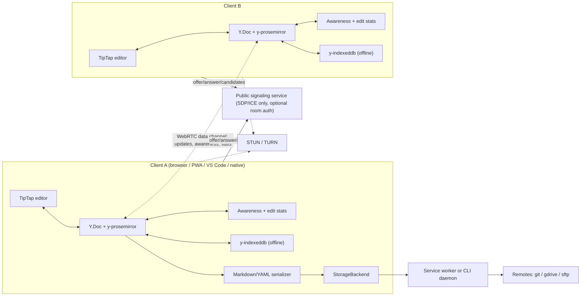
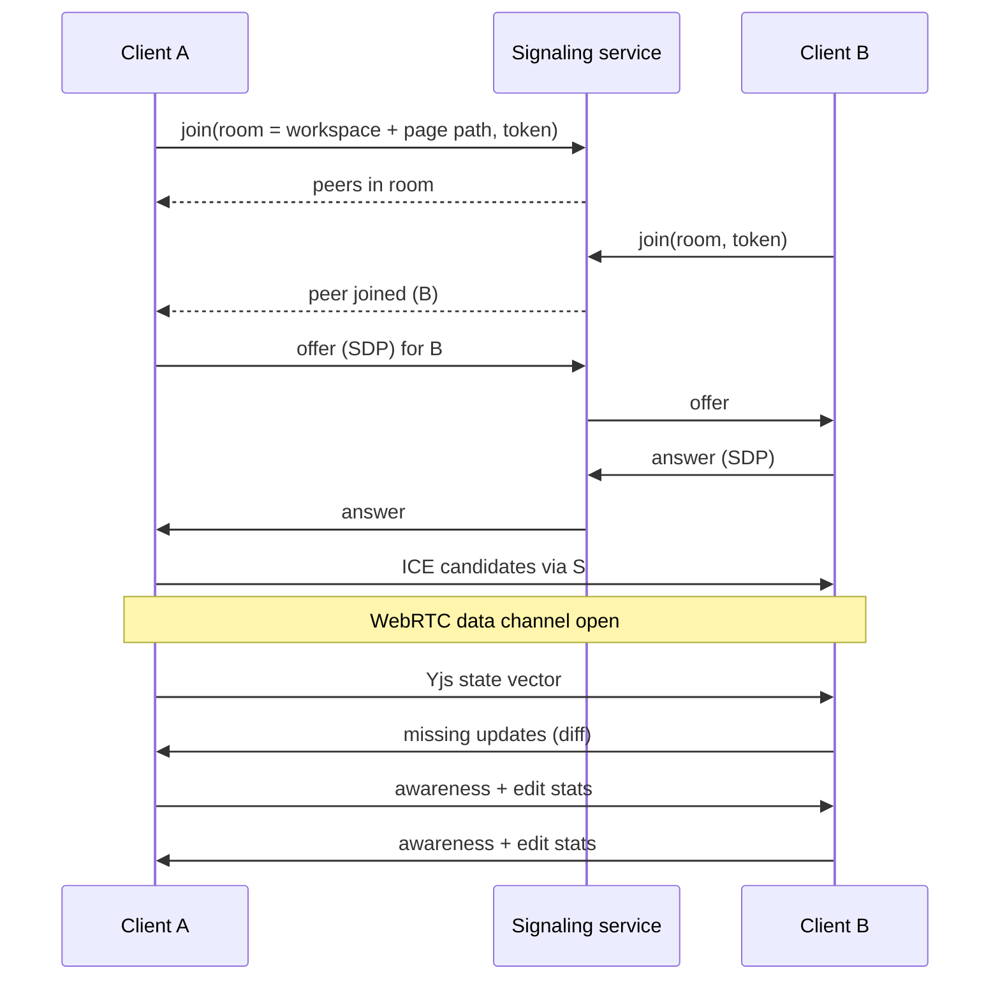
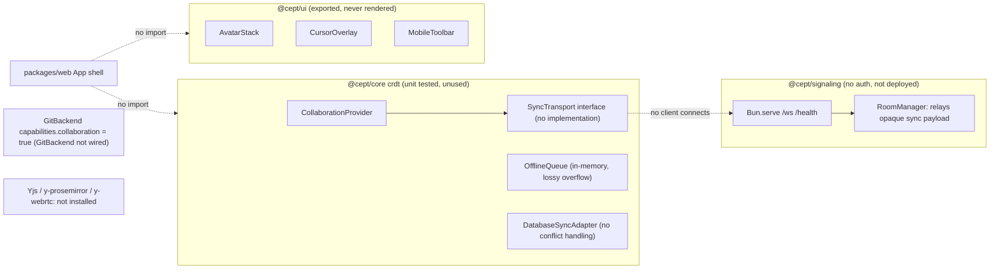

# Requirements: Co-editing & P2P Collaboration

**Status:** Draft, 2026-10-06 · **Area ID prefix:** `REQ-COL` · **Owner:** nsheaps

This document sets out the requirements for **real-time co-editing** in Cept. Two or more clients edit the same page at the same time. They reconcile their edits with a CRDT and share edit statistics and presence over **public peer-to-peer WebRTC**, and a server is used only for signaling. Each requirement below has been checked against the current code, open PRs and issues, and current docs, and the evidence is recorded. In short, the repo has tested building blocks (provider, offline queue, database sync adapter, a WebSocket relay and presentational UI components) and no working co-editing feature. Yjs is not a dependency anywhere, no transport exists, and nothing in the app shell wires these pieces together.

**Related:**

- [README.md](README.md): index, architecture overview, traceability matrix
- [01-browser-app-and-pwa.md](01-browser-app-and-pwa.md): the browser component and service worker that host the collaboration session (REQ-WEB)
- [02-static-rendering.md](02-static-rendering.md): static output, which must never open collaboration sessions (REQ-SSG)
- [03-workspaces-and-storage.md](03-workspaces-and-storage.md): workspace roots, nesting, backend capabilities (REQ-WS)
- [05-cli-and-daemon.md](05-cli-and-daemon.md): the local daemon that may own sync (REQ-CLI)
- [06-vscode-extension.md](06-vscode-extension.md): co-editing from VS Code web and desktop (REQ-VSC)
- [08-editor.md](08-editor.md): the TipTap editor, databases and Markdown serialization (REQ-EDT)
- [09-remotes-and-auth.md](09-remotes-and-auth.md): identities and tokens for room authorization (REQ-AUTH)
- [10-engineering-and-ci.md](10-engineering-and-ci.md): CI and e2e infrastructure (REQ-ENG)
- Original spec: [docs/SPECIFICATION.md](../../SPECIFICATION.md) §5.6 and §6.6

## Contents

1. [Scope & non-goals](#1-scope--non-goals)
2. [Requirements summary](#2-requirements-summary)
3. [Architecture](#3-architecture)
4. [Requirements](#4-requirements)
5. [Conflicts & open questions](#5-conflicts--open-questions)
6. [Stale documentation](#6-stale-documentation)
7. [Cross-area dependencies](#7-cross-area-dependencies)

## 1. Scope & non-goals

### In scope

- Concurrent editing of one page's rich text by several clients, with automatic convergence through a CRDT.
- A public, peer-to-peer WebRTC transport for document updates, plus a signaling service for peer discovery (a public default and a self-hosted option).
- Sharing **edit statistics** and **presence** (who is here, cursors, selections, recent activity) between peers.
- Offline editing that persists and replays when the client reconnects.
- Real-time sync of database (table/board) rows and schemas.
- Optional room-level authorization on the signaling service.
- Test coverage (unit, integration, multi-context e2e) and user-facing docs for all of the above.

### Non-goals

- **Durable remote sync** (pushing to git, gdrive, sftp) is the job of the remotes, the service worker and the CLI daemon. See [03-workspaces-and-storage.md](03-workspaces-and-storage.md), [05-cli-and-daemon.md](05-cli-and-daemon.md) and [09-remotes-and-auth.md](09-remotes-and-auth.md). Collaboration converges live state; the remotes persist it.
- Comments, mentions, notifications and permission roles (viewer/editor). The handler's requirements do not mention them.
- A central server that stores document content. The handler asks for P2P, so content storage on a server is out of scope.
- Git branch-based "collaboration" (the PR/merge workflow). That belongs to the remotes area.

## 2. Requirements summary

| ID | Requirement | Priority | Impl status | Docs status | Docs accurate |
| --- | --- | --- | --- | --- | --- |
| [REQ-COL-001](#req-col-001--co-editing-available-for-shared-workspaces) | Co-editing available for shared workspaces | MUST | stubbed | documented-differently | stale |
| [REQ-COL-002](#req-col-002--crdt-based-reconciliation-of-text-edits-yjs) | CRDT-based reconciliation of text edits (Yjs) | MUST | not-started | documented-as-desired | stale |
| [REQ-COL-003](#req-col-003--public-peer-to-peer-webrtc-transport) | Public peer-to-peer WebRTC transport | MUST | divergent | documented-differently | accurate |
| [REQ-COL-004](#req-col-004--public-signaling-endpoint-available-by-default) | Public signaling endpoint available by default | MUST | not-started | documented-as-desired | accurate |
| [REQ-COL-005](#req-col-005--signaling-server-runnable) | Signaling server runnable | MUST | partial | documented-as-desired | stale |
| [REQ-COL-006](#req-col-006--signaling-room-auth) | Signaling room auth | SHOULD | not-started | documented-as-desired | accurate |
| [REQ-COL-007](#req-col-007--sharing-edit-stats-between-peers) | Sharing edit stats between peers | MUST | not-started | undocumented | n/a |
| [REQ-COL-008](#req-col-008--presence-and-awareness-avatars-remote-cursors) | Presence and awareness (avatars, remote cursors) | MUST | stubbed | documented-as-desired | stale |
| [REQ-COL-009](#req-col-009--offline-editing-with-reconnect-sync) | Offline editing with reconnect sync | MUST | stubbed | documented-as-desired | stale |
| [REQ-COL-010](#req-col-010--real-time-sync-of-database-tableboard-changes) | Real-time sync of database (table/board) changes | MUST | stubbed | documented-as-desired | stale |
| [REQ-COL-011](#req-col-011--collaboration-not-tied-to-git-backend) | Collaboration not tied to Git backend | SHOULD | divergent | documented-differently | accurate |
| [REQ-COL-012](#req-col-012--collaboration-e2e-test-coverage) | Collaboration e2e test coverage | MUST | not-started | documented-as-desired | accurate |
| [REQ-COL-013](#req-col-013--user-facing-collaboration-guide) | User-facing collaboration guide | MUST | not-started | undocumented | stale |

Tally: 0 implemented, 1 partial, 4 stubbed, 6 not-started, 2 divergent.

## 3. Architecture

### 3.1 Required architecture

Every client holds a CRDT document (Yjs `Y.Doc`) for each open page, bound to the TipTap editor. Peers find each other through a signaling service, which only exchanges SDP offers/answers and ICE candidates (and optionally checks a room token). After that, document updates, awareness and edit statistics travel directly over WebRTC data channels. CRDT state is persisted locally (IndexedDB) for offline use, and is serialized to Markdown/YAML for the storage backend and the remotes. Durable remote sync belongs to the service worker or the shared local daemon.

Session establishment:

### 3.2 Current state

The current code is a different design. `@cept/signaling` is a WebSocket hub that **relays document payloads** to every room member, and nothing connects to it. The core CRDT classes depend on a `SyncTransport` interface that has no implementation. The UI components are exported from `@cept/ui` but the app never renders them.

## 4. Requirements

### REQ-COL-001 — Co-editing available for shared workspaces

**Statement:** Cept MUST let two or more clients edit the same workspace page at the same time, with every client's edits reaching the others in near real time (seconds).

**Rationale / source:** handler ("Co-editing support").

**Acceptance criteria:**

- Two clients open the same page of the same shared workspace. A keystroke on one appears on the other within 2 seconds on a typical broadband connection.
- Both clients end with byte-identical serialized Markdown after concurrent edits stop.
- The feature works from the browser app, the PWA, the VS Code extension and the native apps (all of them reuse the browser component).
- A user can start sharing from the UI with no manual server configuration (see [REQ-COL-004](#req-col-004--public-signaling-endpoint-available-by-default)).

**Current state (stubbed):** [packages/core/src/crdt/collaboration-provider.ts](../../../packages/core/src/crdt/collaboration-provider.ts) manages sessions, reconnect backoff and presence events over an injected transport, and has unit tests. It is only re-exported from [packages/core/src/index.ts](../../../packages/core/src/index.ts) (around L174). Nothing in `packages/web` or `packages/ui` constructs it, and no transport implementation exists. TASKS.md P5.7, P5.9 and P5.10 are unchecked.

**Docs state:** documented-differently, stale. [docs/SPECIFICATION.md](../../SPECIFICATION.md) §5.6 (L526-532) and §6.6 describe Yjs plus a relay signaling server, Git backend only. [README.md](../../../README.md) L17, L28 and L71 and [CHANGELOG.md](../../../CHANGELOG.md) L556 present the feature as shipped (stale). [docs/content/reference/roadmap.md](../../content/reference/roadmap.md) L93 says "Planned", which is accurate. [docs/content/guides/features.md](../../content/guides/features.md) says Git collaboration is "Via branches", "Coming soon".

**Gap:** a concrete CRDT binding ([REQ-COL-002](#req-col-002--crdt-based-reconciliation-of-text-edits-yjs)), a transport ([REQ-COL-003](#req-col-003--public-peer-to-peer-webrtc-transport)), app-shell wiring, and the two-context e2e test ([REQ-COL-012](#req-col-012--collaboration-e2e-test-coverage)).

**Related PRs/issues:** none found. A semantic issue search returned 0 results, and no open PR (https://github.com/nsheaps/cept/pull/67, https://github.com/nsheaps/cept/pull/69, https://github.com/nsheaps/cept/pull/37, https://github.com/nsheaps/cept/pull/24, https://github.com/nsheaps/cept/pull/283, https://github.com/nsheaps/cept/pull/246) touches crdt or signaling code.

### REQ-COL-002 — CRDT-based reconciliation of text edits (Yjs)

**Statement:** Concurrent edits to a page's rich-text content MUST be reconciled with a CRDT (Yjs bound to TipTap via y-prosemirror or equivalent), so all clients converge to the same document state without a manual merge.

**Rationale / source:** handler ("reconciling between clients"). The original spec chose Yjs ([docs/SPECIFICATION.md](../../SPECIFICATION.md) L93-95).

**Acceptance criteria:**

- `yjs` and `y-prosemirror` (or `@tiptap/extension-collaboration`) are declared dependencies and appear in `bun.lock`.
- The TipTap editor binds to a `Y.Doc` for each page. Undo/redo is scoped to the local user's edits.
- A deterministic `Y.Doc` to Markdown serializer exists and passes a roundtrip test (Markdown to Y.Doc to Markdown is identical; SPECIFICATION.md L1567).
- A unit test applies concurrent interleaved updates to two `Y.Doc`s in different orders and asserts identical output.
- Blocks the storage format cannot represent fall back to HTML, consistent with [08-editor.md](08-editor.md), and survive the CRDT roundtrip.

**Current state (not-started):** no package.json and no lockfile entry mentions `yjs`, `y-prosemirror`, `y-webrtc`, `y-websocket`, `y-indexeddb` or `@tiptap/extension-collaboration`. The header of [collaboration-provider.ts](../../../packages/core/src/crdt/collaboration-provider.ts) (L7-8) says the module "does NOT import Yjs directly". TASKS.md T6.1 ("Yjs integration with TipTap (y-prosemirror)") is checked, but P5.7 ("Implement concrete Yjs binding") is unchecked. [.claude/prompts/continue.md](../../../.claude/prompts/continue.md) L185 confirms there is "no concrete Yjs/y-prosemirror binding anywhere".

**Docs state:** documented-as-desired, stale. SPECIFICATION.md L93-95 lists Yjs, y-indexeddb and y-prosemirror, and L925 says CRDTs prevent conflicts. [CHANGELOG.md](../../../CHANGELOG.md) L556 claims "Yjs CRDT with signaling server" shipped, which is false.

**Gap:** add the dependencies, bind the editor, write the serializer, and add y-indexeddb persistence (see [REQ-COL-009](#req-col-009--offline-editing-with-reconnect-sync)).

**Related PRs/issues:** TASKS.md P5.7; T6.1 is checked but the work is not done.

### REQ-COL-003 — Public peer-to-peer WebRTC transport

**Statement:** Clients MUST exchange document updates directly peer to peer over WebRTC data channels. A server MAY be used only for signaling (SDP/ICE exchange) and MUST NOT be needed to relay document content.

**Rationale / source:** handler ("public p2p webrtc for sharing stats on edits and reconciling between clients").

**Acceptance criteria:**

- A `SyncTransport` implementation built on `RTCPeerConnection` data channels (y-webrtc or custom) exists in a platform-neutral package.
- The signaling protocol defines `offer`, `answer` and `candidate` message types, and the signaling service never receives Yjs update payloads. A test asserts this, for example by inspecting the message types the server handles.
- STUN servers are configurable, and a TURN fallback is configurable for peers behind symmetric NAT.
- Document payloads on the data channel are end-to-end encrypted with a room secret, or the owner explicitly decides they need not be (see [section 5](#5-conflicts--open-questions)).
- A mesh of at least 3 peers converges. The supported maximum peer count is documented.

**Current state (divergent):** the repo has no WebRTC code: no `RTCPeerConnection` and no y-webrtc. The only server is a WebSocket hub. [packages/signaling-server/src/server.ts](../../../packages/signaling-server/src/server.ts) upgrades `/ws`, and [packages/signaling-server/src/room-manager.ts](../../../packages/signaling-server/src/room-manager.ts) (L62, L243) relays opaque `sync` payloads to every room member, so document content passes through the server. [packages/signaling-server/src/protocol.ts](../../../packages/signaling-server/src/protocol.ts) has no offer, answer or ICE message types.

**Docs state:** documented-differently. SPECIFICATION.md L120 says "SyncTransport ... Implementations: WebSocket (default), WebRTC data channel (future)", and §6.6 L956 says "Server relays Yjs update messages". README.md L63 says "WebSocket signaling server". These describe the current relay design, so they are accurate about the code but differ from the requirement.

**Gap:** implement the WebRTC transport and the signaling message types. Decide whether the WebSocket relay remains as a fallback. Specify STUN/TURN configuration.

**Related PRs/issues:** none.

### REQ-COL-004 — Public signaling endpoint available by default

**Statement:** Cept MUST ship pointed at a public, best-effort signaling endpoint so co-editing works with zero setup, and users MUST be able to set a self-hosted signaling URL instead.

**Rationale / source:** handler ("public p2p") and the existing spec (SPECIFICATION.md §6.6 L950).

**Acceptance criteria:**

- A public signaling instance is deployed by a CI/IaC workflow, possibly from nsheaps/iac next to the Cloudflare OAuth proxy (unverified), and its health endpoint is monitored.
- The app's sync settings have a "Signaling server URL" field (SPECIFICATION.md L539) that defaults to the public endpoint and is persisted per user.
- A Dockerfile (or equivalent artifact) and a self-hosting guide let a user run their own instance.
- The public instance has published terms of use and rate limits.

**Current state (not-started):** no deployed URL, no deploy workflow for the signaling server in `.github/workflows/`, and no Dockerfile in the repo. Grepping `signaling` in `packages/web/src` and in the UI settings code returns nothing. TASKS.md P5.11 is unchecked.

**Docs state:** documented-as-desired, accurate. SPECIFICATION.md L950-952 calls for a community server, a Dockerfile and Fly.io/Railway docs, and L539 calls for a signaling URL setting. No user-facing self-hosting doc exists.

**Gap:** Dockerfile, deploy target, terms page, settings field and self-hosting guide.

**Related PRs/issues:** TASKS.md P5.11.

### REQ-COL-005 — Signaling server runnable

**Statement:** `packages/signaling-server` MUST provide a runnable Bun server that manages per-document rooms (join, leave, disconnect) and exposes a health endpoint.

**Rationale / source:** derived. [REQ-COL-003](#req-col-003--public-peer-to-peer-webrtc-transport) and [REQ-COL-004](#req-col-004--public-signaling-endpoint-available-by-default) depend on it.

**Acceptance criteria:**

- `bun run start` (or the `cept-signaling` bin) starts the server on `PORT`, and `GET /health` returns 200.
- Join, leave and disconnect behaviour is covered by unit tests on `RoomManager`.
- An integration test starts `server.ts`, connects two WebSocket clients, and asserts room membership and message forwarding.
- The package has a README that explains how to run and configure the server.

**Current state (partial):** [packages/signaling-server/src/server.ts](../../../packages/signaling-server/src/server.ts) runs `Bun.serve` with `/ws` and `/health` and reads `PORT`. [packages/signaling-server/package.json](../../../packages/signaling-server/package.json) defines a `start` script and the `cept-signaling` bin. [room-manager.ts](../../../packages/signaling-server/src/room-manager.ts) is tested by [room-manager.test.ts](../../../packages/signaling-server/src/room-manager.test.ts), which root [vitest.config.ts](../../../vitest.config.ts) runs. Verified on 2026-10-06: `PORT=4917 bun run src/server.ts` starts and `GET /health` returns `{"status":"ok","rooms":0}`. `server.ts` has no tests and the package has no README, so two of the four acceptance criteria are open.

**Docs state:** documented-as-desired, stale. [README.md](../../../README.md) L63 lists the package, SPECIFICATION.md §6.6 (L946-959) describes the server, and the `server.ts` header comment gives run instructions. Stale: [roadmap.md](../../content/reference/roadmap.md) L94 lists "Signaling server" as "Planned" although it runs. TASKS.md P5.8 ("Create signaling server entry point") is unchecked although the entry point exists (P2.1 is checked). [.claude/prompts/continue.md](../../../.claude/prompts/continue.md) L55, L143 and L187 say there is "no WebSocket server entry point". The package has no README.

**Gap:** check off P5.8, update roadmap.md L94, fix continue.md, add an integration test for `server.ts`, and write run docs. Once [REQ-COL-003](#req-col-003--public-peer-to-peer-webrtc-transport) lands, change the server from content relay to SDP/ICE signaling.

**Related PRs/issues:** TASKS.md P2.1 (done), P5.8 (stale).

### REQ-COL-006 — Signaling room auth

**Statement:** The signaling server SHOULD support optional room-level authorization, so that only clients allowed into the workspace can join a document room.

**Rationale / source:** existing spec, SPECIFICATION.md §6.6 L959 ("optional room-level auth (token validation against the Git repo)").

**Acceptance criteria:**

- The `join` message carries an optional token. When auth is enabled, the server rejects a join with a missing or invalid token and returns a typed error.
- Tokens are validated through the providers defined in [09-remotes-and-auth.md](09-remotes-and-auth.md) (GitHub app or PAT, Google) for the workspace's remote, or with a room secret shared out of band.
- Room IDs are not guessable from page paths alone (for example, a hash of workspace ID, page path and secret).

**Current state (not-started):** the `JoinMessage` in [protocol.ts](../../../packages/signaling-server/src/protocol.ts) has only `documentId` and `user`, with no token. [server.ts](../../../packages/signaling-server/src/server.ts) upgrades every `/ws` request without checks.

**Docs state:** documented-as-desired, accurate (SPECIFICATION.md L959).

**Gap:** the token field, a validation hook and a room-ID scheme. On a public relay, a known room ID is enough to read document content, which makes this a security gap for the current design.

**Related PRs/issues:** none.

### REQ-COL-007 — Sharing edit stats between peers

**Statement:** Peers MUST share edit statistics or metadata (for example who is editing, last-edit timestamps and per-user change counts) alongside content updates, so clients can show activity and make reconciliation decisions.

**Rationale / source:** handler ("sharing stats on edits").

**Acceptance criteria:**

- A versioned edit-stats schema is specified in this document once the owner defines "stats" (see [section 5](#5-conflicts--open-questions)).
- Stats are sent over the same P2P channel as awareness and never through a server that stores them.
- The UI shows the stats (for example "last edited by X, 2 min ago" and per-collaborator activity).
- A unit test checks that stats from two peers merge deterministically.

**Current state (not-started):** neither [protocol.ts](../../../packages/signaling-server/src/protocol.ts) nor `packages/core/src/crdt/` defines an edit-stats message or model. `DatabaseChange` in [database-sync.ts](../../../packages/core/src/crdt/database-sync.ts) (L15-34) carries a `userId` and timestamp on each operation, but nothing aggregates or exposes them.

**Docs state:** undocumented. SPECIFICATION.md, `docs/specs/` and `docs/content/` do not mention it.

**Gap:** the requirement is ambiguous. It could mean Yjs awareness fields, a state-vector summary, or activity counters. Define it, then specify and implement it.

**Related PRs/issues:** none.

### REQ-COL-008 — Presence and awareness (avatars, remote cursors)

**Statement:** Each client MUST broadcast its identity and cursor/selection through an awareness channel. The editor MUST show an avatar stack of active collaborators, and remote cursors and selections with name labels.

**Rationale / source:** handler (co-editing) and the existing spec (SPECIFICATION.md §5.6 L528, L739).

**Acceptance criteria:**

- The page topbar shows an avatar stack of every connected peer, and a peer's avatar disappears within 30 seconds of disconnect.
- Remote cursors and selections render at the correct document position, follow text reflow, and carry a colour and name label.
- Awareness state comes from Yjs awareness (or y-prosemirror's cursor plugin) over the transport in [REQ-COL-003](#req-col-003--public-peer-to-peer-webrtc-transport).
- The mobile layout shows presence in a compact form.

**Current state (stubbed):** [AvatarStack.tsx](../../../packages/ui/src/components/collaboration/AvatarStack.tsx), [CursorOverlay.tsx](../../../packages/ui/src/components/collaboration/CursorOverlay.tsx) and [MobileToolbar.tsx](../../../packages/ui/src/components/collaboration/MobileToolbar.tsx) are presentational components with their own tests. They are exported from [packages/ui/src/index.ts](../../../packages/ui/src/index.ts) (L64-71), but no app component imports them. `CursorOverlay` expects precomputed pixel positions, and nothing maps ProseMirror positions to pixels. An `AwarenessUser` type exists in [crdt/index.ts](../../../packages/core/src/crdt/index.ts), and `RoomManager` broadcasts awareness. TASKS.md P5.9 is unchecked; T6.3 is checked.

**Docs state:** documented-as-desired, stale. [CHANGELOG.md](../../../CHANGELOG.md) L556 claims "presence awareness" shipped. [roadmap.md](../../content/reference/roadmap.md) L95 says "Presence indicators: Planned" (accurate).

**Gap:** wire the components to awareness, render them in the topbar and editor, and add an e2e test.

**Related PRs/issues:** TASKS.md P5.9, T6.3.

### REQ-COL-009 — Offline editing with reconnect sync

**Statement:** A client that goes offline MUST keep editing locally and persist pending updates across reloads. On reconnect it MUST sync automatically and converge with its peers without data loss.

**Rationale / source:** existing spec (SPECIFICATION.md L47, L531, L941-942), derived from the handler's co-editing and service-worker sync requirements.

**Acceptance criteria:**

- Edits made offline survive a page reload (persisted in IndexedDB, for example via y-indexeddb).
- On reconnect, peers exchange state vectors and apply only the missing updates. Both sides converge.
- Nothing is dropped silently. Any queue bound fails loudly or compacts state; it never discards updates.
- An e2e test edits offline on both sides, reconnects, and asserts both edits are present.

**Current state (stubbed):** [offline-queue.ts](../../../packages/core/src/crdt/offline-queue.ts) is an in-memory FIFO. Its "optionally persisted" header has no persistence code behind it. When full (default 1000 entries) it drops the oldest operations, which loses data and conflicts with CRDT semantics. It is not wired to any transport. TASKS.md P5.10 is unchecked; T6.5 is checked.

**Docs state:** documented-as-desired, stale. SPECIFICATION.md L531 says "Works fully offline; syncs when reconnected". [CHANGELOG.md](../../../CHANGELOG.md) L556 claims "offline queue" shipped. [platform-support.md](../../content/guides/platform-support.md) L27-30 says offline editing works, which is true for local storage only, not for collaboration.

**Gap:** persist CRDT state, sync by state-vector diff, and remove or redesign the lossy overflow policy. With Yjs in place, OfflineQueue may become unnecessary for text.

**Related PRs/issues:** TASKS.md P5.10, T6.5.

### REQ-COL-010 — Real-time sync of database (table/board) changes

**Statement:** Database row and schema changes MUST sync between co-editing clients and MUST converge deterministically under concurrent edits to the same row or property.

**Rationale / source:** handler ("Database support" plus co-editing) and the existing spec (TASKS.md T6.4).

**Acceptance criteria:**

- A merge rule is specified: either a `Y.Map` per row, or last-writer-wins on a hybrid logical clock with a deterministic tiebreak.
- Two clients that concurrently edit the same cell end with the same value on both. A unit test covers both arrival orders.
- Concurrent schema changes (rename versus delete of a property) have defined outcomes, and the `conflict` event is emitted where the rule says so.
- The synced representation round-trips to the database storage formats defined in [08-editor.md](08-editor.md).

**Current state (stubbed):** [database-sync.ts](../../../packages/core/src/crdt/database-sync.ts) is unit tested but only re-exported from [packages/core/src/index.ts](../../../packages/core/src/index.ts) (L182); no app code constructs `DatabaseSyncAdapter`. It batches operations, dedupes them by `changeId`, and applies remote operations in arrival order. It has no ordering, LWW or conflict detection: the `conflict` event type at L53 is declared and never emitted. No broadcast function is wired into the app.

**Docs state:** documented-as-desired, stale. The requirement appears only as a task line: [docs/SPECIFICATION.md](../../SPECIFICATION.md) L2434 and TASKS.md T6.4 ("Real-time sync of database changes"). T6.4 is checked although nothing is wired and no merge rule exists, so it is stale. [docs/specs/database-engine.md](../../specs/database-engine.md) has no sync semantics (a grep for "sync", "collab" and "concurr" found nothing).

**Gap:** a merge rule, database-engine integration and a convergence test.

**Related PRs/issues:** TASKS.md T6.4 (checked).

### REQ-COL-011 — Collaboration not tied to Git backend

**Statement:** Co-editing SHOULD work for any workspace shared between clients, whatever its remote type (git, gdrive, sftp), and not only for GitBackend. Real-time CRDT sync and durable remote sync are separate layers.

**Rationale / source:** derived. The handler lists co-editing as a standalone component and lists the remotes separately.

**Acceptance criteria:**

- Whether collaboration is available depends on whether a workspace is shared (has a room/share identity), not on the storage backend type.
- `BackendCapabilities.collaboration` is removed or redefined, and the change is reflected in [03-workspaces-and-storage.md](03-workspaces-and-storage.md).
- Static rendering ([02-static-rendering.md](02-static-rendering.md)) never opens a collaboration session.

**Current state (divergent):** `BackendCapabilities.collaboration` ([packages/core/src/storage/backend.ts](../../../packages/core/src/storage/backend.ts) L51) is true only in [git-backend.ts](../../../packages/core/src/storage/git-backend.ts) (L37), and GitBackend is not wired into the app (TASKS.md P5.1-P5.6 unchecked). [crdt/index.ts](../../../packages/core/src/crdt/index.ts) L4 says "Only active when using GitBackend".

**Docs state:** documented-differently, accurate (the docs match the current Git-only design). SPECIFICATION.md L43, L116 and L711 and [CLAUDE.md](../../../CLAUDE.md) ("Git adds collaboration") tie collaboration to Git. [features/storage/browser-backend.feature](../../../features/storage/browser-backend.feature) L20 asserts the browser backend has no collaboration.

**Gap:** the owner needs to decide (see [section 5](#5-conflicts--open-questions)). If collaboration should not depend on the backend, change the capability model, the spec and the BDD feature.

**Related PRs/issues:** none.

### REQ-COL-012 — Collaboration e2e test coverage

**Statement:** An e2e test MUST open two browser contexts on the same page and verify that edits converge and that remote cursors and avatars appear.

**Rationale / source:** existing spec (SPECIFICATION.md L1588, and L1408-1411 for `features/collaboration/*.feature`).

**Acceptance criteria:**

- `features/collaboration/*.feature` scenarios exist for concurrent typing, presence, and offline-then-reconnect.
- A Playwright test drives two contexts and asserts convergence, avatars and cursors.
- CI starts the signaling service (or a local test instance) in the e2e job and runs the test on PRs that touch collaboration code.

**Current state (not-started):** there is no `features/collaboration/` directory. `e2e/tests` contains only feature-screenshots, responsive, slash-commands and smoke specs. [.github/workflows/_test-e2e.yml](../../../.github/workflows/_test-e2e.yml) does not start a signaling service.

**Docs state:** documented-as-desired, accurate (SPECIFICATION.md L1408-1411, L1588).

**Gap:** feature files, a multi-context Playwright test, and a CI service.

**Related PRs/issues:** none.

### REQ-COL-013 — User-facing collaboration guide

**Statement:** The docs site MUST have a "Real-time Collaboration" guide that covers how to share and co-edit, the signaling/P2P model, privacy, and self-hosting.

**Rationale / source:** derived.

**Acceptance criteria:**

- `docs/content/guides/collaboration.md` exists and is reachable from the docs navigation.
- It covers starting a share, the P2P and signaling model (what the server sees), presence, offline behaviour, self-hosting signaling, and known limits.
- Screenshots come from the automated e2e screenshot pipeline (per the repo rule on UI screenshot evidence).

**Current state (not-started):** [docs/src/index.ts](../../src/index.ts) L39 registers a `collaboration` guide slug, but the file does not exist. `docs/content/guides/` contains only features, markdown-extensions, platform-support and toggle-syntax.

**Docs state:** undocumented, stale. The nav entry points to a missing page. [vs-notion.md](../../content/comparison/vs-notion.md) L17 and L49-50 describe collaboration as "Git branches + CRDT" / "based on Git".

**Gap:** write the guide once the feature exists, or remove the nav entry until then.

**Related PRs/issues:** none.

## 5. Conflicts & open questions

These need a decision from the owner:

1. **P2P WebRTC or WebSocket relay?** The handler asks for public P2P WebRTC. SPECIFICATION.md L120 makes WebSocket the default and WebRTC "future", §6.6 (L948-959) describes a server that relays Yjs updates, and the implementation ([room-manager.ts](../../../packages/signaling-server/src/room-manager.ts) L62/L243) is a content relay. Proposal: WebRTC is primary, and the relay is kept only as an opt-in fallback for peers that cannot connect directly. Should the relay be kept at all?
2. **Is collaboration tied to the backend?** The handler treats co-editing as its own component. The spec, CLAUDE.md, [crdt/index.ts](../../../packages/core/src/crdt/index.ts) L4 and [git-backend.ts](../../../packages/core/src/storage/git-backend.ts) L37 restrict it to GitBackend. Should any shared workspace be collaborative ([REQ-COL-011](#req-col-011--collaboration-not-tied-to-git-backend))?
3. **What are "stats on edits"?** Presence and awareness, a state-vector summary, per-user change counts, or something else ([REQ-COL-007](#req-col-007--sharing-edit-stats-between-peers))?
4. **Where is the public signaling hosted?** Options include a Cloudflare Worker or Durable Object via nsheaps/iac (next to the OAuth proxy; unverified), Fly.io/Railway as the spec says, or a public y-webrtc signaling server. Who pays for it and runs it?
5. **Encryption and privacy.** Should data-channel payloads be end-to-end encrypted with a room secret? Is a TURN relay acceptable, given that it sees encrypted traffic?
6. **Who owns the session lifecycle?** The handler puts syncing in the service worker or the shared CLI daemon. Does the page, the service worker or the daemon own the `Y.Doc`, its persistence and the transport? This decides whether the VS Code extension and the PWA can share one session.
7. **Room scoping with nested workspaces.** With nesting up to 10 deep ([03-workspaces-and-storage.md](03-workspaces-and-storage.md)), is a room keyed by the innermost workspace root plus page path, or by the outermost root?
8. **The "no server" principle.** SPECIFICATION.md §1 says "Client-only ... no server process". A public signaling service and a CLI daemon contradict this, so the principle needs rewording.
9. **TASKS.md is self-contradictory.** Phase 6 T6.1-T6.5 are checked "2026-03-04", but P5.7, P5.9 and P5.10 (unchecked) describe the same work, and the code has no Yjs dependency. P5.8 is unchecked although [server.ts](../../../packages/signaling-server/src/server.ts) exists (P2.1 checked). Should T6.x be unchecked, or annotated "scaffolding only"?
10. **Terminology.** The handler says "workspaces", while the code and UI renamed workspace to "space" (continue.md, commit d572437; features.md "Spaces"). This document uses "workspace" to match the handler.
11. **Package description.** CLAUDE.md and [signaling-server/src/index.ts](../../../packages/signaling-server/src/index.ts) call `@cept/signaling` a "Yjs WebSocket signaling server", but it does not use Yjs. It relays an opaque payload.

## 6. Stale documentation

| Path | Claim | Problem / fix |
| --- | --- | --- |
| [CHANGELOG.md](../../../CHANGELOG.md) L556 | "Collaboration: Yjs CRDT with signaling server, presence awareness, offline queue" shipped | Yjs is not a dependency and nothing is wired. Reword to "scaffolding" or move to Unreleased/Planned. |
| [README.md](../../../README.md) L17, L28, L71 | "Real-time collaboration via CRDTs (Git backend)", "Yes (CRDTs)" | Presents the feature as available. Mark it planned. |
| [README.md](../../../README.md) L63 | "WebSocket signaling server" | Conflicts with the P2P WebRTC requirement once decided. |
| [docs/content/getting-started/introduction.md](../../content/getting-started/introduction.md) L3 | "supports real-time collaboration" | Not true today. The bundled copy in [docs-content.ts](../../../packages/ui/src/components/docs/docs-content.ts) L127 needs the same fix. |
| [TASKS.md](../../../TASKS.md) T6.1-T6.5 | Checked as complete | No Yjs binding; presence and offline queue are not wired. Uncheck or annotate. |
| [docs/content/reference/roadmap.md](../../content/reference/roadmap.md) L94 | "Signaling server" is "Planned" | The server exists and runs ([server.ts](../../../packages/signaling-server/src/server.ts)). Mark it as available (relay only, not deployed). |
| [TASKS.md](../../../TASKS.md) P5.8 | Unchecked | The signaling entry point exists ([server.ts](../../../packages/signaling-server/src/server.ts)). Check it. |
| [.claude/prompts/continue.md](../../../.claude/prompts/continue.md) L55, L143, L187 | "no WebSocket server entry point" | Outdated. Update. |
| [docs/src/index.ts](../../src/index.ts) L39 | Registers the `collaboration` guide | `docs/content/guides/collaboration.md` does not exist. Write it or remove the entry. |
| [docs/content/comparison/vs-notion.md](../../content/comparison/vs-notion.md) L17, L49-50 | Collaboration is "Git branches + CRDT" / "based on Git" | Differs from the P2P model. Revise after decision 2 in section 5. |
| [docs/content/comparison/vs-obsidian.md](../../content/comparison/vs-obsidian.md) L18, L40 | Git-based collaboration | Same as above. |
| [docs/content/guides/platform-support.md](../../content/guides/platform-support.md) L76 | "Push notifications for collaboration" planned | No collaboration feature backs it. Keep it as planned, but link it to this spec. |
| [docs/content/guides/platform-support.md](../../content/guides/platform-support.md) L27-30 | Offline editing works | True for local storage only. Clarify for collaboration. |
| [packages/core/src/crdt/offline-queue.ts](../../../packages/core/src/crdt/offline-queue.ts) header | Operations "optionally persisted" | No persistence code. Fix the comment or implement persistence. |
| [docs/SPECIFICATION.md](../../SPECIFICATION.md) L120, §6.6 L948-959 | WebSocket default, server relays Yjs updates | Rewrite to match REQ-COL-003 once decided. |
| [CLAUDE.md](../../../CLAUDE.md) package table | `@cept/signaling` is a "Yjs WebSocket signaling server" | It does not use Yjs. Correct the description. |

## 7. Cross-area dependencies

| Depends on / affects | Area | Why |
| --- | --- | --- |
| Editor binding and Markdown serializer | [08-editor.md](08-editor.md) (REQ-EDT) | y-prosemirror must replace or coexist with the current Markdown save path. A `Y.Doc` to Markdown serializer must keep the HTML fallback and the GFM/footnote constructs. See also [docs/specs/markdown-parser.md](../../specs/markdown-parser.md). |
| Database merge semantics | [08-editor.md](08-editor.md) (REQ-EDT), [docs/specs/database-engine.md](../../specs/database-engine.md) | The [REQ-COL-010](#req-col-010--real-time-sync-of-database-tableboard-changes) merge rule must match the database storage formats. |
| Capability model and nesting | [03-workspaces-and-storage.md](03-workspaces-and-storage.md) (REQ-WS) | `BackendCapabilities.collaboration` ([REQ-COL-011](#req-col-011--collaboration-not-tied-to-git-backend)), and room-ID scoping for nested workspaces and `workspace.ya?ml` roots. |
| Room auth identities | [09-remotes-and-auth.md](09-remotes-and-auth.md) (REQ-AUTH) | GitHub app or PAT and Google tokens for [REQ-COL-006](#req-col-006--signaling-room-auth). The Cloudflare worker set up via nsheaps/iac is a possible signaling host (unverified). |
| Session ownership | [01-browser-app-and-pwa.md](01-browser-app-and-pwa.md) (REQ-WEB), [05-cli-and-daemon.md](05-cli-and-daemon.md) (REQ-CLI) | The service worker, the page or the shared daemon owns the CRDT persistence and transport lifecycle. The PWA can share the local daemon. |
| VS Code co-editing | [06-vscode-extension.md](06-vscode-extension.md) (REQ-VSC) | Reuses the same browser component and awareness. WebRTC availability in VS Code web and desktop webviews needs checking (unverified). |
| Native apps | [07-native-apps.md](07-native-apps.md) (REQ-APP) | WebRTC in Capacitor and Electrobun/Electron webviews, and background suspension on mobile. |
| Static output | [02-static-rendering.md](02-static-rendering.md) (REQ-SSG) | Static and read-only output must never open collaboration sessions. |
| CI and e2e | [10-engineering-and-ci.md](10-engineering-and-ci.md) (REQ-ENG) | The signaling service must start in `_test-e2e.yml` for [REQ-COL-012](#req-col-012--collaboration-e2e-test-coverage). `server.ts` needs an integration test, and collaboration tests must be scoped to affected packages in PRs. Deploying public signaling needs a workflow. |
