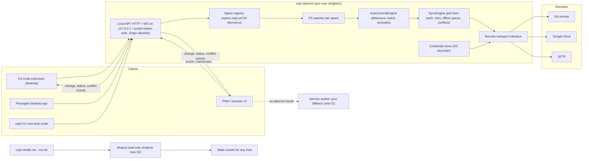
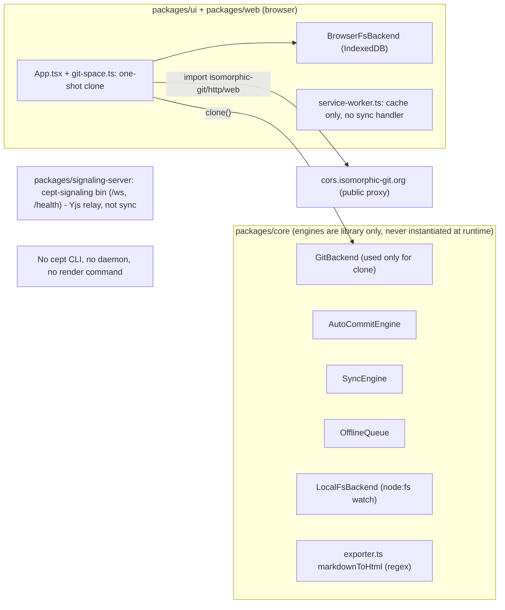

# 05 — CLI & sync daemon

**Status:** Draft, 2026-10-06 · **Area IDs:** `REQ-CLI-NNN`

This document sets the requirements for the Cept command-line tool (`cept`), the long-running local sync daemon it hosts, the local client protocol that lets the VS Code extension, PWA and desktop app share one daemon, and the `cept render` static-site command. Each requirement is checked against the code, open PRs and documentation as of the date above. Today the repo has **no CLI, no daemon, no local daemon API and no render command**. Some of the building blocks exist as unwired library code in `@cept/core`.

**Related:** [Requirements index & traceability](README.md) · [01 Browser app & PWA](01-browser-app-and-pwa.md) · [02 Static rendering](02-static-rendering.md) · [03 Spaces & storage](03-spaces-and-storage.md) · [04 Collaboration](04-collaboration.md) · [06 VS Code extension](06-vscode-extension.md) · [07 Native apps](07-native-apps.md) · [09 Remotes & auth](09-remotes-and-auth.md) · [10 Engineering & CI](10-engineering-and-ci.md) · Original spec: [docs/SPECIFICATION.md](../../SPECIFICATION.md) · Task list: [TASKS.md](../../../TASKS.md)

## Scope & non-goals

**In scope**

- The `cept` executable: packaging, subcommands, and distribution as a compiled binary.
- The sync daemon: process model, the space registry, the watch-to-commit and pull/push loops, conflict surfacing, and sync to any remote kind.
- The local client protocol (HTTP/WebSocket/IPC) that lets several clients share one daemon, plus its discovery and security.
- `cept render`: the CLI entry point to static-site generation. The output contract itself is owned by [02-static-rendering.md](02-static-rendering.md).
- One-shot CLI commands (`sync`, `status`) and where the planned MCP server is hosted.
- CI coverage for the CLI and daemon.

**Non-goals (owned elsewhere)**

| Topic                                                      | Owner                                                  |
| ---------------------------------------------------------- | ------------------------------------------------------ |
| Static output contract, read-only renderer UI              | [02-static-rendering.md](02-static-rendering.md)       |
| `space.cept.ya?ml` format, nesting rules, storage backends | [03-spaces-and-storage.md](03-spaces-and-storage.md)   |
| Realtime co-editing / WebRTC signaling                     | [04-collaboration.md](04-collaboration.md)             |
| Service-worker sync fallback implementation                | [01-browser-app-and-pwa.md](01-browser-app-and-pwa.md) |
| OAuth flows, PAT entry, Cloudflare OAuth proxy             | [09-remotes-and-auth.md](09-remotes-and-auth.md)       |
| VS Code extension host and webview                         | [06-vscode-extension.md](06-vscode-extension.md)       |

## Requirements summary

| ID                                                                          | Requirement                                                | Priority | Impl status | Docs status            | Docs accurate |
| --------------------------------------------------------------------------- | ---------------------------------------------------------- | -------- | ----------- | ---------------------- | ------------- |
| [REQ-CLI-001](#req-cli-001--cept-cli-executable)                            | `cept` CLI executable (own Nx project, compiled binary)    | MUST     | not-started | undocumented           | n/a           |
| [REQ-CLI-002](#req-cli-002--long-running-sync-daemon)                       | Long-running sync daemon (`cept daemon start/stop/status`) | MUST     | not-started | documented-differently | stale         |
| [REQ-CLI-003](#req-cli-003--watch-to-commit-pipeline)                       | Watch-to-commit pipeline                                   | MUST     | stubbed     | documented-differently | stale         |
| [REQ-CLI-004](#req-cli-004--pullpush-sync-loop-with-conflict-handling)      | Pull/push sync loop with conflict handling                 | MUST     | stubbed     | documented-differently | stale         |
| [REQ-CLI-005](#req-cli-005--daemon-supports-all-remote-kinds)               | Daemon supports git, Google Drive and SFTP remotes         | MUST     | stubbed     | undocumented           | n/a           |
| [REQ-CLI-006](#req-cli-006--local-client-protocol-for-daemon-sharing)       | Versioned local client protocol for daemon sharing         | MUST     | not-started | undocumented           | n/a           |
| [REQ-CLI-007](#req-cli-007--daemon-discovery-and-fallback-from-pwabrowser)  | Daemon discovery and fallback from PWA/browser             | MUST     | not-started | documented-differently | stale         |
| [REQ-CLI-008](#req-cli-008--daemon-security-for-localhost-api)              | Daemon security for the localhost API                      | MUST     | not-started | undocumented           | n/a           |
| [REQ-CLI-009](#req-cli-009--space-discovery-in-the-daemon)                  | Nested space awareness in the daemon                       | MUST     | not-started | undocumented           | n/a           |
| [REQ-CLI-010](#req-cli-010--cept-render-static-site-command)                | `cept render` static site command                          | MUST     | not-started | documented-differently | stale         |
| [REQ-CLI-011](#req-cli-011--render-command-exercised-by-cept-docs-site-e2e) | Docs site built by `cept render` (serves as e2e)           | MUST     | not-started | documented-differently | stale         |
| [REQ-CLI-012](#req-cli-012--cli-one-shot-syncstatus-commands)               | One-shot `cept sync` / `cept status`                       | SHOULD   | not-started | undocumented           | n/a           |
| [REQ-CLI-013](#req-cli-013--mcp-server-surface-existing-plan)               | MCP server hosted by CLI/daemon                            | SHOULD   | not-started | documented-differently | accurate      |
| [REQ-CLI-014](#req-cli-014--clidaemon-ci-coverage)                          | CLI/daemon CI coverage incl. binary smoke test             | MUST     | not-started | undocumented           | n/a           |

Status vocabulary: implementation is one of `implemented`, `partial`, `stubbed` (code exists but is not wired), `not-started` or `divergent`. Docs status is one of `documented-as-desired`, `documented-differently` or `undocumented`. Docs accuracy is one of `accurate`, `stale` or `n/a`.

## Architecture

### Required

### Current state

## Requirements

### REQ-CLI-001 — Cept CLI executable

**Statement.** The project MUST ship a `cept` command-line executable, written in Bun/TS and packaged as its own Nx project (e.g. `packages/cli`). At minimum it needs subcommands for daemon control and static-site rendering. It SHOULD be distributable as a compiled single binary (`bun build --compile`).

**Rationale / source.** Handler: "A cli". The daemon and render command both live in it.

**Acceptance criteria**

- `packages/cli/package.json` declares `"bin": { "cept": ... }` and the package is an Nx project with `build`, `typecheck` and `test` targets.
- `cept --help` and `cept --version` exit 0 and list at least `daemon`, `render`, `sync` and `status`.
- A compile target produces a standalone binary for linux/macos/windows (x64 + arm64 where Bun supports it).
- Unknown subcommands exit non-zero and print usage to stderr.

**Current state + evidence.** not-started. No package declares a `cept` bin. The only `bin` in the monorepo is `cept-signaling` ([packages/signaling-server/package.json](../../../packages/signaling-server/package.json) line 7, pointing to [packages/signaling-server/src/server.ts](../../../packages/signaling-server/src/server.ts)). That is a Bun.serve Yjs relay, not a CLI. [package.json](../../../package.json) spaces/scripts and [nx.json](../../../nx.json) have no CLI project or target.

**Docs state.** undocumented / n/a. The CLI is not mentioned in [docs/SPECIFICATION.md](../../SPECIFICATION.md), `docs/specs/*.md`, `docs/content/**`, [README.md](../../../README.md) or [TASKS.md](../../../TASKS.md). The only "CLI" mention in [.claude/prompts/continue.md](../../../.claude/prompts/continue.md) (around line 764) is about git-spice, which is unrelated.

**Gap.** Create `packages/cli` with a subcommand framework, a compiled-binary target, CI build/test, and a reference page.

**Related PRs/issues.** None. An issue search returned 0 results and no open PR touches this.

### REQ-CLI-002 — Long-running sync daemon

**Statement.** `cept daemon` (`start` / `stop` / `status`) MUST run a long-lived background process. It watches one or more registered spaces on the local filesystem and syncs changes to each space's configured remote(s) without the UI being open.

**Rationale / source.** Handler: "a daemon that runs to sync changes to the remotes".

**Acceptance criteria**

- `cept daemon start` detaches and writes a pidfile/lockfile. A second `start` reports the daemon is already running (per-user singleton).
- `cept daemon status` reports pid, uptime, protocol version and per-space sync state.
- `cept daemon stop` shuts down gracefully: it flushes pending commits and completes or aborts in-flight pushes cleanly.
- An optional `cept daemon install` registers a user service (launchd / systemd user unit / Windows scheduled task or service).
- With the daemon running and no UI open, editing a file in a registered git space results in a commit pushed to the remote (integration test).

**Current state + evidence.** not-started. No daemon process exists. The building blocks have no host process: `SyncEngine.start()` uses `setInterval` ([packages/core/src/git/sync-engine.ts](../../../packages/core/src/git/sync-engine.ts)), and `LocalFsBackend.watch()` uses `node:fs` watch ([packages/core/src/storage/local-fs.ts](../../../packages/core/src/storage/local-fs.ts)).

**Docs state.** documented-differently / stale. [docs/SPECIFICATION.md](../../SPECIFICATION.md) line 43 (mirrored in [.claude/prompts/init.md](../../../.claude/prompts/init.md) line 43) says: "Client-only architecture — ... No server process, no database daemon." [README.md](../../../README.md) line 3 says "Client-only."

**Gap.** Define the process model (singleton, lock, service install). Host one `AutoCommitEngine` and one `SyncEngine` per space. Amend the "no daemon" principle (see [Conflicts](#conflicts--open-questions)).

**Related PRs/issues.** Issue [#48](https://github.com/nsheaps/cept/issues/48) (live remote demo space with auto-commit and sync) is adjacent.

### REQ-CLI-003 — Watch-to-commit pipeline

**Statement.** The daemon MUST turn filesystem change events from a space into batched commits (debounced, honouring exclude patterns) for git-backed spaces. For non-git remotes it MUST produce the equivalent upload unit.

**Rationale / source.** Derived. This makes REQ-CLI-002 concrete.

**Acceptance criteria**

- N writes within the debounce window produce one commit, and batches never exceed `maxBatchSize` files.
- Paths that match exclude patterns (e.g. `.git/**`, editor swap files) never trigger commits.
- Writes made by the daemon itself, such as pulls, do not trigger a commit loop.
- Integration test: temp space plus temp git repo, write files, assert the commit count and contents.

**Current state + evidence.** stubbed. `AutoCommitEngine.recordChange` / `flushNow` support debounce, `maxBatchSize` and `excludePatterns`, with unit tests ([packages/core/src/git/auto-commit.ts](../../../packages/core/src/git/auto-commit.ts), [packages/core/src/git/auto-commit.test.ts](../../../packages/core/src/git/auto-commit.test.ts)). Nothing feeds it `watch()` events, and nothing instantiates it outside its tests and the re-export in [packages/core/src/index.ts](../../../packages/core/src/index.ts) (around line 128). TASKS.md P5.3 "Wire auto-commit engine to app" is unchecked.

**Docs state.** documented-differently / stale. [TASKS.md](../../../TASKS.md) line 99 marks T5.3 done, but P5.3 (wire) is still open (line 207). [docs/content/getting-started/introduction.md](../../content/getting-started/introduction.md) line 29 claims "Every edit becomes a Git commit". [docs/content/getting-started/quick-start.md](../../content/getting-started/quick-start.md) lines 58-64 say "Your space will sync automatically".

**Gap.** Wire `watch()` into `AutoCommitEngine` in the daemon, and in the app for PWA-only mode. Add an integration test.

**Related PRs/issues.** [#48](https://github.com/nsheaps/cept/issues/48).

### REQ-CLI-004 — Pull/push sync loop with conflict handling

**Statement.** For each space remote, the daemon MUST run a pull-then-push cycle both periodically and on change. The cycle needs retry/backoff, offline detection and queued replay on reconnect. Conflicts MUST be surfaced to clients, never silently lost.

**Rationale / source.** Derived. This makes REQ-CLI-002 concrete.

**Acceptance criteria**

- A sync cycle pulls before it pushes. A rejected (non-fast-forward) push triggers pull, merge, then retry.
- When the remote is unreachable, the space enters `offline`, queues operations and replays them on reconnect (test with a remote that is toggled off and on).
- A conflicting edit on both sides sets space state `conflict` and emits a `conflict` event over the client protocol (REQ-CLI-006). No content is discarded.
- Backoff is bounded and configurable.

**Current state + evidence.** stubbed. [packages/core/src/git/sync-engine.ts](../../../packages/core/src/git/sync-engine.ts) implements the loop, retries and conflict/offline states ([sync-engine.test.ts](../../../packages/core/src/git/sync-engine.test.ts)). [packages/core/src/crdt/offline-queue.ts](../../../packages/core/src/crdt/offline-queue.ts) and the auto-resolve in [packages/core/src/git/merge-engine.ts](../../../packages/core/src/git/merge-engine.ts) also exist. Each is tested in isolation and not referenced outside `packages/core/src/{git,crdt}` and `index.ts`. TASKS.md P5.4, P5.6 and P5.10 are unchecked. The running app only does a one-shot clone ([packages/ui/src/components/App.tsx](../../../packages/ui/src/components/App.tsx) around lines 353-363 and 962-987; [packages/ui/src/components/storage/git-space.ts](../../../packages/ui/src/components/storage/git-space.ts)).

**Docs state.** documented-differently / stale. [docs/SPECIFICATION.md](../../SPECIFICATION.md) §6.5 "Sync Engine" (line 933) places sync inside the client app. [README.md](../../../README.md) line 17 advertises multi-device sync that is "all automatic", which is not implemented at runtime.

**Gap.** Host `SyncEngine` in the daemon, and in the app when no daemon is present. Wire `OfflineQueue` and a conflict UI. Expose conflict state over REQ-CLI-006.

**Related PRs/issues.** [#48](https://github.com/nsheaps/cept/issues/48).

### REQ-CLI-005 — Daemon supports all remote kinds

**Statement.** Daemon sync MUST be remote-agnostic. It goes through a remote/transport interface covering git, Google Drive and SFTP remotes, and uses credentials obtained via the shared auth flows (GitHub app / Google / PAT; see [09-remotes-and-auth.md](09-remotes-and-auth.md)).

**Rationale / source.** Derived from the handler's storage list ("git, gdrive, sftp") combined with "daemon syncs changes to the remotes".

**Acceptance criteria**

- A `Remote` (transport) interface is defined in a shared package. `SyncEngine` and `AutoCommitEngine` depend on it, not on `GitStorageBackend`.
- Git, Google Drive and SFTP transports each pass a shared conformance test suite (push, pull, list, detect conflict).
- Credentials are read from the daemon credential store and are never sent to clients.

**Current state + evidence.** stubbed (git primitives only, no daemon or transport interface). [packages/core/src/storage/git-backend.ts](../../../packages/core/src/storage/git-backend.ts) (around lines 182-278) has commit/push/pull/clone/fetch via isomorphic-git, but at runtime only `clone()` is ever called ([packages/ui/src/components/storage/git-space.ts](../../../packages/ui/src/components/storage/git-space.ts) lines 56-65); nothing calls `push`/`pull`/`commit` outside tests. The storage directory contains only `browser-fs`, `local-fs`, `web-fs` and `git-backend`. The engines are typed to `GitStorageBackend` ([auto-commit.ts](../../../packages/core/src/git/auto-commit.ts) line 9, [sync-engine.ts](../../../packages/core/src/git/sync-engine.ts) line 8). There is no gdrive or sftp code.

**Docs state.** undocumented / n/a. [docs/specs/storage-backends.md](../storage-backends.md) lists only browser, local and git.

**Gap.** Add the transport abstraction, gdrive and sftp transports (Node-side, in the daemon), and keychain credential storage.

**Related PRs/issues.** PR [#67](https://github.com/nsheaps/cept/pull/67) touches git-space remote handling (UI clone only).

### REQ-CLI-006 — Local client protocol for daemon sharing

**Statement.** The daemon MUST expose a versioned, documented local API, e.g. HTTP + WebSocket bound to `127.0.0.1` and/or a Unix socket or named pipe. The API covers listing and registering spaces, reading and writing files, subscribing to change events, sync status and conflict events, and triggering a sync. Multiple clients (VS Code extension, PWA, desktop app) MUST be able to share one daemon concurrently.

**Rationale / source.** Handler: VS Code plugin "shares local daemon"; PWA "can share local daemon".

**Acceptance criteria**

- A protocol schema (e.g. Zod + generated JSON Schema) is published with an explicit `protocolVersion`. Clients and the daemon negotiate on connect, and an incompatible major version is rejected with a clear error.
- Two simultaneously connected clients both receive a change event within 1 s of a write made by the other.
- A `DaemonBackend` client in a shared package implements `StorageBackend` over this API.
- The error model (codes and messages) is documented.

**Current state + evidence.** not-started. The only local server is the signaling server ([packages/signaling-server/src/server.ts](../../../packages/signaling-server/src/server.ts): `/ws` room relay and `/health`). Its [protocol.ts](../../../packages/signaling-server/src/protocol.ts) covers rooms and presence only.

**Docs state.** undocumented / n/a.

**Gap.** Protocol spec, daemon server implementation, and the `DaemonBackend` client.

**Related PRs/issues.** None.

### REQ-CLI-007 — Daemon discovery and fallback from PWA/browser

**Statement.** The PWA and browser UI MUST detect a reachable local daemon (well-known localhost port plus handshake) and use it for persistence and sync when present. Otherwise they MUST fall back to in-browser storage with service-worker-driven sync.

**Rationale / source.** Handler: PWA "can share local daemon, otherwise uses service worker".

**Acceptance criteria**

- On startup the UI probes the daemon with a short timeout. Neither success nor failure blocks first paint.
- When the daemon is present, the UI shows it as the sync provider and routes I/O through `DaemonBackend`.
- When the daemon is absent, the UI uses the in-browser backend, and the service worker registers a sync handler (owned by [01-browser-app-and-pwa.md](01-browser-app-and-pwa.md)).
- e2e coverage for both paths.

**Current state + evidence.** not-started. There is no daemon probe in `packages/web/src` or `packages/ui`. [packages/web/src/service-worker.ts](../../../packages/web/src/service-worker.ts) handles only caching and the `SKIP_WAITING` / `CLEAR_CACHE` messages (around lines 161-170), and has no `sync` / `periodicsync` handler.

**Docs state.** documented-differently / stale. The service-worker header (line 6) claims "background sync for pending operations". [docs/content/guides/platform-support.md](../../content/guides/platform-support.md) (around lines 27-30) describes the SW as offline support only.

**Gap.** Discovery handshake with an origin allowlist, the `DaemonBackend` client, the SW sync fallback, and a fix for the stale SW comment.

**Related PRs/issues.** None.

### REQ-CLI-008 — Daemon security for localhost API

**Statement.** The local daemon API MUST authenticate clients (per-install token or a pairing flow), restrict CORS/`Origin` to known Cept origins and VS Code webview origins, bind only to loopback, and never expose remote credentials to clients.

**Rationale / source.** Derived. Required to satisfy REQ-CLI-006/007 safely, because any website can attempt requests to localhost.

**Acceptance criteria**

- A request from a non-allowlisted `Origin` is rejected (403), including on the WebSocket upgrade.
- A request without a valid client token is rejected (401). Pairing a new browser origin requires explicit user approval.
- The listener never binds to a non-loopback interface (test asserts the bound address).
- No API response contains remote tokens or keys (test greps responses).

**Current state + evidence.** not-started (no daemon exists).

**Docs state.** undocumented / n/a.

**Gap.** Add a security section to the daemon spec, then implement it.

**Related PRs/issues.** None.

### REQ-CLI-009 — Space discovery in the daemon

**Statement.** The daemon MUST discover space roots through `space.cept.yaml` / `space.cept.yml`, including several sibling spaces in subfolders of one repo or folder (D-2). It MUST sync each space without double-syncing shared content. Nested spaces are deferred (D-3): discovery does not descend into a found space.

**Rationale / source.** Derived from the owner's space model (D-1, D-2, D-3) applied to the daemon.

**Acceptance criteria**

- Registering a repo or folder discovers every space root in it; a `space.cept.ya?ml` found below another space root is reported as a warning and not registered.
- Two spaces in one git repo share one clone and one push/pull cycle; each space's watcher covers only its own subtree.
- Adding or removing a `space.cept.yaml` at runtime updates the registry without a restart.

**Current state + evidence.** not-started. There is no `space.cept.ya?ml` discovery code. The app stores a "spaces" manifest in browser storage (`loadSpaces` / `createRemoteSpace` in [packages/ui/src/components/storage/SpaceManager.ts](../../../packages/ui/src/components/storage/SpaceManager.ts), called from [packages/ui/src/components/App.tsx](../../../packages/ui/src/components/App.tsx)).

**Docs state.** undocumented / n/a. [docs/SPECIFICATION.md](../../SPECIFICATION.md) uses a `.cept/` config folder, and the UI and roadmap say "spaces".

**Gap.** A daemon space registry that depends on the space spec in [03-spaces-and-storage.md](03-spaces-and-storage.md).

**Related PRs/issues.** None.

### REQ-CLI-010 — `cept render` static site command

**Statement.** The CLI MUST provide a command, e.g. `cept render <space> --out <dir>`, that produces the static, read-only site assets for a space. The output conforms to the static output contract in [02-static-rendering.md](02-static-rendering.md) and is suitable for upload to any static host.

**Rationale / source.** Handler: "A render static site command to generate the static assets for upload of a space".

**Acceptance criteria**

- Running against a fixture space produces an output directory that passes the 02 contract checks (one HTML page per page, nav, assets, rendered mermaid, rendered databases, working cross-links).
- Running twice on unchanged input produces byte-identical output (deterministic).
- Exit code is non-zero on broken internal links unless `--allow-broken-links` is passed.
- The renderer is the shared read-only UI renderer, not a separate regex converter.

**Current state + evidence.** not-started. The only related code is `exportPages` / `markdownToHtml` in [packages/core/src/exporters/exporter.ts](../../../packages/core/src/exporters/exporter.ts), a regex converter with no layout, nav, mermaid or database rendering. Nothing uses it outside the core re-export. TASKS.md P8.4-P8.6 are unchecked ([TASKS.md](../../../TASKS.md) lines 250-252).

**Docs state.** documented-differently / stale. [docs/content/reference/roadmap.md](../../content/reference/roadmap.md) (around lines 140-160) and [.claude/prompts/continue.md](../../../.claude/prompts/continue.md) (around lines 455-459) describe the GitHub Pages renderer as a runtime drop-in `<script>` with "Zero build step required" (roadmap line 160). That is not a CLI build command.

**Gap.** Implement it as a thin CLI wrapper over the 02 renderer, and reconcile the roadmap's runtime-script model (see [Conflicts](#conflicts--open-questions)).

**Related PRs/issues.** PR [#24](https://github.com/nsheaps/cept/pull/24) (space export as ZIP, draft) is adjacent but is not static rendering.

### REQ-CLI-011 — Render command exercised by Cept docs site e2e

**Statement.** Cept's own docs site deployment MUST be produced by the same `cept render` pipeline, so the docs deploy acts as the e2e test of static site generation.

**Rationale / source.** Handler: "Cept's own docs site is a static site deployment, which e2e tests the static site generation workflow".

**Acceptance criteria**

- The docs content is a Cept space (it has a `space.cept.yaml`).
- CI runs `cept render` on it for every PR that touches the CLI, the renderer or the docs, and fails on render errors or broken links.
- The deploy workflow publishes exactly the rendered output.

**Current state + evidence.** not-started. The [docs/package.json](../../package.json) `build` script (line 9) is `echo 'Documentation site build'`. In-app docs come from hard-coded TS ([packages/ui/src/components/docs/docs-content.ts](../../../packages/ui/src/components/docs/docs-content.ts), generated by [scripts/generate-live-docs.sh](../../../scripts/generate-live-docs.sh)). No workflow in `.github/workflows/` runs a render step, and there is no `docs.yml` workflow. The build, cd and preview-deploy workflows run `bun run build` (web/desktop/mobile app builds plus the no-op docs `echo`).

**Docs state.** documented-differently / stale. [docs/SPECIFICATION.md](../../SPECIFICATION.md) §9.5 (lines 1272-1280) specifies a `.github/workflows/docs.yml` that builds the docs with "VitePress or Starlight" (also line 1639 and [CLAUDE.md](../../../CLAUDE.md) package table: "`@cept/docs` ... Starlight/VitePress documentation site"), not with Cept's own renderer. That workflow does not exist, so the description is stale. The roadmap ([roadmap.md](../../content/reference/roadmap.md) line 128) lists "Documentation site (Starlight)" as Planned.

**Gap.** Make the docs a Cept space and render it in CI and deploy. Coordinate with [02-static-rendering.md](02-static-rendering.md) and [10-engineering-and-ci.md](10-engineering-and-ci.md).

**Related PRs/issues.** PR [#67](https://github.com/nsheaps/cept/pull/67) (docs as a real remote space) is a precursor.

### REQ-CLI-012 — CLI one-shot sync/status commands

**Statement.** The CLI SHOULD provide one-shot commands (`cept sync`, `cept status`) that run a single sync cycle or report status. They run either directly or via the running daemon, for scripting and CI use.

**Rationale / source.** Derived. Makes REQ-CLI-002/004 testable and scriptable.

**Acceptance criteria**

- `cept sync <space>` runs one cycle. It exits 0 on success, uses a distinct non-zero code on conflict, and another on network failure.
- `cept status [--json]` prints per-space state, and the JSON output is schema-validated.
- When a daemon is running, both commands go through the daemon instead of competing with it for locks.

**Current state + evidence.** not-started. `SyncEngine.sync()` and `getStatus()` exist as library methods ([packages/core/src/git/sync-engine.ts](../../../packages/core/src/git/sync-engine.ts)), but there is no CLI wrapper.

**Docs state.** undocumented / n/a.

**Gap.** Add the subcommands.

**Related PRs/issues.** None.

### REQ-CLI-013 — MCP server surface (existing plan)

**Statement.** If the planned MCP server (P8.1-P8.3) is built, it SHOULD be hosted by the CLI/daemon (e.g. `cept mcp`) and reuse the daemon's space access rather than being a separate runtime.

**Rationale / source.** Existing plan ([TASKS.md](../../../TASKS.md) lines 247-249; [roadmap.md](../../content/reference/roadmap.md) lines 133-151). The placement is derived.

**Acceptance criteria**

- `cept mcp` starts a stdio MCP server that reads and writes pages via the daemon (or directly when no daemon is running).
- MCP writes go through the same commit/sync pipeline (REQ-CLI-003/004).

**Current state + evidence.** not-started. There is no MCP code.

**Docs state.** documented-differently / accurate. The roadmap lists "MCP server for Cept spaces" as Planned (line 137; mirrored in the in-app docs at [docs-content.ts](../../../packages/ui/src/components/docs/docs-content.ts) line 707). That status is accurate, but the roadmap does not say where the server runs.

**Gap.** Decide where it is hosted, then spec it.

**Related PRs/issues.** None.

### REQ-CLI-014 — CLI/daemon CI coverage

**Statement.** The CLI and daemon MUST have unit tests and integration tests (temp space plus a local bare git remote) that run in CI scoped to affected projects. They MUST also have a compiled-binary smoke test, mirroring the qontacts `server:smoke` pattern.

**Rationale / source.** Derived from the handler's CI requirements ("unit tests which can run in scope in PR") applied to this area.

**Acceptance criteria**

- `nx affected -t test` includes `cli` when CLI, core sync or storage code changes.
- An integration job runs daemon start, a write, a commit and a push against a local bare repo, then stop, on Linux at minimum.
- A smoke job builds the compiled binary and checks that `cept --version` and `cept daemon start/status/stop` work within a time budget.

**Current state + evidence.** not-started. No CLI exists. The existing engine tests ([auto-commit.test.ts](../../../packages/core/src/git/auto-commit.test.ts), [sync-engine.test.ts](../../../packages/core/src/git/sync-engine.test.ts)) use mocks. [.github/workflows/\_test-unit.yml](../../../.github/workflows/_test-unit.yml) and [.github/workflows/\_test-integration.yml](../../../.github/workflows/_test-integration.yml) run vitest globally.

**Docs state.** undocumented / n/a.

**Gap.** Nx targets plus a CI smoke job. See [10-engineering-and-ci.md](10-engineering-and-ci.md).

**Related PRs/issues.** None.

## Conflicts & open questions

Items marked **Decided** have owner direction recorded. Remaining items still need a decision.

1. **"Client-only, no daemon" principle versus the daemon requirement.** **Decided (D-4):** Client-only framing retired. The app MUST work fully without a daemon; the daemon is optional and adds background sync and shared access. [docs/SPECIFICATION.md](../../SPECIFICATION.md) line 43 and [README.md](../../../README.md) line 3 need updating.
2. **Runtime drop-in renderer versus build-time `cept render`.** The roadmap ([roadmap.md](../../content/reference/roadmap.md) lines 155-160) and [continue.md](../../../.claude/prompts/continue.md) (around lines 455-459) specify a `<script>` renderer with "zero build step". The handler wants a CLI that generates static assets. _Decide:_ support both (the same renderer bundle used at build time and at runtime), or drop the runtime model.
3. **Terminology.** **Decided (D-1):** "space" is the canonical term; `space.cept.ya?ml` marks the space root; daemon registry uses "space" throughout.
4. **Where sync lives.** **Decided (D-4+D-5):** `SyncEngine` in `@cept/core`; service worker = offline caching + queued-write flushing only (~30 s lifetime); SharedWorker owns the live sync loop when no daemon is present; daemon is optional and additive. The in-app path runs `SyncEngine` in the SharedWorker, not the page thread.
5. **`node:fs` in `@cept/core`.** [CLAUDE.md](../../../CLAUDE.md) architecture rule 1 forbids it, yet [packages/core/src/storage/local-fs.ts](../../../packages/core/src/storage/local-fs.ts) imports `node:fs`, and [packages/web/vite.config.ts](../../../packages/web/vite.config.ts) (around lines 10-30) stubs `node:*` to cope. _Proposed:_ move `LocalFsBackend` and the Node-side transports into a platform package (e.g. `packages/cli` or `packages/daemon`).
6. **isomorphic-git ownership.** CLAUDE.md rule 5 (only `GitBackend` may import isomorphic-git) is violated by [App.tsx](../../../packages/ui/src/components/App.tsx), which dynamically imports `isomorphic-git/http/web` (lines 354, 456 and 965) to build the HTTP client it passes in. [git-space.ts](../../../packages/ui/src/components/storage/git-space.ts) itself complies: it goes through `GitBackend` from `@cept/core`. _Decide:_ should the daemon-side git be the single owner of git transport whenever a daemon is present?
7. **Transport abstraction.** The engines are typed to `GitStorageBackend` only, but gdrive and sftp are required. What is the unit of sync for non-git remotes (file-level last-writer-wins, manifest diff, or CRDT snapshots)?
8. **VS Code for Web.** The browser-hosted VS Code cannot reach a localhost daemon. Is in-extension sync acceptable there (see [06-vscode-extension.md](06-vscode-extension.md))?
9. **Daemon and Yjs.** Should the daemon also relay Yjs updates between local clients, or is that always the signaling server's job (see [04-collaboration.md](04-collaboration.md))?
10. **Credential storage.** OS keychain (via which library under Bun?) or an encrypted file, and how it is shared with the desktop app.

## Stale documentation

| Path                                                                                                        | Claim                                                                     | Problem                                                                                                                                         |
| ----------------------------------------------------------------------------------------------------------- | ------------------------------------------------------------------------- | ----------------------------------------------------------------------------------------------------------------------------------------------- |
| [docs/SPECIFICATION.md](../../SPECIFICATION.md) line 43                                                     | "No server process, no database daemon"                                   | Contradicts the daemon requirement. Needs amending.                                                                                             |
| [TASKS.md](../../../TASKS.md) lines 99, 104, 112                                                            | T5.3 auto-commit, T5.8 sync engine and T6.5 offline queue marked done     | Library-only. P5.3, P5.4 and P5.10 (lines 207-214) show they are not wired. Annotate them as "library only".                                    |
| [TASKS.md](../../../TASKS.md) line 212                                                                      | P5.8 "Create signaling server entry point" unchecked                      | [packages/signaling-server/src/server.ts](../../../packages/signaling-server/src/server.ts) implements it, and the `cept-signaling` bin exists. |
| [docs/content/reference/roadmap.md](../../content/reference/roadmap.md) line 94                             | "Signaling server — Planned"                                              | The entry point exists.                                                                                                                         |
| [packages/web/src/service-worker.ts](../../../packages/web/src/service-worker.ts) line 6                    | "background sync for pending operations"                                  | No `sync` / `periodicsync` handler exists.                                                                                                      |
| [docs/content/getting-started/introduction.md](../../content/getting-started/introduction.md) lines 8, 29   | "Changes sync when you're back online"; "Every edit becomes a Git commit" | Not wired at runtime.                                                                                                                           |
| [README.md](../../../README.md) line 17                                                                     | Multi-device sync, "all automatic"                                        | Not implemented at runtime.                                                                                                                     |
| [docs/content/getting-started/quick-start.md](../../content/getting-started/quick-start.md) lines 22, 58-64 | Git "coming soon" alongside "Your space will sync automatically"          | Self-contradictory, and auto-sync is not implemented.                                                                                           |
| [docs/SPECIFICATION.md](../../SPECIFICATION.md) §9.5 lines 1272-1280                                        | Docs built by `docs.yml` with VitePress/Starlight                         | No such workflow exists, and the handler wants the docs built by `cept render` (REQ-CLI-011).                                                   |
| [docs/package.json](../../package.json) line 9                                                              | `build` is `echo 'Documentation site build'`                              | There is no static docs build. It should become `cept render` (REQ-CLI-011).                                                                    |
| [docs/content/reference/roadmap.md](../../content/reference/roadmap.md) lines 155-160                       | Renderer is "zero build step"                                             | Needs reconciling with REQ-CLI-010.                                                                                                             |

## Cross-area dependencies

| Depends on / consumed by                               | What                                                                                                                                       | This area's requirements |
| ------------------------------------------------------ | ------------------------------------------------------------------------------------------------------------------------------------------ | ------------------------ |
| [02-static-rendering.md](02-static-rendering.md)       | Static output contract and the shared read-only renderer. `cept render` is a thin wrapper over it.                                         | REQ-CLI-010, REQ-CLI-011 |
| [03-spaces-and-storage.md](03-spaces-and-storage.md)   | `space.cept.ya?ml` root discovery, nesting (max 10), spaces-to-spaces rename, gdrive/sftp backends                                         | REQ-CLI-005, REQ-CLI-009 |
| [09-remotes-and-auth.md](09-remotes-and-auth.md)       | GitHub app/login, Google login, GitHub PAT, and the Cloudflare OAuth proxy (nsheaps/iac) supply the credentials the daemon stores and uses | REQ-CLI-005, REQ-CLI-008 |
| [06-vscode-extension.md](06-vscode-extension.md)       | Consumes the daemon client protocol on desktop. VS Code for Web needs a fallback.                                                          | REQ-CLI-006, REQ-CLI-008 |
| [01-browser-app-and-pwa.md](01-browser-app-and-pwa.md) | Daemon discovery and the service-worker sync fallback (the SW currently has no sync handler)                                               | REQ-CLI-007              |
| [04-collaboration.md](04-collaboration.md)             | The signaling server is separate from the daemon. Open question whether the daemon relays Yjs locally.                                     | REQ-CLI-006              |
| [07-native-apps.md](07-native-apps.md)                 | The desktop app may bundle or launch the daemon. `packages/desktop` currently has no main process (TASKS P6.1).                            | REQ-CLI-002, REQ-CLI-006 |
| [10-engineering-and-ci.md](10-engineering-and-ci.md)   | New `packages/cli` Nx project, affected-scoped tests, binary smoke job (qontacts `server:smoke` pattern)                                   | REQ-CLI-001, REQ-CLI-014 |
| [README.md](README.md)                                 | Traceability matrix and architecture overview                                                                                              | All                      |
