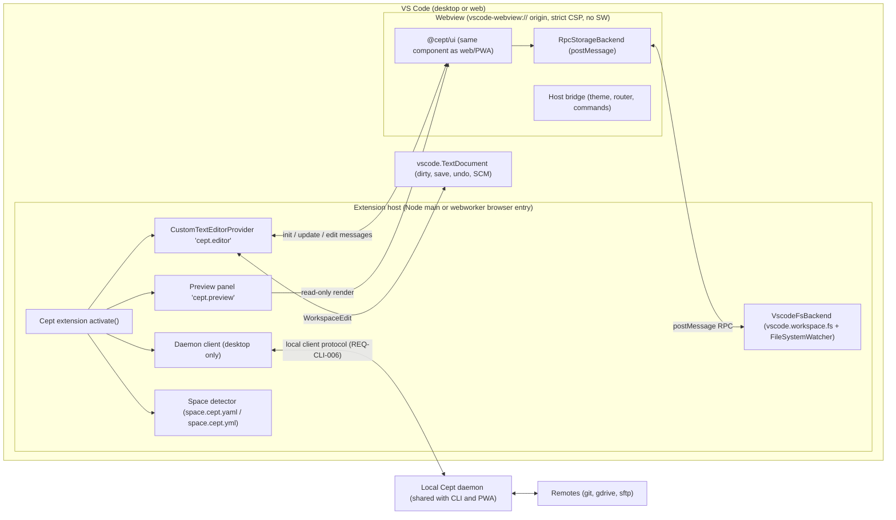
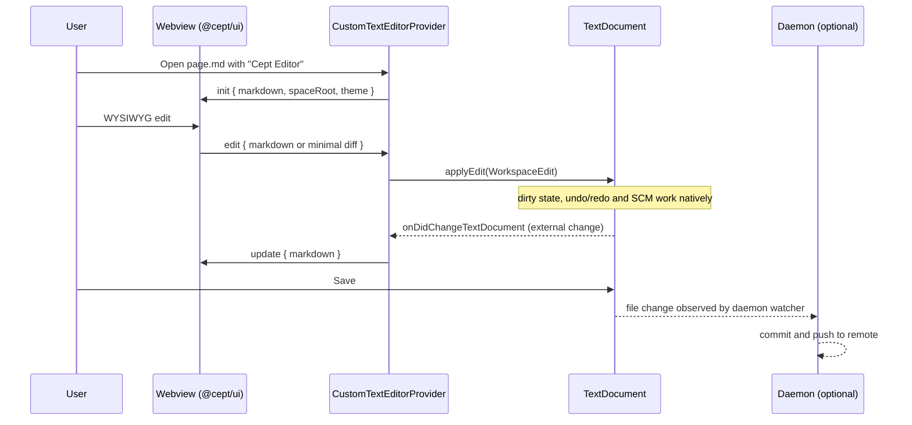
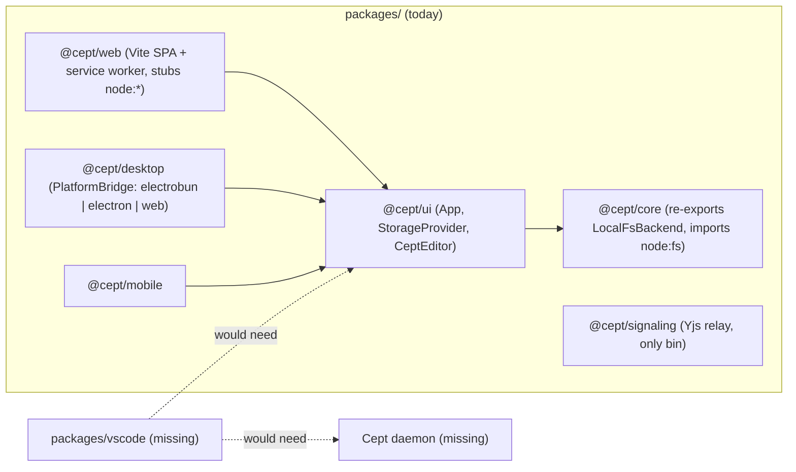

# Requirements: VS Code Extension

**Status:** Draft, 2026-10-06 · **Area ID prefix:** `REQ-VSC` · **Owner:** nsheaps

This document lists the requirements for a Cept extension for Visual Studio Code. The extension lets users open the Markdown pages of a Cept space inside VS Code and live-edit or live-render them with the same browser component the web app and PWA use. It shares the local Cept daemon when one is running, and it works in both VS Code desktop and VS Code for the Web (vscode.dev, github.dev). For each requirement, the document records the current implementation and documentation state, citing evidence. **Summary of the current state: no VS Code extension exists in Cept today, in code, docs, TASKS.md, issues or open PRs.** A few existing pieces of `@cept/ui` and `@cept/core` could serve as building blocks, and several architectural choices block an extension. Both are covered below.

**Related:** [Requirements index & traceability](README.md) · [01 Browser app & PWA](01-browser-app-and-pwa.md) · [02 Static rendering](02-static-rendering.md) · [03 Spaces & storage](03-spaces-and-storage.md) · [04 Collaboration](04-collaboration.md) · [05 CLI & daemon](05-cli-and-daemon.md) · [07 Native apps](07-native-apps.md) · [08 Editor](08-editor.md) · [09 Remotes & auth](09-remotes-and-auth.md) · [10 Engineering & CI](10-engineering-and-ci.md) · [Original specification](../../SPECIFICATION.md) · [Storage backends spec](../storage-backends.md)

## Contents

1. [Scope & non-goals](#1-scope--non-goals)
2. [Requirements summary](#2-requirements-summary)
3. [Architecture](#3-architecture)
4. [Requirements](#4-requirements)
5. [Conflicts & open questions](#5-conflicts--open-questions)
6. [Stale documentation to fix](#6-stale-documentation-to-fix)
7. [Cross-area dependencies](#7-cross-area-dependencies)

## 1. Scope & non-goals

### In scope

The owner's requirement, verbatim:

> - A vscode plugin
>   - live edit/render that uses the same browser component
>   - shares local daemon
>   - full support for vscode on web as well as desktop

This document turns that requirement into:

- the extension package, its manifest and its build (REQ-VSC-001)
- a custom WYSIWYG editor and a live-rendered preview for space Markdown, both built on `@cept/ui` (REQ-VSC-002, 003, 005, 006)
- the changes `@cept/ui` and `@cept/core` need before they can be embedded in a VS Code webview (REQ-VSC-004, 007, 010, 013)
- daemon sharing, and fallback behaviour when no daemon is running (REQ-VSC-008, 009)
- desktop and web extension hosts (REQ-VSC-010, 011)
- space root detection through `space.cept.ya?ml`, including several spaces in one folder (REQ-VSC-012)
- tests, packaging, publishing and documentation (REQ-VSC-014, 015, 016)

### Non-goals (covered elsewhere)

- **Cept's own plugin system** (TASKS.md P7.7–P7.7c). That system extends Cept itself and is a different thing from a VS Code extension.
- **The daemon itself, its protocol and its security.** These are defined in [05 CLI & daemon](05-cli-and-daemon.md). This document only covers the extension's client side.
- **The `space.cept.ya?ml` format and space discovery rules.** Defined in [03 Spaces & storage](03-spaces-and-storage.md).
- **Editor features** (blocks, databases, mermaid, GFM, graph). Defined in [08 Editor](08-editor.md). The extension inherits them through the shared component.
- **Co-editing inside the webview.** See [open question Q4](#5-conflicts--open-questions) and [04 Collaboration](04-collaboration.md).

## 2. Requirements summary

| ID                                                                                  | Requirement                                                          | Priority | Impl status | Docs status            | Docs accurate |
| ----------------------------------------------------------------------------------- | -------------------------------------------------------------------- | -------- | ----------- | ---------------------- | ------------- |
| [REQ-VSC-001](#req-vsc-001--vs-code-extension-package-in-the-monorepo)              | VS Code extension package in the monorepo                            | MUST     | not-started | undocumented           | n/a           |
| [REQ-VSC-002](#req-vsc-002--cept-custom-editor-for-space-markdown-files)            | Cept custom editor for space Markdown files                          | MUST     | not-started | undocumented           | n/a           |
| [REQ-VSC-003](#req-vsc-003--reuse-the-same-browser-component-ceptui-in-the-webview) | Reuse the same browser component (`@cept/ui`) in the webview         | MUST     | not-started | undocumented           | n/a           |
| [REQ-VSC-004](#req-vsc-004--embeddable-ceptui-with-injected-host-backend)           | Embeddable `@cept/ui` with injected host backend                     | MUST     | partial     | documented-differently | stale         |
| [REQ-VSC-005](#req-vsc-005--two-way-live-sync-between-webview-and-textdocument)     | Two-way live sync between webview and `TextDocument`                 | MUST     | not-started | undocumented           | n/a           |
| [REQ-VSC-006](#req-vsc-006--live-render-read-only-preview-mode)                     | Live render (read-only preview) mode                                 | MUST     | not-started | undocumented           | n/a           |
| [REQ-VSC-007](#req-vsc-007--webview-storagebackend-adapter-over-vscodeworkspacefs)  | Webview `StorageBackend` adapter over `vscode.workspace.fs`          | MUST     | not-started | undocumented           | n/a           |
| [REQ-VSC-008](#req-vsc-008--share-the-local-cept-daemon-when-available)             | Share the local Cept daemon when available                           | MUST     | not-started | documented-differently | stale         |
| [REQ-VSC-009](#req-vsc-009--daemon-less-fallback)                                   | Daemon-less fallback                                                 | MUST     | not-started | undocumented           | n/a           |
| [REQ-VSC-010](#req-vsc-010--full-support-for-vs-code-for-the-web)                   | Full support for VS Code for the Web                                 | MUST     | not-started | undocumented           | n/a           |
| [REQ-VSC-011](#req-vsc-011--full-support-for-vs-code-desktop)                       | Full support for VS Code desktop                                     | MUST     | not-started | undocumented           | n/a           |
| [REQ-VSC-012](#req-vsc-012--space-root-detection)                                   | Space root detection (`space.cept.ya?ml`) and nested spaces          | MUST     | not-started | documented-differently | stale         |
| [REQ-VSC-013](#req-vsc-013--webview-platform-constraints)                           | Webview platform constraints (CSP, no service worker, theming)       | MUST     | not-started | undocumented           | n/a           |
| [REQ-VSC-014](#req-vsc-014--automated-extension-tests-in-ci)                        | Automated extension tests in CI (desktop and web hosts, Nx-affected) | MUST     | not-started | undocumented           | n/a           |
| [REQ-VSC-015](#req-vsc-015--extension-packaging-and-publishing)                     | Extension packaging and publishing (Marketplace and Open VSX)        | SHOULD   | not-started | undocumented           | n/a           |
| [REQ-VSC-016](#req-vsc-016--extension-user-and-developer-documentation)             | Extension user and developer documentation                           | MUST     | not-started | undocumented           | n/a           |

Status totals: 15 not-started, 1 partial. Source: 9 requirements come from the owner's list (001–003, 005, 006, 008, 010, 011, and 012, which applies the owner's space definition to the extension). The other 7 (004, 007, 009, 013–016) are derived because the owner's requirements depend on them.

## 3. Architecture

### 3.1 Required architecture

### 3.2 Required edit flow (custom editor)

### 3.3 Current state (2026-10-06)

What is in the repo today:

- **Building blocks:** `@cept/ui` exports `App`, `StorageProvider` and a standalone `CeptEditor` with `content`, `editable` and `onUpdate(markdown)` props. `App` reads its backend from context, and the web shell injects a `BrowserFsBackend`.
- **Blockers:**
  - `App.tsx` gates features with `instanceof BrowserFsBackend`.
  - The router assumes an http(s) `location.pathname`.
  - Offline behaviour in the web shell relies on a service worker (`packages/web/src/service-worker.ts` does precaching and cache-first/network-first fetch handling only; it has no `sync` event handler). Remote-space sync itself runs on the main thread in `App.tsx`, not in the service worker.
  - The `@cept/core` barrel pulls in `node:fs`.
  - There is no daemon and no `space.cept.ya?ml` detection.

## 4. Requirements

### REQ-VSC-001 — VS Code extension package in the monorepo

**Statement:** The repo MUST contain a VS Code extension package (for example `packages/vscode`). It MUST be an Nx project in the Bun workspace, written in TypeScript and built with Bun or esbuild. Its extension manifest MUST be valid: `package.json` with `publisher`, `engines.vscode`, `activationEvents` and `contributes`.

**Rationale / source:** Owner requirement ("A vscode plugin"), plus "mono repo setup … using nx and mise" and "base code implementation using bun/ts where possible".

**Acceptance criteria:**

- `packages/vscode/package.json` exists, with `name`, `publisher`, `engines.vscode`, `main` (desktop) and `browser` (web) entries.
- `nx show projects` lists the extension project. `nx run <project>:build` produces the desktop and web bundles.
- `bun run typecheck` and `bun run lint` cover the package, in TypeScript strict mode with no `any` and no `@ts-ignore`.
- The package appears in the CLAUDE.md package table and in the SPECIFICATION package and build-target sections.

**Current state:** not-started. `packages/` contains only `core`, `desktop`, `mobile`, `signaling-server`, `ui` and `web`. The root [package.json](../../../package.json) workspaces are `packages/*`, `docs` and `e2e`. A repo-wide grep for `vscode` (excluding `node_modules` and this requirements folder) matches only `.gitignore:24` (`.vscode/`). A case-insensitive grep for "VS Code" adds only the external-text-editor mentions in [SPECIFICATION.md](../../SPECIFICATION.md) and `.claude/prompts/init.md` (lines 34, 114, 710, 762, 859 in both).

**Docs state:** undocumented. The extension is missing from [SPECIFICATION.md](../../SPECIFICATION.md) §8 "Cross-Platform Build Targets" (lines ~1001–1060), the [CLAUDE.md](../../../CLAUDE.md) package table, [platform-support.md](../../content/guides/platform-support.md), [roadmap.md](../../content/reference/roadmap.md) and [TASKS.md](../../../TASKS.md).

**Gap:** Create the package, its Nx project config and its build targets. Add it to the package tables.

**Related PRs/issues:** None. An issue search for "vscode extension VS Code plugin webview" on nsheaps/cept returned 0 results. Going by title, open PRs [#69](https://github.com/nsheaps/cept/pull/69), [#37](https://github.com/nsheaps/cept/pull/37), [#24](https://github.com/nsheaps/cept/pull/24), [#283](https://github.com/nsheaps/cept/pull/283) and [#246](https://github.com/nsheaps/cept/pull/246) are unrelated (diffs not inspected). The file list of [#67](https://github.com/nsheaps/cept/pull/67) was inspected: it adds no extension package, but it affects REQ-VSC-004 (see there).

### REQ-VSC-002 — Cept custom editor for space Markdown files

**Statement:** The extension MUST register a custom editor (`CustomTextEditorProvider`) so that Markdown pages inside a Cept space open in a fully WYSIWYG Cept editor in a webview. "Reopen With…" MUST switch between this editor and the plain text editor.

**Rationale / source:** Owner requirement ("live edit … that uses the same browser component").

**Acceptance criteria:**

- `contributes.customEditors` declares a `viewType` (for example `cept.editor`) with a selector for `*.md`.
- The editor offers to open (priority `option` or `default`, see [Q5](#5-conflicts--open-questions)) only for files inside a detected Cept space root (REQ-VSC-012).
- "Reopen With… → Text Editor" and back works without data loss. An integration test asserts that the file bytes are unchanged after an open/close round trip with no edits.
- All block types defined in [08 Editor](08-editor.md) render and edit exactly as they do in the web app.

**Current state:** not-started. There is no extension code, no `customEditors` contribution and no webview code anywhere in `packages/`.

**Docs state:** undocumented. [SPECIFICATION.md](../../SPECIFICATION.md) (lines 34, 114, 710, 762, 859) mentions VS Code only as an external plain-text editor that users may point at Local Folder files.

**Gap:** Implement the provider, the viewType and the space-scoped file selectors.

**Related PRs/issues:** none.

### REQ-VSC-003 — Reuse the same browser component (`@cept/ui`) in the webview

**Statement:** The webview MUST render the same `@cept/ui` React component that the web app and PWA use. There MUST NOT be a forked editor implementation. Host-specific code MUST live in the extension package and in host adapters.

**Rationale / source:** Owner requirement ("uses the same browser component"). See also [REQ-WEB-001](01-browser-app-and-pwa.md#req-web-001--shared-browser-ui-component).

**Acceptance criteria:**

- The webview bundle's dependency graph includes `@cept/ui`. It contains no copy of editor or extension code, which an Nx module-boundary lint rule or a dependency check enforces.
- A visual regression test renders a fixture page in the web app and in the webview and compares screenshots within a set tolerance.
- When an editor feature changes in `@cept/ui`, the extension picks it up with no code change in `packages/vscode`.

**Current state:** not-started, though building blocks exist.

- [packages/ui/src/index.ts](../../../packages/ui/src/index.ts) exports `App`, `StorageProvider` and `CeptEditor`.
- [CeptEditor.tsx](../../../packages/ui/src/components/editor/CeptEditor.tsx) (lines 36–48) accepts `content`, `editable`, `placeholder` and `onUpdate(markdown)`.
- [App.tsx](../../../packages/ui/src/components/App.tsx) gets its backend through `useStorage()` (line 88).
- [packages/web/src/main.tsx](../../../packages/web/src/main.tsx) injects `new BrowserFsBackend(...)` via `StorageProvider` (lines 15 and 39).
- There is no webview bundle entry.

**Docs state:** undocumented. [platform-support.md](../../content/guides/platform-support.md) says "Each platform shell wraps the same @cept/ui and @cept/core packages", but it lists only the web, desktop and mobile shells.

**Gap:** Add a webview entry bundle that mounts `@cept/ui`. List VS Code as a shell.

**Related PRs/issues:** none.

### REQ-VSC-004 — Embeddable `@cept/ui` with injected host backend

**Statement:** `@cept/ui` MUST be embeddable by a non-web host. It MUST accept an injected `StorageBackend` and a host bridge. It MUST gate features only through `backend.capabilities`, never through backend class or `type` checks. Routing MUST NOT depend on an http(s) `location.pathname` or a base path.

**Rationale / source:** Derived. REQ-VSC-003 cannot be met without it. This also restates [CLAUDE.md](../../../CLAUDE.md) architecture rule 4 and [REQ-WEB-003](01-browser-app-and-pwa.md#req-web-003--ui-talks-to-storage-only-through-the-injected-backend).

**Acceptance criteria:**

- `grep -rn "instanceof .*Backend" packages/ui/src` returns no matches. A lint rule or test enforces this.
- The router supports a host- or memory-history mode that works under a `vscode-webview://` origin. A unit test mounts `App` with no `window.location` path and navigates between pages.
- A test mounts `App` with a mock backend whose class is not `BrowserFsBackend` but which declares sync and remote capabilities, and asserts that the remote, sync and clone UI is enabled.
- The platform union in `PlatformBridge` / `NativeShell` includes `'vscode'`.

**Current state:** partial.

- Backend injection works (`StorageProvider`, [App.tsx](../../../packages/ui/src/components/App.tsx) line 88).
- But [App.tsx](../../../packages/ui/src/components/App.tsx) gates features on `backend instanceof BrowserFsBackend` at lines 342, 430, 956 and 1041. That would disable remote, sync and clone features for any VS Code-backed backend.
- [router.ts](../../../packages/ui/src/router.ts) uses `window.location.pathname`, `history.pushState` and the Vite `BASE_URL` (around lines 64, 110–120, 184 and 279).
- In [platform-bridge.ts](../../../packages/desktop/src/platform-bridge.ts), line 75 declares `platform: 'electrobun' | 'electron' | 'web'`.

**Docs state:** documented-differently, stale. The capability-gating part is documented as desired (CLAUDE.md rule 4; [SPECIFICATION.md](../../SPECIFICATION.md) lines ~845–847, "In UI components, check capabilities — don't check backend type"), but those docs are stale as a description of the code, which uses `instanceof`. Embedding in a non-web host and host-agnostic routing are not documented, and the `NativeShell` platform union in SPECIFICATION.md §8.5 (line ~1042: `"electrobun" | "electron" | "web" | "capacitor-ios" | "capacitor-android"`) has no `vscode`.

**Gap:** Replace the `instanceof` checks with capability checks. Add a host-agnostic router mode. Extend the platform union.

**Related PRs/issues:** [#67](https://github.com/nsheaps/cept/pull/67) (remote spaces, open) moves this requirement further away. Its diff of `packages/ui/src/components/App.tsx` keeps the existing `instanceof BrowserFsBackend` checks and adds new ones (for example `if (backend instanceof BrowserFsBackend) {` and `if (!(backend instanceof BrowserFsBackend)) return;` in the new docs-space loading), and adds new `window.location.pathname` reads. It also changes `packages/ui/src/router.ts`. If #67 merges as is, the capability refactor in this requirement grows.

### REQ-VSC-005 — Two-way live sync between webview and `TextDocument`

**Statement:** Edits made in the Cept webview MUST be applied to the underlying `vscode.TextDocument` through `WorkspaceEdit`, so that dirty state, save, undo/redo, Git SCM and other editors keep working. External changes to the document (from the text editor, a git checkout or another extension) MUST appear live in the webview, keeping the cursor or selection position where possible.

**Rationale / source:** Owner requirement ("live edit").

**Acceptance criteria:**

- A versioned postMessage protocol (`init`, `update`, `edit`, `save`, `error`) is specified in the extension spec, with typed message schemas.
- A WYSIWYG edit marks the document dirty, Ctrl/Cmd+S saves it, and Ctrl/Cmd+Z undoes the edit through VS Code's undo stack. An integration test covers each of these.
- Edits use minimal text ranges rather than replacing the whole document. A test asserts that one-character edits produce a `WorkspaceEdit` that touches no more than one line.
- An external change (an edit in a side-by-side text editor) appears in the webview within 500 ms, and does not loop back as a new edit.
- Markdown round-trips are stable: open then save with no edits produces byte-identical output (relies on the [Markdown parser spec](../markdown-parser.md)).

**Current state:** not-started. `CeptEditor` already emits Markdown through `onUpdate` ([CeptEditor.tsx](../../../packages/ui/src/components/editor/CeptEditor.tsx) line 40), and a Markdown parser and serializer exists ([docs/specs/markdown-parser.md](../markdown-parser.md)). Both could be reused.

**Docs state:** undocumented.

**Gap:** Design and implement the message protocol and the diff strategy.

**Related PRs/issues:** none.

### REQ-VSC-006 — Live render (read-only preview) mode

**Statement:** The extension MUST provide a live rendered preview of a Cept page next to the text editor, using the same component in read-only mode. It MUST render Cept extensions (mermaid, callouts, toggles, databases, wiki-links) identically to the app.

**Rationale / source:** Owner requirement ("live edit/render").

**Acceptance criteria:**

- The command `Cept: Open Preview to the Side` opens a webview panel bound to the active Markdown editor.
- The preview updates on each text change, debounced to 300 ms or less.
- Scroll and selection stay in sync between the text editor and the preview.
- The preview output matches the static renderer output for the same page (shared pipeline, see [REQ-SSG-004](02-static-rendering.md#req-ssg-004--static-rendering-shares-the-editors-rendering-pipeline)).
- Clicking a wiki-link opens the target page in VS Code.

**Current state:** not-started. `CeptEditor` supports `editable={false}` ([CeptEditor.tsx](../../../packages/ui/src/components/editor/CeptEditor.tsx) line 38), but there is no preview command or panel.

**Docs state:** undocumented.

**Gap:** Add the preview command, the panel and scroll/selection sync.

**Related PRs/issues:** none.

### REQ-VSC-007 — Webview `StorageBackend` adapter over `vscode.workspace.fs`

**Statement:** The extension MUST provide a `StorageBackend` implementation that forwards file operations from the webview over postMessage to the extension host's `vscode.workspace.fs` API, including `watch()` through `FileSystemWatcher`. This lets space-wide features (sidebar, graph, databases, backlinks, search) work on both local and virtual file systems (`file://`, `vscode-vfs://`, github.dev).

**Rationale / source:** Derived. REQ-VSC-003 and REQ-VSC-010 need it, because the full component needs access to the whole space, not just one document.

**Acceptance criteria:**

- `VscodeFsBackend` (host side) and `RpcStorageBackend` (webview side) both implement the full `StorageBackend` interface. They pass the same backend conformance suite as the existing backends.
- Both backends declare `capabilities` truthfully. Features are gated on those capabilities (REQ-VSC-004).
- The sidebar page tree, graph view and backlinks work on a `vscode-vfs://` (github.dev) workspace in a `@vscode/test-web` test.
- File changes made outside the webview raise `watch()` events.

**Current state:** not-started. The interface exists in [backend.ts](../../../packages/core/src/storage/backend.ts) (line 67; `type` is limited to `'browser' | 'local' | 'git'`). The existing implementations are `BrowserFsBackend` ([browser-fs.ts](../../../packages/core/src/storage/browser-fs.ts)), `LocalFsBackend` ([local-fs.ts](../../../packages/core/src/storage/local-fs.ts), which uses `node:fs`), `WebFsBackend` ([web-fs.ts](../../../packages/core/src/storage/web-fs.ts), which uses the File System Access API) and `GitBackend`. None of them is VS Code-backed.

**Docs state:** undocumented. No `vscode` matches in `docs/specs/`, and [storage-backends.md](../storage-backends.md) lists no VS Code backend (line-level check unverified).

**Gap:** Implement both backends. Widen the `type` union or remove reliance on it. Add the backends to the storage-backends spec and to [03 Spaces & storage](03-spaces-and-storage.md).

**Related PRs/issues:** none.

### REQ-VSC-008 — Share the local Cept daemon when available

**Statement:** On desktop, the extension MUST discover a running local Cept sync daemon (the same one the CLI and PWA use), connect to it, and delegate remote sync to it rather than running its own sync engine. It MUST NOT start a second, conflicting sync process for the same space.

**Rationale / source:** Owner requirement ("shares local daemon"). This is the client side of [REQ-CLI-006](05-cli-and-daemon.md#req-cli-006--local-client-protocol-for-daemon-sharing) and [REQ-CLI-007](05-cli-and-daemon.md#req-cli-007--daemon-discovery-and-fallback-from-pwabrowser).

**Acceptance criteria:**

- The extension finds the daemon through the discovery mechanism defined in [05 CLI & daemon](05-cli-and-daemon.md), for example a port or socket file, and authenticates according to [REQ-CLI-008](05-cli-and-daemon.md#req-cli-008--daemon-security-for-localhost-api).
- The status bar shows the daemon connection and the space's sync state (synced, pending, conflict, error).
- An integration test starts a daemon, opens a space in the extension and edits a page, then asserts that the daemon (not the extension) performs the commit and push.
- If the extension cannot reach a running daemon for the space, it never runs its own remote sync for that space. It may offer a "Start daemon" command.

**Current state:** not-started. No daemon exists. The only package with a `bin` entry is [packages/signaling-server/package.json](../../../packages/signaling-server/package.json) (line 7), and that is a Yjs relay, not a sync daemon.

**Docs state:** documented-differently, stale. [SPECIFICATION.md](../../SPECIFICATION.md) line 43 says "Client-only architecture … No server process, no database daemon", which contradicts the owner's shared-daemon requirement.

**Gap:** Blocked on the daemon area ([REQ-CLI-002](05-cli-and-daemon.md#req-cli-002--long-running-sync-daemon), REQ-CLI-006, REQ-CLI-007). Then implement the extension's client.

**Related PRs/issues:** none.

### REQ-VSC-009 — Daemon-less fallback

**Statement:** When no daemon is reachable (which is always the case in VS Code for the Web), the extension MUST still fully support editing and rendering of space files. It MUST show the sync status, for example "Daemon unavailable — changes saved to space files; sync via VS Code SCM / remote file system".

**Rationale / source:** Derived from REQ-VSC-008 and REQ-VSC-010.

**Acceptance criteria:**

- With no daemon running, opening, editing, saving and previewing all work. Tested in both desktop and web hosts.
- The status bar item shows "No daemon" and links to documentation.
- No errors or modal dialogs appear just because the daemon is missing.

**Current state:** not-started (there is no extension).

**Docs state:** undocumented.

**Gap:** Define the fallback behaviour and the status indicator.

**Related PRs/issues:** none.

### REQ-VSC-010 — Full support for VS Code for the Web

**Statement:** The extension MUST ship a web-extension entry (the `browser` field) bundled for the webworker extension host. That bundle MUST NOT use any Node.js API (no `node:*`, `child_process` or `net`). The extension MUST work on vscode.dev and github.dev with the same editing and rendering features as on desktop.

**Rationale / source:** Owner requirement ("full support for vscode on web as well as desktop").

**Acceptance criteria:**

- The `browser` entry bundle builds as a single webworker-compatible file. A build check fails if the bundle contains any `node:` specifier or Node built-in import.
- `@vscode/test-web` integration tests run the custom editor, the preview and the space-wide features in Chromium.
- A manual smoke test on github.dev against a sample Cept space repo is documented in the extension guide.
- `@cept/core` exposes Node-free entry points (subpath exports), so the extension does not need a `node:*` stub plugin.

**Current state:** not-started, with a known blocker. The [@cept/core barrel](../../../packages/core/src/index.ts) (line 37) re-exports `LocalFsBackend`, and [local-fs.ts](../../../packages/core/src/storage/local-fs.ts) (lines 8–10) imports `node:fs/promises`, `node:path` and `node:fs`. The web build only works because a custom Vite plugin stubs `node:*` imports in [packages/web/vite.config.ts](../../../packages/web/vite.config.ts) (around lines 14–53).

**Docs state:** undocumented.

**Gap:** Add the web entry and a webworker bundle. Split the core exports so platform-independent code can be imported without `node:*`. Note that the core `node:fs` import already breaks CLAUDE.md rule 1.

**Related PRs/issues:** none.

### REQ-VSC-011 — Full support for VS Code desktop

**Statement:** The extension MUST ship a Node `main` entry for VS Code desktop and compatible forks (VSCodium, Cursor). It MUST have feature parity with the web entry, plus daemon sharing (REQ-VSC-008).

**Rationale / source:** Owner requirement ("… as well as desktop").

**Acceptance criteria:**

- `@vscode/test-electron` integration tests pass on Linux, macOS and Windows runners. Running only Linux on PRs is acceptable if all three OSes run on main.
- The `.vsix` installs and activates in VSCodium (smoke test, documented).
- Daemon sharing works on desktop (see REQ-VSC-008).

**Current state:** not-started (there is no extension).

**Docs state:** undocumented.

**Gap:** Add the desktop entry point and the cross-OS test matrix.

**Related PRs/issues:** none.

### REQ-VSC-012 — Space root detection

**Statement:** The extension MUST identify Cept spaces in the opened VS Code folder or folders by the presence of `space.cept.yaml` or `space.cept.yml`. An opened folder MAY contain several spaces in subfolders (D-2). It MUST activate when such a file exists (`workspaceContains` activation event), and it MUST scope the custom editor and sidebar to the space that contains the file.

**Rationale / source:** Owner decisions D-1, D-2 and D-3, applied to the extension. The semantics are defined in [03 Spaces & storage](03-spaces-and-storage.md).

**Acceptance criteria:**

- `activationEvents` includes `workspaceContains:**/space.cept.{yaml,yml}`.
- For a fixture repo with two sibling spaces, each page resolves to its own space root. A marker below another space root is reported as a diagnostic (nesting is deferred, D-3).
- Multi-root VS Code workspaces with several Cept spaces work independently.
- Markdown files outside any Cept space are not offered the Cept editor by default.

**Current state:** not-started. Nothing in the code implements `space.cept.ya?ml`. Backends write `.cept/config.yaml` instead ([local-fs.ts](../../../packages/core/src/storage/local-fs.ts) line 162, [web-fs.ts](../../../packages/core/src/storage/web-fs.ts) line 213, [browser-fs.ts](../../../packages/core/src/storage/browser-fs.ts) line 150). The UI uses the term "spaces" (`SpaceManager`, imported in [App.tsx](../../../packages/ui/src/components/App.tsx) around line 43).

**Docs state:** documented-differently, stale. [SPECIFICATION.md](../../SPECIFICATION.md) defines space config under `.cept/`, and [roadmap.md](../../content/reference/roadmap.md) uses "Multi-space support".

**Gap:** Blocked on the space format in 03. After that, add the detector and activation events.

**Related PRs/issues:** none.

### REQ-VSC-013 — Webview platform constraints

**Statement:** The webview bundle MUST load its assets through `asWebviewUri` under a strict Content Security Policy with a nonce. It MUST NOT depend on a service worker, because VS Code webviews do not support them. It SHOULD map VS Code theme CSS variables onto Cept's light and dark themes.

**Rationale / source:** Derived from REQ-VSC-003.

**Acceptance criteria:**

- The webview HTML sets `default-src 'none'`, scripts only through a nonce, and styles and images restricted to `webview.cspSource`. A test asserts that no CSP violations appear in the console when a fixture page loads.
- The webview build excludes `sw-register` and the service worker, and loads every asset through relative or `asWebviewUri` URLs (no dependency on `VITE_BASE_PATH`).
- Switching the VS Code color theme between light, dark and high-contrast updates Cept's theme without reloading.
- If co-editing is enabled in the webview (see Q4), the CSP `connect-src` allows exactly the configured signaling endpoints.

**Current state:** not-started. Offline support in the web shell depends on a service worker ([sw-register.ts](../../../packages/web/src/sw-register.ts) line 44; [service-worker.ts](../../../packages/web/src/service-worker.ts), which precaches and serves cached responses; its header comment mentions "background sync for pending operations" but no `sync` handler exists, so sync does not run in the service worker today). The build depends on `VITE_BASE_PATH` ([vite.config.ts](../../../packages/web/vite.config.ts); [cd.yml](../../../.github/workflows/cd.yml) line 81).

**Docs state:** undocumented.

**Gap:** Create a separate webview build target with no service worker, relative assets, a CSP and a theme bridge. Make sure that, once REQ-WEB-007 moves sync into the service worker, a non-service-worker sync path remains for the webview (see [REQ-WEB-007](01-browser-app-and-pwa.md#req-web-007--service-worker-handles-syncing)).

**Related PRs/issues:** none.

### REQ-VSC-014 — Automated extension tests in CI

**Statement:** CI MUST run the extension's unit tests and its integration tests in both the desktop host (`@vscode/test-electron`) and the web host (`@vscode/test-web`). These jobs MUST be scoped with Nx affected, so they run only when the extension or one of its dependencies changes.

**Rationale / source:** Derived from REQ-VSC-010 and REQ-VSC-011, combined with the owner's requirement for "CI workflows for unit tests which can run in scope in PR". See [10 Engineering & CI](10-engineering-and-ci.md).

**Acceptance criteria:**

- The Nx targets `test`, `test:integration:desktop` and `test:integration:web` exist for the extension project.
- On a PR that touches only `packages/signaling-server`, the extension jobs are skipped. On a PR that touches `packages/ui`, they run.
- Headless runs work in CI (xvfb on Linux for the electron tests).

**Current state:** not-started. The workflows in `.github/workflows/` (`ci.yml`, `cd.yml`, `release.yml`, `_build`, `_lint`, `_test-unit`, `_test-integration`, `_test-e2e`, …) contain no extension jobs. Grepping `.github` for `vscode` finds nothing.

**Docs state:** undocumented.

**Gap:** Add the Nx targets and the CI jobs.

**Related PRs/issues:** none.

### REQ-VSC-015 — Extension packaging and publishing

**Statement:** Releases SHOULD package a `.vsix` with `vsce` and publish it to the VS Code Marketplace and to Open VSX, versioned through the repo's release flow. If publishing secrets are missing, the release MUST warn and skip publishing, never fail `main`.

**Rationale / source:** Derived. The extension has to reach users. The secrets-optional behaviour follows the pattern used in other nsheaps repos (for example qontacts `_tag-release`).

**Acceptance criteria:**

- Every release attaches a `.vsix` to its GitHub Release.
- With `VSCE_PAT` and `OVSX_PAT` set, the release publishes to both registries. Without them, the job emits `::warning::` and skips.
- The `.vsix` version matches the repo release version.

**Current state:** not-started. [release.yml](../../../.github/workflows/release.yml), [cd.yml](../../../.github/workflows/cd.yml) and [\_tag-release.yml](../../../.github/workflows/_tag-release.yml) contain no `vsce` or `ovsx` steps.

**Docs state:** undocumented.

**Gap:** Add the packaging and publish jobs.

**Related PRs/issues:** none.

### REQ-VSC-016 — Extension user and developer documentation

**Statement:** The docs site MUST include a VS Code extension guide covering installation, desktop versus web, daemon sharing and limitations. The platform-support page, the roadmap, SPECIFICATION.md and the CLAUDE.md package table MUST list the extension. A feature spec MUST exist under `docs/specs/`.

**Rationale / source:** Derived. The owner asked for specs, docs and crosslinks.

**Acceptance criteria:**

- A `docs/specs/vscode-extension.md` feature spec exists, covering the message protocol, the backends and activation.
- A guide exists under `docs/content/guides/` and is linked from [platform-support.md](../../content/guides/platform-support.md).
- [roadmap.md](../../content/reference/roadmap.md) and [TASKS.md](../../../TASKS.md) contain extension items that trace to these REQ IDs.
- Screenshots in the guide come from the automated pipeline (cept rule `ui-screenshot-evidence`).

**Current state:** not-started.

**Docs state:** undocumented. [platform-support.md](../../content/guides/platform-support.md) lists only Web, macOS, Windows, Linux, iOS and Android. The roadmap and TASKS.md have no extension items, and there is no extension spec in `docs/specs/`.

**Gap:** Write the feature spec and the guide, and add roadmap and task entries.

**Related PRs/issues:** none.

## 5. Conflicts & open questions

The owner needs to decide on each of these.

| #   | Conflict / question                                                                                                                                            | Evidence                                                                                                                                                                                                                                                                                       | Options                                                                                                                   |
| --- | -------------------------------------------------------------------------------------------------------------------------------------------------------------- | ---------------------------------------------------------------------------------------------------------------------------------------------------------------------------------------------------------------------------------------------------------------------------------------------- | ------------------------------------------------------------------------------------------------------------------------- |
| C1  | **Daemon versus client-only architecture.** The owner requires a shared local daemon, but SPECIFICATION.md says "No server process, no database daemon".       | [SPECIFICATION.md](../../SPECIFICATION.md) line 43                                                                                                                                                                                                                                             | (a) Revise the spec to "client-first, optional local daemon" (recommended). (b) Keep the extension daemon-free.           |
| C2  | **`space.cept.ya?ml` versus `.cept/config.yaml`; "workspaces" versus "spaces".**                                                                               | [local-fs.ts](../../../packages/core/src/storage/local-fs.ts) line 162, [web-fs.ts](../../../packages/core/src/storage/web-fs.ts) line 213, [browser-fs.ts](../../../packages/core/src/storage/browser-fs.ts) line 150; [roadmap.md](../../content/reference/roadmap.md) "Multi-space support" | Settled in [03 Spaces & storage](03-spaces-and-storage.md). The extension follows that decision.                          |
| C3  | **Architecture rule 4 is broken in code.** UI features are gated by `instanceof BrowserFsBackend`, which would disable remote and sync features under VS Code. | [App.tsx](../../../packages/ui/src/components/App.tsx) lines 342, 430, 956, 1041                                                                                                                                                                                                               | Refactor to capability checks (REQ-VSC-004). This needs no decision, only prioritisation.                                 |
| C4  | **Architecture rule 1 is broken in code.** `@cept/core` imports `node:fs`, which the web build hides with a stub plugin.                                       | [local-fs.ts](../../../packages/core/src/storage/local-fs.ts) lines 8–10; [core index.ts](../../../packages/core/src/index.ts) line 37; [vite.config.ts](../../../packages/web/vite.config.ts)                                                                                                 | (a) Move `LocalFsBackend` to a Node-only subpath or package (recommended). (b) Replicate the stub in the extension build. |
| C5  | The platform union lacks `vscode`.                                                                                                                             | [platform-bridge.ts](../../../packages/desktop/src/platform-bridge.ts) line 75; SPECIFICATION.md §8.5                                                                                                                                                                                          | Add `'vscode'`, or move host abstraction into `@cept/ui`.                                                                 |
| C6  | Electron is listed for Windows and Linux desktop, but the owner's list never mentions Electron. This is outside this area.                                     | [CLAUDE.md](../../../CLAUDE.md) package table; SPECIFICATION.md §8.2                                                                                                                                                                                                                           | See [07 Native apps](07-native-apps.md).                                                                                  |

Open questions:

- **Q1 — Edit model:** Should the custom editor be a `CustomTextEditorProvider` (text document is the source of truth, best SCM and undo integration; this document's assumption) or a `CustomEditorProvider` with Cept-managed documents?
- **Q2 — Non-page files:** How should database YAML files (`.cept/databases/*.yaml`) open in VS Code: in a Cept database view, or as plain YAML only?
- **Q3 — Remote auth in the extension:** When no daemon is present, should the extension use VS Code's built-in GitHub and Microsoft authentication providers for remotes, or leave remotes entirely to VS Code SCM and the daemon? See [09 Remotes & auth](09-remotes-and-auth.md).
- **Q4 — Co-editing in the webview:** Should WebRTC peer-to-peer co-editing ([REQ-COL-003](04-collaboration.md#req-col-003--public-peer-to-peer-webrtc-transport)) work inside the webview? If so, how does it combine with VS Code Live Share and with `TextDocument` as the source of truth?
- **Q5 — Default editor:** Should the Cept editor be the default for `*.md` inside a space (priority `default`), or opt-in (priority `option`)?
- **Q6 — Marketplace identity:** Which publisher ID, and is Open VSX publishing required (needed for VSCodium and Cursor)?

## 6. Stale documentation to fix

- [docs/content/guides/platform-support.md](../../content/guides/platform-support.md): the "Supported Platforms" table and the "Architecture" block omit the VS Code extension (desktop and web).
- [docs/content/reference/roadmap.md](../../content/reference/roadmap.md): no phase or item for a VS Code extension. The planned "Plugin system" item means Cept's own plugins, which could be mistaken for the extension.
- [TASKS.md](../../../TASKS.md): no task for the extension. P7.7–P7.7c cover Cept-internal plugins only.
- [docs/SPECIFICATION.md](../../SPECIFICATION.md) line 43: "No server process, no database daemon" is out of date now that the design includes a daemon (C1).
- [docs/SPECIFICATION.md](../../SPECIFICATION.md) §8 "Cross-Platform Build Targets" (around lines 1001–1060) and the §8.5 `NativeShell` platform union omit VS Code.
- [docs/SPECIFICATION.md](../../SPECIFICATION.md) lines 34, 114, 710, 762 and 859 describe VS Code only as an external text editor. They should cross-reference the extension.
- [CLAUDE.md](../../../CLAUDE.md): the "Monorepo Packages" table lacks the extension. "Architecture Rules" 1 and 4 are presented as enforced, but the code breaks them (C3, C4).
- [docs/specs/storage-backends.md](../storage-backends.md): needs the VS Code fs and RPC backends once they are designed (REQ-VSC-007).

## 7. Cross-area dependencies

| This area needs                                                                                                                   | From area                                         | Requirement(s)                                                                                                                                                                                                                                                                                                                                                                                                                           |
| --------------------------------------------------------------------------------------------------------------------------------- | ------------------------------------------------- | ---------------------------------------------------------------------------------------------------------------------------------------------------------------------------------------------------------------------------------------------------------------------------------------------------------------------------------------------------------------------------------------------------------------------------------------- |
| A shared, host-embeddable UI component (capability gating, injected backend, no service worker assumption)                        | [01 Browser app & PWA](01-browser-app-and-pwa.md) | [REQ-WEB-001](01-browser-app-and-pwa.md#req-web-001--shared-browser-ui-component), [REQ-WEB-003](01-browser-app-and-pwa.md#req-web-003--ui-talks-to-storage-only-through-the-injected-backend), [REQ-WEB-007](01-browser-app-and-pwa.md#req-web-007--service-worker-handles-syncing)                                                                                                                                                     |
| One rendering pipeline shared by the preview and the static renderer                                                              | [02 Static rendering](02-static-rendering.md)     | [REQ-SSG-004](02-static-rendering.md#req-ssg-004--static-rendering-shares-the-editors-rendering-pipeline)                                                                                                                                                                                                                                                                                                                                |
| The `space.cept.ya?ml` format, space discovery rules (nesting deferred), the `StorageBackend` contract and Node-free core exports | [03 Spaces & storage](03-spaces-and-storage.md)   | REQ-WS (space root, nesting and backend-interface requirements)                                                                                                                                                                                                                                                                                                                                                                          |
| A decision on co-editing inside webviews, and the signaling endpoints for the CSP                                                 | [04 Collaboration](04-collaboration.md)           | [REQ-COL-003](04-collaboration.md#req-col-003--public-peer-to-peer-webrtc-transport)                                                                                                                                                                                                                                                                                                                                                     |
| The daemon, its discovery mechanism, its local client protocol and its security                                                   | [05 CLI & daemon](05-cli-and-daemon.md)           | [REQ-CLI-002](05-cli-and-daemon.md#req-cli-002--long-running-sync-daemon), [REQ-CLI-006](05-cli-and-daemon.md#req-cli-006--local-client-protocol-for-daemon-sharing), [REQ-CLI-007](05-cli-and-daemon.md#req-cli-007--daemon-discovery-and-fallback-from-pwabrowser), [REQ-CLI-008](05-cli-and-daemon.md#req-cli-008--daemon-security-for-localhost-api), [REQ-CLI-009](05-cli-and-daemon.md#req-cli-009--space-discovery-in-the-daemon) |
| A platform and shell abstraction that includes `vscode`                                                                           | [07 Native apps](07-native-apps.md)               | REQ-APP (shell abstraction)                                                                                                                                                                                                                                                                                                                                                                                                              |
| Editor feature parity (WYSIWYG, databases, mermaid, GFM, graph, HTML fallback) and stable Markdown round-trips                    | [08 Editor](08-editor.md)                         | REQ-EDT (all)                                                                                                                                                                                                                                                                                                                                                                                                                            |
| Remote authentication when the extension runs without a daemon                                                                    | [09 Remotes & auth](09-remotes-and-auth.md)       | REQ-AUTH (auth providers)                                                                                                                                                                                                                                                                                                                                                                                                                |
| An Nx project, affected-scoped CI jobs, auto-fix formatting, and release and publishing                                           | [10 Engineering & CI](10-engineering-and-ci.md)   | REQ-ENG (Nx/mise monorepo, scoped CI, release)                                                                                                                                                                                                                                                                                                                                                                                           |
