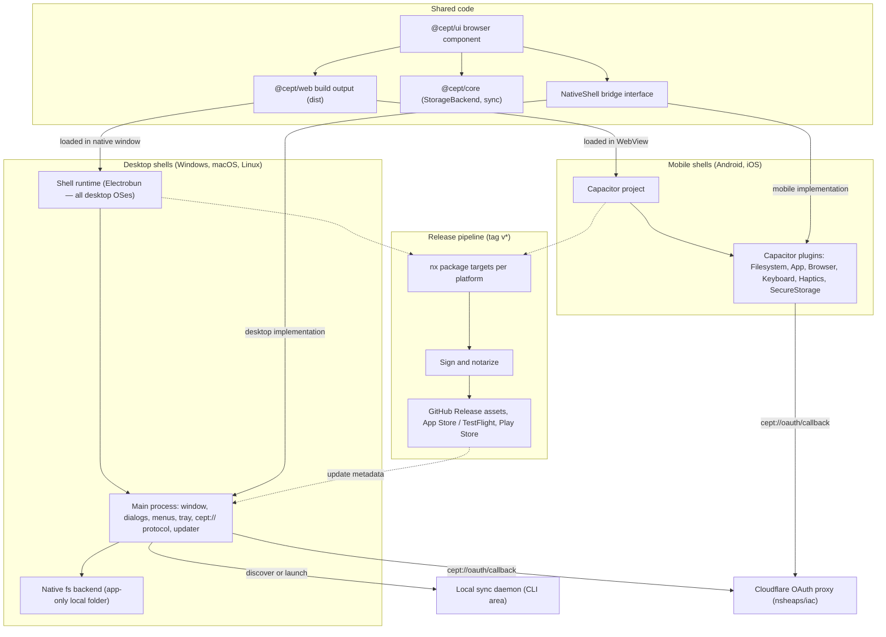
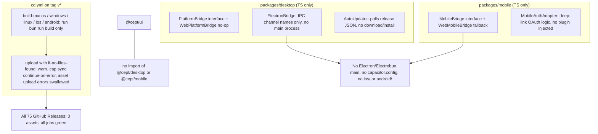
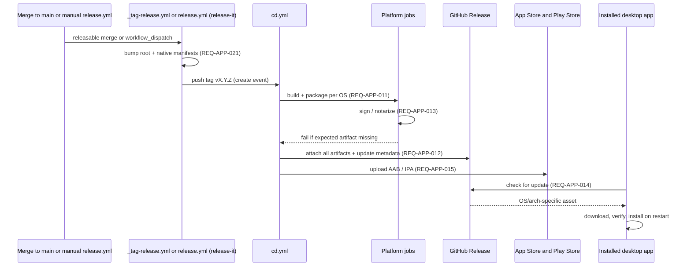

# 07 — Packaged native apps

**Status:** Draft, 2026-10-06 · **Area IDs:** `REQ-APP-NNN`

This spec covers the installable Cept applications for Windows, macOS, Linux, Android and iOS. Each one wraps the same browser component (`@cept/ui` built by `@cept/web`) in a native shell, reaches native features through a bridge, and is built, signed, versioned, published and updated by CI. Every requirement below was checked against the code, the open pull requests and the current documentation as of the date above. Each one records whether it is implemented, whether it is documented as the owner wants, and whether that documentation is accurate.

**Bottom line:** Cept has no packaged native app on any platform today. `packages/desktop` and `packages/mobile` hold only renderer-side bridge interfaces, web fallbacks, an update checker and a deep-link OAuth helper. Nothing creates a window, a Capacitor project or an installer. The `cd.yml` platform jobs pass but produce no artifacts, and every one of the 75 GitHub Releases (through v0.7.31) has zero assets (`gh api repos/nsheaps/cept/releases`, checked 2026-10-06).

**Related:**
[Requirements index & traceability matrix](README.md) ·
[01 Browser app & PWA](01-browser-app-and-pwa.md) ·
[02 Static rendering](02-static-rendering.md) ·
[03 Spaces & storage](03-spaces-and-storage.md) ·
[04 Collaboration](04-collaboration.md) ·
[05 CLI & daemon](05-cli-and-daemon.md) ·
[06 VS Code extension](06-vscode-extension.md) ·
[08 Editor](08-editor.md) ·
[09 Remotes & auth](09-remotes-and-auth.md) ·
[10 Engineering & CI](10-engineering-and-ci.md) ·
[Original specification](../../SPECIFICATION.md) ·
[TASKS.md](../../../TASKS.md)

## 1. Scope and non-goals

### In scope

- Desktop installers for Windows, macOS and Linux, and mobile apps for Android and iOS.
- Choosing the native shell runtime (Electrobun, Electron or Capacitor).
- The bridge abstraction between the shared UI and native capabilities: dialogs, menus, tray, notifications, secure storage, deep links and updates.
- App-only local space storage when it runs inside a packaged app.
- How packaged desktop apps relate to the local sync daemon.
- Build, sign, version, publish and auto-update pipelines for native artifacts, plus PR-time validation of packaging.
- Native-shell UI concerns on mobile (safe areas, keyboard, touch).

### Non-goals (covered elsewhere)

- The browser UI itself, the service worker and the PWA. See [01](01-browser-app-and-pwa.md).
- Storage backend semantics (git, gdrive, sftp, `space.cept.ya?ml`, nesting). See [03](03-spaces-and-storage.md).
- Daemon protocol and CLI. See [05](05-cli-and-daemon.md). This spec only says how apps use them.
- OAuth proxy infrastructure and login app registration. See [09](09-remotes-and-auth.md).
- General monorepo/CI conventions. See [10](10-engineering-and-ci.md). This spec covers only the native-specific targets and jobs.
- The VS Code extension host. See [06](06-vscode-extension.md).

## 2. Requirements summary

| ID                                                                                | Requirement                                             | Priority | Impl status | Docs status            | Docs accurate |
| --------------------------------------------------------------------------------- | ------------------------------------------------------- | -------- | ----------- | ---------------------- | ------------- |
| [REQ-APP-001](#req-app-001--windows-packaged-app)                                 | Windows packaged app                                    | MUST     | not-started | documented-as-desired  | stale         |
| [REQ-APP-002](#req-app-002--macos-packaged-app)                                   | macOS packaged app                                      | MUST     | not-started | documented-as-desired  | stale         |
| [REQ-APP-003](#req-app-003--linux-packaged-app)                                   | Linux packaged app                                      | MUST     | not-started | documented-as-desired  | stale         |
| [REQ-APP-004](#req-app-004--android-packaged-app)                                 | Android packaged app                                    | MUST     | not-started | documented-as-desired  | stale         |
| [REQ-APP-005](#req-app-005--ios-packaged-app)                                     | iOS packaged app                                        | MUST     | not-started | documented-as-desired  | stale         |
| [REQ-APP-006](#req-app-006--native-shells-reuse-the-single-browser-component)     | Native shells reuse the single browser component        | MUST     | stubbed     | documented-as-desired  | stale         |
| [REQ-APP-007](#req-app-007--desktop-shell-runtime-selection-bunts-where-possible) | Desktop shell runtime selection (Bun/TS where possible) | MUST     | not-started | documented-differently | stale         |
| [REQ-APP-008](#req-app-008--unified-native-bridge-abstraction)                    | Unified native bridge abstraction                       | SHOULD   | divergent   | documented-differently | stale         |
| [REQ-APP-009](#req-app-009--app-only-local-space-storage)                         | App-only local space storage                            | MUST     | stubbed     | documented-differently | stale         |
| [REQ-APP-010](#req-app-010--packaged-app-integrates-with-the-local-sync-daemon)   | Packaged app integrates with the local sync daemon      | SHOULD   | not-started | undocumented           | n/a           |
| [REQ-APP-011](#req-app-011--release-pipeline-builds-per-platform-artifacts)       | Release pipeline builds per-platform artifacts          | MUST     | stubbed     | documented-differently | stale         |
| [REQ-APP-012](#req-app-012--artifacts-attached-to-github-releases)                | Artifacts attached to GitHub Releases                   | MUST     | stubbed     | documented-as-desired  | accurate      |
| [REQ-APP-013](#req-app-013--code-signing-and-notarization)                        | Code signing and notarization                           | MUST     | not-started | documented-as-desired  | stale         |
| [REQ-APP-014](#req-app-014--desktop-auto-update)                                  | Desktop auto-update                                     | MUST     | stubbed     | documented-as-desired  | stale         |
| [REQ-APP-015](#req-app-015--distribution-channels)                                | Distribution channels                                   | MUST     | not-started | documented-differently | accurate      |
| [REQ-APP-016](#req-app-016--native-oauth-via-deep-link-for-packaged-apps)         | Native OAuth via deep link for packaged apps            | MUST     | stubbed     | documented-as-desired  | stale         |
| [REQ-APP-017](#req-app-017--desktop-os-integration-deep-links-tray-menus)         | Desktop OS integration (deep links, tray, menus)        | SHOULD   | stubbed     | documented-as-desired  | accurate      |
| [REQ-APP-018](#req-app-018--nxmise-targets-for-native-builds)                     | Nx/mise targets for native builds                       | MUST     | partial     | documented-differently | stale         |
| [REQ-APP-019](#req-app-019--pr-time-validation-of-packaging)                      | PR-time validation of packaging                         | SHOULD   | not-started | undocumented           | n/a           |
| [REQ-APP-020](#req-app-020--mobile-specific-ui-polish)                            | Mobile-specific UI polish                               | MUST     | partial     | undocumented           | n/a           |
| [REQ-APP-021](#req-app-021--native-app-versions-track-releases)                   | Native app versions track releases                      | MUST     | not-started | undocumented           | n/a           |

The "Docs accurate" column judges the docs that describe the requirement as a whole. Where user-facing docs are accurate ("Coming soon") but README, CLAUDE.md, CHANGELOG or TASKS.md claim the feature exists, the row is marked stale. See [section 7](#7-stale-documentation).

## 3. Architecture

### 3.1 Required architecture

### 3.2 Current state (2026-10-06)

### 3.3 Required release flow

## 4. Requirements

### REQ-APP-001 — Windows packaged app

**Statement:** Cept MUST be distributed as an installable Windows desktop application, in at least one installer format such as NSIS `.exe` or `.msi`, that runs the Cept browser component in a native window.

**Source:** Handler ("A packaged app distributed for windows/macos/linux/android/ios").

**Acceptance criteria:**

- A tagged release has a Windows installer attached to its GitHub Release.
- Installing and launching it on a clean Windows 10/11 machine opens a native window showing the Cept UI loaded from the bundled `@cept/web` build, with no network needed for the first boot.
- The app boots to a working state with browser-only storage alone (CLAUDE.md architecture rule 6).
- The CI job that builds it fails when the installer is not produced.

**Current state:** not-started.

- There is no main process, window or packaging config in `packages/desktop`. The only Windows-relevant code is renderer-side IPC stubs in [packages/desktop/src/electron-bridge.ts](../../../packages/desktop/src/electron-bridge.ts) (lines 25-37).
- [packages/desktop/package.json](../../../packages/desktop/package.json) has no build or package script and no `electron` dependency.
- In [.github/workflows/cd.yml](../../../.github/workflows/cd.yml), `build-windows` only runs `bun run build` and uploads `packages/desktop/dist/*.exe` with `if-no-files-found: warn`.
- All 75 releases, including v0.7.27 to v0.7.31, have 0 assets (`gh api repos/nsheaps/cept/releases`).
- TASKS P6.1 and P6.3 are unchecked. T7.2 is marked done ([TASKS.md](../../../TASKS.md) line 117), which is wrong.

**Docs state:** documented-as-desired, stale.

- [docs/SPECIFICATION.md](../../SPECIFICATION.md) §8.2 (lines 1011-1015) asks for Electron `.exe`, `.msi` and a portable `.zip`.
- [docs/content/guides/platform-support.md](../../content/guides/platform-support.md) line 11 says "Coming soon" and [docs/content/reference/roadmap.md](../../content/reference/roadmap.md) line 104 says "Planned". Both are accurate.
- [README.md](../../../README.md) lines 30 and 61, the [CLAUDE.md](../../../CLAUDE.md) package table, [CONTRIBUTING.md](../../../CONTRIBUTING.md) line 49 and [CHANGELOG.md](../../../CHANGELOG.md) line 557 present a Windows Electron shell as existing. That is stale.

**Gap:** Needs a shell runtime (see [REQ-APP-007](#req-app-007--desktop-shell-runtime-selection-bunts-where-possible)), a main process with a window that loads the `@cept/web` build, a packaging config, an nx `package` target and a CI job that fails when no installer is produced.

**Related:** TASKS P6.1, P6.3, T7.2. No open PRs or issues.

### REQ-APP-002 — macOS packaged app

**Statement:** Cept MUST be distributed as an installable macOS application (`.dmg`, universal or per-arch) that runs the Cept browser component natively.

**Source:** Handler.

**Acceptance criteria:**

- A tagged release has a `.dmg` for arm64 and x64, or a universal one.
- The app launches on a current macOS release without Gatekeeper blocking it (depends on [REQ-APP-013](#req-app-013--code-signing-and-notarization)).
- The window renders the bundled `@cept/web` UI.

**Current state:** not-started.

- There is no Electrobun or Electron code. `PlatformBridge.platform` allows `'electrobun'` ([packages/desktop/src/platform-bridge.ts](../../../packages/desktop/src/platform-bridge.ts) line 75), but nothing implements it.
- `build-macos` in [cd.yml](../../../.github/workflows/cd.yml) uploads `packages/desktop/dist/*.dmg`, which is never produced.
- TASKS T7.1 is marked done ([TASKS.md](../../../TASKS.md) line 116) but no Electrobun shell exists. P6.4 is unchecked.

**Docs state:** documented-as-desired, stale.

- [SPECIFICATION.md](../../SPECIFICATION.md) §8.1 (lines 1003-1009) asks for Electrobun and a `.dmg`.
- [platform-support.md](../../content/guides/platform-support.md) line 10 says "Coming soon", which is accurate.
- [packages/desktop/src/index.ts](../../../packages/desktop/src/index.ts) line 4 claims bridges "for Electrobun (macOS)". That is stale because no Electrobun bridge exists. README.md line 61 and CLAUDE.md are also stale.

**Gap:** Needs a macOS shell, `.dmg` packaging, a working CI job and signing/notarization.

**Related:** TASKS P6.4, T7.1.

### REQ-APP-003 — Linux packaged app

**Statement:** Cept MUST be distributed as an installable Linux desktop application: at least an AppImage, with `.deb`/`.rpm` as derived formats per SPECIFICATION §8.2.

**Source:** Handler.

**Acceptance criteria:**

- A tagged release has an `.AppImage` (and, if adopted, `.deb`/`.rpm`).
- The AppImage launches on a current Ubuntu LTS and renders the UI.
- The CI job fails if the AppImage is missing.

**Current state:** not-started. Nothing produces a Linux build. `build-linux` in [cd.yml](../../../.github/workflows/cd.yml) uploads `packages/desktop/dist/*.AppImage`, which never exists. CD run 32660431419 reported "Build Linux: success" and uploaded zero artifacts.

**Docs state:** documented-as-desired, stale. [SPECIFICATION.md](../../SPECIFICATION.md) line 1015 lists `.AppImage`, `.deb`, `.rpm` and `.snap`. [platform-support.md](../../content/guides/platform-support.md) line 12 says "Coming soon (AppImage, deb, rpm)", which is accurate. README and CLAUDE.md are stale.

**Gap:** Needs a shell, AppImage/deb packaging and a CI job that actually produces the files.

**Related:** TASKS P6.3.

### REQ-APP-004 — Android packaged app

**Statement:** Cept MUST be distributed as an Android application that wraps the Cept browser component via Capacitor: an `.apk` for sideloading and GitHub Releases, and an `.aab` for the Play Store.

**Source:** Handler.

**Acceptance criteria:**

- `packages/mobile` contains a Capacitor config and an `android/` project that builds with gradle in CI.
- A tagged release attaches a signed `.apk`, and an `.aab` is produced for Play upload.
- The installed app opens on an Android emulator (API level per the Capacitor support matrix) and renders the UI.

**Current state:** not-started.

- There is no `capacitor.config.ts`, no `android/` directory and no `@capacitor/*` dependency ([packages/mobile/package.json](../../../packages/mobile/package.json)).
- `build-android` in [cd.yml](../../../.github/workflows/cd.yml) runs `npx cap sync android` with `continue-on-error: true`, has no `gradle assemble` step, and uploads `packages/mobile/android/app/build/outputs/`, which does not exist.
- `upload-release-assets` never globs Android or iOS outputs.
- TASKS P6.6 and P6.7 are unchecked. T7.4 is marked done ([TASKS.md](../../../TASKS.md) line 119), which is wrong.

**Docs state:** documented-as-desired, stale. [SPECIFICATION.md](../../SPECIFICATION.md) §8.4 (lines 1027-1037) and §9.4 (lines 1247-1261) cover this. [platform-support.md](../../content/guides/platform-support.md) line 14 says "Coming soon … via Play Store", which is accurate. [.claude/prompts/continue.md](../../../.claude/prompts/continue.md) line 142 says "No Capacitor project files", which is accurate. README.md line 62 and CLAUDE.md say "Capacitor iOS + Android", which is stale.

**Gap:** Needs a Capacitor project, the Android platform, a gradle build in CI, signing and artifact upload.

**Related:** TASKS P6.6, P6.7, T7.4.

### REQ-APP-005 — iOS packaged app

**Statement:** Cept MUST be distributed as an iOS application (`.ipa` via TestFlight/App Store) that wraps the Cept browser component via Capacitor.

**Source:** Handler.

**Acceptance criteria:**

- `packages/mobile/ios/` exists and `xcodebuild archive` plus export runs in CI on macOS runners.
- A signed `.ipa` is produced on tags and uploaded to TestFlight (see [REQ-APP-015](#req-app-015--distribution-channels)).
- The app renders the UI on an iOS simulator in a CI smoke test.

**Current state:** not-started. There is no `ios/` project and no Capacitor config. `build-ios` in [cd.yml](../../../.github/workflows/cd.yml) runs `npx cap sync ios` with `continue-on-error: true`, has no `xcodebuild archive` step, and uploads `packages/mobile/ios/`, which does not exist.

**Docs state:** documented-as-desired, stale. [SPECIFICATION.md](../../SPECIFICATION.md) §8.4 and §9.4 (lines 1263-1270) cover this. [platform-support.md](../../content/guides/platform-support.md) line 13 says "Coming soon … via App Store", which is accurate. README and CLAUDE.md are stale.

**Gap:** Needs a Capacitor iOS project, xcodebuild archive and export, signing and TestFlight upload.

**Related:** TASKS P6.6, P6.7.

### REQ-APP-006 — Native shells reuse the single browser component

**Statement:** Every packaged app, desktop and mobile, MUST render the same `@cept/ui` browser component built by `@cept/web`, with no forked UI code. Platform-specific behavior MUST be reached only through a bridge abstraction.

**Source:** Derived from the handler's "browser component - the UI interface" combined with the packaged-app requirement; also SPECIFICATION §8.2 ("Shared NativeShell interface").

**Acceptance criteria:**

- Each shell loads the `packages/web` build output; no shell contains React components of its own.
- `@cept/ui` exposes one bridge injection point (provider or context) and detects capabilities through it.
- Capability-gated UI (for example "Open Folder") appears only when the injected bridge reports the capability, never on a platform-name check (CLAUDE.md architecture rule 4 applied to bridges).
- `@cept/ui` still imports no platform modules (architecture rule 1).

**Current state:** stubbed. The bridge interfaces exist ([packages/desktop/src/platform-bridge.ts](../../../packages/desktop/src/platform-bridge.ts) lines 72-126; [packages/mobile/src/mobile-bridge.ts](../../../packages/mobile/src/mobile-bridge.ts) lines 56-96), but nothing in `packages/ui` or `packages/web` imports `@cept/desktop` or `@cept/mobile`. No shell loads `packages/web/dist`, and the UI has no bridge injection point.

**Docs state:** documented-as-desired, stale. [platform-support.md](../../content/guides/platform-support.md) lines 33-50 say "Each platform shell wraps the same @cept/ui and @cept/core packages", and [SPECIFICATION.md](../../SPECIFICATION.md) §8.2 and §8.5 describe the intended design. However, platform-support.md lines 41-42, README.md lines 61-62, CLAUDE.md lines 44-45 and the in-app docs ([docs-content.ts](../../../packages/ui/src/components/docs/docs-content.ts) lines 170-171 and 380-381) describe `@cept/desktop`/`@cept/mobile` as existing shells, which they are not.

**Gap:** Needs a bridge provider in `@cept/ui`, shells that load the web build, and capability-gated UI.

**Related:** TASKS P6.1, P6.2. Depends on [01 REQ-WEB-001](01-browser-app-and-pwa.md#req-web-001--shared-browser-ui-component).

### REQ-APP-007 — Desktop shell runtime selection (Bun/TS where possible)

**Statement:** The desktop shell runtime MUST be chosen and documented.

> **Owner direction (D-17):** Electrobun is the desktop shell runtime on all desktop OSes (macOS, Windows, Linux); Electron is removed from scope. Mobile shells use Capacitor (iOS, Android).

**Source:** Derived from the handler ("base code implementation using bun/ts where possible"), SPECIFICATION §2 and §8.1-8.2, and TASKS P6.4.

**Acceptance criteria:**

- An ADR or spec under `docs/specs/` records an Electrobun-versus-Electron evaluation per OS, with current upstream platform support verified and dated.
- SPECIFICATION.md, CLAUDE.md, README.md and platform-support.md all name the same runtime per OS.
- The chosen runtime is integrated and builds in CI.

**Current state:** not-started. No runtime is integrated. `ElectronBridge` is a renderer-only IPC client, and there is no Electrobun code. TASKS P6.4 ("Evaluate Electrobun, implement or fall back") is unchecked. There is no evaluation record in `docs/research` or `docs/specs`.

**Docs state:** documented-differently, stale — **Decided (D-17).** [SPECIFICATION.md](../../SPECIFICATION.md) lines 82-83 and CLAUDE.md previously fixed Electrobun for macOS and Electron for Windows/Linux on an unverified premise. D-17 resolves this: Electrobun on all desktop OSes; update SPECIFICATION.md, CLAUDE.md, README.md and platform-support.md accordingly.

**Gap:** Needs the evaluation, a recorded decision and an implementation.

**Related:** TASKS P6.4.

### REQ-APP-008 — Unified native bridge abstraction

**Statement:** A single typed native-shell abstraction (SPECIFICATION §8.5 `NativeShell`) SHOULD cover desktop and mobile capabilities, with a web fallback, so the UI is runtime-agnostic. The capabilities are dialogs, menus, notifications, clipboard, `openExternal`, OAuth popup, secure storage, and update check/install.

**Source:** Existing spec ([SPECIFICATION.md](../../SPECIFICATION.md) §8.5, lines 1039-1068).

**Acceptance criteria:**

- One interface (or a documented, deliberate split) with a capability-discovery method.
- It includes `openExternal`, secure storage, an OAuth popup/session and `installUpdate`.
- Storage is exposed to the renderer as a renderer-side `StorageBackend` proxy that forwards serializable calls. No backend object is ever returned across IPC.
- Unit tests cover the web fallback and each native implementation's message contract.

**Current state:** divergent.

- The code has two unrelated interfaces: `PlatformBridge` (desktop; platforms `'electrobun' | 'electron' | 'web'`) and `MobileBridge` (platforms `'ios' | 'android' | 'web'`). Neither has `openExternal`, secure storage, `openOAuthPopup` or `installUpdate`.
- `ElectronBridge.createLocalBackend` expects a `StorageBackend` back from `ipc.invoke` ([electron-bridge.ts](../../../packages/desktop/src/electron-bridge.ts) lines 72-77). Electron IPC structured-clones values, so class methods cannot cross that boundary, and this design cannot work as written.

**Docs state:** documented-differently, stale. SPECIFICATION §8.5 defines a single `NativeShell`, while the code and [continue.md](../../../.claude/prompts/continue.md) line 141 refer to `PlatformBridge`/`ElectronBridge`.

**Gap:** Reconcile the spec and the code, add the missing capabilities, and replace the IPC-returned backend with a proxy backend. Consider whether the abstraction should also cover the VS Code webview host ([06](06-vscode-extension.md)).

**Related:** TASKS P6.1, P6.2.

### REQ-APP-009 — App-only local space storage

**Statement:** Packaged apps MUST be able to open or create a space in a native local folder ("stored locally (app only)") through a native folder dialog. All persistence still goes through `StorageBackend`.

**Source:** Handler ("stored locally (app only)").

**Acceptance criteria:**

- On desktop, "Open Folder" shows the native dialog, and the chosen folder becomes a space whose reads and writes go through a `StorageBackend`. A folder containing `space.cept.yaml` or `space.cept.yml` is recognized as a space root.
- On Android and iOS, the app can create and open spaces in app-sandbox storage (and, where the OS allows, user-picked folders) through a Capacitor filesystem backend.
- Opening an existing folder modifies no files until the user edits (architecture rule 11).
- The platform matrix in platform-support.md reflects actual support.

**Current state:** stubbed.

- `LocalFsBackend` exists in core and uses `node:fs` ([packages/core/src/storage/local-fs.ts](../../../packages/core/src/storage/local-fs.ts) lines 8-10 and 30).
- The IPC channel names `SHOW_OPEN_DIALOG` and `CREATE_LOCAL_BACKEND` exist ([electron-bridge.ts](../../../packages/desktop/src/electron-bridge.ts) lines 26 and 36), but there is no main-process handler and no UI path through a bridge.
- On mobile, `WebMobileBridge.createStorageBackend` throws ([mobile-bridge.ts](../../../packages/mobile/src/mobile-bridge.ts) lines 115-117), and no native mobile filesystem backend exists.
- TASKS P2.7 is relevant and P6.2 is unchecked.

**Docs state:** documented-differently, stale. [platform-support.md](../../content/guides/platform-support.md) lines 52-58 (row at line 57) say Local Folder is available on desktop (no desktop app exists) and not on mobile, while the in-app docs ([docs-content.ts](../../../packages/ui/src/components/docs/docs-content.ts) line 287) say Local Folder is "Coming soon" everywhere. [docs/specs/storage-backends.md](../storage-backends.md) FR-2 specifies `LocalFsBackend` without saying which shell hosts it. platform-support.md's "No" for mobile conflicts with the handler's "app only" requirement, which implies mobile support too. SPECIFICATION.md line 117 defers a `CapacitorFsBackend` to the future. The handler says "spaces" where the code says "spaces".

**Gap:** Needs main-process fs handlers or Electrobun RPC, a dialog wired into the UI, a mobile filesystem backend and an updated matrix. The backend itself is specified in [03 REQ-WS-009](03-spaces-and-storage.md#req-ws-009--local-app-only-native-filesystem-backend) and [03 REQ-WS-017](03-spaces-and-storage.md#req-ws-017--backend-availability-matrix-per-platform).

**Related:** TASKS P6.2, P2.7.

### REQ-APP-010 — Packaged app integrates with the local sync daemon

**Statement:** Desktop packaged apps SHOULD bundle or connect to the same local CLI sync daemon used by the PWA and the VS Code extension, rather than running a separate sync stack. Mobile apps fall back to in-app sync.

**Source:** Derived from the handler ("a daemon that runs to sync changes to the remotes"; the PWA and VS Code plugin "share local daemon").

**Acceptance criteria:**

- When a daemon is running, the desktop app discovers it with the protocol from [05 REQ-CLI-006](05-cli-and-daemon.md#req-cli-006--local-client-protocol-for-daemon-sharing) and [05 REQ-CLI-007](05-cli-and-daemon.md#req-cli-007--daemon-discovery-and-fallback-from-pwabrowser) and delegates sync to it.
- When no daemon is running, the app either launches its bundled daemon or uses in-process sync, and the choice is documented.
- Two clients (for example the app and VS Code) editing the same space never run two competing sync loops.

**Current state:** not-started. No daemon, CLI or shell code exists, `packages/` has no CLI package, and neither bridge mentions a daemon.

**Docs state:** undocumented. Neither SPECIFICATION.md, `docs/specs` nor `docs/content` mentions it.

**Gap:** Needs a shell decision on embedding or launching the daemon, based on the daemon protocol from area 05.

**Related:** none. See [05 REQ-CLI-002](05-cli-and-daemon.md#req-cli-002--long-running-sync-daemon) and [01 REQ-WEB-010](01-browser-app-and-pwa.md#req-web-010--pwa-shares-local-daemon-when-present).

### REQ-APP-011 — Release pipeline builds per-platform artifacts

**Statement:** On every version tag, CI MUST build installable artifacts for Windows, macOS, Linux, Android and iOS. A job MUST fail if an expected artifact is missing.

**Source:** Derived from the handler ("distributed for windows/macos/linux/android/ios").

**Acceptance criteria:**

- Each platform job runs a real nx `package` target (see [REQ-APP-018](#req-app-018--nxmise-targets-for-native-builds)).
- Upload steps use `if-no-files-found: error`. No `continue-on-error` and no `|| true` on build, sync or upload steps.
- A deliberately broken packaging config makes the job fail (gate proven, per qontacts validation-first practice).
- The spec names the actual workflow file(s).

> **Owner direction (D-24):** These gates are scoped to Electrobun/Capacitor artifact jobs only. Platform jobs MUST fail (or emit `::warning::` and produce unsigned builds on PRs) when expected artifacts are missing. No `continue-on-error` and no `|| true` on any build, sync or upload step.

**Current state:** stubbed.

- [cd.yml](../../../.github/workflows/cd.yml) has `build-macos`, `build-windows`, `build-linux`, `build-ios` and `build-android` jobs. Each runs only `bun run build`, which excludes desktop and mobile because they have no build target, then uploads with `if-no-files-found: warn`. The `cap sync` steps use `continue-on-error: true`.
- CD run 32660431419 (v0.7.31, `create` event) passed every job and produced no artifacts (artifact count 0).
- Tags come from two places, both running release-it: [\_tag-release.yml](../../../.github/workflows/_tag-release.yml) (called from CI on releasable merges to `main`) and the manual [release.yml](../../../.github/workflows/release.yml) (`workflow_dispatch` with an `increment` choice). `cd.yml` triggers on the tag's `create` event because the release commit carries `[skip ci]`. Neither tagging workflow builds or validates native packaging before the tag is pushed.
- TASKS T10.1 is marked done ([TASKS.md](../../../TASKS.md) line 142).

**Docs state:** documented-differently, stale. SPECIFICATION §9.2 and §9.4 describe separate `release-desktop.yml` and `release-mobile.yml` with a target matrix. Neither file exists; the jobs live in `cd.yml`. [CHANGELOG.md](../../../CHANGELOG.md) line 560 claims "Release workflows for … desktop, and mobile". [continue.md](../../../.claude/prompts/continue.md) lines 750-752 list the non-existent workflows.

**Gap:** Needs real package targets, strict upload gating, and a spec update that names `_tag-release.yml`, `release.yml` and `cd.yml` (or a split into the specified files).

**Related:** TASKS T10.1. See [10 Engineering & CI](10-engineering-and-ci.md).

### REQ-APP-012 — Artifacts attached to GitHub Releases

**Statement:** Release artifacts for all five platforms MUST be attached to the corresponding GitHub Release.

**Source:** Derived.

**Acceptance criteria:**

- After a tag, the release lists Windows, macOS and Linux installers, the Android `.apk`, and any iOS artifact or a TestFlight link in the notes.
- The upload step fails on error and is not silenced.
- Update metadata files needed by [REQ-APP-014](#req-app-014--desktop-auto-update) are attached.

**Current state:** stubbed. `upload-release-assets` in [cd.yml](../../../.github/workflows/cd.yml) only globs `dist/*.dmg`, `*.exe` and `*.AppImage`, swallows errors with `2>/dev/null || true`, and ignores iOS and Android outputs. The GitHub API shows 0 assets on v0.7.27 to v0.7.31. [.release-it.json](../../../.release-it.json) has `github.release: false`; the release is created by the `github-release` job in cd.yml.

**Docs state:** documented-as-desired, accurate. SPECIFICATION §9.2 says "Upload to GitHub Release assets", and §9.4 says the same for mobile.

**Gap:** Needs real artifacts, mobile globs and removal of the silent failure.

**Related:** none.

### REQ-APP-013 — Code signing and notarization

**Statement:** Distributed builds MUST be code-signed: macOS Developer ID plus notarization, Windows Authenticode, an Android keystore, and an iOS distribution certificate. Signing secrets are optional at PR time and enforced on release.

**Source:** Derived; real distribution needs signing on all four platforms. Also SPECIFICATION §8.1 and §9.2.

**Acceptance criteria:**

- Secret names for each platform are documented in a developer doc.
- Release jobs sign artifacts, and macOS builds pass `spctl --assess` after notarization.
- When secrets are absent (forks, PRs), jobs emit `::warning::` and produce unsigned builds; they never turn `main` red.
- On a release tag, a missing signing secret fails the release job.

**Current state:** not-started. Nothing in `.github/workflows` references signing steps, entitlements, keystore handling or signing secrets (grep finds nothing). TASKS T10.2 "Code signing setup" is marked done ([TASKS.md](../../../TASKS.md) line 143), which is false.

**Docs state:** documented-as-desired, stale. [SPECIFICATION.md](../../SPECIFICATION.md) line 1007 ("code signing, notarization") and line 1232 describe it. TASKS T10.2 marked done is stale.

**Gap:** Needs a signing design, documented secret names and per-platform CI steps.

**Related:** TASKS T10.2.

### REQ-APP-014 — Desktop auto-update

**Statement:** Desktop packaged apps MUST check for, download and install new versions published to GitHub Releases, choosing the asset that matches the current OS and architecture.

**Source:** Derived from SPECIFICATION §8.5 (`checkForUpdates`/`installUpdate`), TASKS P6.5, and the need for maintained distribution.

**Acceptance criteria:**

- The updater picks the asset for the current OS and arch by name or metadata, not by `assets[0]`.
- It downloads, verifies (signature or checksum), and installs on restart. The `downloading` and `ready` states are reachable and tested.
- Each shell starts it, and the user is told when an update is ready.
- An end-to-end test updates from version N to N+1 against a fixture release.

**Current state:** stubbed. The `AutoUpdater` class ([packages/desktop/src/auto-updater.ts](../../../packages/desktop/src/auto-updater.ts) lines 75-194) only polls a release JSON and compares semver. It takes `data.assets[0]` whatever the platform (line 127). Its `autoDownload` option (lines 50 and 87) is stored but never acted on and has no download or install, so the `downloading` and `ready` states are never reached. It is unit-tested ([auto-updater.test.ts](../../../packages/desktop/src/auto-updater.test.ts)), but no shell creates it. TASKS P6.5 is unchecked. T10.3 is marked done ([TASKS.md](../../../TASKS.md) line 144).

**Docs state:** documented-as-desired, stale. [roadmap.md](../../content/reference/roadmap.md) line 108 ("Auto-updater: Planned") and [platform-support.md](../../content/guides/platform-support.md) line 69 (under "Desktop-Specific Features (Coming Soon)") are accurate. [CHANGELOG.md](../../../CHANGELOG.md) line 559 lists "Auto-Updater: GitHub Releases-based update checking for desktop" as shipped, which is misleading.

**Gap:** Needs per-OS asset selection, download and install through the runtime's updater (electron-updater or the Electrobun updater), update metadata in releases, and shell wiring.

**Related:** TASKS P6.5, T10.3.

### REQ-APP-015 — Distribution channels

**Statement:** Packaged apps MUST be published to defined channels: GitHub Releases for all desktop builds and the Android APK, the Apple App Store/TestFlight for iOS, and the Google Play Store for Android (AAB). The choice of channels, including optional stores such as a Homebrew cask, winget or the Mac App Store, SHOULD be documented.

**Source:** Derived.

**Acceptance criteria:**

- A documented channel table per platform, with the owner's decision on required versus optional stores.
- Automated upload to each required store on release, using fastlane or an equivalent tool.
- User-facing docs promise only the channels that exist.

**Current state:** not-started. There is no fastlane, TestFlight, Play or Homebrew publishing in the repo.

**Docs state:** documented-differently, accurate. SPECIFICATION §9.4 marks Play and TestFlight upload as optional ("(optionally) … via fastlane"). [platform-support.md](../../content/guides/platform-support.md) lines 13-14 promise App Store and Play Store distribution. Each doc accurately describes its own plan, but they disagree with each other.

**Gap:** Needs a channel decision, a spec, store accounts and pipelines.

**Related:** none.

### REQ-APP-016 — Native OAuth via deep link for packaged apps

**Statement:** Packaged apps MUST complete GitHub/Google OAuth through the system browser or an in-app auth session, with a registered app redirect (for example `cept://oauth/callback`) that works with the Cloudflare OAuth proxy.

**Source:** Derived from the handler ("auth through github (login) app / google login app") applied to packaged apps.

**Acceptance criteria:**

- The `cept://` (or equivalent) scheme is registered on all five platforms.
- The login flow checks state/CSRF, times out cleanly, and stores tokens in OS secure storage (keychain or keystore), never in localStorage.
- The OAuth proxy in nsheaps/iac allows the native redirect URI.
- An integration test drives the flow with a mocked deep-link handler. That already exists for the adapter logic, and it should be extended to the real plugin wiring.

**Current state:** stubbed. `MobileAuthAdapter` ([packages/mobile/src/mobile-auth.ts](../../../packages/mobile/src/mobile-auth.ts) lines 79-204) handles state/CSRF, a timeout and the code exchange behind an injected `DeepLinkHandler`, and it is unit-tested ([mobile-auth.test.ts](../../../packages/mobile/src/mobile-auth.test.ts)). No Capacitor App/Browser plugin implementation is injected and no URL scheme is registered. The desktop side has nothing equivalent. T7.6 is marked done ([TASKS.md](../../../TASKS.md) line 121) although nothing is wired.

**Docs state:** documented-as-desired, stale. [SPECIFICATION.md](../../SPECIFICATION.md) line 969 (OS keychain or secure storage for tokens) and §8.5 `openOAuthPopup`/`getSecureStorage` cover this, and [platform-support.md](../../content/guides/platform-support.md) line 70 accurately says deep linking is "Coming soon". TASKS T7.6 "Native OAuth flow for mobile" is marked done ([TASKS.md](../../../TASKS.md) line 121), which is stale because nothing is wired into a shell.

**Gap:** Needs scheme registration, a `DeepLinkHandler` implementation, secure token storage and proxy redirect support.

**Related:** TASKS T7.6, P5.1. See [09 Remotes & auth](09-remotes-and-auth.md).

### REQ-APP-017 — Desktop OS integration (deep links, tray, menus)

**Statement:** Desktop apps SHOULD register the `cept://` protocol and provide native menus and system tray integration, as planned in the roadmap.

**Source:** Existing spec ([roadmap.md](../../content/reference/roadmap.md) lines 109-110).

**Acceptance criteria:**

- Opening a `cept://` link focuses the app and routes to the target page or space.
- The native application menu mirrors the main commands, and menu actions reach the UI through the bridge.
- The tray icon shows sync status (from the daemon when present) and offers open/quit.

**Current state:** stubbed. The types and IPC channel names exist (`MenuItem`, `SET_MENU`, `MENU_ACTION`; [platform-bridge.ts](../../../packages/desktop/src/platform-bridge.ts) lines 36-45 and [electron-bridge.ts](../../../packages/desktop/src/electron-bridge.ts) lines 30-34). There are no handlers and nothing for the tray or protocol registration. TASKS P6.5 is unchecked.

**Docs state:** documented-as-desired, accurate. roadmap.md lists "Deep linking" and "System tray integration" as Planned, and platform-support.md lines 64-70 say "Coming soon".

**Gap:** Implement once a shell exists.

**Related:** TASKS P6.5.

### REQ-APP-018 — Nx/mise targets for native builds

**Statement:** `@cept/desktop` and `@cept/mobile` MUST expose nx targets (`dev`, `build`, `package`) that run the same way locally and in CI, with the required toolchains pinned in mise, following the qontacts reference layout.

**Source:** Derived from the handler ("mono repo setup matching other nsheaps repos using nx and mise").

**Acceptance criteria:**

- `nx run @cept/desktop:dev` launches the desktop shell against the web dev server.
- `nx run @cept/desktop:package` and `nx run @cept/mobile:package` produce artifacts locally on a host with the right toolchain.
- Java/Android SDK (and any shell-runtime tool) versions are pinned in `.mise.toml` or documented where mise cannot pin them (Xcode). CI uses the same pins.
- The root `dev:desktop` script works.

**Current state:** partial.

- Both packages only have `lint` and `typecheck` scripts ([packages/desktop/package.json](../../../packages/desktop/package.json), [packages/mobile/package.json](../../../packages/mobile/package.json)), and neither has a `project.json`.
- The root `dev:desktop` script ([package.json](../../../package.json) line 16) calls `nx run @cept/desktop:dev`, which does not exist.
- [.mise.toml](../../../.mise.toml) pins only bun and node. cd.yml uses `setup-java` outside mise.
- Unit tests for both packages do run in the root vitest unit project ([vitest.config.ts](../../../vitest.config.ts) lines 29-30), which is why this is partial rather than not-started.

**Docs state:** documented-differently, stale. CLAUDE.md and [SPECIFICATION.md](../../SPECIFICATION.md) line 1291 list `bun run dev:desktop  # Start Electrobun/Electron in dev mode`, which does not work. SPECIFICATION.md line 1305 says node 22.x is required for Electron, while `.mise.toml` pins node 24.

**Gap:** Needs dev, build and package targets, mise-pinned toolchains and a working `dev:desktop`.

**Related:** none. See [10 Engineering & CI](10-engineering-and-ci.md).

### REQ-APP-019 — PR-time validation of packaging

**Statement:** Native packaging SHOULD be validated in PR CI, so release-time breakage is caught early. At minimum, an unsigned build of each affected platform runs when desktop, mobile, ui or web change, scoped with `nx affected`.

**Source:** Derived from the handler ("full CI workflows … which can run in scope in PR") and the qontacts validation-first practice.

**Acceptance criteria:**

- A PR touching `packages/desktop`, `packages/mobile`, `packages/ui` or `packages/web` runs an unsigned packaging smoke test for at least one desktop OS and Android.
- PRs that do not affect those packages skip the job.
- A broken packaging config fails the PR.

**Current state:** not-started. [\_build.yml](../../../.github/workflows/_build.yml) only runs `bun run build` on ubuntu. No PR job packages desktop or mobile, so packaging is only tried on tags.

**Docs state:** undocumented. SPECIFICATION §9.2 and §9.4 trigger only on a published release or `workflow_dispatch`.

**Gap:** Needs an affected-scoped packaging smoke job.

**Related:** none.

### REQ-APP-020 — Mobile-specific UI polish

**Statement:** The browser component MUST be usable inside native mobile shells: adequate touch targets, safe-area insets, keyboard avoidance and native gestures.

**Source:** Existing task (TASKS P6.8, T7.5). SPECIFICATION §8.4 lists mobile native plugins (secure storage, file system, share extension, push) but does not cover safe areas, keyboard or touch targets.

**Acceptance criteria:**

- The UI reads safe-area insets from the mobile bridge, or from `env(safe-area-inset-*)`, and content is never hidden under the notch or home indicator.
- The editor scrolls the caret into view when the soft keyboard opens.
- Touch targets meet platform guidelines (44pt iOS, 48dp Android).
- E2E screenshots are taken at mobile viewports inside the native shell.

**Current state:** partial. A responsive web UI exists ([CHANGELOG.md](../../../CHANGELOG.md) line 279: full-page settings on mobile, #54; line 311: sidebar closed on mobile, #31; TASKS T7.5). The `MobileBridge` API includes `getSafeAreaInsets`, `onKeyboardShow` and haptics ([mobile-bridge.ts](../../../packages/mobile/src/mobile-bridge.ts) lines 73-86), but only the web no-op exists and it is not wired. P6.8 is unchecked. [PR #24](https://github.com/nsheaps/cept/pull/24) only adds mobile-viewport screenshots.

**Docs state:** undocumented on `main`. Neither roadmap.md Phase 6 (lines 97-110) nor [platform-support.md](../../content/guides/platform-support.md) "Mobile-Specific Features" (lines 72-77: share extension, widgets, push notifications, biometrics) mentions safe areas, keyboard avoidance or touch targets. Only TASKS tracks it: T7.5 "Mobile-specific UI adaptations (responsive, touch)" is marked done (line 120), which is only true for the responsive web layout, and P6.8 is unchecked (line 226). Draft [PR #37](https://github.com/nsheaps/cept/pull/37) adds `docs/content/reference/design-style-guide.md`, which specifies 44x44px minimum touch targets and keeping the caret visible above the on-screen keyboard for the web UI. Once merged, that would document part of this requirement (web, not native shells).

**Gap:** Needs a native bridge implementation, and the UI must use the insets and keyboard events.

**Related:** TASKS P6.8, T7.5; [PR #24](https://github.com/nsheaps/cept/pull/24) (screenshots only); [PR #37](https://github.com/nsheaps/cept/pull/37) (design style guide: touch targets, on-screen keyboard).

### REQ-APP-021 — Native app versions track releases

**Statement:** Packaged app versions (Info.plist, Android `versionCode`/`versionName`, the desktop package version) MUST be bumped from the single release-it version on each release.

**Source:** Derived.

**Acceptance criteria:**

- After a release, every native manifest carries the root version, and Android `versionCode` increases monotonically.
- The release-it bumper `out` list includes the native manifests and the desktop/mobile `package.json` files.
- An installed app reports the same version as the GitHub Release tag.

**Current state:** not-started. [.release-it.json](../../../.release-it.json) configures `@release-it/bumper` with `in: package.json` and `out: []`, so `packages/desktop` and `packages/mobile` stay at 0.1.0 while the root is 0.7.31. There are no native project files to bump yet.

**Docs state:** undocumented.

**Gap:** Add bumper `out` files for the native manifests once they exist.

**Related:** none.

## 5. Conflicts and open questions

Items marked **Decided** have owner direction recorded. Remaining items still need a decision.

1. **TASKS.md contradicts itself and the code.** T7.1, T7.2, T7.4, T7.6, T10.1, T10.2 and T10.3 are marked done ([TASKS.md](../../../TASKS.md) lines 116-121 and 142-145), while P6.1-P6.8 for the same work are unchecked (lines 219-226). The code matches the continuation view. _Decision:_ uncheck the T-tasks, or annotate them as superseded by P6.
2. **Desktop runtime — Decided (D-17).** The handler asked for "bun/ts where possible" and named no runtime. CLAUDE.md, README.md line 61, SPECIFICATION.md lines 82-83 and platform-support.md lines 10-12 previously fixed Electrobun for macOS and Electron for Windows/Linux on an unverified premise. **Decided (D-17):** Electrobun on all desktop OSes (macOS, Windows, Linux); Electron removed; mobile = Capacitor (iOS, Android). See [REQ-APP-007](#req-app-007--desktop-shell-runtime-selection-bunts-where-possible).
3. **One bridge or two.** SPECIFICATION §8.5 defines one `NativeShell` covering `capacitor-ios`/`capacitor-android`. The code has separate `PlatformBridge` and `MobileBridge` with different methods. _Decision:_ unify, or document the split. Should the VS Code webview host share the same interface?
4. **Release workflow layout.** SPECIFICATION §9.2/§9.4 and continue.md lines 750-752 specify `release-desktop.yml` and `release-mobile.yml`, but the jobs live in `cd.yml`. _Decision:_ split the workflows to match the spec, or update the spec.
5. **Weakened gates.** `cd.yml` reports success while producing nothing (`if-no-files-found: warn`, `continue-on-error: true`, `|| true`). This is the kind of gate weakening that qontacts' validation-first rule forbids. _Decision:_ adopt the qontacts rule for cept.
6. **Mobile local storage.** The handler's "stored locally (app only)" covers packaged mobile apps, but platform-support.md lines 50-56 say Local Folder is unavailable on mobile and SPECIFICATION.md line 117 defers `CapacitorFsBackend`. _Decision:_ is a mobile native filesystem backend required for v1?
7. **Terminology — Decided (D-1).** **Decided (D-1):** "space" is the canonical user-facing term throughout; docs and UI use "space"; requirement IDs (REQ-WS-NNN) stay stable; protected code identifiers unchanged (`WorkspaceConfig`, `workspace-state.json`, `cept-workspace`, `vscode.workspace`). See [03 REQ-WS-022](03-spaces-and-storage.md#req-ws-022--consistent-terminology-space-adopted-d-1).
8. **`node:fs` in core.** CLAUDE.md architecture rule 1 forbids `node:fs` in `@cept/core`, yet [packages/core/src/storage/local-fs.ts](../../../packages/core/src/storage/local-fs.ts) lines 8-10 import it, and that is the backend the desktop app would use. _Decision:_ move it to a platform package, or inject an fs abstraction.
9. **IPC-returned backend.** `ElectronBridge.createLocalBackend` cannot work over structured-clone IPC. _Decision:_ adopt a renderer-side proxy backend design.
10. **Store distribution.** SPECIFICATION §9.4 treats Play and TestFlight publishing as optional, while platform-support.md lines 13-14 promise the App Store and Play Store. _Decision:_ required or optional for v1? Is an Apple Developer and Play Console account available?
11. **Node version.** SPECIFICATION.md line 1305 says node 22.x is required for Electron, while `.mise.toml` pins node 24. _Decision:_ re-check this against the chosen runtime.
12. **Daemon in apps.** Should desktop apps bundle the CLI daemon, launch a system-installed one, or sync in-process when none is found? See [REQ-APP-010](#req-app-010--packaged-app-integrates-with-the-local-sync-daemon).

## 6. Open PRs and issues

No open PR touches `packages/desktop`, `packages/mobile` or the release workflows:

- [PR #67](https://github.com/nsheaps/cept/pull/67) (remote spaces) does not touch this area. It affects terminology and storage only.
- [PR #69](https://github.com/nsheaps/cept/pull/69) is unrelated to this area.
- [PR #37](https://github.com/nsheaps/cept/pull/37) (draft) adds a design style guide with mobile touch-target (44x44px) and on-screen-keyboard rules. It is relevant to [REQ-APP-020](#req-app-020--mobile-specific-ui-polish) docs, and it also edits the in-app docs file `docs-content.ts`.
- [PR #24](https://github.com/nsheaps/cept/pull/24) only adds desktop and mobile viewport screenshots (plus a CLAUDE.md UI-discoverability rule that every action must work on desktop, tablet and mobile).
- [PR #283](https://github.com/nsheaps/cept/pull/283) and [PR #246](https://github.com/nsheaps/cept/pull/246) are dependency bumps. The TypeScript v7 bump will also type-check the bridge packages.

The REST issue list (open issues, checked 2026-10-06) has no issues about desktop or mobile apps, signing, releases or updates.

## 7. Stale documentation

These claims need fixing:

- [README.md](../../../README.md) line 30 lists "Cross-platform: Desktop (macOS/Windows/Linux), Web (PWA), Mobile (iOS/Android)" as current, and lines 61-62 describe `@cept/desktop`/`@cept/mobile` as Electrobun/Electron/Capacitor shells. Only bridge interfaces exist.
- [CLAUDE.md](../../../CLAUDE.md) package table says "Electrobun (macOS) + Electron (Win/Linux) shells" and "Capacitor iOS + Android", and documents `bun run dev:desktop`, which has no target.
- [CONTRIBUTING.md](../../../CONTRIBUTING.md) lines 49-50 repeat the same shell descriptions.
- [CHANGELOG.md](../../../CHANGELOG.md) lines 557-560 (0.1.0) claim Desktop (Electrobun/Electron), Mobile (Capacitor), an Auto-Updater, and "Release workflows for web, desktop, and mobile". None of these produce a working app.
- [TASKS.md](../../../TASKS.md) lines 116-121 and 142-145 mark T7.1, T7.2, T7.4, T7.6, T10.1, T10.2 and T10.3 as done. They are not.
- [packages/desktop/src/index.ts](../../../packages/desktop/src/index.ts) line 4 says it "Provides platform bridges for Electrobun (macOS) and Electron (Win/Linux)". There is no Electrobun bridge.
- [docs/SPECIFICATION.md](../../SPECIFICATION.md) §9.2/§9.4 (lines 1215-1270) and [.claude/prompts/continue.md](../../../.claude/prompts/continue.md) lines 750-752 reference `release-desktop.yml` and `release-mobile.yml`, which do not exist.
- [docs/SPECIFICATION.md](../../SPECIFICATION.md) line 1291 documents `bun run dev:desktop`, which fails because the target is missing. Line 1305 says node 22.x, while `.mise.toml` pins 24.
- [docs/content/guides/platform-support.md](../../content/guides/platform-support.md) lines 41-42 describe `@cept/desktop`/`@cept/mobile` as existing shells, and lines 52-58 (row at line 57) show Local Folder as available on desktop, but no desktop app exists. The "Coming soon" rows at lines 10-14 are accurate.
- [packages/ui/src/components/docs/docs-content.ts](../../../packages/ui/src/components/docs/docs-content.ts) line 136 ("Cross-platform — Web (PWA), desktop …, and mobile …") and lines 170-171 and 380-381 repeat the shell descriptions in the in-app docs. The "Coming soon" table at lines 350-354 is accurate.

## 8. Cross-area dependencies

| Depends on                      | Why                                                                                                                                                                                                                                                                    | Link                                                                                                                                                                                                                                                                          |
| ------------------------------- | ---------------------------------------------------------------------------------------------------------------------------------------------------------------------------------------------------------------------------------------------------------------------- | ----------------------------------------------------------------------------------------------------------------------------------------------------------------------------------------------------------------------------------------------------------------------------- |
| Browser component and web build | Shells load the `packages/web` dist, and the UI needs a bridge injection point, which `packages/ui` lacks today                                                                                                                                                        | [01 REQ-WEB-001](01-browser-app-and-pwa.md#req-web-001--shared-browser-ui-component)                                                                                                                                                                                          |
| Service worker sync fallback    | Mobile shells, and desktop shells without a daemon, likely fall back to the service-worker sync path ([packages/web/src/service-worker.ts](../../../packages/web/src/service-worker.ts))                                                                               | [01 REQ-WEB-007](01-browser-app-and-pwa.md#req-web-007--service-worker-handles-syncing)                                                                                                                                                                                       |
| App-only local storage backend  | Native fs backend, `space.cept.ya?ml` root detection, platform availability matrix                                                                                                                                                                                     | [03 REQ-WS-009](03-spaces-and-storage.md#req-ws-009--local-app-only-native-filesystem-backend), [03 REQ-WS-017](03-spaces-and-storage.md#req-ws-017--backend-availability-matrix-per-platform)                                                                                |
| Terminology                     | Space terminology alignment (D-1 decided)                                                                                                                                                                                                                              | [03 REQ-WS-022](03-spaces-and-storage.md#req-ws-022--consistent-terminology-space-adopted-d-1)                                                                                                                                                                                |
| Co-editing                      | Packaged apps join the same P2P WebRTC sessions as browser clients                                                                                                                                                                                                     | [04 Collaboration](04-collaboration.md)                                                                                                                                                                                                                                       |
| Sync daemon                     | Desktop apps discover, launch or share the local daemon                                                                                                                                                                                                                | [05 REQ-CLI-002](05-cli-and-daemon.md#req-cli-002--long-running-sync-daemon), [05 REQ-CLI-006](05-cli-and-daemon.md#req-cli-006--local-client-protocol-for-daemon-sharing), [05 REQ-CLI-007](05-cli-and-daemon.md#req-cli-007--daemon-discovery-and-fallback-from-pwabrowser) |
| VS Code extension               | Shares the browser component and daemon; the bridge abstraction should cover a webview host                                                                                                                                                                            | [06 VS Code extension](06-vscode-extension.md)                                                                                                                                                                                                                                |
| Editor                          | Same editor in all shells; no native-only editor features                                                                                                                                                                                                              | [08 Editor](08-editor.md)                                                                                                                                                                                                                                                     |
| Remotes and auth                | Native `cept://` OAuth redirect allowed by the Cloudflare OAuth proxy (nsheaps/iac) and by the GitHub/Google login apps; secure token storage                                                                                                                          | [09 Remotes & auth](09-remotes-and-auth.md)                                                                                                                                                                                                                                   |
| CI, monorepo, versioning        | nx targets and nx-affected scoping, mise pins for Java/Android/Xcode, release-it version propagation (`.release-it.json` bumper `out: []`). `cd.yml` and `_tag-release.yml` are shared with the web Pages deploy, so fixing artifact gating must not break web deploys | [10 Engineering & CI](10-engineering-and-ci.md)                                                                                                                                                                                                                               |
