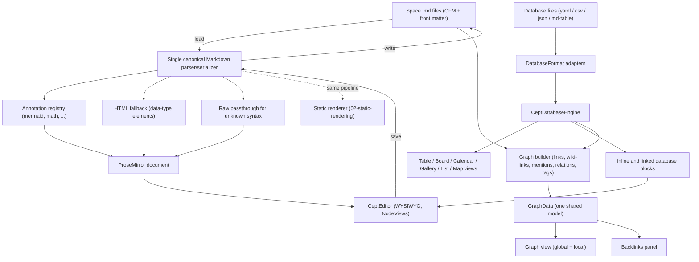
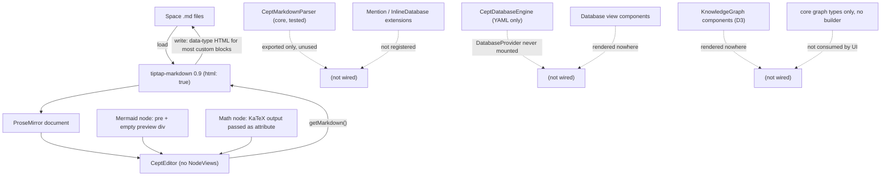

# Requirements: Editor, databases, markdown & graph

**Status:** Draft, 2026-10-06

This document sets out the requirements for Cept's editing experience: the WYSIWYG block editor, how page content is stored as Markdown (with GitHub Flavored Markdown, footnotes, fenced-code "annotation" plugins such as ` ```mermaid `, and an HTML fallback), the database engine and its views, and the Obsidian-style knowledge graph built from crosslinks between files. Each requirement is checked against the current code, open PRs, `TASKS.md` and the published docs. The audit found that the base editor is real and working. Most of the richer features (databases, graph, mentions, wiki-links, live mermaid, math) exist only as unwired components or tested pure logic, while several docs present them as finished.

**Related:**

- [Requirements index, architecture overview and traceability matrix](README.md)
- [01-browser-app-and-pwa.md](01-browser-app-and-pwa.md): the browser UI component that hosts the editor
- [02-static-rendering.md](02-static-rendering.md): static rendering, which must reuse this area's block pipeline
- [03-spaces-and-storage.md](03-spaces-and-storage.md): the StorageBackend that databases and the graph read through
- [04-collaboration.md](04-collaboration.md): CRDT co-editing of editor documents and databases
- [06-vscode-extension.md](06-vscode-extension.md): the VS Code extension, which embeds the same editor
- [10-engineering-and-ci.md](10-engineering-and-ci.md): test and CI requirements
- Source specs: [docs/SPECIFICATION.md](../../SPECIFICATION.md) §4 and §5, [docs/specs/markdown-parser.md](../markdown-parser.md), [docs/specs/database-engine.md](../database-engine.md), [docs/specs/knowledge-graph.md](../knowledge-graph.md)

## Scope and non-goals

**In scope**

- The TipTap/ProseMirror WYSIWYG editor, its custom blocks, slash menu and inline mentions.
- The Markdown storage format: GFM, footnotes, fenced-code annotation plugins (mermaid, math), the HTML fallback, and preserving content the editor does not understand.
- The database engine (schema, rows, filter, sort, group, formulas, relations, rollups), database storage formats, database views, and inline and linked databases (Phase 2, D-26, D-36; not shipped in Phase 1).
- Crosslinks (standard GFM markdown links and mentions; `[[wiki-links]]` are out of scope, D-32), the graph builder, the graph view and backlinks.
- Acceptance tests (Gherkin and E2E) for the above.

**Non-goals (covered elsewhere)**

- Storage backends, space roots and nesting: [03-spaces-and-storage.md](03-spaces-and-storage.md).
- Real-time co-editing transport and CRDT sync: [04-collaboration.md](04-collaboration.md).
- Static-site generation and publishing: [02-static-rendering.md](02-static-rendering.md). This document defines only the block pipeline that the static renderer must share.
- Import and export formats (Notion, Obsidian, ZIP), except where they produce editor content.
- A general third-party plugin SDK beyond the fenced-annotation registry (TASKS P7.7b and P7.7c).

## Requirements summary

| ID                                                                                               | Requirement                                                              | Priority | Impl status | Docs status            | Docs accurate |
| ------------------------------------------------------------------------------------------------ | ------------------------------------------------------------------------ | -------- | ----------- | ---------------------- | ------------- |
| [REQ-EDT-001](#req-edt-001--fully-wysiwyg-block-editor-in-the-app)                               | Fully WYSIWYG block editor in the app                                    | MUST     | implemented | documented-as-desired  | accurate      |
| [REQ-EDT-002](#req-edt-002--rich-custom-blocks-are-editable-in-wysiwyg-mode)                     | Rich custom blocks are editable in WYSIWYG mode                          | MUST     | partial     | documented-differently | stale         |
| [REQ-EDT-003](#req-edt-003--slash-menu-exposes-all-supported-blocks)                             | Slash menu exposes all supported blocks                                  | MUST     | partial     | documented-as-desired  | stale         |
| [REQ-EDT-004](#req-edt-004--inline-mentions-pagepersondate)                                      | Inline mentions (@page/@person/@date)                                    | SHOULD   | stubbed     | documented-as-desired  | stale         |
| [REQ-EDT-005](#req-edt-005--pages-persist-as-markdown-with-lossless-wysiwyg-round-trip)          | Pages persist as Markdown with lossless WYSIWYG round-trip               | MUST     | divergent   | documented-differently | stale         |
| [REQ-EDT-006](#req-edt-006--database-engine-crud-filter-sort-group-formula-relations-rollups)    | Database engine (CRUD, filter, sort, group, formula, relations, rollups) | MUST     | partial     | documented-as-desired  | stale         |
| [REQ-EDT-007](#req-edt-007--database-storage-in-multiple-formats)                                | Database storage in multiple formats                                     | MUST     | partial     | documented-differently | n/a           |
| [REQ-EDT-008](#req-edt-008--database-views-rendered-from-real-data)                              | Database views rendered from real data                                   | MUST     | stubbed     | documented-as-desired  | stale         |
| [REQ-EDT-009](#req-edt-009--inline-and-linked-database-blocks-in-pages)                          | Inline and linked database blocks in pages                               | SHOULD   | stubbed     | documented-as-desired  | stale         |
| [REQ-EDT-010](#req-edt-010--markdown-plugins-via-fenced-code-annotations)                        | Markdown plugins via fenced-code annotations                             | MUST     | divergent   | documented-as-desired  | stale         |
| [REQ-EDT-011](#req-edt-011--fenced-annotation-blocks-serialize-back-to-fenced-code)              | Fenced annotation blocks serialize back to fenced code                   | MUST     | divergent   | documented-differently | stale         |
| [REQ-EDT-012](#req-edt-012--math-rendering-block-and-inline)                                     | Math rendering (block and inline)                                        | SHOULD   | partial     | documented-as-desired  | stale         |
| [REQ-EDT-013](#req-edt-013--extensible-annotationplugin-registry)                                | Extensible annotation/plugin registry                                    | SHOULD   | not-started | documented-differently | n/a           |
| [REQ-EDT-014](#req-edt-014--github-flavored-markdown-core-syntax)                                | GitHub Flavored Markdown core syntax                                     | MUST     | partial     | documented-as-desired  | accurate      |
| [REQ-EDT-015](#req-edt-015--gfm-footnotes)                                                       | GFM footnotes                                                            | MUST     | not-started | undocumented           | n/a           |
| [REQ-EDT-016](#req-edt-016--footnotes-for-repeated-information)                                  | Footnotes for repeated information                                       | MUST     | not-started | undocumented           | n/a           |
| [REQ-EDT-017](#req-edt-017--wiki-link-crosslinks-between-files)                                  | `[[wiki-link]]` crosslinks between files                                 | MUST     | not-started | documented-as-desired  | stale         |
| [REQ-EDT-018](#req-edt-018--graph-builder-extracts-crosslinks-from-space-files)                  | Graph builder extracts crosslinks from space files                       | MUST     | not-started | documented-as-desired  | stale         |
| [REQ-EDT-019](#req-edt-019--browsable-obsidian-style-graph-view-in-the-app)                      | Browsable Obsidian-style graph view in the app                           | MUST     | stubbed     | documented-as-desired  | stale         |
| [REQ-EDT-020](#req-edt-020--single-consistent-graph-data-model)                                  | Single consistent graph data model                                       | SHOULD   | divergent   | documented-differently | stale         |
| [REQ-EDT-021](#req-edt-021--backlinks-panel)                                                     | Backlinks panel                                                          | SHOULD   | not-started | documented-as-desired  | accurate      |
| [REQ-EDT-022](#req-edt-022--html-fallback-for-blocks-with-no-markdown-representation)            | HTML fallback for blocks with no Markdown representation                 | MUST     | partial     | documented-as-desired  | accurate      |
| [REQ-EDT-023](#req-edt-023--unknown-raw-html-and-unsupported-syntax-preserved-without-data-loss) | Unknown/raw HTML and unsupported syntax preserved without data loss      | MUST     | partial     | undocumented           | n/a           |
| [REQ-EDT-024](#req-edt-024--toggle-block-encoding-is-gfm-compatible)                             | Toggle block encoding is GFM-compatible                                  | SHOULD   | divergent   | documented-differently | stale         |
| [REQ-EDT-025](#req-edt-025--editor-area-acceptance-tests-bound-and-running)                      | Editor-area acceptance tests bound and running                           | MUST     | partial     | documented-as-desired  | stale         |

Priority is MUST for items the owner named directly and for their direct prerequisites. Derived refinements are SHOULD.

## Architecture

### Required architecture



### Current state



## Requirements

### REQ-EDT-001 — Fully WYSIWYG block editor in the app

> **Scope: Phase 1 (D-26).**

**Statement:** The app MUST provide a WYSIWYG block editor (TipTap/ProseMirror) as the primary way to edit page content. Formatted output is edited in place, and no separate source view is required.

**Source:** handler ("fully wysiwyg").

**Acceptance criteria**

- Opening any writable page shows rendered formatting (headings, lists, tables, code) that can be edited in place.
- Read-only pages (for example the docs viewer) render through the same editor component with editing disabled.
- No source-mode toggle is needed to author any supported block.

**Current state:** implemented. [CeptEditor.tsx](../../../packages/ui/src/components/editor/CeptEditor.tsx) builds a TipTap editor with StarterKit plus the custom nodes. It is rendered at [App.tsx](../../../packages/ui/src/components/App.tsx) line 1432 (editable) and line 1324 (read-only docs). E2E coverage: [e2e/tests/slash-commands.spec.ts](../../../e2e/tests/slash-commands.spec.ts). TASKS T2.1-T2.8 are checked.

**Docs:** documented-as-desired and accurate: [SPECIFICATION.md](../../SPECIFICATION.md) §5.1, [guides/features.md](../../content/guides/features.md) "Block Editor", [reference/roadmap.md](../../content/reference/roadmap.md) lines 13-14.

**Gap:** None for the base editor. Sub-features are tracked below.

**Related:** [PR #37](https://github.com/nsheaps/cept/pull/37) (draft) adds a code-color-swatch extension to `CeptEditor.tsx`.

### REQ-EDT-002 — Rich custom blocks are editable in WYSIWYG mode

> **Scope: Phase 1 (D-26), except the inline database block, which is Phase 2 (D-26, D-36).** Mermaid, math, embed and bookmark editing are Phase 1; the inline-database part follows [REQ-EDT-009](#req-edt-009--inline-and-linked-database-blocks-in-pages).

**Statement:** Every custom block (mermaid, math, callout, embed, bookmark, columns, inline database) MUST be both rendered and editable in place, for example through NodeViews. Being insertable with default content is not enough.

**Source:** derived. It makes "fully wysiwyg" concrete.

**Acceptance criteria**

- After insertion, the source of each mermaid and math block can be edited, and the preview updates.
- Embed and bookmark URLs can be changed after insertion.
- An E2E test inserts each block, edits it, saves, reloads, and sees the edited content.

**Current state:** partial. No extension in [extensions/](../../../packages/ui/src/components/editor/extensions/index.ts) defines `addNodeView`. [mermaid.ts](../../../packages/ui/src/components/editor/extensions/mermaid.ts) and [math.ts](../../../packages/ui/src/components/editor/extensions/math.ts) are `atom: true` nodes whose content is set only on insert (the math default is `E = mc^2`). [callout.ts](../../../packages/ui/src/components/editor/extensions/callout.ts) and [columns.ts](../../../packages/ui/src/components/editor/extensions/columns.ts) hold editable child content.

**Docs:** documented-differently and stale. [SPECIFICATION.md](../../SPECIFICATION.md) §5.9 requires a ReactNodeViewRenderer with code, preview and split modes. [TASKS.md](../../../TASKS.md) T2.11 claims "live preview".

**Gap:** Implement NodeViews with an edit/preview toggle for mermaid, math, embed and bookmark. Add E2E tests for editing after insertion.

**Related:** TASKS P7.7c cites `mermaid.ts` as the canonical extension example.

### REQ-EDT-003 — Slash menu exposes all supported blocks

> **Scope: Phase 1 (D-26).** **Decided (D-36):** database entries are removed from the slash menu and UI in Phase 1 so nothing half-working ships (library code is left untouched); the `/database` entry returns with [REQ-EDT-009](#req-edt-009--inline-and-linked-database-blocks-in-pages) in Phase 2.

**Statement:** The `/` command menu MUST list every supported block type, including the inline database, with search and keyboard navigation.

**Source:** existing spec.

**Acceptance criteria**

- Every block type that has a node in the editor schema has a slash entry.
- Typing filters the list, and arrow keys plus Enter insert the selected block.
- The documented list of slash commands matches `defaultSlashCommands` exactly.

**Current state:** partial. [slash-command.ts](../../../packages/ui/src/components/editor/extensions/slash-command.ts) `defaultSlashCommands` has 20 entries: headings, lists, todo, code, quote, divider, callout, toggle, image, embed, bookmark, table, 2 and 3 columns, math, inline math and mermaid. There is no database entry. E2E coverage is in [slash-commands.spec.ts](../../../e2e/tests/slash-commands.spec.ts).

**Docs:** documented-as-desired but stale. [features.md](../../content/guides/features.md) line 47 lists `/database` (Inline Database), which does not exist. Line 13 lists `/text` for Paragraph, but there is no Paragraph entry: `filterSlashCommands` (slash-command.ts lines 211-222) matches title, description or category substrings, so `/text` matches the "Text" category (headings, lists) rather than a paragraph command. The documented `/heading1`, `/heading2` and `/heading3` (lines 14-16) do not substring-match the titles "Heading 1/2/3" (which contain a space), so those exact commands return no results.

**Gap:** Add `/database` once [REQ-EDT-009](#req-edt-009--inline-and-linked-database-blocks-in-pages) is wired, add a Paragraph/Text entry or search aliases, and correct the slash names in `features.md`.

**Related:** TASKS P3.11.

### REQ-EDT-004 — Inline mentions (@page/@person/@date)

> **Scope: Phase 1 for @page and @date mentions; @person mentions later (D-35, D-26).** Page mentions count as crosslinks for backlinks and the graph (D-32).

**Statement:** The editor SHOULD support inline mentions of pages and dates (Phase 1, D-35); @person mentions are later (D-26). Page mentions SHOULD count as crosslinks for the graph.

**Source:** existing spec ([SPECIFICATION.md](../../SPECIFICATION.md) §4.2, §5.1).

**Acceptance criteria**

- Typing `@` opens a suggestion list of pages, people and dates.
- An inserted mention survives save and reload, using a documented Markdown encoding.
- Page mentions appear as edges in the graph ([REQ-EDT-018](#req-edt-018--graph-builder-extracts-crosslinks-from-space-files)) and in backlinks.

**Current state:** stubbed. [mention.ts](../../../packages/ui/src/components/editor/extensions/mention.ts) defines PageMention, PersonMention and DateMention with unit tests, but `CeptEditor.tsx` does not register them. The core [parser.ts](../../../packages/core/src/markdown/parser.ts) handles `<!-- cept:mention -->` comments, but that parser is not wired into the app.

**Docs:** documented-as-desired but stale. TASKS T2.9 is checked, and [features.md](../../content/guides/features.md) presents mentions as available.

**Gap:** Register the extensions with suggestion sources, define the Markdown serialization, and add E2E tests.

**Related:** TASKS T2.9 (claimed done).

### REQ-EDT-005 — Pages persist as Markdown with lossless WYSIWYG round-trip

> **Scope: Phase 1 (D-33).** **Decided (D-14, D-15, D-33):** GFM, lossless round-trip and one Markdown pipeline are Phase 1.

**Statement:** Page content MUST be stored as Markdown with YAML front matter. Loading a file into the editor and saving it without edits MUST NOT lose or rewrite content beyond documented normalization.

**Source:** derived. This is a prerequisite for the storage-format and fallback requirements, and for CLAUDE.md rule 11 (opening a folder must not modify files).

**Acceptance criteria**

- Exactly one Markdown parser/serializer is used by the editor, the static renderer and the importers/exporters.
- There is a round-trip test (load, then save with no edits) for every block type and for a GFM corpus. The output equals the input, or a documented normalized form of it.
- Front matter is preserved byte-for-byte when it is not edited.

**Current state:** divergent. The app saves via tiptap-markdown `getMarkdown()` ([CeptEditor.tsx](../../../packages/ui/src/components/editor/CeptEditor.tsx) line 222, written at [App.tsx](../../../packages/ui/src/components/App.tsx) lines 737-744). The tested `CeptMarkdownParser` ([parser.ts](../../../packages/core/src/markdown/parser.ts), [parser.test.ts](../../../packages/core/src/markdown/parser.test.ts), TASKS P2.2) is only re-exported from [core/src/index.ts](../../../packages/core/src/index.ts) line 125 and is not used by the app. Two Markdown dialects therefore exist, and the one users actually hit has no round-trip tests in `packages/ui`.

**Docs:** documented-differently and stale. [markdown-parser.md](../markdown-parser.md) line 32 says the core parser is "Depended on by: editor, storage backends, search index". It is not used by the editor. [roadmap.md](../../content/reference/roadmap.md) line 42 marks "Markdown parser/serializer (roundtrip-safe)" as "Done", which is true only of the unused core parser. Concrete consequence: [toggle.ts](../../../packages/ui/src/components/editor/extensions/toggle.ts) line 151 leaves its Markdown `parse` hook empty with the comment "Toggle parsing handled by CeptMarkdownParser preprocessor", but that preprocessor never runs in the app (see [REQ-EDT-024](#req-edt-024--toggle-block-encoding-is-gfm-compatible)).

**Gap:** Choose one serializer: wire `CeptMarkdownParser` into the editor, or retire it and make tiptap-markdown canonical. Then add editor-level round-trip tests and update `markdown-parser.md`.

**Related:** TASKS P2.2.

### REQ-EDT-006 — Database engine (CRUD, filter, sort, group, formula, relations, rollups)

> **Scope: Phase 2 (D-26, D-36).** Databases are deferred; library code is left untouched and no database UI ships in Phase 1.

**Statement:** Cept MUST provide a database engine for databases stored in the space. It supports schema CRUD, row CRUD, filter, sort, group-by, formulas, relations and rollups.

**Source:** handler ("Database support").

**Acceptance criteria**

- The engine is reachable from the running app through a mounted provider, and it reads and writes through the active StorageBackend.
- Integration tests run the engine against every shipped backend (browser and local folder at minimum).
- The documented property-type list matches the model.

**Current state:** partial. [engine.ts](../../../packages/core/src/database/engine.ts), [formula.ts](../../../packages/core/src/database/formula.ts) and [relations.ts](../../../packages/core/src/database/relations.ts) are implemented and unit-tested. [DatabaseContext.tsx](../../../packages/ui/src/components/storage/DatabaseContext.tsx) defines `DatabaseProvider`, but it is only exported ([ui/src/index.ts](../../../packages/ui/src/index.ts) line 72) and never mounted. The model defines 20 property types ([models/index.ts](../../../packages/core/src/models/index.ts) lines 67-87).

**Docs:** documented-as-desired but stale. [database-engine.md](../database-engine.md) (Draft) FR-1 says "18 property types". [roadmap.md](../../content/reference/roadmap.md) line 50 marks database persistence ("DatabaseContext + CeptDatabaseEngine") "Done", although the provider is never mounted; line 58 ("Database engine (CRUD, filter, sort, group) Done") is accurate for the core engine alone, and line 59 says 18 types. [features.md](../../content/guides/features.md) line 141 says 18 types.

**Gap:** Mount `DatabaseProvider` in the app shell, validate the engine against real backends (TASKS P3.2), and reconcile the 18-type and 20-type counts.

**Related:** TASKS T1.5, T1.6, P2.5 (done); P3.2 (open).

### REQ-EDT-007 — Database storage in multiple formats

> **Scope: Phase 2 (D-26, D-36).** Databases are deferred; library code is left untouched and no database UI ships in Phase 1.

**Statement:** Database data MUST be storable in more than one on-disk format: at minimum the YAML schema-plus-rows format, plus at least one tabular interchange format (CSV, JSON, a Markdown table, or a folder of pages with per-row front matter). Each database MUST declare its format, and every format MUST round-trip through the engine.

**Source:** handler ("storage in multiple formats").

**Acceptance criteria**

- A `DatabaseFormat` adapter interface exists, with at least two implementations.
- Each database records its format in its metadata, and the engine selects the matching adapter.
- Round-trip tests exist per adapter (schema, rows, relations).
- Imported Notion CSVs become real databases, not raw text pages.

**Current state:** partial. YAML only: [engine.ts](../../../packages/core/src/database/engine.ts) line 204 hardcodes `.cept/databases/${id}.yaml`. There is no format abstraction and no sharding (SPEC §4.7). [notion-importer.ts](../../../packages/core/src/importers/notion-importer.ts) lines 320-333 flag CSVs as `isDatabase: true` but store the raw CSV text as page content.

**Docs:** documented-differently. [SPECIFICATION.md](../../SPECIFICATION.md) §4.3/§4.7, [database-engine.md](../database-engine.md) and [CLAUDE.md](../../../CLAUDE.md) rule 10 all specify YAML only.

**Gap:** Specify and implement the adapter interface, convert imported CSVs, and update SPEC §4.3, CLAUDE.md rule 10 and `database-engine.md`.

**Related:** [PR #24](https://github.com/nsheaps/cept/pull/24) (draft, space ZIP import/export) is adjacent. It has not been verified to touch databases.

### REQ-EDT-008 — Database views rendered from real data

> **Scope: Phase 2 (D-26, D-36).** Databases are deferred; library code is left untouched and no database UI ships in Phase 1.

**Statement:** Users MUST be able to open a database in the app and use Table, Board, Calendar, Gallery, List and Map views backed by engine data, with edits persisted.

**Source:** handler ("Database support"); [SPECIFICATION.md](../../SPECIFICATION.md) §4.5.

**Acceptance criteria**

- Databases are reachable from navigation (sidebar or route).
- Each of the six views renders engine rows, and edits made in the view persist to storage.
- The Map view shows a real map with markers for location properties.
- There is one E2E test per view.

**Current state:** stubbed. [DatabaseTableView.tsx](../../../packages/ui/src/components/database/DatabaseTableView.tsx), [DatabaseBoardView.tsx](../../../packages/ui/src/components/database/DatabaseBoardView.tsx), [DatabaseCalendarView.tsx](../../../packages/ui/src/components/database/DatabaseCalendarView.tsx), [DatabaseGalleryView.tsx](../../../packages/ui/src/components/database/DatabaseGalleryView.tsx), [DatabaseListView.tsx](../../../packages/ui/src/components/database/DatabaseListView.tsx), [DatabaseMapView.tsx](../../../packages/ui/src/components/database/DatabaseMapView.tsx) and [DatabaseSchemaEditor.tsx](../../../packages/ui/src/components/database/DatabaseSchemaEditor.tsx) are prop-driven components that are rendered nowhere. `App.tsx` has no database references. Leaflet is not integrated.

**Docs:** documented-as-desired but stale. [roadmap.md](../../content/reference/roadmap.md) lines 58-67 mark all views "Done". [README.md](../../../README.md) lines 22-23, [features.md](../../content/guides/features.md) lines 128-141, [vs-notion.md](../../content/comparison/vs-notion.md) line 15 and [vs-obsidian.md](../../content/comparison/vs-obsidian.md) lines 15 and 30 present them as available. TASKS T4.1-T4.12 are checked, while P3.1-P3.10 are open.

**Gap:** Add navigation (P3.1), wire each view to the engine (P3.3-P3.8), verify the property editors (P3.9), and mark the docs "Planned" until this is done.

**Related:** TASKS P3.1-P3.10.

### REQ-EDT-009 — Inline and linked database blocks in pages

> **Scope: Phase 2 (D-26, D-36).** Databases are deferred; library code is left untouched and no database UI ships in Phase 1.

**Statement:** A page SHOULD be able to embed a database inline, or a linked view of an existing database with its own filter and sort. The embed SHOULD be persisted in the page file and SHOULD render live data.

**Source:** [SPECIFICATION.md](../../SPECIFICATION.md) §5.1; derived from "Database support".

**Acceptance criteria**

- `/database` inserts an inline database, and a linked-view command references an existing one.
- The block's Markdown encoding is documented and round-trips.
- Edits made in the embedded view persist to the database's storage.

**Current state:** stubbed. [inline-database.ts](../../../packages/ui/src/components/editor/extensions/inline-database.ts) renders a header plus an empty body and is not registered in `CeptEditor.tsx`. [LinkedDatabaseView.tsx](../../../packages/ui/src/components/database/LinkedDatabaseView.tsx) is unused. The core parser handles `<!-- cept:database -->` but is not wired.

**Docs:** documented-as-desired but stale. TASKS T4.8 and T4.9 are checked, and [features.md](../../content/guides/features.md) line 47 lists `/database`.

**Gap:** Register the extension, render it through React NodeViews bound to the engine, define the encoding, and add the slash command and E2E tests.

**Related:** TASKS P3.11, P3.12.

### REQ-EDT-010 — Markdown plugins via fenced-code annotations

> **Scope: Phase 1 (D-33).** **Decided (D-33):** mermaid must render as it does on GitHub and is the first fenced-block plugin; a ` ```graph ` block may be the second ([REQ-EDT-019](#req-edt-019--browsable-obsidian-style-graph-view-in-the-app)).

**Statement:** A fenced code block whose info string names a registered renderer (for example ` ```mermaid ` or ` ```math `) MUST be parsed into the matching rich block on load and rendered live. Unknown info strings MUST remain ordinary syntax-highlighted code blocks.

**Source:** handler ("markdown plugins via ` ```mermaid ` sort of annotations").

**Acceptance criteria**

- Loading a file that contains a ` ```mermaid ` fence shows a rendered diagram (an SVG is present in the DOM).
- Loading ` ```math ` shows KaTeX output.
- A fence such as ` ```python ` stays a highlighted code block.
- E2E tests load these blocks from Markdown, not only through slash insertion.

**Current state:** divergent. [mermaid.ts](../../../packages/ui/src/components/editor/extensions/mermaid.ts) parses only `div[data-type="mermaid"]` (lines 116-122), so a loaded fence becomes a CodeBlockLowlight node. The `mermaid` package is a root dependency in [package.json](../../../package.json) but is never imported, and the preview div is empty (lines 124-136). The unused core parser does map ` ```mermaid ` to a mermaid block. Nothing handles ` ```math `.

**Docs:** documented-as-desired but stale. [markdown-extensions.md](../../content/guides/markdown-extensions.md) says mermaid uses fenced blocks, which is not true on load. TASKS T2.11 and [README.md](../../../README.md) line 25 claim live preview, 20+ diagram types and SVG/PNG export.

**Gap:** Add a parse hook that maps `pre > code.language-<x>` to registered annotation nodes, integrate `mermaid.render()` and KaTeX, and add load-from-Markdown E2E tests.

**Related:** TASKS T2.11 (claimed done), P7.7b, P7.7c. [PR #67](https://github.com/nsheaps/cept/pull/67) adds `docs-loader.ts`, which clones `docs/content/` into a real docs space, so Markdown docs with ` ```mermaid ` fences (for example `markdown-extensions.md` line 51) will load through this path and show as plain code blocks until this requirement is met.

### REQ-EDT-011 — Fenced annotation blocks serialize back to fenced code

> **Scope: Phase 1 (D-33).**

**Statement:** On save, annotation blocks (mermaid, math and others) MUST serialize back to a fenced code block with the same info string, so the files still render on GitHub.

**Source:** derived. It is the round-trip half of [REQ-EDT-010](#req-edt-010--markdown-plugins-via-fenced-code-annotations).

**Acceptance criteria**

- Loading a ` ```mermaid ` fence and saving it without edits produces an identical fence.
- No `data-type` HTML is emitted for annotation blocks.

**Current state:** divergent. Only [toggle.ts](../../../packages/ui/src/components/editor/extensions/toggle.ts) (line 121) and [image.ts](../../../packages/ui/src/components/editor/extensions/image.ts) (line 126) define Markdown serializers. With `html: true`, tiptap-markdown most likely emits `<div data-type="mermaid" ...>` for mermaid and math. This is inferred from library behaviour and was not verified at runtime because `node_modules` is absent. The core parser instead wraps the fence in a `cept:block` comment.

**Docs:** documented-differently and stale. SPEC §5.9, `markdown-extensions.md` and the code give three different answers.

**Gap:** Decide the canonical encoding (a plain fence, per the handler), implement serializers and round-trip tests, and update SPEC §5.9.

**Related:** none.

### REQ-EDT-012 — Math rendering (block and inline)

> **Scope: Phase 1 (D-33).** Math is part of the Phase 1 GFM-plus-math pipeline.

**Statement:** Math SHOULD render via KaTeX in the editor, and Markdown SHOULD accept `$$...$$`, `$...$` and/or ` ```math ` in both directions (load and save).

**Source:** derived (an annotation plugin example); [SPECIFICATION.md](../../SPECIFICATION.md) §5.1.

**Acceptance criteria**

- An inserted or loaded formula produces a `.katex` element, and KaTeX CSS is loaded.
- `$$x$$` and `$x$` round-trip.
- The E2E test asserts the `.katex` output, not just the container.

**Current state:** partial. [math.ts](../../../packages/ui/src/components/editor/extensions/math.ts) calls `katex.renderToString`, but passes the result as `{ innerHTML }` inside a ProseMirror DOMOutputSpec. ProseMirror treats that as an attribute, so the math most likely does not display (unverified at runtime). No KaTeX stylesheet is imported, and there is no `$` syntax support. The E2E test only checks that `.cept-math-block` is visible ([slash-commands.spec.ts](../../../e2e/tests/slash-commands.spec.ts) lines 294-316).

**Docs:** documented-as-desired but stale. [markdown-extensions.md](../../content/guides/markdown-extensions.md) and [docs-content.ts](../../../packages/ui/src/components/docs/docs-content.ts) line 851 document `$$E = mc^2$$` and `$a^2$`.

**Gap:** Inject the KaTeX HTML through a NodeView, import the CSS, add `$` input and Markdown rules, and strengthen the E2E test.

**Related:** TASKS T2.10.

### REQ-EDT-013 — Extensible annotation/plugin registry

> **Scope: Phase 1 for the internal plugin interface (D-33); a third-party plugin registry is later (D-33, D-26).** **Decided (D-33):** the interface is internal to Cept; mermaid is the first plugin and ` ```graph ` may be the second.

**Statement:** Annotation renderers SHOULD be registered through an internal plugin interface (Phase 1, D-33; a third-party plugin registry is later), so new ` ```<lang> ` renderers can be added without modifying core editor code.

**Source:** derived from the handler's "markdown plugins".

**Acceptance criteria**

- There is a registry interface with an info-string match, parse, render (editor and static) and serialize.
- Mermaid and math are implemented on the registry.
- A test registers a dummy renderer and proves the load, render and save round-trip.

**Current state:** not-started. Extensions are hardcoded in the `CeptEditor.tsx` extensions array.

**Docs:** documented-differently. TASKS P7.7b and P7.7c describe a broader plugin SDK. [roadmap.md](../../content/reference/roadmap.md) does not describe a fenced-annotation registry.

**Gap:** Specify the interface and move mermaid and math onto it. The static renderer ([02-static-rendering.md](02-static-rendering.md)) consumes the same registry.

**Related:** TASKS P7.7b, P7.7c.

### REQ-EDT-014 — GitHub Flavored Markdown core syntax

> **Scope: Phase 1 (D-33).**

**Statement:** The editor and storage MUST support GFM: tables, task lists, strikethrough, autolinks, and fenced code with a language.

**Source:** handler ("github flavored markdown").

**Acceptance criteria**

- Each GFM construct renders WYSIWYG and round-trips (see [REQ-EDT-005](#req-edt-005--pages-persist-as-markdown-with-lossless-wysiwyg-round-trip)).
- Bare URLs in loaded Markdown render as links, and the autolink-while-typing behaviour is an explicit, documented choice.

**Current state:** partial. `CeptEditor.tsx` registers StarterKit (strike), TaskList/TaskItem, Table, CodeBlockLowlight and tiptap-markdown 0.9.0 (`Markdown.configure` at lines 210-214 sets `html`, `transformPastedText` and `transformCopiedText` only). The core parser uses remark-gfm, but it is not wired into the app ([REQ-EDT-005](#req-edt-005--pages-persist-as-markdown-with-lossless-wysiwyg-round-trip)). Table E2E coverage (slash insertion only) is in [slash-commands.spec.ts](../../../e2e/tests/slash-commands.spec.ts) from line 318. Link `autolink: false` is set (CeptEditor.tsx line 111), so URLs are not autolinked while typing, and `linkify` is not enabled on tiptap-markdown, so GFM bare-URL autolinks in loaded Markdown most likely stay plain text (inferred from the library default; not verified at runtime because `node_modules` is absent). There are no load-from-Markdown or round-trip tests for any GFM construct in `packages/ui`.

**Docs:** documented-as-desired and accurate: [markdown-extensions.md](../../content/guides/markdown-extensions.md), [.claude/rules/content-formatting.md](../../../.claude/rules/content-formatting.md).

**Gap:** Enable GFM autolinks on load (tiptap-markdown `linkify`) or document the exception, confirm that disabling autolink while typing is intended, and add editor-level GFM load and round-trip tests.

**Related:** none.

### REQ-EDT-015 — GFM footnotes

> **Scope: Phase 1 (D-33).**

**Statement:** The editor MUST support GFM footnotes: `[^id]` references and `[^id]:` definitions. They render WYSIWYG and round-trip in Markdown.

**Source:** handler ("can use footnotes").

**Acceptance criteria**

- A loaded file with footnotes shows superscript references and a footnote list.
- Users can insert a footnote from the editor (slash command or shortcut).
- Footnotes round-trip unchanged.

**Current state:** not-started. A case-insensitive grep for "footnote" across packages, docs, e2e and features returns nothing. The core parser's remark-gfm produces footnote nodes, but `convertNode`'s default case returns `null`, so footnote definitions are dropped.

**Docs:** undocumented.

**Gap:** Add a footnote reference/definition node pair with parse and serialize support (for example markdown-it-footnote), plus spec and docs.

**Related:** none.

### REQ-EDT-016 — Footnotes for repeated information

> **Scope: Phase 1 (D-33).** Per D-26, synced blocks are later, so repeated information in Phase 1 is covered by footnotes only.

**Statement:** A single footnote definition MUST be referenceable multiple times in a page, so repeated information is stated once. Editing the definition MUST update every reference.

**Source:** handler ("use footnotes for repeated info").

**Acceptance criteria**

- Two `[^a]` references share one definition and render the same number.
- The rendered footnote list shows a back-reference to each use.
- Editing the definition is reflected at every reference without further edits.

**Current state:** not-started. There is no footnote support. A related "synced block" exists only as a serialize case in the core parser, with no editor extension.

**Docs:** undocumented. SPEC §5.1 mentions synced blocks but not footnote reuse.

**Gap:** Specify the reuse semantics and decide how footnotes relate to synced blocks.

**Related:** none.

### REQ-EDT-017 — `[[wiki-link]]` crosslinks between files

> **Status: out of scope (D-32).** `[[wiki-links]]` are not supported. Crosslinks use standard GFM links (`[link text](https://example.com)` syntax, with a relative path to the target page) only. Backlinks, search and the graph are derived from standard links.

**Statement:** ~~The editor MUST support `[[Page]]` and `[[path|alias]]` crosslinks.~~ Out of scope (D-32): crosslinks use standard GFM links (`[link text](https://example.com)` syntax, with a relative path to the target page) only, and the editor offers page-link autocomplete that inserts such links. Links render as navigable links, persist in Markdown, and resolve to space files.

**Source:** derived. It is a prerequisite for "graph with crosslinks of files ... like obsidian".

**Acceptance criteria**

- Typing `[[` offers page suggestions, and the chosen link navigates on click.
- Unresolved targets are visibly marked, and creating the target page resolves them.
- Wiki-links from imported Obsidian and Notion content render as links.
- Resolution rules across nested space roots are defined ([03-spaces-and-storage.md](03-spaces-and-storage.md#req-ws-005--nested-spaces-inside-a-parent-space-deferred)).

**Current state:** not-started. Neither `packages/ui/src` nor `core/src/markdown` handles `[[`. The importers emit `[[...]]` ([obsidian-importer.ts](../../../packages/core/src/importers/obsidian-importer.ts) lines 152-176, [notion-importer.ts](../../../packages/core/src/importers/notion-importer.ts) lines 147-153), and [exporter.ts](../../../packages/core/src/exporters/exporter.ts) line 75 converts them back. Imported pages therefore show wiki-links as plain text.

**Docs:** documented-as-desired but stale. [roadmap.md](../../content/reference/roadmap.md) line 79 marks wiki-links "Done".

**Gap:** Implement a wiki-link inline node (input rule, suggestion, parse and serialize) and a resolver, then fix `roadmap.md`.

**Related:** TASKS P4.4.

### REQ-EDT-018 — Graph builder extracts crosslinks from space files

> **Scope: Phase 1 (D-32).** **Decided (D-32):** edges are extracted from standard GFM links (not `[[wiki-links]]`), page mentions, and the other kinds that remain applicable. Database relations are Phase 2 (D-26).

**Statement:** A graph builder MUST scan all space pages and extract edges from standard Markdown links, mentions, database relations (Phase 2) and shared tags (wiki-links are out of scope, D-32). It MUST include unresolved targets and produce `GraphData`.

**Source:** handler ("graph with crosslinks of files").

**Acceptance criteria**

- Given a fixture space, the builder returns the expected nodes and edges for each link kind, including unresolved nodes.
- The builder reads through StorageBackend and updates incrementally when a page is saved.
- It runs off the main thread for large spaces (Web Worker), with a benchmark test.

**Current state:** not-started. [core/src/graph/index.ts](../../../packages/core/src/graph/index.ts) contains only types. [graph-types.ts](../../../packages/ui/src/components/knowledge-graph/graph-types.ts) line 31 `buildGraphData()` takes precomputed links. Nothing parses page content.

**Docs:** documented-as-desired but stale. SPEC §5.8 describes a builder that scans all pages. [knowledge-graph.md](../knowledge-graph.md) lists MarkdownParser as a dependency. [features.md](../../content/guides/features.md) presents the graph as available.

**Gap:** Implement the builder in core, with tests.

**Related:** TASKS P4.1.

### REQ-EDT-019 — Browsable Obsidian-style graph view in the app

> **Scope: Phase 1 (D-32).** **Decided (D-32, D-33):** the graph view may be delivered as a fenced ` ```graph ` block plugin built on the internal plugin interface ([REQ-EDT-013](#req-edt-013--extensible-annotationplugin-registry)).

**Statement:** The app MUST expose a graph view, reachable from navigation, in two modes: global, and local with a depth of 1-5. It MUST support pan/zoom, click-to-navigate, hover preview, filters (search, tags, orphans, attachments, exclusions), color groups and time-lapse.

**Source:** handler ("browseable like the obsidian one").

**Acceptance criteria**

- A sidebar or command-palette entry opens the global graph, populated by the builder.
- Clicking a node opens the page. The local graph follows the active page.
- Each filter has a test, and E2E covers opening the graph and navigating from it.
- The Gherkin steps for `global-graph.feature` are bound and pass.

**Current state:** stubbed. [KnowledgeGraph.tsx](../../../packages/ui/src/components/knowledge-graph/KnowledgeGraph.tsx) (D3 force simulation, zoom, drag, click), [KnowledgeGraphView.tsx](../../../packages/ui/src/components/knowledge-graph/KnowledgeGraphView.tsx) and [GraphAnimationPlayer.tsx](../../../packages/ui/src/components/knowledge-graph/GraphAnimationPlayer.tsx) are unit-tested but only exported ([ui/src/index.ts](../../../packages/ui/src/index.ts) lines 26-35). `App.tsx` has no graph references. [global-graph.feature](../../../features/graph/global-graph.feature) has no step definitions.

**Docs:** documented-as-desired but stale. [roadmap.md](../../content/reference/roadmap.md) lines 75-76 say "Done". [README.md](../../../README.md) line 24, [features.md](../../content/guides/features.md) lines 118-126, [vs-notion.md](../../content/comparison/vs-notion.md) lines 21 and 38-39, and [vs-obsidian.md](../../content/comparison/vs-obsidian.md) line 16 present it as built in. TASKS T3.9-T3.12 are checked, while P4.2, P4.5 and P4.6 are open.

**Gap:** Wire the view into the app shell with builder data, add local-graph follow and hover preview, bind the steps, add E2E, and correct the docs until then.

**Related:** TASKS P4.2, P4.5, P4.6.

### REQ-EDT-020 — Single consistent graph data model

> **Scope: Phase 1 (D-32).**

**Statement:** Core and UI SHOULD share one graph data model (node and edge types), so the builder's output feeds the view directly.

**Source:** derived.

**Acceptance criteria**

- The UI graph components import their types from `@cept/core`.
- Node types (page, tag, attachment, unresolved) and edge types (link, mention, tag, relation) are rendered distinctly.

**Current state:** divergent. Core `GraphData` is `{nodes, edges}` with edge types `link|mention|tag|relation` and node types `page|tag|attachment|unresolved`. UI `GraphData` is `{nodes, links}` with link types `parent|mention|backlink` and no node type ([graph-types.ts](../../../packages/ui/src/components/knowledge-graph/graph-types.ts) lines 1-21).

**Docs:** documented-differently and stale. SPEC §5.8 and [knowledge-graph.md](../knowledge-graph.md) define only the core model.

**Gap:** Unify on the core model, or document a mapping.

**Related:** none.

### REQ-EDT-021 — Backlinks panel

> **Scope: Phase 1 (D-32).** Backlinks are derived from standard GFM links.

**Statement:** Each page SHOULD show its backlinks (the pages that link to it), derived from the same crosslink index as the graph.

**Source:** derived (Obsidian-like crosslink browsing).

**Acceptance criteria**

- The panel lists linking pages, with context snippets, and updates after a save.
- Unlinked mentions are optional and SHOULD be listed separately.

**Current state:** not-started. There is no backlinks UI.

**Docs:** documented-as-desired and accurate. [roadmap.md](../../content/reference/roadmap.md) line 80 says "Planned". SPEC §5.8 item 4.

**Gap:** Build the panel on top of [REQ-EDT-018](#req-edt-018--graph-builder-extracts-crosslinks-from-space-files).

**Related:** TASKS P4.3.

### REQ-EDT-022 — HTML fallback for blocks with no Markdown representation

> **Scope: Phase 1 (D-33).**

**Statement:** When a block has no Markdown/GFM representation, it MUST be persisted as HTML (semantic elements with `data-type` attributes) and parsed back into the same block on load.

**Source:** handler ("Fallback to HTML where support doesn't exist for storage").

**Acceptance criteria**

- Callout, embed, bookmark and columns each round-trip through the save path as `data-type` HTML.
- The fallback is used only when no Markdown, GFM or annotation encoding exists.

**Current state:** partial, implemented de facto. `Markdown.configure({html: true})` ([CeptEditor.tsx](../../../packages/ui/src/components/editor/CeptEditor.tsx) lines 210-211) is combined with `parseHTML` rules for `div[data-type=callout]`, `figure[data-type=embed]`, `figure[data-type=image]`, `aside[data-type=bookmark]`, `div[data-type=columns]`, `div[data-type=math-block]`, `span[data-type=inline-math]`, `div[data-type=mermaid]` and `details[data-type=toggle]`. Demo content in [App.tsx](../../../packages/ui/src/components/App.tsx) lines 1559-1724 is authored in this HTML. There are no automated round-trip tests through `getMarkdown()`. The unused core parser uses `cept:block` comments instead and drops non-cept HTML.

**Docs:** documented-as-desired and accurate: [markdown-extensions.md](../../content/guides/markdown-extensions.md) "HTML as last resort" and [.claude/rules/content-formatting.md](../../../.claude/rules/content-formatting.md). Both conflict with SPEC §4.2 and CLAUDE.md rule 9 (see [Conflicts](#conflicts-and-open-questions)).

**Gap:** Add round-trip tests per fallback block, retire or align the core comment format, and update SPEC §4.2 and CLAUDE.md rule 9.

**Related:** none.

### REQ-EDT-023 — Unknown raw HTML and unsupported syntax preserved without data loss

> **Scope: Phase 1 (D-33).**

**Statement:** Opening and saving a file MUST preserve Markdown or HTML that the editor does not understand (raw HTML, footnotes until supported, unknown `cept` comments), for example by keeping it as an opaque raw block.

**Source:** derived from the fallback requirement and [CLAUDE.md](../../../CLAUDE.md) rule 11.

**Acceptance criteria**

- A corpus of unsupported constructs survives load and save byte-for-byte.
- Raw blocks are visible in the editor, and they are editable as source or at least deletable.

**Current state:** partial. The ProseMirror schema discards HTML elements that have no parse rule (TipTap default; not tested here). The core parser returns `null` for footnotes and for non-cept HTML. There is no raw passthrough node.

**Docs:** undocumented.

**Gap:** Add a raw passthrough node and data-loss regression tests.

**Related:** none.

### REQ-EDT-024 — Toggle block encoding is GFM-compatible

> **Scope: Phase 1 (D-33).**

**Statement:** Toggle blocks SHOULD have a storage encoding that renders sensibly on GitHub and in other Markdown renderers (for example a `<details>`/`<summary>` HTML fallback), and SHOULD NOT be confused with blockquotes.

**Source:** derived (GFM plus the HTML fallback).

**Acceptance criteria**

- A saved toggle renders as collapsible content on GitHub.
- A blockquote is never loaded as a toggle, and a toggle is never loaded as a blockquote, in round-trip tests.

**Current state:** divergent, and lossy in the running app. [toggle.ts](../../../packages/ui/src/components/editor/extensions/toggle.ts) lines 121-148 serialize as `> summary` followed by 2-space-indented content, which standard GFM renders as a blockquote. On load the editor only recognises `details[data-type="toggle"]` (line 67); the Markdown `parse` hook is empty (lines 150-152) and defers to the `CeptMarkdownParser` toggle preprocessor ([parser.ts](../../../packages/core/src/markdown/parser.ts) line 110), which the app never calls. So a toggle created in the editor and saved most likely reloads as a blockquote (inferred from the code; not verified at runtime). The demo content works only because it is authored as `<details data-type="toggle">` HTML ([App.tsx](../../../packages/ui/src/components/App.tsx) lines 1645-1649). The E2E toggle check in [feature-screenshots.spec.ts](../../../e2e/tests/feature-screenshots.spec.ts) lines 86-101 is guarded by `if (toggleCount > 0)` and would pass with no toggles.

**Docs:** documented-differently and stale. [toggle-syntax.md](../../content/guides/toggle-syntax.md) documents the `>` syntax and says "These are all covered by automated tests", but those tests exercise only the unused core parser, not the editor. [features.md](../../content/guides/features.md) lines 53-68 author real toggles in this syntax, which will load as blockquotes once [PR #67](https://github.com/nsheaps/cept/pull/67) loads `docs/content/` as a space. SPEC §4.2 specifies a `cept:block` comment instead.

**Gap:** Decide the canonical encoding (the `<details>` HTML the parser already accepts is the GFM-compatible option), make load and save agree, add an editor round-trip test, then update SPEC, docs and the serializer.

**Related:** none.

### REQ-EDT-025 — Editor-area acceptance tests bound and running

> **Scope: Phase 1 (D-26).** Binding and running steps for database features is Phase 2 (D-26, D-36); wiki-link load and round-trip tests are dropped (D-32).

**Statement:** The Gherkin features for the editor, databases and the graph MUST have bound step definitions that run in CI, and E2E tests MUST cover load-from-Markdown rendering for annotation blocks.

**Source:** derived (validation of the requirements above).

**Acceptance criteria**

- Every `.feature` file under `features/` for this area has bound steps that run in CI.
- Load and round-trip E2E tests exist for mermaid, math, callout and wiki-links.

**Current state:** partial. [slash-commands.feature](../../../features/editor/slash-commands.feature), [table-view.feature](../../../features/database/table-view.feature) and [global-graph.feature](../../../features/graph/global-graph.feature) exist, but the only step file is [example.steps.ts](../../../features/step-definitions/example.steps.ts), which binds only `features/example.feature`. [vitest.config.ts](../../../vitest.config.ts) line 41 includes the step-definitions directory. E2E covers only that blocks are visible after slash insertion (the mermaid test at [slash-commands.spec.ts](../../../e2e/tests/slash-commands.spec.ts) lines 336-341 checks `.cept-mermaid`, not an SVG), plus demo pages authored in `data-type` HTML. [ci.yml](../../../.github/workflows/ci.yml) lines 20-27 call the unit, integration and E2E workflows.

**Docs:** documented-as-desired but stale. The "Test Plan" sections of [database-engine.md](../database-engine.md) and [knowledge-graph.md](../knowledge-graph.md) cite these features as active, and `local-graph.feature` and `graph-filters.feature` do not exist.

**Gap:** Write the step definitions and add markdown-load and round-trip E2E tests. See [10-engineering-and-ci.md](10-engineering-and-ci.md).

**Related:** none.

## Conflicts and open questions

Items marked **Decided** have owner direction recorded. Remaining items still need a decision.

1. **Canonical block encoding.** [SPECIFICATION.md](../../SPECIFICATION.md) §4.2 and [CLAUDE.md](../../../CLAUDE.md) rule 9 require `<!-- cept:block {...} -->` comments. [markdown-extensions.md](../../content/guides/markdown-extensions.md) and [content-formatting.md](../../../.claude/rules/content-formatting.md) specify `data-type` HTML elements. The running editor emits `data-type` HTML, and the unused core parser emits comments. The handler's "Fallback to HTML" matches the docs and the running editor. **Proposal:** adopt GFM, then fenced annotations, then `data-type` HTML, and retire `cept:block` comments (keeping a reader for migration).
2. **Answered (D-33).** **Mermaid and math encoding.** SPEC §5.9 says to wrap the fence in a `cept:block` comment. The docs say a plain fence. The code likely emits a `data-type` div and cannot parse a fence. The handler wants fence-style annotations.
3. **Toggle encoding.** SPEC §4.2 uses a comment. The editor and [toggle-syntax.md](../../content/guides/toggle-syntax.md) use `> summary` with indented content, which GFM renders as a blockquote. Should toggles use `<details>`?
4. **Answered in part (D-33):** one pipeline is Phase 1 (D-14, D-15). **One Markdown implementation.** Keep tiptap-markdown, or wire `CeptMarkdownParser` in? Today [markdown-parser.md](../markdown-parser.md) and TASKS P2.2 describe a parser the app does not use.
5. **Two graph data models.** Core (`edges`, link/mention/tag/relation) and UI (`links`, parent/mention/backlink) differ. Should the UI unify on core?
6. **Deferred (D-26, D-36):** databases are Phase 2. **Database storage formats.** The handler requires multiple formats, but SPEC §4.3, [database-engine.md](../database-engine.md) and CLAUDE.md rule 10 mandate YAML only. Which formats are required (CSV, JSON, Markdown table, folder of pages)?
7. **Property type count.** The docs say 18, and [models/index.ts](../../../packages/core/src/models/index.ts) defines 20 (adding files and location).
8. **TASKS.md contradiction.** T2.9, T2.11, T3.9-T3.12 and T4.1-T4.12 are checked, while P3.1-P3.12 and P4.1-P4.6 show the same features are not wired. Should the earlier items be unchecked or annotated "component only"?
9. **Terminology — Decided (D-1).** **Decided (D-1):** "space" is the canonical user-facing term throughout; the graph, database scope and wiki-link resolution are all per space; requirement IDs (REQ-WS-NNN) stay stable; protected code identifiers unchanged. See [REQ-WS-022](03-spaces-and-storage.md#req-ws-022--consistent-terminology-space-adopted-d-1).
10. **Answered (D-26, D-33):** synced blocks are later, so Phase 1 covers repeated info with footnotes only. **Footnote reuse vs synced blocks.** Should "repeated info" be covered only by footnotes, or also by synced/transcluded blocks?
11. **Autolinks.** `autolink: false` is set in the editor. Is that intended, given GFM autolinks?
12. **Docs rendering.** SPEC §11 describes `@cept/docs` as a Starlight/VitePress site, but [docs/package.json](../../package.json) only echoes. In-app docs render through `CeptEditor` (App.tsx line 1324), so the editor's limitations (`$$` math, mermaid fences) apply to the docs themselves.

## Stale documentation

These are the specific claims to fix, either by marking them "Planned/In progress" or by implementing the feature:

- [docs/content/reference/roadmap.md](../../content/reference/roadmap.md) lines 58-67: Table/Board/Calendar/Gallery/List/Map views, formulas and relations/rollups are marked "Done", but the views are unwired.
- [docs/content/reference/roadmap.md](../../content/reference/roadmap.md) lines 75-76: the knowledge graph (global and local) and graph filters are marked "Done", but nothing renders them and there is no builder.
- [docs/content/reference/roadmap.md](../../content/reference/roadmap.md) line 79: wiki-links are marked "Done", but they do not exist.
- [docs/content/reference/roadmap.md](../../content/reference/roadmap.md) line 14 marks "20+ block types (... math, mermaid, etc.)" Done, and [README.md](../../../README.md) line 25 claims "Mermaid diagram support (20+ diagram types with live preview)", but the `mermaid` library is never imported and math output most likely does not display.
- [docs/content/reference/roadmap.md](../../content/reference/roadmap.md) line 42: "Markdown parser/serializer (roundtrip-safe)" is marked Done, but the editor does not use that parser.
- [docs/content/reference/roadmap.md](../../content/reference/roadmap.md) and the in-app roadmap in [docs-content.ts](../../../packages/ui/src/components/docs/docs-content.ts) (Phase 3 and 4 tables, around lines 655-672) disagree: the former marks databases, graph and wiki-links "Done", the latter "Planned". The in-app version is closer to the truth for this area.
- [docs/content/guides/markdown-extensions.md](../../content/guides/markdown-extensions.md) "Mermaid Diagrams": the claimed fence syntax loads as a plain code block.
- [docs/content/guides/markdown-extensions.md](../../content/guides/markdown-extensions.md) "Math Equations" and [docs-content.ts](../../../packages/ui/src/components/docs/docs-content.ts) line 851: the `$$`/`$` syntax is not parsed.
- [docs/content/guides/features.md](../../content/guides/features.md) line 47: the `/database` slash command does not exist; lines 13-16: `/text` and `/heading1`-`/heading3` do not match any command as written.
- [docs/content/guides/toggle-syntax.md](../../content/guides/toggle-syntax.md): "covered by automated tests" refers to the core parser, not the editor, which cannot load this syntax.
- [docs/content/guides/features.md](../../content/guides/features.md) lines 118-141: the graph and database sections present the features as available, and line 141 says 18 property types (the model has 20).
- [README.md](../../../README.md) lines 22-25: databases (6 views, 18 types), the knowledge graph and mermaid live preview are listed as features.
- [docs/content/comparison/vs-notion.md](../../content/comparison/vs-notion.md) lines 15, 21 and 38-39, and [docs/content/comparison/vs-obsidian.md](../../content/comparison/vs-obsidian.md) lines 15-16 and 30-31: they claim built-in databases and a knowledge graph.
- [docs/specs/markdown-parser.md](../markdown-parser.md): "Depended on by: editor, storage backends, search index" is false for the editor.
- [docs/specs/knowledge-graph.md](../knowledge-graph.md) and [docs/specs/database-engine.md](../database-engine.md): the Test Plans cite unbound or non-existent feature files, FR-1 says 18 types, and both are still "Status: Draft".
- [TASKS.md](../../../TASKS.md): T2.9, T2.10, T2.11, T3.9-T3.12 and T4.1-T4.12 are checked but not functional in the running app.
- [SPECIFICATION.md](../../SPECIFICATION.md) §4.2, §4.3, §5.9 and [CLAUDE.md](../../../CLAUDE.md) rules 9 and 10: these must be updated once Conflicts 1, 2 and 6 are decided.

## Cross-area dependencies

- **Spaces and storage** ([03-spaces-and-storage.md](03-spaces-and-storage.md)): the database engine and graph builder read through StorageBackend per space ([REQ-WS-008](03-spaces-and-storage.md#req-ws-008--common-extensible-storagebackend-interface)). Nested spaces ([REQ-WS-005](03-spaces-and-storage.md#req-ws-005--nested-spaces-inside-a-parent-space-deferred), [REQ-WS-006](03-spaces-and-storage.md#req-ws-006--nesting-depth-limit-deferred)) need defined graph and database scope, and wiki-link resolution across roots marked by `space.cept.ya?ml` ([REQ-WS-002](03-spaces-and-storage.md#req-ws-002--spaceceptyaml--spaceceptyml-marks-the-space-root)). Database files live under `.cept/` ([REQ-WS-018](03-spaces-and-storage.md#req-ws-018--cept-metadata-directory-conventions)). Non-destructive open ([REQ-WS-019](03-spaces-and-storage.md#req-ws-019--opening-an-existing-folder-is-non-destructive)) depends on [REQ-EDT-005](#req-edt-005--pages-persist-as-markdown-with-lossless-wysiwyg-round-trip) and [REQ-EDT-023](#req-edt-023--unknown-raw-html-and-unsupported-syntax-preserved-without-data-loss).
- **Static rendering** ([02-static-rendering.md](02-static-rendering.md)): the static renderer must reuse this block and annotation pipeline ([REQ-SSG-003](02-static-rendering.md#req-ssg-003--full-block-fidelity-in-static-output), [REQ-SSG-004](02-static-rendering.md#req-ssg-004--static-rendering-shares-the-editors-rendering-pipeline)), including mermaid, KaTeX, footnotes, the HTML fallback and wiki-link resolution ([REQ-SSG-005](02-static-rendering.md#req-ssg-005--navigation-cross-links-and-deep-links-in-static-site)). Today [exporter.ts](../../../packages/core/src/exporters/exporter.ts) line 113 uses an ad-hoc regex `markdownToHtml` that handles none of them.
- **Browser component and VS Code extension** ([01-browser-app-and-pwa.md](01-browser-app-and-pwa.md#req-web-001--shared-browser-ui-component), [06-vscode-extension.md](06-vscode-extension.md)): both embed the same `CeptEditor` and serializer, so the decision in [REQ-EDT-005](#req-edt-005--pages-persist-as-markdown-with-lossless-wysiwyg-round-trip) applies to both.
- **Collaboration** ([04-collaboration.md](04-collaboration.md)): [database-sync.ts](../../../packages/core/src/crdt/database-sync.ts) imports the database engine ([REQ-COL-010](04-collaboration.md#req-col-010--real-time-sync-of-database-tableboard-changes)). CRDT text sync ([REQ-COL-002](04-collaboration.md#req-col-002--crdt-based-reconciliation-of-text-edits-yjs)) depends on the canonical ProseMirror schema and Markdown encoding chosen here.
- **CLI** ([05-cli-and-daemon.md](05-cli-and-daemon.md)): the static render command needs the same parser and annotation registry ([REQ-EDT-013](#req-edt-013--extensible-annotationplugin-registry)).
- **Import/export:** the Notion and Obsidian importers emit `[[wiki-links]]` and raw CSV "databases" that the editor and engine cannot consume yet ([REQ-EDT-007](#req-edt-007--database-storage-in-multiple-formats), [REQ-EDT-017](#req-edt-017--wiki-link-crosslinks-between-files)). [PR #24](https://github.com/nsheaps/cept/pull/24) may interact.
- **Docs and demo space** ([01-browser-app-and-pwa.md](01-browser-app-and-pwa.md#req-web-012--demo-space-uses-in-memory-file-storage), [REQ-SSG-016](02-static-rendering.md#req-ssg-016--single-source-of-truth-for-docs-content)): in-app docs ([docs-content.ts](../../../packages/ui/src/components/docs/docs-content.ts)) and demo content (App.tsx lines 1559-1724) are authored in `data-type` HTML and rendered by `CeptEditor`, so any change to the encoding must migrate them.
- **Remotes and auth** ([09-remotes-and-auth.md](09-remotes-and-auth.md)): no direct dependency. Remote spaces supply the pages that the graph indexes.
- **Engineering and CI** ([10-engineering-and-ci.md](10-engineering-and-ci.md)): the Gherkin steps and E2E tests for [REQ-EDT-025](#req-edt-025--editor-area-acceptance-tests-bound-and-running), and test scoping with `nx affected` across `ui` and `core`.
- **Plugin SDK** (TASKS P7.7b, P7.7c): [REQ-EDT-013](#req-edt-013--extensible-annotationplugin-registry) is the editor half of that work.
