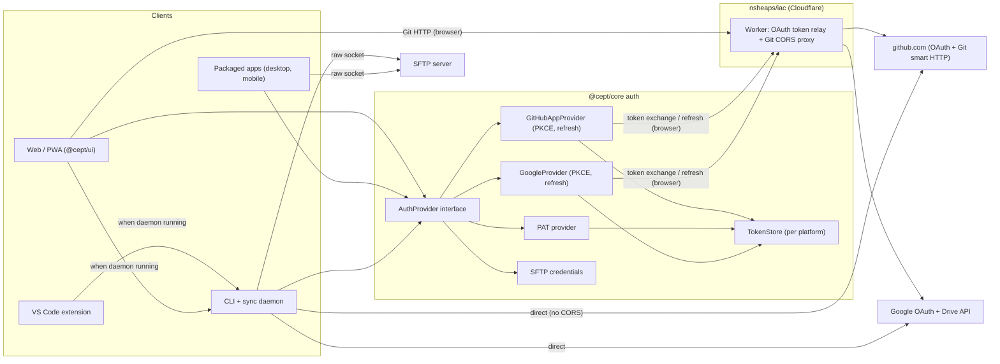
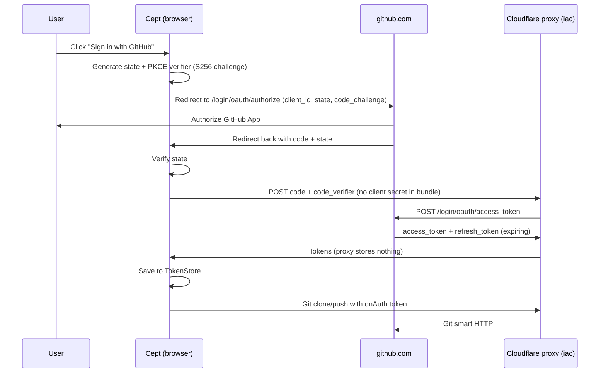
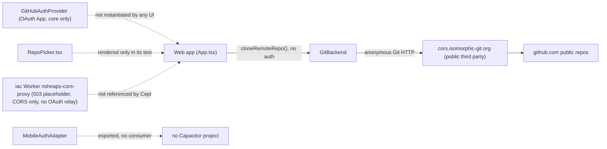

# Remotes and authentication requirements

**Status:** Draft, 2026-10-06

This document covers how Cept connects spaces to remote storage and how it authenticates to those remotes. Remotes are GitHub-hosted Git, Google Drive and SFTP. Auth paths are a GitHub App login, a Google login app and a GitHub personal access token. All browser-side token exchange and Git CORS traffic goes through a Cloudflare Worker proxy that nsheaps/iac provisions. Each requirement records the owner's intent, the current implementation and docs status with evidence, and the gap still to close.

**Related:**

- [Requirements index and traceability matrix](README.md)
- [03 Spaces and storage backends](03-spaces-and-storage.md): Git, Google Drive and SFTP backends that consume these credentials
- [05 CLI and sync daemon](05-cli-and-daemon.md): the headless client and shared credential holder
- [06 VS Code extension](06-vscode-extension.md) and [01 Browser app and PWA](01-browser-app-and-pwa.md): clients that share the daemon's credentials
- [07 Packaged native apps](07-native-apps.md): native OAuth redirects and secure storage
- [10 Engineering and CI](10-engineering-and-ci.md): build-time injection of client IDs and the proxy URL
- Original spec: [docs/SPECIFICATION.md](../../SPECIFICATION.md) §7 (Authentication)
- Code: [packages/core/src/auth/provider.ts](../../../packages/core/src/auth/provider.ts), [packages/core/src/auth/github.ts](../../../packages/core/src/auth/github.ts)

## Scope and non-goals

**In scope**

- The provider abstraction (`AuthProvider`) and its implementations for GitHub, Google and SFTP.
- The GitHub App (user-to-server) login, the device flow for headless clients, PAT entry, and the Google login for Drive.
- Token exchange, refresh, storage and revocation on every platform: web/PWA, desktop, mobile, CLI daemon and VS Code.
- The Cloudflare OAuth and CORS proxy Worker (provisioned in nsheaps/iac) and how Cept is configured to use it.
- Authenticated and anonymous Git transport (clone, fetch, pull, push).
- The account and sign-in UI.

**Non-goals**

- The storage backend implementations themselves (Drive API file mapping, SFTP file I/O, Git commit and merge logic). See [03](03-spaces-and-storage.md) and [05](05-cli-and-daemon.md).
- Identity for co-editing presence and authorization on the signaling server. See [04 Collaboration](04-collaboration.md).
- GitLab, Bitbucket and Forgejo providers. The interface must allow them, but the owner did not ask for them.
- Any Cept-operated backend that stores user data or tokens. The proxy must be stateless.

## Requirements summary

| ID                                                                                             | Requirement                                                      | Priority | Impl status | Docs status            | Docs accurate |
| ---------------------------------------------------------------------------------------------- | ---------------------------------------------------------------- | -------- | ----------- | ---------------------- | ------------- |
| [REQ-AUTH-001](#req-auth-001--provider-abstraction-for-all-remote-kinds)                       | Provider abstraction covers all remote kinds (git, gdrive, sftp) | MUST     | partial     | documented-differently | stale         |
| [REQ-AUTH-002](#req-auth-002--github-sign-in-via-a-github-app)                                 | GitHub sign-in via a GitHub App (user-to-server)                 | MUST     | divergent   | documented-differently | stale         |
| [REQ-AUTH-003](#req-auth-003--browser-token-exchange-without-a-client-secret)                  | Browser code exchange with PKCE and a relay, no client secret    | MUST     | not-started | undocumented           | n/a           |
| [REQ-AUTH-004](#req-auth-004--github-device-flow-for-headless-clients)                         | GitHub device flow for the CLI and daemon                        | MUST     | partial     | undocumented           | n/a           |
| [REQ-AUTH-005](#req-auth-005--github-personal-access-token-entry)                              | GitHub personal access token entry                               | MUST     | partial     | documented-differently | stale         |
| [REQ-AUTH-006](#req-auth-006--google-sign-in-for-google-drive-remotes)                         | Google login app for Google Drive remotes                        | MUST     | not-started | undocumented           | n/a           |
| [REQ-AUTH-007](#req-auth-007--sftp-remote-credentials)                                         | SFTP remote credentials (password or key)                        | MUST     | not-started | undocumented           | n/a           |
| [REQ-AUTH-008](#req-auth-008--cloudflare-oauth-and-cors-proxy-provisioned-through-nsheaps-iac) | Cloudflare OAuth and CORS proxy Worker via nsheaps/iac           | MUST     | stubbed     | undocumented           | n/a           |
| [REQ-AUTH-009](#req-auth-009--configurable-first-party-proxy-instead-of-a-public-cors-proxy)   | Configurable first-party proxy, no third-party proxy             | MUST     | partial     | undocumented           | n/a           |
| [REQ-AUTH-010](#req-auth-010--authenticated-git-transport)                                     | Authenticated Git clone, fetch, pull and push                    | MUST     | partial     | documented-as-desired  | stale         |
| [REQ-AUTH-011](#req-auth-011--anonymous-read-only-access-to-public-remotes)                    | Anonymous read-only access to public remotes                     | SHOULD   | partial     | documented-as-desired  | stale         |
| [REQ-AUTH-012](#req-auth-012--secure-persistent-token-storage-per-platform)                    | Secure, persistent token storage on each platform                | MUST     | partial     | documented-as-desired  | accurate      |
| [REQ-AUTH-013](#req-auth-013--account-and-sign-in-ui)                                          | Sign-in, account display and sign-out UI                         | MUST     | stubbed     | documented-differently | stale         |
| [REQ-AUTH-014](#req-auth-014--repo-listing-and-creation-after-sign-in)                         | Repo listing and creation after sign-in                          | SHOULD   | stubbed     | documented-as-desired  | accurate      |
| [REQ-AUTH-015](#req-auth-015--automatic-token-refresh)                                         | Automatic refresh of expiring tokens                             | MUST     | not-started | undocumented           | n/a           |
| [REQ-AUTH-016](#req-auth-016--native-oauth-for-packaged-apps)                                  | Native OAuth via system browser and redirect for packaged apps   | MUST     | stubbed     | documented-differently | stale         |
| [REQ-AUTH-017](#req-auth-017--shared-credentials-through-the-local-daemon)                     | Shared credentials through the local daemon                      | SHOULD   | not-started | undocumented           | n/a           |
| [REQ-AUTH-018](#req-auth-018--no-secrets-in-client-bundles-or-the-repo)                        | No secrets in client bundles or the repo                         | MUST     | partial     | documented-as-desired  | accurate      |

## Architecture

### Required architecture

### Required GitHub App login sequence (browser)

### Current state

## Requirements

### REQ-AUTH-001 — Provider abstraction for all remote kinds

> **Scope: Phase 1 (D-29).** Phase 1 ships the host-agnostic `AuthProvider` abstraction with GitHub (PAT) as the only host. The `google` and `sftp` provider types are later (D-26, see REQ-AUTH-006/007); the interface must still not preclude them.

**Statement:** All remote authentication MUST go through a provider abstraction (`AuthProvider`) whose type set covers every supported remote: Git (GitHub), Google Drive and SFTP. Adding a provider MUST NOT require changes outside its own implementation and registration.

**Rationale / source:** Handler: "Support for remotes"; spaces "stored ... git, gdrive, sftp".

**Acceptance criteria**

- `AuthProviderType` (or its successor) includes at least `github`, `github-pat` (or a PAT mode of `github`), `google` and `sftp`.
- The interface exposes credentials in a transport-neutral form (HTTP bearer, Git `onAuth`, SFTP password or key). It is not limited to `getHttpAuth()` and `getRepos()`.
- A unit test registers a fake provider and uses it from a backend without modifying core code.
- A spec under `docs/specs/` describes the interface.

**Current state:** partial. [packages/core/src/auth/provider.ts](../../../packages/core/src/auth/provider.ts) line 9 defines `AuthProviderType = 'github' | 'gitlab' | 'bitbucket' | 'forgejo' | 'ssh' | 'https'`, with no gdrive, google or sftp. The interface is Git-centric. Only `GitHubAuthProvider` in [packages/core/src/auth/github.ts](../../../packages/core/src/auth/github.ts) implements it.

**Docs state:** documented-differently, stale. [docs/SPECIFICATION.md](../../SPECIFICATION.md) line 118 says `AuthProvider` is "only needed when using `GitBackend` with a remote" and lists only Git providers as future work (§7.3). It does not mention Drive or SFTP.

**Gap:** Generalize the interface beyond Git, add the provider types, and write the auth spec (none exists under `docs/specs/`).

**Related PRs/issues:** none identified.

### REQ-AUTH-002 — GitHub sign-in via a GitHub App

> **Scope: Phase 2 (D-26, D-27).** Phase 1 auth is PATs only. GitHub App login, the GitHub App registration and the related Pulumi/iac work wait for the iac restructure.

**Statement:** The app MUST let a user sign in with GitHub through a **GitHub App** (user-to-server token, "login app"). It MUST use that token for repository listing and Git transport.

**Rationale / source:** Handler: "auth through github (login) app".

**Acceptance criteria**

- A GitHub App is registered for Cept. Its client ID is injected at build time (see [REQ-AUTH-018](#req-auth-018--no-secrets-in-client-bundles-or-the-repo)).
- Sign-in uses the GitHub App authorize URL with PKCE (S256) and state. The token is an expiring user-to-server token with a refresh token.
- Repo access follows the App's installations and permissions, not the broad OAuth `repo` scope.
- An e2e or integration test with a mocked GitHub covers authorize, callback, exchange, token stored and authenticated clone.
- [docs/SPECIFICATION.md](../../SPECIFICATION.md) §7.1 is updated to describe the GitHub App.

**Current state:** divergent. [packages/core/src/auth/github.ts](../../../packages/core/src/auth/github.ts) implements an **OAuth App** flow (`GitHubOAuthConfig`, `/login/oauth/authorize`, default scope `repo`). It has no PKCE, never uses refresh tokens, and has no installation semantics. No UI package instantiates it. [TASKS.md](../../../TASKS.md) line 97 marks T5.1 done, but line 205 (P5.1 "Wire GitHub OAuth into app") is unchecked.

**Docs state:** documented-differently, stale. [docs/SPECIFICATION.md](../../SPECIFICATION.md) §7.1 (line 965) is titled "MVP: GitHub OAuth App" and specifies the `repo` scope. nsheaps/iac `cloudflare-apps/TASKS.md` also says "GitHub OAuth App".

**Gap:** Move to a GitHub App with PKCE, expiring tokens and refresh. Wire it into the UI (P5.1). Update the spec. The sibling repo github2 (`docs/specs/auth.md`, `relay/relay.worker.js`) has a working pattern to reuse.

**Related PRs/issues:** none. PR #67 (closed per D-42) touched remote spaces but added no auth.

### REQ-AUTH-003 — Browser token exchange without a client secret

> **Scope: Phase 2 (D-26, D-27).** The PKCE code exchange and the relay Worker belong to GitHub App login. PAT sign-in in Phase 1 needs no token exchange.

**Statement:** Browser and PWA builds MUST complete the GitHub (and Google) code-for-token exchange without embedding a client secret. They MUST use PKCE and route the exchange through the Cloudflare proxy, because the github.com token endpoints do not send CORS headers.

**Rationale / source:** Derived. This is required for [REQ-AUTH-002](#req-auth-002--github-sign-in-via-a-github-app) and [REQ-AUTH-010](#req-auth-010--authenticated-git-transport) in a client-only app.

**Acceptance criteria**

- PKCE `code_verifier` and `code_challenge` (S256) are generated with Web Crypto and validated in unit tests.
- The token exchange URL is configurable (for example `VITE_AUTH_RELAY`) and defaults to the nsheaps Worker.
- A browser build fails or refuses to start if a client secret is configured.
- A test asserts that the exchange request body contains no `client_secret` in browser mode.

**Current state:** not-started. `exchangeCode()` in [packages/core/src/auth/github.ts](../../../packages/core/src/auth/github.ts) (around lines 127-150) POSTs directly to `${base}/login/oauth/access_token`, which a browser cannot do because of CORS. It forwards `config.clientSecret` when present (lines 137-138). There is no PKCE anywhere.

**Docs state:** undocumented. SPECIFICATION §7.1 says only "callback with code → exchange for token".

**Gap:** Implement PKCE and a relay-based exchange, guard against a client secret, and document both.

**Related PRs/issues:** none identified.

### REQ-AUTH-004 — GitHub device flow for headless clients

> **Scope: later (D-26).** Its only consumer is the CLI/daemon, which is deferred with no phase yet.

**Statement:** Headless clients (the CLI and sync daemon) MUST be able to authenticate with GitHub through the device authorization flow.

**Rationale / source:** Derived from the handler: "a daemon that runs to sync changes to the remotes".

**Acceptance criteria**

- `startDeviceFlow()` returns, or retains internally, the `device_code`, so polling works without a second request.
- Polling honours `interval`, `slow_down` and `expires_in`. Unit tests cover each response.
- `cept auth login github` (or similar) in the CLI uses it, and the token goes to the daemon's TokenStore.

**Current state:** partial, with a functional bug. `startDeviceFlow()` ([packages/core/src/auth/github.ts](../../../packages/core/src/auth/github.ts) line 196) parses `device_code` but returns `DeviceFlowVerification` (line 32), which has only `userCode`, `verificationUri`, `expiresIn` and `interval`. A caller cannot supply `deviceCode` to `pollDeviceFlow(deviceCode)` (line 238). `pollDeviceFlow()` makes a single request and throws `AuthPendingError` or `AuthSlowDownError` (lines 270, 274); there is no polling loop that honours `interval` or `slow_down`, so that is left to a caller that does not exist. There is no CLI package to consume it.

**Docs state:** undocumented. Only a code comment in `github.ts` mentions the device flow.

**Gap:** Fix the API, add the CLI consumer ([05](05-cli-and-daemon.md)), and document it.

**Related PRs/issues:** none identified.

### REQ-AUTH-005 — GitHub personal access token entry

> **Scope: Phase 1 (D-27).** PAT is the Phase 1 auth path. Fine-grained PATs are recommended and classic PATs are accepted.

**Statement:** Users MUST be able to authenticate a GitHub remote by pasting a personal access token (PAT). The token is stored securely and used for Git HTTP auth and API calls.

**Rationale / source:** Handler: "github PAT".

**Acceptance criteria**

- Settings, or the add-space wizard, has a PAT field. The token is validated (for example with a `GET /user` call) before it is saved.
- The PAT is persisted through the platform TokenStore ([REQ-AUTH-012](#req-auth-012--secure-persistent-token-storage-per-platform)) and is never written to space files or logs.
- Clone, pull and push of a private repo succeed with only a PAT configured.
- The user can remove the PAT.

**Current state:** partial. [packages/core/src/auth/pat.ts](../../../packages/core/src/auth/pat.ts) adds `PatAuthProvider`: `signIn()` checks the token with `GET /user` before saving it, reports what it grants (classic scopes from `X-OAuth-Scopes`, fine-grained tokens, expiry from `GitHub-Authentication-Token-Expiration`), `restore()` re-checks a saved token and drops it on a 401, and `logout()` deletes it. Errors carry only a reason and status, and `redactTokens()` strips anything token-shaped; a unit test asserts no token reaches an error or the console. No UI collects a PAT yet (plan PR 30): [AddSpaceWizardModal.tsx](../../../packages/ui/src/components/settings/AddSpaceWizardModal.tsx) has only URL, branch and sub-path fields, and [App.tsx](../../../packages/ui/src/components/App.tsx) never passes `auth`.

**Docs state:** documented-differently, stale. [docs/content/reference/roadmap.md](../../content/reference/roadmap.md) line 92 lists "Auth provider (GitHub OAuth, token) | Planned". [docs/content/getting-started/quick-start.md](../../content/getting-started/quick-start.md) line 63 tells users to "Authenticate with GitHub", which they cannot do today.

**Gap:** Build the PAT UI and storage, and thread the PAT into `GitBackend`.

**Related PRs/issues:** none identified.

### REQ-AUTH-006 — Google sign-in for Google Drive remotes

> **Scope: later (D-26).** Google Drive backend and its login are deferred with no phase yet.

**Statement:** The app MUST support Google sign-in through an OAuth client ("login app") that grants Drive scopes, so spaces can be stored on Google Drive.

**Rationale / source:** Handler: "google login app"; spaces "stored ... gdrive".

**Acceptance criteria**

- A `GoogleAuthProvider` uses the authorization code flow with PKCE. On web, the exchange and refresh go through the proxy.
- It requests the least Drive scope that works (for example `drive.file`, or `drive` for an existing folder). The owner must choose the scope.
- Tokens refresh automatically ([REQ-AUTH-015](#req-auth-015--automatic-token-refresh)).
- The GDrive backend ([REQ-WS-015](03-spaces-and-storage.md#req-ws-015--google-drive-backend)) consumes the credentials.

**Current state:** not-started. There is no Google or Drive code in `packages/*`, and no GDrive backend in `packages/core/src/storage/`.

**Docs state:** undocumented. [docs/SPECIFICATION.md](../../SPECIFICATION.md) Appendix B (line 2600) lists GitHub as the only external auth service. [docs/specs/storage-backends.md](../../specs/storage-backends.md) has no Drive backend.

**Gap:** Write the spec, register the Google client, and implement the provider.

**Related PRs/issues:** none identified.

### REQ-AUTH-007 — SFTP remote credentials

> **Scope: later (D-26).** The SFTP backend and its credentials are deferred with no phase yet.

**Statement:** The app MUST support SFTP remotes with password or SSH-key credentials, at least in contexts that have raw sockets (the daemon, desktop and possibly mobile).

**Rationale / source:** Derived from the handler: spaces "stored ... sftp".

**Acceptance criteria**

- A platform availability matrix states where SFTP works. Browsers cannot open raw SFTP connections, so browser clients can only reach SFTP through the daemon.
- Password and private-key (optionally passphrase-protected) credentials are stored in the platform TokenStore.
- Host keys are verified on first use with a prompt, and mismatches are rejected.
- An integration test against a containerized SFTP server passes.

**Current state:** not-started. `'ssh'` and an `SSHKey` type exist in [packages/core/src/auth/provider.ts](../../../packages/core/src/auth/provider.ts), but nothing implements them and there is no SFTP backend.

**Docs state:** undocumented. SFTP appears nowhere in `docs/`.

**Gap:** Specify it and implement it together with [REQ-WS-016](03-spaces-and-storage.md#req-ws-016--sftp-backend).

**Related PRs/issues:** none identified.

### REQ-AUTH-008 — Cloudflare OAuth and CORS proxy provisioned through nsheaps iac

> **Scope: Phase 2 (D-26, D-27, D-39).** The Worker (a Worker just for Cept), `auth.nsheaps.dev` and all Pulumi/iac work are Phase 2. Until then the browser reaches github.com through the public `cors.isomorphic-git.org` proxy (D-39).

**Statement:** A Cloudflare Worker that acts as the OAuth token-exchange relay and the Git CORS proxy MUST be provisioned and deployed through nsheaps/iac. It MUST be reachable on an nsheaps domain and MUST restrict requests to Cept origins.

**Rationale / source:** Handler: "cloudflare oauth proxy using workers set up through nsheaps/iac".

**Acceptance criteria**

- The Worker code is real (not a placeholder), version-controlled, and deployed by the iac pipeline.
- A Worker route or custom domain makes it reachable on its hostname (for example `auth.nsheaps.dev`).
- It handles the GitHub and Google token exchange and refresh endpoints, plus Git smart-HTTP (`info/refs`, `git-upload-pack`, `git-receive-pack`) for allowed hosts only.
- `ALLOWED_ORIGINS` covers production, GitHub Pages and the PR-preview origins. Requests from other origins are rejected.
- It is stateless: it logs and stores no tokens.
- A smoke check runs after deploy, and Cept's specs document the Worker.

**Current state:** stubbed (in nsheaps/iac, not this repo). The infrastructure resources exist, but the Worker has no real code and no OAuth relay. Evidence:

- `cloudflare-apps/index.ts` lines 62-73 define a `WorkersScript` named `nsheaps-cors-proxy` with an `ALLOWED_ORIGINS` binding. `Pulumi.prod.yaml` line 3 sets it to `https://nsheaps.github.io,https://private-pages.nsheaps.dev,https://cept.nsheaps.dev`.
- The script content is `process.env.CORS_PROXY_SCRIPT` or else a placeholder that returns 503 "cors-proxy not deployed yet" (lines 59-60). `.github/workflows/cloudflare-deploy.yaml` never sets `CORS_PROXY_SCRIPT`, so every pipeline deploy ships the placeholder. Real code only reaches Cloudflare through a manual `pulumi up` (`cloudflare-apps/TASKS.md`, "CORS Proxy Worker").
- The Worker is described only as a CORS proxy built in nsheaps/cors-proxy (lines 53-58). No GitHub or Google token-exchange relay exists in iac. nsheaps/cors-proxy is not checked out here, so its contents are unverified.
- `auth.nsheaps.dev` is a proxied CNAME to `nsheaps-cors-proxy.workers.dev` (lines 76-82). There is no `WorkersRoute` or Worker custom-domain resource. workers.dev hostnames normally have the form `<script>.<account-subdomain>.workers.dev`, so this CNAME target is probably wrong and the hostname probably does not reach the Worker (not tested live).
- Every setup, deploy and verify step in `cloudflare-apps/TASKS.md` is unchecked. Whether `cloudflare-deploy.yaml` has ever run successfully is unverified.

**Docs state:** undocumented in Cept. No Cept doc mentions Cloudflare, Workers or `auth.nsheaps.dev`.

**Gap:** Write the OAuth relay (GitHub and Google exchange and refresh) alongside the Git CORS proxy, have the iac pipeline supply real Worker code instead of the placeholder, replace the CNAME with a Worker custom domain or route, and document it here and in iac.

**Related PRs/issues:** none in nsheaps/cept.

### REQ-AUTH-009 — Configurable first-party proxy instead of a public CORS proxy

> **Scope: Phase 1 config, Phase 2 Worker (D-39).** Phase 1 keeps the public `cors.isomorphic-git.org` proxy, but the URL MUST come from one build-time setting rather than being hardcoded, so Phase 2 can switch to the first-party Worker without code changes. The public proxy sees users' PATs; Phase 1 accepts that risk until the Worker exists.

**Statement:** Cept MUST route browser Git HTTP and OAuth exchange traffic through a configurable proxy URL that defaults to the nsheaps Worker. It MUST NOT hardcode a public third-party proxy, because that proxy would see auth tokens.

**Rationale / source:** Derived from [REQ-AUTH-008](#req-auth-008--cloudflare-oauth-and-cors-proxy-provisioned-through-nsheaps-iac) and the token security needed by [REQ-AUTH-005](#req-auth-005--github-personal-access-token-entry).

**Acceptance criteria**

- One config source (for example `VITE_CORS_PROXY` and `VITE_AUTH_RELAY`) is read in one module. No other module contains a proxy URL literal (enforced by a lint rule or a grep check in CI).
- Authenticated requests never go to `cors.isomorphic-git.org`.
- The CD and preview workflows inject the URL.

**Current state:** partial (PR 27). [packages/ui/src/config/git-proxy.ts](../../../packages/ui/src/config/git-proxy.ts) is the one module that reads the proxy URL: `gitCorsProxy()` returns the `VITE_CORS_PROXY` build setting (injected as `__GIT_CORS_PROXY__` in [vite.config.ts](../../../packages/web/vite.config.ts)), or the public `https://cors.isomorphic-git.org` when it is unset. Every clone in App.tsx uses it. The ESLint rule `cept/no-cors-proxy-literal` ([tools/lint/boundaries.js](../../../tools/lint/boundaries.js)) fails on the proxy host anywhere else, proven by fixtures in `tools/boundary-fixtures/`. Still missing: `VITE_AUTH_RELAY`, the first-party Worker as the default, keeping authenticated requests off the public proxy, and the workflows injecting the URL (all Phase 2, D-39).

**Docs state:** undocumented.

**Gap:** Point the proxy URL at the iac Worker (Phase 2). The space work rebuilt from PR #67 (D-42) must use `gitCorsProxy()`.

**Related PRs/issues:** PR #67 (closed per D-42; ideas rebuilt in Phase 1).

### REQ-AUTH-010 — Authenticated Git transport

> **Scope: Phase 1 (D-27, D-29).** Authenticated clone, fetch, pull and push with a PAT. The browser reaches github.com through the configurable public proxy until Phase 2 (D-39; see REQ-AUTH-008/009). Offline queued commits and push-on-reconnect are Phase 1 (D-37). A rejected push falls back to "push to a new branch" (D-30).

**Statement:** When credentials exist for a remote, every Git operation (clone, fetch, pull and push) MUST use them through the isomorphic-git `onAuth` callback. Private repos MUST work.

**Rationale / source:** Derived from the handler: "Support for remotes"; the daemon syncs to remotes.

**Acceptance criteria**

- `cloneRemoteRepo` and the sync engine accept a provider or credentials and pass them to `GitBackend`.
- An integration test clones, pulls and pushes a private repository with a mocked or local authenticated Git server.
- Auth failures (401/403) show the user a re-authenticate prompt and are not retried in a loop.

**Current state:** partial. `GitBackend` wires `onAuth` for clone, fetch, pull and push ([packages/core/src/storage/git-backend.ts](../../../packages/core/src/storage/git-backend.ts) lines 214, 243, 271, 287). [packages/ui/src/components/storage/git-space.ts](../../../packages/ui/src/components/storage/git-space.ts) `cloneRemoteRepo()` passes no auth to core's `withShallowClone()` (which accepts it), so only public repos work. Push and sync are not wired ([TASKS.md](../../../TASKS.md) lines 207-208, P5.3/P5.4 unchecked).

**Docs state:** documented-as-desired, stale. SPECIFICATION §7.1 matches the intent. [README.md](../../../README.md) line 17 and [quick-start.md](../../content/getting-started/quick-start.md) lines 55-64 overstate the current state ("sync automatically").

**Gap:** Thread credentials through and wire push and pull (P5.4). See [REQ-WS-014](03-spaces-and-storage.md#req-ws-014--git-backed-space-write-commit-pushpull-sync).

**Related PRs/issues:** none identified.

### REQ-AUTH-011 — Anonymous read-only access to public remotes

> **Scope: Phase 1 (D-29).** Anonymous read-only clone of public HTTPS git URLs keeps working. The third acceptance criterion (first-party proxy) is Phase 2; Phase 1 uses the configurable public proxy (D-39). **Decided (D-42):** the read-only editor applies to anonymous public clones only; spaces backed by a PAT are editable (rebuilt from closed PR #67).

**Statement:** Users SHOULD be able to browse public Git remotes read-only without signing in.

**Rationale / source:** Derived. The docs site is a remote space, and the demo and read-only docs deployment need it.

**Acceptance criteria**

- A user can add a public Git URL with no credentials, and it opens read-only.
- The same repository added with a PAT opens editable, not read-only (D-42).
- Background refresh works anonymously.
- This path uses the first-party proxy ([REQ-AUTH-009](#req-auth-009--configurable-first-party-proxy-instead-of-a-public-cors-proxy)).

**Current state:** partial. Anonymous read-only browsing works, but it goes through the third-party proxy (the third acceptance criterion fails), and no e2e test covers adding a remote space. Since PR 28 `cloneRemoteRepo` has unit tests ([git-space.test.ts](../../../packages/ui/src/components/storage/git-space.test.ts)) and core's `withShallowClone` has an integration test against `git http-backend` ([git-clone.integration.test.ts](../../../packages/core/src/storage/git-clone.integration.test.ts)). [AddSpaceWizardModal.tsx](../../../packages/ui/src/components/settings/AddSpaceWizardModal.tsx) offers "Add a read-only space from a Git repository". [App.tsx](../../../packages/ui/src/components/App.tsx) implements auto-clone by remote space ID (around lines 341-415), a 5-minute background refresh (around lines 426-470) and `handleAddRemoteRepo` (around lines 946-1036). PR #67 (closed per D-42) made the docs a real remote space through a runtime clone, which is not carried over (D-12); its remote-space UI ideas are rebuilt in Phase 1.

**Docs state:** documented-as-desired, stale. The in-app demo content in [App.tsx](../../../packages/ui/src/components/App.tsx) line 1724 says "Public repositories can be browsed anonymously; private repositories require authentication." It sits under a "Git Repository (Coming Soon)" heading, though. [quick-start.md](../../content/getting-started/quick-start.md) line 22 and [features.md](../../content/guides/features.md) line 114 also say Git is "coming soon", even though read-only remote spaces ship today. Only [docs/content/index.md](../../content/index.md) line 33 mentions a read-only Git-backed space, and only for the docs.

**Gap:** Move it off the third-party proxy, add tests for the anonymous clone path, and document adding a read-only remote space.

**Related PRs/issues:** PR #67 (closed per D-42; ideas rebuilt in Phase 1).

### REQ-AUTH-012 — Secure persistent token storage per platform

> **Scope: Phase 1 (D-27, D-28).** Web (encrypted IndexedDB) and desktop (OS keychain) stores hold the PAT. The mobile (Capacitor) secure store is later (D-43); on phones the PWA uses the web store. The CLI daemon credential file is later (D-26).

**Statement:** Tokens MUST persist across sessions in platform-appropriate secure storage: encrypted IndexedDB on web, the OS keychain on desktop, secure storage on mobile, and a protected credential store for the CLI daemon.

**Rationale / source:** Derived. Needed for [REQ-AUTH-002](#req-auth-002--github-sign-in-via-a-github-app), [REQ-AUTH-005](#req-auth-005--github-personal-access-token-entry) and [REQ-AUTH-006](#req-auth-006--google-sign-in-for-google-drive-remotes).

**Acceptance criteria**

- Each platform has a `TokenStore` implementation with unit tests.
- Tokens survive a reload or restart. Sign-out removes them.
- On web, tokens are encrypted at rest with a non-extractable WebCrypto key.
- The daemon credential file uses mode 0600 or the OS keychain.

**Current state:** partial. Web: [packages/web/src/token-store.ts](../../../packages/web/src/token-store.ts) `EncryptedTokenStore` keeps tokens in IndexedDB (`cept-auth`), sealed with AES-GCM under a non-extractable WebCrypto key held in the same database; a token sealed under a lost key is dropped. Unit tests cover the round trip, deletion, ciphertext-only storage and the lost-key case. Desktop (keychain) and mobile stores do not exist yet; `MemoryTokenStore` ([packages/core/src/auth/github.ts](../../../packages/core/src/auth/github.ts)) remains the in-memory default.

**Docs state:** documented-as-desired, accurate as a requirement. SPECIFICATION §7.1 says "Token stored securely (OS keychain on desktop, secure storage on mobile, encrypted in IndexedDB on web)".

**Gap:** Implement a store for each platform. Decide whether the daemon holds credentials for other clients ([REQ-AUTH-017](#req-auth-017--shared-credentials-through-the-local-daemon)).

**Related PRs/issues:** none identified.

### REQ-AUTH-013 — Account and sign-in UI

> **Scope: Phase 1 (D-27).** Phase 1 UI covers PAT entry, account display and sign-out/removal. GitHub App, Google and SFTP entry points follow their phases (D-26).

**Statement:** The app MUST provide a sign-in entry point for each provider (GitHub App, PAT, Google, SFTP), show the signed-in account, and allow sign-out and credential removal.

**Rationale / source:** Derived. Without it, the providers cannot be used.

**Acceptance criteria**

- Settings has an Accounts section that lists connected providers with user identity and avatar.
- Onboarding offers a "Connect a remote" path that leads into provider selection.
- Sign-out removes the stored tokens and, where the provider supports it, revokes them.
- E2E tests with screenshots cover the flow, per the UI evidence rule.

**Current state:** stubbed. [packages/ui/src/components/git/RepoPicker.tsx](../../../packages/ui/src/components/git/RepoPicker.tsx) has `onSignIn` and `onSignOut` props, but only [RepoPicker.test.tsx](../../../packages/ui/src/components/git/RepoPicker.test.tsx) references it. [SettingsModal.tsx](../../../packages/ui/src/components/settings/SettingsModal.tsx) has no account section.

**Docs state:** documented-differently, stale. [quick-start.md](../../content/getting-started/quick-start.md) lines 55-64 describe an "Authenticate with GitHub" step that does not exist. SPECIFICATION line 1576 describes an onboarding "Connect a Git repo → OAuth → repo selection" path that was never built.

**Gap:** Build the accounts UI and wire RepoPicker (P5.2) and the onboarding path.

**Related PRs/issues:** none identified.

### REQ-AUTH-014 — Repo listing and creation after sign-in

> **Scope: Phase 1 (D-30).** With a PAT, list the repos it reaches via `GET /user/repos` (forks and archived repos skipped for discovery) and create a repo. Installation-endpoint listing arrives with the GitHub App in Phase 2.

**Statement:** After GitHub sign-in, users SHOULD be able to pick an existing repo or create a new one to back a space.

**Rationale / source:** Existing spec: [docs/SPECIFICATION.md](../../SPECIFICATION.md) §7.2.

**Acceptance criteria**

- The picker lists the repositories the GitHub App can access (through installations), with search.
- "Create repo" creates a repo and initializes the space (`space.cept.yaml`, see [03](03-spaces-and-storage.md)).
- Component and e2e tests cover both paths.

**Current state:** stubbed. `getRepos()` and `createRepo()` exist and are tested ([github.ts](../../../packages/core/src/auth/github.ts), [github.test.ts](../../../packages/core/src/auth/github.test.ts)). `RepoPicker` is not used. [TASKS.md](../../../TASKS.md) marks T5.2 done (line 98), but P5.2 is unchecked (line 206).

**Docs state:** documented-as-desired, accurate (§7.2).

**Gap:** Wire it (P5.2) and switch listing to the GitHub App installation endpoints.

**Related PRs/issues:** none identified.

### REQ-AUTH-015 — Automatic token refresh

> **Scope: Phase 2 (D-26, D-27).** PATs do not expire via refresh. Refresh applies to GitHub App user tokens (Phase 2) and Google tokens (later).

**Statement:** Expiring tokens (GitHub App user tokens and Google tokens) MUST be refreshed automatically with the refresh token, through the proxy on web, without forcing the user to sign in again.

**Rationale / source:** Derived from [REQ-AUTH-002](#req-auth-002--github-sign-in-via-a-github-app) and [REQ-AUTH-006](#req-auth-006--google-sign-in-for-google-drive-remotes).

**Acceptance criteria**

- Tokens are refreshed shortly before `expiresAt`, and again on a 401 before the user sees an error.
- Concurrent refreshes are deduplicated into a single in-flight request.
- If the refresh token has expired, the user sees a clear re-auth prompt.
- Unit tests use fake timers.

**Current state:** not-started. `refreshToken` is stored ([github.ts](../../../packages/core/src/auth/github.ts) lines 180, 291) but never used. An expired token makes `requireToken()` throw.

**Docs state:** undocumented.

**Gap:** Implement a refresh grant through the proxy.

**Related PRs/issues:** none identified.

### REQ-AUTH-016 — Native OAuth for packaged apps

> **Scope: Phase 3 (D-26).** Native-app login callbacks and deep links for OAuth are Phase 3. Phase 1 native apps (desktop only; native iOS and Android are later per D-43) sign in with a PAT.

**Statement:** Packaged apps (iOS, Android, Windows, macOS and Linux) MUST complete OAuth through the system browser with a deep-link (`cept://`) or loopback redirect, and MUST check state against CSRF.

**Rationale / source:** Derived from the handler: a packaged app distributed for windows/macos/linux/android/ios, plus remote auth.

**Acceptance criteria**

- Each platform registers its redirect (URL scheme or loopback port).
- The state check rejects mismatched or expired callbacks (unit-tested).
- The app uses PKCE and does not embed a client secret.
- The token is stored in the platform's secure storage.

**Current state:** stubbed. [packages/mobile/src/mobile-auth.ts](../../../packages/mobile/src/mobile-auth.ts) (`MobileAuthAdapter`) checks state against CSRF (lines 129-133) but has no PKCE. It is exported from [packages/mobile/src/index.ts](../../../packages/mobile/src/index.ts) but has no consumer. `packages/desktop/src` contains no OAuth, deep-link or keychain code. There is no Capacitor project and no desktop OAuth handling. [TASKS.md](../../../TASKS.md) marks T7.6 done (line 121), but P6.5 and P6.6 are unchecked (lines 223-224).

**Docs state:** documented-differently, stale. SPECIFICATION line 85 and the `openOAuthPopup` bridge (line 1062) assume Capacitor and Electron plugins, and the checked T7.6 implies the work is done.

**Gap:** See [REQ-APP-016](07-native-apps.md#req-app-016--native-oauth-via-deep-link-for-packaged-apps).

**Related PRs/issues:** none identified.

### REQ-AUTH-017 — Shared credentials through the local daemon

> **Scope: later (D-26).** Exists only to share the daemon's credentials; the CLI/daemon and VS Code are deferred.

**Statement:** When the local daemon is running, PWA and VS Code clients SHOULD use the daemon's authenticated remote connections instead of authenticating separately.

**Rationale / source:** Derived from the handler: "vscode plugin ... shares local daemon"; "PWA can share local daemon".

**Acceptance criteria**

- The daemon API never returns raw tokens to clients. Clients ask the daemon to perform remote operations.
- The daemon API listens only on localhost or a local socket and checks origin and a pairing token ([REQ-CLI-008](05-cli-and-daemon.md#req-cli-008--daemon-security-for-localhost-api)).
- When no daemon is running, clients fall back to their own auth.

**Current state:** not-started. No CLI, daemon or VS Code packages exist.

**Docs state:** undocumented.

**Gap:** Define the credential ownership model and the IPC contract ([REQ-CLI-006](05-cli-and-daemon.md#req-cli-006--local-client-protocol-for-daemon-sharing), [REQ-VSC-008](06-vscode-extension.md#req-vsc-008--share-the-local-cept-daemon-when-available)).

**Related PRs/issues:** none identified.

### REQ-AUTH-018 — No secrets in client bundles or the repo

> **Scope: Phase 1 (D-38).** The secret scanner and the no-secrets-in-bundle guard are Phase 1 engineering prerequisites. Client ID injection for the GitHub App is Phase 2 (D-27).

**Statement:** No OAuth client secret or user token may be committed to the repo or embedded in a shipped client bundle. Client IDs MUST be injected through build config.

**Rationale / source:** Derived from [docs/SPECIFICATION.md](../../SPECIFICATION.md) line 2191 (security checklist) and the client-only architecture.

**Acceptance criteria**

- Client IDs are supplied through `VITE_*` variables (or the equivalent for each platform) set in [cd.yml](../../../.github/workflows/cd.yml) and [preview-deploy.yml](../../../.github/workflows/preview-deploy.yml).
- Any client secret exists only in Worker secrets, if one is needed at all.
- A secret scanner runs in CI, and a test asserts that browser builds reject `clientSecret`.

**Current state:** partial. No secrets or client IDs are committed, but `GitHubOAuthConfig.clientSecret` is optional and is forwarded in `exchangeCode` ([github.ts](../../../packages/core/src/auth/github.ts) lines 18, 137-138). There is no client ID config, and the secret scanner now runs: [\_security.yml](../../../.github/workflows/_security.yml) runs gitleaks over git history and the working tree on every PR and `main` (see REQ-ENG-018). The test that browser builds reject `clientSecret` is still missing.

**Docs state:** documented-as-desired, accurate. The only source is a code-review checklist item in SPECIFICATION line 2191 ("No secrets in code? OAuth tokens handled securely?").

**Gap:** Add the client ID config and the browser-build guard, and document both.

**Related PRs/issues:** none identified.

## Conflicts and open questions

The owner needs to decide each of these.

1. **GitHub App or OAuth App.** The handler asks for a GitHub App login. [docs/SPECIFICATION.md](../../SPECIFICATION.md) §7.1, line 118, `github.ts` and the iac TASKS.md all specify an OAuth App with the broad `repo` scope. Proposal: adopt a GitHub App and rewrite §7.1. **Answered (D-27):** Phase 1 uses PATs only; GitHub App login is Phase 2.
2. **AuthProvider scope.** The SPECIFICATION says AuthProvider is only for Git remotes, and Appendix B lists GitHub as the only external auth service. The handler requires Google Drive and SFTP. Which Drive scope (`drive.file` or full `drive`)? **Answered (D-26, D-29):** Google Drive and SFTP are later; `AuthProvider` stays host-agnostic with GitHub as the only Phase 1 host. The Drive scope question is deferred with Drive.
3. **Proxy.** The code hardcodes `cors.isomorphic-git.org` (App.tsx; PR #67, closed per D-42, added another). The handler wants the iac Cloudflare Worker. Should one Worker handle both OAuth relay and Git CORS, or should they be split? Where does the Worker code live (nsheaps/cors-proxy, iac, or this monorepo)? **Partly answered (D-27):** the Worker is Phase 2, a Worker just for Cept, with iac restructured first. The Phase 1 keeps the public proxy behind a build-time setting (D-39).
4. **Proxy reachability.** `auth.nsheaps.dev` is a CNAME to workers.dev with no route or custom domain, and the script defaults to a 503 placeholder. The setup exists on paper only (unverified that it fails). **Answered (D-26, D-27):** iac/Pulumi work, including `auth.nsheaps.dev`, is Phase 2.
5. **TASKS.md accuracy.** T5.1, T5.2 and T7.6 are checked, but P5.1, P5.2 and P6.5/P6.6 and the code show they are not wired. Should the T-task checkboxes be reverted?
6. **Token exchange design.** SPECIFICATION §7.1 implies a direct browser code exchange, which CORS makes impossible. Is a client secret ever acceptable (Worker-only)? PKCE with a GitHub App removes the need for one. **Answered (D-27):** no token exchange in Phase 1 (PAT only); revisit PKCE and relay in Phase 2.
7. **SFTP in the browser.** It is impossible without the daemon. Should SFTP be desktop and daemon only, with browser access only through the daemon? **Answered (D-26):** SFTP is later.
8. **Credential ownership.** Is the daemon the single credential holder for PWA and VS Code, or does each client keep its own tokens? **Answered (D-26):** daemon is later; Phase 1 clients keep their own PATs.
9. **Terminology.** The handler originally said "workspace", while the UI and code say "space". See [REQ-WS-022](03-spaces-and-storage.md#req-ws-022--consistent-terminology-space-adopted-d-1).
10. **Preview origins.** PR previews (`nsheaps.github.io/cept/pr-N`) share the `https://nsheaps.github.io` origin, which `ALLOWED_ORIGINS` already allows, so the origin check cannot tell previews, production Pages and other nsheaps Pages apps apart. Is that acceptable? Should the GitHub App and Google client also register the preview callback URLs?

## Stale documentation

| Location                                                                                                                                                                                                                                            | Claim                                                             | Problem                                                                                                                                                     |
| --------------------------------------------------------------------------------------------------------------------------------------------------------------------------------------------------------------------------------------------------- | ----------------------------------------------------------------- | ----------------------------------------------------------------------------------------------------------------------------------------------------------- |
| [docs/content/getting-started/quick-start.md](../../content/getting-started/quick-start.md) lines 55-64                                                                                                                                             | "Authenticate with GitHub ... Your space will sync automatically" | There is no auth UI and no sync. Only anonymous read-only clone works.                                                                                      |
| [packages/ui/src/components/docs/docs-content.ts](../../../packages/ui/src/components/docs/docs-content.ts) line 223                                                                                                                                | Same "Authenticate with GitHub" step in the bundled docs          | Same as above.                                                                                                                                              |
| [README.md](../../../README.md) line 17                                                                                                                                                                                                             | Git gives "multi-device sync ... all automatic"                   | Remote Git is anonymous and read-only today.                                                                                                                |
| [docs/SPECIFICATION.md](../../SPECIFICATION.md) §7.1 (lines 965-973)                                                                                                                                                                                | "MVP: GitHub OAuth App", `repo` scope, direct code exchange       | The owner wants a GitHub App with a Cloudflare relay. PAT, Google and the proxy are missing.                                                                |
| [docs/SPECIFICATION.md](../../SPECIFICATION.md) line 118                                                                                                                                                                                            | AuthProvider is "only needed when using GitBackend"               | Drive and SFTP also need it.                                                                                                                                |
| [docs/SPECIFICATION.md](../../SPECIFICATION.md) Appendix B (line 2600)                                                                                                                                                                              | GitHub is the only external auth service                          | Google and the Cloudflare Worker are omitted.                                                                                                               |
| [TASKS.md](../../../TASKS.md) lines 97, 98, 121                                                                                                                                                                                                     | T5.1, T5.2 and T7.6 marked done                                   | The code is library-only and unwired (contradicted by P5.1/P5.2/P6.5/P6.6 and [.claude/prompts/continue.md](../../../.claude/prompts/continue.md) line 50). |
| [docs/content/reference/roadmap.md](../../content/reference/roadmap.md) line 92                                                                                                                                                                     | "Auth provider (GitHub OAuth, token) Planned"                     | It should say GitHub App, PAT, Google, SFTP and the proxy, and link to this spec.                                                                           |
| nsheaps/iac `cloudflare-apps/TASKS.md`                                                                                                                                                                                                              | "Update GitHub OAuth App redirect URLs"                           | Assumes an OAuth App, but the owner wants a GitHub App.                                                                                                     |
| nsheaps/iac `cloudflare-apps/index.ts` line 75                                                                                                                                                                                                      | "Route the worker on a subdomain (optional: auth.nsheaps.dev)"    | Only a CNAME exists, with no route or custom domain, and CI deploys the 503 placeholder.                                                                    |
| [docs/content/guides/platform-support.md](../../content/guides/platform-support.md) line 62                                                                                                                                                         | Git in the browser needs "No server-side Git required"            | Browser Git needs a CORS proxy, today the third-party `cors.isomorphic-git.org`.                                                                            |
| [docs/content/getting-started/quick-start.md](../../content/getting-started/quick-start.md) line 22, [docs/content/guides/features.md](../../content/guides/features.md) line 114, [App.tsx](../../../packages/ui/src/components/App.tsx) line 1724 | Git repository spaces are "coming soon"                           | Anonymous read-only remote spaces already ship (REQ-AUTH-011).                                                                                              |

## Cross-area dependencies

- **Storage backends.** The Git backend uses provider credentials through `onAuth` ([REQ-WS-013](03-spaces-and-storage.md#req-ws-013--git-backed-space-cloneread-from-remote), [REQ-WS-014](03-spaces-and-storage.md#req-ws-014--git-backed-space-write-commit-pushpull-sync)). The Drive backend ([REQ-WS-015](03-spaces-and-storage.md#req-ws-015--google-drive-backend)) needs REQ-AUTH-006, and the SFTP backend ([REQ-WS-016](03-spaces-and-storage.md#req-ws-016--sftp-backend)) needs REQ-AUTH-007.
- **CLI and daemon.** These need device-flow auth (REQ-AUTH-004), secure credential storage (REQ-AUTH-012) and support for all remote kinds ([REQ-CLI-002](05-cli-and-daemon.md#req-cli-002--long-running-sync-daemon), [REQ-CLI-005](05-cli-and-daemon.md#req-cli-005--daemon-supports-all-remote-kinds)). The daemon is the proposed shared credential holder ([REQ-CLI-006](05-cli-and-daemon.md#req-cli-006--local-client-protocol-for-daemon-sharing), [REQ-CLI-008](05-cli-and-daemon.md#req-cli-008--daemon-security-for-localhost-api)).
- **VS Code extension and PWA.** They share credentials through the daemon ([REQ-VSC-008](06-vscode-extension.md#req-vsc-008--share-the-local-cept-daemon-when-available), REQ-AUTH-017). The service worker sync ([REQ-WEB-007](01-browser-app-and-pwa.md#req-web-007--service-worker-handles-syncing)) needs tokens it can read.
- **Packaged apps.** They need native redirects and secure storage ([REQ-APP-016](07-native-apps.md#req-app-016--native-oauth-via-deep-link-for-packaged-apps), REQ-AUTH-012), which depend on desktop deep linking (P6.5/P6.6) and, once native mobile returns (D-43), a Capacitor project.
- **Git history and conflicts.** TASKS P5.5 (HistoryViewer) and P5.6 (ConflictResolver) are outside auth, but they depend on authenticated pull and push (REQ-AUTH-010). See [03](03-spaces-and-storage.md).
- **Collaboration.** Presence identity could reuse the GitHub user from `getUser()`. The signaling server has no auth today (unverified). See [04 Collaboration](04-collaboration.md).
- **Engineering and CI.** The build injects client IDs and the proxy URL as `VITE_*` variables in the CD and preview workflows. A secret scanner is also needed. See [10 Engineering and CI](10-engineering-and-ci.md).
- **Demo and docs deployment.** The demo space and read-only docs must keep working without auth (REQ-AUTH-011). See [02 Static rendering](02-static-rendering.md).
- **Infra.** nsheaps/iac and nsheaps/cors-proxy own the Worker code, route or custom domain, allowed origins (including PR previews), and the GitHub App and Google client redirect URLs. github2 (`docs/specs/auth.md`, `relay/relay.worker.js`) is a reference implementation of the GitHub App + PKCE + relay pattern.
