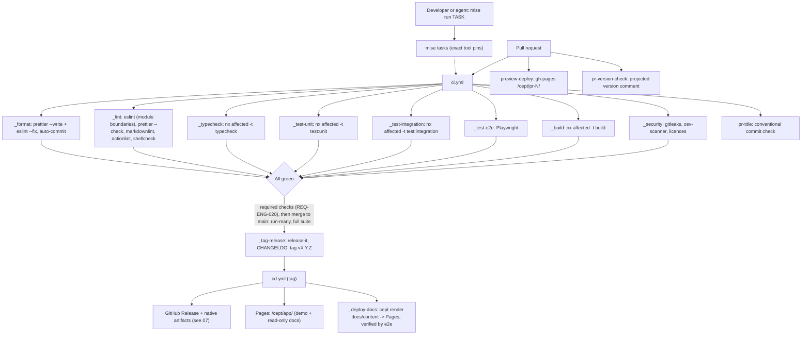
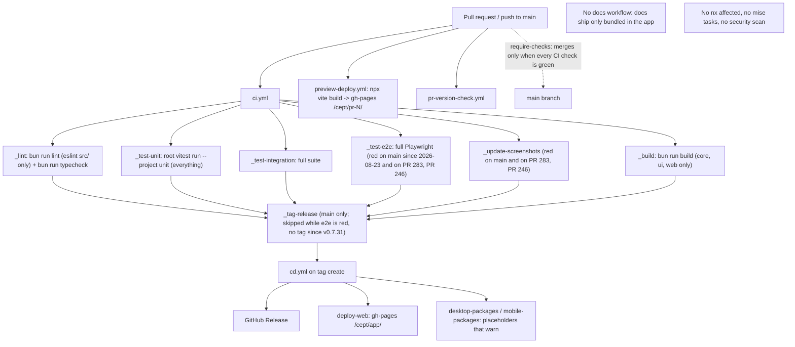

# Monorepo, toolchain and CI/CD requirements

**Status:** Draft, 2026-10-06 · **Area ID prefix:** `REQ-ENG` · **Owner:** nsheaps

This document lists the engineering requirements for Cept: how the monorepo is laid out, which toolchain it uses (Nx, mise, Bun, TypeScript), and which CI/CD pipelines check, release and deploy it. Each requirement is compared with the repository as of 2026-10-06 (code, `.github/workflows/*`, and open PRs) and with current docs, so that gaps, stale claims and owner decisions are listed in one place. The owner's monorepo, toolchain and CI requirements sit alongside requirements derived from the conventions of other nsheaps repos, with `qontacts` as the main reference.

**Related:**

- [Requirements index and traceability matrix](README.md)
- [02 Static rendering](02-static-rendering.md) (docs site generation and deploy)
- [05 CLI and daemon](05-cli-and-daemon.md) (`render` command used by the docs pipeline)
- [07 Native apps](07-native-apps.md) (packaging and release artifacts)
- [01 Browser app and PWA](01-browser-app-and-pwa.md) (GitHub Pages app, demo, PR previews)
- [06 VS Code extension](06-vscode-extension.md) (extension CI and publishing)
- Original spec: [docs/SPECIFICATION.md](../../SPECIFICATION.md) §3, §9
- Repo agent guidance: [CLAUDE.md](../../../CLAUDE.md), [CONTRIBUTING.md](../../../CONTRIBUTING.md), [TASKS.md](../../../TASKS.md)

## 1. Scope and non-goals

**In scope**

- Monorepo layout and Nx project configuration (targets, tags, module boundaries, affected detection).
- Tool pinning and task definitions in mise.
- Language and runtime baseline (Bun, TypeScript strict).
- CI workflows: lint, format autofix, typecheck, unit/integration/e2e tests, screenshots, build, security.
- CD workflows: versioning, tagging, GitHub Releases, GitHub Pages deploys (app and PR previews), docs site deploy pipeline.
- Dependency maintenance (Renovate) and the contributor git workflow as it relates to repo rulesets.

**Non-goals (covered elsewhere)**

- What the static renderer and CLI `render` command produce. This area covers only the CI that runs them: see [02](02-static-rendering.md) and [05](05-cli-and-daemon.md).
- Native shell implementation (Electrobun desktop projects in Phase 1; Capacitor mobile projects are later, D-43): see [07](07-native-apps.md). This area requires only that CI builds whatever those projects define. Mobile in Phase 1 is the PWA, validated by mobile-viewport e2e (REQ-ENG-017).
- Demo space and docs-space runtime behaviour: see [01](01-browser-app-and-pwa.md).
- Deploying the Cloudflare OAuth proxy infrastructure, which lives in `nsheaps/iac`: see [09](09-remotes-and-auth.md#req-auth-008--cloudflare-oauth-and-cors-proxy-provisioned-through-nsheaps-iac).
- Editing org-synced files (`apply-repo-settings.yaml`, `dispatch-review.yaml`, `pr-status-dispatch.yaml`, and the shared parts of `.github/settings.yml`). They come from `nsheaps/.github` and are only referenced here. The exception is the per-repo enablement of ruleset templates in `.github/settings.yml`, such as `require-checks` (REQ-ENG-020).

## 2. Requirements summary

| ID                                                                                   | Requirement                                                        | Priority | Impl status | Docs status            | Docs accurate |
| ------------------------------------------------------------------------------------ | ------------------------------------------------------------------ | -------- | ----------- | ---------------------- | ------------- |
| [REQ-ENG-001](#req-eng-001--monorepo-orchestrated-by-nx)                             | Monorepo orchestrated by Nx with standard targets on every package | MUST     | implemented | documented             | current       |
| [REQ-ENG-002](#req-eng-002--nx-project-tags-and-module-boundary-enforcement)         | Nx tags + enforce-module-boundaries lint                           | SHOULD   | implemented | documented             | current       |
| [REQ-ENG-003](#req-eng-003--mise-pins-all-tools-exactly)                             | mise pins all tools exactly                                        | MUST     | divergent   | documented-differently | stale         |
| [REQ-ENG-004](#req-eng-004--mise-tasks-are-the-single-entry-point-for-ci-and-local)  | mise tasks are the single entry point for CI and local             | MUST     | not-started | undocumented           | n/a           |
| [REQ-ENG-005](#req-eng-005--reusable-workflow-structure)                             | Reusable `_*.yml` workflow structure                               | SHOULD   | implemented | documented-differently | stale         |
| [REQ-ENG-006](#req-eng-006--automated-formatting-fixes-in-ci)                        | Automated formatting fixes committed by CI                         | MUST     | partial     | documented             | current       |
| [REQ-ENG-007](#req-eng-007--lint-covers-every-auto-checkable-file-type)              | Lint covers every auto-checkable file type                         | SHOULD   | partial     | undocumented           | n/a           |
| [REQ-ENG-008](#req-eng-008--pr-unit-tests-scoped-to-affected-projects)               | PR unit tests scoped to affected projects                          | MUST     | partial     | documented             | current       |
| [REQ-ENG-009](#req-eng-009--typecheck-and-build-per-project)                         | Typecheck and build per project with real artifacts                | MUST     | partial     | documented-differently | stale         |
| [REQ-ENG-010](#req-eng-010--base-implementation-in-bun-and-typescript-strict)        | Bun + TypeScript strict baseline                                   | MUST     | implemented | documented-as-desired  | accurate      |
| [REQ-ENG-011](#req-eng-011--dependencies-declared-per-package)                       | Dependencies declared per package                                  | SHOULD   | partial     | documented             | current       |
| [REQ-ENG-012](#req-eng-012--automated-versionrelease-flow-from-conventional-commits) | Automated version/release flow from conventional commits           | MUST     | partial     | undocumented           | n/a           |
| [REQ-ENG-013](#req-eng-013--dependency-updates-via-renovate)                         | Dependency updates via Renovate, validated by full CI              | MUST     | partial     | documented-as-desired  | accurate      |
| [REQ-ENG-014](#req-eng-014--pr-preview-deployments-of-the-app)                       | PR preview deployments of the app                                  | MUST     | implemented | documented-as-desired  | stale         |
| [REQ-ENG-015](#req-eng-015--github-pages-production-deployment-of-the-app)           | GitHub Pages deployment of the app (demo + read-only docs)         | MUST     | partial     | documented-differently | stale         |
| [REQ-ENG-016](#req-eng-016--docs-site-built-and-deployed-as-a-static-site-by-ci)     | Docs site built by Cept's static render and deployed by CI         | MUST     | not-started | documented-differently | stale         |
| [REQ-ENG-017](#req-eng-017--e2e-and-screenshot-automation-healthy-and-gating)        | E2E and screenshot automation healthy and gating                   | MUST     | partial     | documented-as-desired  | n/a           |
| [REQ-ENG-018](#req-eng-018--security-scanning-in-ci)                                 | Security scanning in CI                                            | SHOULD   | partial     | undocumented           | n/a           |
| [REQ-ENG-019](#req-eng-019--git-workflow-matches-repo-rulesets)                      | Git workflow docs match repo rulesets                              | MUST     | divergent   | documented-differently | stale         |
| [REQ-ENG-020](#req-eng-020--ci-checks-gate-merges-to-main)                           | CI checks gate merges to `main` (including Renovate automerge)     | MUST     | implemented | documented             | current       |

Status vocabulary:

- **Implementation:** implemented, partial, stubbed (code exists but is not wired), not-started, or divergent (built differently from the requirement).
- **Docs:** documented-as-desired, documented-differently, or undocumented.
- **Docs accuracy:** accurate, stale, or n/a.

## 3. Architecture

### 3.1 Required pipeline

### 3.2 Current state (2026-10-06)

Material differences: no affected scoping, no mise task layer, no security or PR-title workflow, no docs-site pipeline, no required status checks (so red PRs merge and `main` has been red since 2026-08-23), and native build jobs that pass without producing anything.

## 4. Requirements

### REQ-ENG-001 — Monorepo orchestrated by Nx

> **Scope: Phase 1 (D-38).** Kept as needed for the Phase 1 build and CI.

**Statement:** The repository MUST be an Nx-orchestrated monorepo in which every workspace package is an Nx project with the standard targets defined (`build`, `test:unit`/`test`, `lint`, `typecheck`, and `test:integration` where relevant), so that `nx run-many` and `nx affected` cover every package.

**Source:** handler ("mono repo setup matching other nsheaps repos using nx and mise").

**Acceptance criteria:**

- `nx show projects` lists every space (core, ui, web, desktop, mobile, signaling-server, docs, e2e, plus future cli and vscode packages).
- Every project except pure test harnesses defines `build`, `lint`, `typecheck` and `test:unit` targets. None of them is an `echo` placeholder.
- A package that intentionally has no build declares that explicitly (target omitted with a documented reason, or a tag such as `type:nobuild`).
- Root `test`, `build`, `lint` and `typecheck` scripts go through Nx.
- `nx graph` shows dependency edges that match space imports.

**Current state:** implemented.

- `nx show projects` lists core, ui, web, desktop, mobile, signaling, docs, e2e and `cept-workspace` (the root [project.json](../../../project.json): repo scripts' unit tests, every integration test, and a typecheck of `scripts/`, `tools/`, `features/` and the root configs via [tsconfig.scripts.json](../../../tsconfig.scripts.json)).
- Every package has `typecheck` and `test:unit` (`vitest run --root <repo> --project unit <package dir>`, so the root Vitest config and aliases still apply). core, ui, web and desktop have a real `build`; docs no longer has `echo` targets.
- A project that has no build or unit tests records why in `package.json` `cept.skipTargets` (mobile: Capacitor is later, D-43; signaling: co-editing is later; docs: the site build is Phase 2, REQ-ENG-016; e2e: Playwright specs run through `test:e2e`; the root: nothing to build). `mise run check:targets` ([scripts/ci/check-targets.ts](../../../scripts/ci/check-targets.ts), part of `mise run lint`) fails when a project lacks `build`, `typecheck` or `test:unit` with no reason, both skips and defines one, or skips a target that is not required (a typo).
- Root `test`, `test:unit`, `test:integration`, `build`, `lint` and `typecheck` scripts go through `nx run-many`.

**Docs state:** documented, current ([CLAUDE.md](../../../CLAUDE.md) Key Commands, [CONTRIBUTING.md](../../../CONTRIBUTING.md)). [TASKS.md](../../../TASKS.md) T0.1 is now accurate.

**Gap:** `nx graph` edges follow `package.json` workspace dependencies and imports; the tag and import rules on those edges are REQ-ENG-002.

**Related PRs/issues:** PR 7 of the [Phase 1 plan](../phase-1-plan.md).

### REQ-ENG-002 — Nx project tags and module-boundary enforcement

> **Scope: Phase 1 (D-38).** Kept as needed for the Phase 1 build and CI.

**Statement:** Each package SHOULD declare Nx tags (`scope:*`, `platform:*`), and lint MUST enforce `@nx/enforce-module-boundaries`. CI then checks the architecture rules in [CLAUDE.md](../../../CLAUDE.md) (for example, "`@cept/ui` and `@cept/core` must never import platform-specific modules"), as qontacts does.

**Source:** derived (matching other nsheaps repos; makes CLAUDE.md architecture rule 1 enforceable).

**Acceptance criteria:**

- Every `packages/*/package.json` has exactly one `scope:` tag and one `platform:` tag in `nx.tags`.
- [eslint.config.js](../../../eslint.config.js) loads `@nx/eslint-plugin` with `enforce-module-boundaries` configured for those tags.
- A fixture or gate test shows that a forbidden import (for example `electron` from `@cept/core`) fails lint in CI.

**Current state:** implemented.

- Every Nx project (each package, docs, e2e and the root `cept-workspace`) has exactly one `scope:` and one `platform:` tag. `mise run check:targets` ([scripts/ci/check-targets.ts](../../../scripts/ci/check-targets.ts)) fails otherwise.
- [eslint.config.js](../../../eslint.config.js) runs `@nx/enforce-module-boundaries` with `depConstraints` by tag (`scope:shared` → shared only; `scope:client` → shared and client; `scope:app` → shared and client; `scope:server` → shared and server; `scope:docs` → shared; `platform:none` → `platform:none`), which also rejects circular project imports and imports of another project by relative path. Only core and ui are importable (app projects have no importable entry point), so per-platform rows for the app tags would never fire; platform isolation inside core and ui is `cept/restricted-imports`' job.
- Tags cannot express the import rules inside a project, so [tools/lint/boundaries.js](../../../tools/lint/boundaries.js) adds `cept/restricted-imports`: no platform modules (`node:*`, `fs`, `path`, `electron`, `electrobun`, `@capacitor/*`) in core or ui (rule 1), no concrete backend value imports in ui (rule 3), and no `isomorphic-git` outside `GitBackend` (rule 5). It checks static imports, `import()`, re-exports and `require()`; a namespace import, `import()`, `export *` or `require()` of `@cept/core` in ui counts as reaching every backend.
- The same file adds `cept/no-git-type-check` (rule 4): in ui source (not tests), comparing a `type` read (`x.type`, `x['type']`, or a variable named `type`, through `as` casts and `!`) with `'git'` (a string or plain template literal; `===`, `!==`, `==`, `!=`) or a `case 'git':` in a `switch` on one fails lint. Git features are gated on `backend.capabilities` instead.
- Violations that predate the gate are listed in [tools/lint/boundary-baseline.json](../../../tools/lint/boundary-baseline.json), each entry allowing `count` imports of one module or name in one file (App.tsx and git-space.ts until PR 28; local-fs.ts moved to `@cept/desktop` in PR 13). A baselined file still fails on any new forbidden import, including a second copy of a baselined one.
- [tools/lint/boundaries.integration.test.ts](../../../tools/lint/boundaries.integration.test.ts) lints each fixture in [tools/boundary-fixtures/](../../../tools/boundary-fixtures/) with the real config and asserts the expected rule fires (and that the clean fixture passes). It also fails if a baseline entry's count no longer matches the file's real imports (or the file is gone), or if an entry or count grows past what the baseline had when the gate landed.

**Docs state:** documented, current ([CLAUDE.md](../../../CLAUDE.md) Architecture Rules, [CONTRIBUTING.md](../../../CONTRIBUTING.md) Architecture Rules).

**Gap:** Rules 2, 6, 7 and 11 are still enforced in review only. The baseline empties in PRs 13 and 28.

**Related PRs/issues:** PR 8 of the [Phase 1 plan](../phase-1-plan.md).

### REQ-ENG-003 — mise pins all tools exactly

> **Scope: Phase 1 (D-38).** Engineering prerequisite: mise pins and tasks are needed for reproducible CI.

**Statement:** `.mise.toml` MUST pin every tool CI uses (bun, node, and linters/scanners such as actionlint, shellcheck, gitleaks and osv-scanner) to an exact version. Renovate bumps the pins.

**Source:** handler (mise) + derived (qontacts convention: exact pins, because floating pins cause cascade breaks across the org).

**Acceptance criteria:**

- Every entry in `.mise.toml` `[tools]` is a full `x.y.z` version.
- `package.json` `engines` and the docs agree with the mise pins.
- Renovate opens PRs for mise tool updates.

**Current state:** divergent. [.mise.toml](../../../.mise.toml) has `bun = "1"` and `node = "24"` (floating majors) and no linters.

**Docs state:** documented-differently, stale. [SPECIFICATION.md](../../SPECIFICATION.md) §9.6 shows `bun = "1.x"` and `node = "22.x"`. `package.json` engines say `node >=22`.

**Gap:** Pin exact versions, add the CI tools, and update SPEC §9.6 and engines.

### REQ-ENG-004 — mise tasks are the single entry point for CI and local

> **Scope: Phase 1 (D-38).** Engineering prerequisite: the mise task layer is part of fixing CI.

**Statement:** Install, lint, format, typecheck, test, build, e2e, screenshot, release-preview and deploy steps MUST be defined as mise tasks. Workflow YAML MUST stay thin, calling `mise run <task>` and putting non-trivial logic in `scripts/ci/`, so CI can be reproduced locally with `mise run check`.

**Source:** handler ("mono repo setup matching other nsheaps repos using nx and mise").

**Acceptance criteria:**

- `.mise.toml` `[tasks]` or `.mise/tasks/` defines at least `install`, `lint`, `format`, `typecheck`, `test`, `test:unit`, `test:integration`, `test:e2e`, `build` and `check`.
- No workflow under `.github/workflows/` (except org-synced ones) runs `bun run …`, `npx …` or multi-line build logic directly. Every step calls `mise run …` or a script in `scripts/ci/`.
- `mise run check` locally runs the same gates as CI.

**Current state:** not-started. There is no `[tasks]` section and no `.mise/tasks/` directory. Workflows call bun scripts directly ([.github/workflows/\_lint.yml](../../../.github/workflows/_lint.yml), [.github/workflows/\_test-unit.yml](../../../.github/workflows/_test-unit.yml)). Inline logic remains in [pr-version-check.yml](../../../.github/workflows/pr-version-check.yml) (bump-type shell, around lines 28-73), [\_update-screenshots.yml](../../../.github/workflows/_update-screenshots.yml) (ImageMagick diff, around lines 63-92), [cd.yml](../../../.github/workflows/cd.yml) (gh-pages deploy, around lines 85-98) and [preview-deploy.yml](../../../.github/workflows/preview-deploy.yml) (around lines 33-66).

**Docs state:** undocumented. CLAUDE.md lists only `bun run` commands.

**Gap:** Introduce mise tasks, move inline shell into `scripts/ci/`, and document `mise run check` in CLAUDE.md and CONTRIBUTING.md.

### REQ-ENG-005 — Reusable workflow structure

> **Scope: Phase 1 (D-38).** Kept as needed for the Phase 1 build and CI.

**Statement:** CI SHOULD be composed of reusable `_*.yml` (`workflow_call`) workflows orchestrated by `ci.yml` and `cd.yml` (plus a manual `release.yml`), and SHOULD include the org-standard set: `_lint`, `_typecheck`, `_test-*`, `_build`, `_security`, `_deploy-docs`, `pr-title`.

**Source:** derived (matching other nsheaps repos).

**Acceptance criteria:**

- `ci.yml` only orchestrates `_*.yml` jobs and declares `needs` ordering.
- `_typecheck`, `_security`, `_deploy-docs` and a PR-title workflow exist (see REQ-ENG-012, REQ-ENG-016 and REQ-ENG-018).
- The workflow list in the specs matches `.github/workflows/`.

**Current state:** implemented (core structure). [ci.yml](../../../.github/workflows/ci.yml) calls [\_build.yml](../../../.github/workflows/_build.yml), [\_lint.yml](../../../.github/workflows/_lint.yml), [\_typecheck.yml](../../../.github/workflows/_typecheck.yml), [\_test-unit.yml](../../../.github/workflows/_test-unit.yml), [\_test-integration.yml](../../../.github/workflows/_test-integration.yml), [\_test-e2e.yml](../../../.github/workflows/_test-e2e.yml), [\_update-screenshots.yml](../../../.github/workflows/_update-screenshots.yml) and [\_tag-release.yml](../../../.github/workflows/_tag-release.yml). Also [\_security.yml](../../../.github/workflows/_security.yml). [pr-title.yml](../../../.github/workflows/pr-title.yml) checks PR titles. Missing compared with qontacts: `_deploy-docs`.

**Docs state:** documented-differently, stale. [SPECIFICATION.md](../../SPECIFICATION.md) §3 (lines 131-136) and §9.2-9.5 list `release-desktop.yml`, `release-web.yml`, `release-mobile.yml` and `docs.yml`. None of these exist. The [README.md](../../../README.md) badge (line 8) points at the nonexistent `release-web.yml`.

**Gap:** Update SPEC §3/§9 and the README badge to the real workflow set, and add the missing workflows.

### REQ-ENG-006 — Automated formatting fixes in CI

> **Scope: Phase 1 (D-38).** Kept as needed for the Phase 1 build and CI.

**Statement:** CI MUST run the formatters (Prettier, and `eslint --fix` where safe) on pull requests, commit any fixes back to the PR branch with the automation App token, and leave the final commit clean (`prettier --check` and lint pass).

**Source:** handler ("full CI workflows for automated fixes where possible for things like formatting").

**Acceptance criteria:**

- A `mise run format` task runs `prettier --write .` and `eslint --fix`. A `mise run lint` task runs `prettier --check .`.
- On a PR with a formatting violation, CI pushes a `chore: format` style commit (via `stefanzweifel/git-auto-commit-action` or an equivalent) and the subsequent run is green.
- Fork PRs, where the token cannot push, fail with a clear message instead of a silent pass.
- Autofix never runs on `main` directly and never adds `[skip ci]`.

**Current state:** partial. `mise run format` runs `prettier --write .`; `mise run lint` depends on `lint:format` (`prettier --check .`), so the lint job fails on unformatted files. [.prettierignore](../../../.prettierignore) excludes the generated changelog, files synced from other repos, the bundled docs space (Cept-flavoured toggle syntax) and two specs with nested fences. [format.yml](../../../.github/workflows/format.yml) runs `mise run format` on same-repo PRs with the automation App token ([checkout-as-app](https://github.com/nsheaps/github-actions)) and pushes a `style: apply prettier formatting` commit through [commit-format-fixes.sh](../../../scripts/ci/commit-format-fixes.sh); because the push uses the App token, CI re-runs on the new commit, and no `[skip ci]` is added. Fork PRs get a `::warning` telling the author to run `mise run format`, and their lint job still fails. `eslint --fix` is not part of `format` yet.

**Docs state:** documented, current. [CONTRIBUTING.md](../../../CONTRIBUTING.md) and [CLAUDE.md](../../../CLAUDE.md) describe `mise run lint` / `mise run format`. SPEC §9.1 still says `bun run lint  # ESLint + Prettier`; `bun run lint` runs ESLint only.

**Gap:** Add `eslint --fix` to `mise run format` once ESLint covers the whole repo (REQ-ENG-007).

### REQ-ENG-007 — Lint covers every auto-checkable file type

> **Scope: Phase 1 (D-38).** Kept as needed for the Phase 1 build and CI.

**Statement:** Lint SHOULD cover all TS/TSX in the repo (packages, `e2e/`, `features/`, `scripts/`, root configs, docs sources), plus Markdown (markdownlint), workflow YAML (actionlint) and shell scripts (shellcheck).

**Source:** derived (REQ-ENG-006 / qontacts parity).

**Acceptance criteria:**

- `mise run lint` covers the whole tree (ESLint on `.`, with ignores limited to generated output).
- actionlint, shellcheck and markdownlint run in `_lint` and are pinned in mise.

**Current state:** partial. Only `eslint src/` runs per package. `e2e/`, `features/step-definitions/`, root config files and docs sources are not linted. There is no markdownlint, actionlint, shellcheck or link check. The lint job is live: it fails on https://github.com/nsheaps/cept/pull/246.

**Docs state:** undocumented.

**Gap:** Expand ESLint scope and add the three linters via mise.

### REQ-ENG-008 — PR unit tests scoped to affected projects

> **Scope: Phase 1 (D-38).** Kept as needed for the Phase 1 build and CI.

**Statement:** On pull requests, unit and integration tests MUST run only for Nx projects affected by the change (`nx affected -t test:unit --base=<PR base sha>`). Pushes to `main` MUST run the full suite (`nx run-many`).

**Source:** handler ("full CI workflows for unit tests which can run in scope in PR to not test everything on every change").

**Acceptance criteria:**

- Every project has its own `test:unit` target (per-project Vitest config or project filter).
- PR workflows check out with enough history (`fetch-depth: 0` or `nrwl/nx-set-shas`) and invoke `nx affected`.
- A PR touching only `packages/signaling-server` does not run `@cept/ui` tests; a PR touching `@cept/core` runs tests for core and all dependents.
- Nx caching is enabled in CI (local or remote cache) so unchanged targets are skipped.
- `main` runs `nx run-many -t test:unit` for every project.

**Current state:** partial (all but CI caching; plan PR 9).

- The lint, typecheck, unit, integration, e2e and build jobs set `NX_BASE` to the pull request's base SHA and fetch that one commit into their shallow checkout. With no merge base in the shallow clone, Nx diffs the base against the checked-out merge commit, which is exactly the pull request's change. Their mise tasks run through [scripts/ci/nx-targets.ts](../../../scripts/ci/nx-targets.ts), which runs `nx affected -t <target> --base=$NX_BASE` when `NX_BASE` is set. Otherwise (pushes to `main`, `mise run check` locally) it runs `nx run-many -t <target>`.
- Root config files (`nx.json`, `package.json`, `bun.lock`, `bunfig.toml`, `.mise.toml`, `tsconfig.json`, `tsconfig.base.json`, `vitest.config.ts`) are the `sharedGlobals` named input in [nx.json](../../../nx.json). They are part of every target's `default` inputs and of `lint`'s inputs, so changing one affects every project.
- `@cept/e2e` has an implicit dependency on `@cept/web` (Playwright serves the web app), so UI changes run E2E. Its Playwright target is `test:e2e`. The E2E job runs `mise run ci:affected -- @cept/e2e` ([scripts/ci/nx-affected.ts](../../../scripts/ci/nx-affected.ts)) first, and skips the browser setup and the run when E2E is not affected.
- `cept-workspace` has an implicit dependency on every `@cept/*` project, because its integration tests lint and read package sources.
- [scripts/ci/affected.integration.test.ts](../../../scripts/ci/affected.integration.test.ts) proves the following:
  - A signaling-server change does not affect `@cept/ui`.
  - A ui change affects `@cept/e2e`.
  - A core change affects `cept-workspace`.
  - Each root config file affects every project.
- Nx's cache is local to each CI run; nothing restores it between runs.

**Docs state:** documented, current. [CLAUDE.md](../../../CLAUDE.md) CI Conventions describe the `NX_BASE` switch.

**Gap:** Nx caching across CI runs (local cache restored by `actions/cache`, or a remote cache).

### REQ-ENG-009 — Typecheck and build per project

> **Scope: Phase 1 (D-28, D-38).** Artifacts for later or Phase 2 packages (CLI, VS Code extension, signaling server, docs site) are built when those packages are scheduled. **Decided (D-28, amended by D-43).** Native CI builds in Phase 1: desktop macOS dmg (arm64 + x64), Windows NSIS x64, Linux AppImage + deb x64 (Electrobun updater fed from GitHub Releases). **Later (D-43):** the Android APK and iOS simulator builds, i.e. every Capacitor CI job (`build-android`, `build-ios`, `cap sync`, gradle/xcodebuild), move out of Phase 1 and must be disabled and labelled as placeholders until the native mobile apps return. Mobile in Phase 1 is the PWA, covered by the mobile-viewport e2e in REQ-ENG-017 (Phase 1). Distribution channel is GitHub Releases only; signing is optional and emits `::warning::` when secrets are missing. Store submissions are later.

**Statement:** Typecheck and build MUST run for every project via Nx and fail on any error. Build MUST produce real artifacts for each deliverable package (web bundle, desktop installers, signaling server, CLI, VS Code extension, docs site; mobile apps when they return, later per D-43). CD jobs MUST fail, not warn, when an expected artifact is missing.

**Source:** derived (from the handler's monorepo and packaged-app requirements).

**Acceptance criteria:**

- `nx run-many -t typecheck` and `nx run-many -t build` include every deliverable package.
- No release job uses `if-no-files-found: warn` or `continue-on-error: true` for a required artifact. A job whose platform is not yet implemented is explicitly disabled and labelled as a placeholder. This covers the Capacitor jobs for Android and iOS (later, D-43).

> **Owner direction (D-24, D-43):** Native-platform CI jobs (Electrobun packaging, signing, upload in Phase 1; Capacitor jobs later) are scoped to their respective platform artifacts only. These jobs MUST fail (or emit `::warning::` and produce unsigned builds on PRs) when expected artifacts are missing. No `continue-on-error` and no `|| true` on any build, sync or upload step. See [REQ-APP-011](07-native-apps.md#req-app-011--release-pipeline-builds-per-platform-artifacts).

**Current state:** partial. [\_lint.yml](../../../.github/workflows/_lint.yml) runs typecheck via `nx run-many`, and [\_build.yml](../../../.github/workflows/_build.yml) runs `bun run build`, which covers only core, ui and web. The docs build is `echo`. [cd.yml](../../../.github/workflows/cd.yml) builds no native packages: since plan PR 10 its `desktop-packages` and `mobile-packages` placeholder jobs emit a `::warning::` instead of uploading nothing with `if-no-files-found: warn`, and `scripts/ci/no-fake-green.ts` keeps those patterns out.

**Docs state:** documented-differently, stale. [TASKS.md](../../../TASKS.md) T10.1 (release CI for desktop/web/mobile) and T10.2 (code signing) are checked while P6.1-P6.7 are not. [SPECIFICATION.md](../../SPECIFICATION.md) §9.2/§9.4 describe electron-builder, signing and gradle steps that do not exist.

**Gap:** Add real packaging targets (see [REQ-APP-018](07-native-apps.md#req-app-018--nxmise-targets-for-native-builds) and [REQ-APP-011](07-native-apps.md#req-app-011--release-pipeline-builds-per-platform-artifacts)), or mark the cd.yml jobs as placeholders. Un-check or annotate T10.1/T10.2.

### REQ-ENG-010 — Base implementation in Bun and TypeScript strict

> **Scope: Phase 1 (D-38).** Kept as needed for the Phase 1 build and CI.

**Statement:** All code MUST be TypeScript in strict mode (no `any`, no `@ts-ignore`) and MUST use Bun as runtime and package manager wherever possible (`bunx` rather than `npx`; frozen lockfile in CI).

**Source:** handler ("base code implementation using bun/ts where possible").

**Acceptance criteria:**

- `tsconfig.base.json` has `strict: true`, and ESLint errors on `no-explicit-any` and `ban-ts-comment`.
- CI installs with `bun install --frozen-lockfile`.
- No workflow uses `npx` or `node -p` where `bunx`/`bun -e` works.

**Current state:** implemented, with minor caveats. [tsconfig.base.json](../../../tsconfig.base.json) is strict, [eslint.config.js](../../../eslint.config.js) bans `any` and ts-comments, `bun.lock` is committed, and [bunfig.toml](../../../bunfig.toml) uses exact installs. Caveats: `npx vite build` in [preview-deploy.yml](../../../.github/workflows/preview-deploy.yml) (around line 35), `npx cap sync` in [cd.yml](../../../.github/workflows/cd.yml), and `node -p` in [pr-version-check.yml](../../../.github/workflows/pr-version-check.yml) (line 32). Tests run on Vitest under Node; there is no Bun-runtime test pass like qontacts' `test:bun`.

**Docs state:** documented-as-desired, accurate ([CLAUDE.md](../../../CLAUDE.md) Toolchain; [SPECIFICATION.md](../../SPECIFICATION.md) §2.1; [CONTRIBUTING.md](../../../CONTRIBUTING.md)).

**Gap:** Replace `npx` with `bunx`. Optionally add a Bun-runtime test pass.

### REQ-ENG-011 — Dependencies declared per package

> **Scope: Phase 1 (D-38).** Kept as needed for the Phase 1 build and CI.

**Statement:** Each package SHOULD declare its own runtime dependencies, exactly pinned, in its own `package.json`, so the Nx project graph and lockfile-based affected detection are accurate.

**Source:** derived (needed for REQ-ENG-008 to be correct).

**Acceptance criteria:**

- Root `package.json` `dependencies` is empty or limited to tooling.
- Each third-party import in `packages/<x>/src` resolves to a dependency in `packages/<x>/package.json`. Lint enforces this (for example with `@nx/dependency-checks`).
- No package declares a ranged version of a dependency that is exactly pinned elsewhere.

**Current state:** partial. Root [package.json](../../../package.json) `dependencies` is empty (the unused `@anthropic-ai/sdk` was removed). core, ui, web and signaling declare their own runtime dependencies with exact pins (ui's tiptap ranges are now exact, and React is a peer dependency of ui). Nothing yet lints that each import is declared (`@nx/dependency-checks`).

**Docs state:** documented ([CONTRIBUTING.md](../../../CONTRIBUTING.md) "Dependencies").

**Gap:** Enforce declared dependencies in lint (`@nx/dependency-checks`).

### REQ-ENG-012 — Automated version/release flow from conventional commits

> **Scope: Phase 1 (D-28).** **Decided (D-28).** GitHub Releases is the only distribution channel; store submissions are later.

**Statement:** Merges to `main` MUST compute the next semver from conventional commits, update `CHANGELOG.md`, tag `vX.Y.Z` and create a GitHub Release. PRs MUST show the projected version and MUST have their title validated as a conventional commit.

**Source:** derived (release flow in this area's scope; parity with qontacts release-it).

**Acceptance criteria:**

- After all CI jobs pass on `main`, a tag and GitHub Release are created automatically.
- Every PR carries a sticky "Release Version Check" comment.
- A `pr-title` check fails on non-conventional titles.
- The release process has a single path: no manual script that tags or pushes to `main`.

**Current state:** partial. The mechanism is wired, but it has not produced a release in over six weeks.

- [.release-it.json](../../../.release-it.json) uses conventional-changelog and tag `v${version}`.
- [\_tag-release.yml](../../../.github/workflows/_tag-release.yml) runs `bunx release-it` with the automation App token.
- [cd.yml](../../../.github/workflows/cd.yml) creates the GitHub Release when the tag is created.
- [pr-version-check.yml](../../../.github/workflows/pr-version-check.yml) posts the projected version. [release.yml](../../../.github/workflows/release.yml) is a manual dispatch.
- [pr-title.yml](../../../.github/workflows/pr-title.yml) runs `mise run ci:pr-title` ([scripts/ci/pr-title.ts](../../../scripts/ci/pr-title.ts)) on every PR open, edit and push. It fails unless the title is `type(scope)!: subject` with a type listed in `.release-it.json` (which now also lists `build`, `style` and `revert`), a lowercase scope, a non-empty subject and at most 100 characters.
- Gaps: there are two extra manual paths: the `workflow_dispatch` [release.yml](../../../.github/workflows/release.yml), and the legacy [scripts/bump-version.sh](../../../scripts/bump-version.sh), which rewrites every `package.json` version and then tells the user to commit, tag and `git push origin main --tags` by hand.
- `@release-it/bumper` bumps only the root `package.json` (`"out": []`), so every workspace package stays at `0.1.0` while the root is `0.7.31`.
- Tagging `needs` e2e and screenshots. `main` is red: the GitHub Actions API shows the last green `ci.yml` push run on `main` on 2026-08-23, and every push since then (for example run 37399563318 on 2026-10-06, the merge of #351) has failed `test-e2e` and `screenshots`, so `tag-release` is skipped. The same jobs fail on https://github.com/nsheaps/cept/pull/283 and https://github.com/nsheaps/cept/pull/246.
- This matches the latest tag, `v0.7.31`, and the last [CHANGELOG.md](../../../CHANGELOG.md) entry, v0.7.31 (2026-08-23).

**Docs state:** undocumented. No cept doc describes the release-it/tag/CD flow. SPEC §9.2-9.4 describe workflows triggered by `release published` that do not exist. CONTRIBUTING has no PR-title guidance.

**Gap:** Document the flow, retire `scripts/bump-version.sh` (and decide whether `release.yml` stays), decide whether workspace package versions follow the root, and unblock e2e (REQ-ENG-017).

### REQ-ENG-013 — Dependency updates via Renovate

> **Scope: Phase 1 (D-38).** Kept as needed for the Phase 1 build and CI.

**Statement:** Renovate MUST keep dependencies current using the shared org preset, and every Renovate PR MUST run full CI plus a preview deploy.

**Source:** existing spec ([SPECIFICATION.md](../../SPECIFICATION.md) §9.0).

**Acceptance criteria:**

- [renovate.json](../../../renovate.json) extends `github>nsheaps/renovate-config`.
- Renovate PRs run ci, preview-deploy and pr-version-check.
- mise tool pins (REQ-ENG-003) are covered by Renovate.

**Current state:** partial. Renovate PRs run the full set: open PRs https://github.com/nsheaps/cept/pull/283 (nsheaps/agents digest) and https://github.com/nsheaps/cept/pull/246 (TypeScript v7) both ran ci, preview-deploy and pr-version-check. Both fail `test-e2e` and `screenshots / Capture Screenshots`, and #246 also fails lint (check runs dated 2026-10-05/06). However, CI does not gate merges. Renovate automerge is enabled (per the PR bodies) and no status check is required (REQ-ENG-020), so Renovate PRs #347-#351 were merged on 2026-10-05/06 with red CI. Because mise pins float, Renovate cannot bump them meaningfully.

**Docs state:** documented-as-desired, accurate (SPEC §9.0).

**Gap:** Fix the red e2e/screenshots jobs, make CI required before automerge (REQ-ENG-020), and pin mise tools.

### REQ-ENG-014 — PR preview deployments of the app

> **Scope: Phase 1 (D-38).** Kept as needed for the Phase 1 build and CI.

**Statement:** Every PR MUST deploy the built web app to GitHub Pages at `/cept/pr-<N>/`, post the URL as a sticky comment, and remove the deployment when the PR closes. The preview build MUST use the same Nx/mise build as production.

**Source:** existing spec ([SPECIFICATION.md](../../SPECIFICATION.md) §9.1.1). See also [REQ-WEB-019](01-browser-app-and-pwa.md#req-web-019--pr-preview-deployments).

**Acceptance criteria:**

- Opening or synchronising a PR yields a working URL at `/cept/pr-<N>/`. Closing the PR removes the directory.
- The preview build runs `mise run build` (or `nx run web:build`), not raw `npx vite build`.
- Fork PRs are handled: either skipped with a notice or deployed through a safe two-stage workflow.

**Current state:** implemented. [preview-deploy.yml](../../../.github/workflows/preview-deploy.yml) has deploy-preview and cleanup-preview jobs that use the gh-pages branch and a sticky comment. It builds with `npx vite build` (skipping Nx and the web `tsc` step), pushes with `GITHUB_TOKEN`, sets `VITE_IS_PREVIEW` (not SPEC's `CEPT_DEMO_MODE`), and would fail on fork PRs.

**Docs state:** documented-as-desired, stale. The SPEC §9.1.1 snippet shows placeholder steps, `nx run web:build`, `actions/checkout@v4` and `CEPT_DEMO_MODE`.

**Gap:** Refresh the SPEC snippet, build through Nx/mise, and handle fork PRs.

### REQ-ENG-015 — GitHub Pages production deployment of the app

> **Scope: Phase 1 (D-27).** **Decided (D-27, D-26).** Production app = GitHub Pages (`nsheaps.github.io/cept/app`) + PWA; no custom domain. Generating the bundled read-only docs space (REQ-WEB-018) is Phase 2, so `scripts/generate-live-docs.sh` is wired or deleted then.

**Statement:** CI MUST deploy the web app to GitHub Pages (`/cept/app/`), configured for the demo space and the bundled read-only docs space. The site root MUST redirect to the app (or to a landing page linking the app and the docs site).

**Source:** handler ("a github pages deployment of just the app, set up for the demo space and a read-only docs site"). Runtime behaviour is covered in [REQ-WEB-015](01-browser-app-and-pwa.md#req-web-015--github-pages-deployment-of-just-the-app), [REQ-WEB-016](01-browser-app-and-pwa.md#req-web-016--pages-deployment-configured-for-demo-space) and [REQ-WEB-017](01-browser-app-and-pwa.md#req-web-017--read-only-docs-in-the-pages-deployment).

**Acceptance criteria:**

- On every release (the owner decides whether this also runs on every push to `main`; see open questions), `/cept/app/` is updated and deep links resolve (404 fallback).
- The deployed app opens with the demo space and the read-only docs space available.
- A post-deploy smoke check (HTTP 200 on app shell and a deep link) runs in CD.
- Every script used for deploy content (for example `scripts/generate-live-docs.sh`) is either invoked by a workflow or deleted.

**Current state:** partial. [cd.yml](../../../.github/workflows/cd.yml) `deploy-web` builds with `VITE_BASE_PATH=/cept/app/` and pushes to gh-pages with the [.github/pages/index.html](../../../.github/pages/index.html) redirect and a 404 fallback. Docs are bundled via [packages/ui/src/components/docs/docs-content.ts](../../../packages/ui/src/components/docs/docs-content.ts). The deploy runs only on tags. No workflow invokes [scripts/generate-live-docs.sh](../../../scripts/generate-live-docs.sh). Demo and docs-space runtime behaviour was not verified in this audit. There is no post-deploy smoke check.

**Docs state:** documented-differently, stale. SPEC §9.3 describes `release-web.yml` triggered on release and on push to `main`. The [README.md](../../../README.md) badge references the missing workflow. [docs/content/reference/roadmap.md](../../content/reference/roadmap.md) marks "GitHub Pages deployment" as Done.

**Gap:** Decide the trigger, wire or delete `generate-live-docs.sh`, add a smoke check, and fix the README badge and SPEC §9.3.

**Related PRs:** https://github.com/nsheaps/cept/pull/67 (docs as a real remote space).

### REQ-ENG-016 — Docs site built and deployed as a static site by CI

> **Scope: Phase 2 (D-26).** Static rendering, SSG and the docs site are Phase 2 (depends on REQ-CLI-011, which is also Phase 2).

**Statement:** CI MUST build Cept's own documentation (`docs/content/`) as a static site using Cept's own static render command (`cept render`, see [REQ-CLI-010](05-cli-and-daemon.md#req-cli-010--cept-render-static-site-command)) and deploy it to GitHub Pages. The pipeline MUST verify the generated output (link check plus Playwright smoke on the built site), so it works as the end-to-end test of static site generation.

**Source:** handler ("Cept's own docs site is a static site deployment, which e2e tests the static site generation workflow"). See also [REQ-SSG-013](02-static-rendering.md#req-ssg-013--cept-docs-site-is-generated-by-cepts-own-static-site-generation), [REQ-SSG-014](02-static-rendering.md#req-ssg-014--docs-site-deployed-as-a-static-site) and [REQ-SSG-015](02-static-rendering.md#req-ssg-015--docs-site-deployment-e2e-tests-static-site-generation).

**Acceptance criteria:**

- A `_deploy-docs.yml` (or equivalent job) runs `mise run docs:build`, which calls the Cept CLI render command. No third-party SSG (VitePress or Starlight) is used.
- PR runs build the docs site and run e2e assertions on the output (pages render, cross-links resolve, assets load under the subpath). A regression in static rendering fails the PR.
- `main`/release runs deploy the output to a stable Pages path (for example `/cept/docs/`).
- The `docs` space targets are real, not `echo`.

**Current state:** not-started. There is no docs workflow, [docs/package.json](../../../docs/package.json) build is `echo`, and there is no CLI package or static render command. TASKS.md P8.4-P8.6 are unchecked. Docs exist only as the bundled in-app space.

**Docs state:** documented-differently, stale. SPEC §9.5 describes `docs.yml` building VitePress/Starlight to `/cept/docs/`. TASKS.md T9.1 is checked. CLAUDE.md describes `@cept/docs` as a "Starlight/VitePress documentation site".

**Gap:** Implement CLI render ([05](05-cli-and-daemon.md)) and the static component ([02](02-static-rendering.md)), then add the docs pipeline. Correct T9.1, SPEC §9.5 and the CLAUDE.md package table.

### REQ-ENG-017 — E2E and screenshot automation healthy and gating

> **Scope: Phase 1 (D-38, D-43).** Fixing the red e2e/screenshots CI is an engineering prerequisite. Mobile-viewport e2e for the PWA is Phase 1 (D-43): the owner treats mobile usability as a fix, and CI validates it with Playwright device emulation and screenshots. Capacitor/native mobile CI is later.

**Statement:** Playwright E2E MUST pass in CI and gate releases, including a mobile-viewport project that runs the core flows under device emulation (D-43). Screenshot capture MUST update `docs/screenshots/` automatically on `main` only when pixels change. The Playwright browser image MUST match the pinned `@playwright/test` version.

**Source:** existing spec ([CLAUDE.md](../../../CLAUDE.md) Testing Requirements; [.claude/rules/ui-screenshot-evidence.md](../../../.claude/rules/ui-screenshot-evidence.md); TASKS.md P2.4f).

**Acceptance criteria:**

- `test-e2e` and `screenshots` are green on `main` and on dependency-only PRs.
- The Playwright container image tag, cache key and comments all equal the `@playwright/test` version in `package.json`, and Renovate bumps them together.
- Screenshot commits occur only when the pixel diff exceeds the threshold.
- Playwright runs a mobile project (phone device profiles, for example an iPhone and a Pixel) alongside desktop, against the built PWA, asserting the mobile usability criteria of [REQ-APP-020](07-native-apps.md#req-app-020--mobile-specific-ui-polish) (safe areas, caret above the on-screen keyboard, 44px touch targets, no horizontal scroll) and capturing screenshots through the same pipeline. It is green and required (REQ-ENG-020) like the desktop project (D-43).

**Current state:** partial. [\_test-e2e.yml](../../../.github/workflows/_test-e2e.yml) and [\_update-screenshots.yml](../../../.github/workflows/_update-screenshots.yml) exist. They copy browsers from Playwright image v1.61.1 (comments say 1.59.1), while `package.json` pins `@playwright/test` 1.63.0. Both jobs fail on https://github.com/nsheaps/cept/pull/283 and https://github.com/nsheaps/cept/pull/246. They have also failed on every `main` push since 2026-08-23. Because [ci.yml](../../../.github/workflows/ci.yml) makes tag-release `need` both, releases are blocked while they are red. The root cause of the current failure is verified from the log of `main` run 37399563318 (2026-10-06): `browserType.launch: Executable doesn't exist at ~/.cache/ms-playwright/chromium_headless_shell-1243/...`. Playwright 1.63.0 expects a newer browser build than the cached v1.61.1 image provides. Whatever caused the earlier failures, before the 1.63.0 bump in #347, was not checked.

**Docs state:** documented-as-desired. Docs accuracy is n/a.

**Gap:** Align the Playwright image tag, cache key and comments with 1.63.0 (or derive them from `package.json`), get e2e green, and make it a required check (REQ-ENG-020).

### REQ-ENG-018 — Security scanning in CI

> **Scope: Phase 1 (D-38).** The secret scanner is an engineering prerequisite; the remaining scanners only as needed.

**Statement:** CI SHOULD run secret scanning (gitleaks), dependency vulnerability scanning (osv-scanner on `bun.lock`) and licence policy checks, as other nsheaps repos do.

**Source:** derived (matching other nsheaps repos).

**Acceptance criteria:**

- A `_security.yml` job runs on every PR and on `main` and fails on findings.
- Exceptions require a reason and an expiry date.
- The scanning tools are pinned in mise.

**Current state:** partial. Secret and dependency scanning are implemented; licence policy checks are not. [\_security.yml](../../../.github/workflows/_security.yml) runs `mise run security` (gitleaks over git history and the working tree with [.gitleaks.toml](../../../.gitleaks.toml), osv-scanner on `bun.lock` with [osv-scanner.toml](../../../osv-scanner.toml)). It is called from [ci.yml](../../../.github/workflows/ci.yml) and gates `tag-release`; `mise run check` includes it. Both tools are pinned in [.mise.toml](../../../.mise.toml). Fixable findings are resolved with exact `overrides` in [package.json](../../../package.json); the rest are ignored with a reason and `ignoreUntil` expiry. [gates.integration.test.ts](../../../tools/security/gates.integration.test.ts) proves the gates fail on [tools/security-fixtures](../../../tools/security-fixtures/README.md). Reference: `/home/user/qontacts/.github/workflows/_security.yml`.

**Docs state:** undocumented.

**Gap:** Add the workflow, the mise tools and a policy file.

### REQ-ENG-019 — Git workflow matches repo rulesets

> **Scope: Phase 1 (D-38).** Kept as needed for the Phase 1 build and CI.

**Statement:** Contributor and agent workflow docs MUST describe the workflow that the branch rulesets enforce: PRs required on `main` (currently with zero required approvals). Docs-only changes MAY be pushed directly to `main` by the automation App; functional changes (code, CI) MUST go through small, reviewable PRs.

> **Owner direction (D-21):** Docs-only changes are pushed directly to `main` without review; functional changes (code, CI) go through small, reviewable PRs. `require-1-review` remains disabled.

**Source:** derived (conflict found during the audit); decided as D-21.

**Acceptance criteria:**

- [CLAUDE.md](../../../CLAUDE.md), [SPECIFICATION.md](../../SPECIFICATION.md), [CONTRIBUTING.md](../../../CONTRIBUTING.md) and [.claude/rules/pr-management.md](../../../.claude/rules/pr-management.md) all describe the D-21 workflow: docs-only → direct push to `main`; code/CI → PR.
- No doc or script instructs pushing functional (code, CI) changes directly to `main` (including `scripts/bump-version.sh`, whose closing instructions say `git push origin main --tags`; that script must be updated or retired).

**Current state:** divergent. In [.github/settings.yml](../../../.github/settings.yml), `require-pr` is `enforcement: 'active'` (line 188), while `require-1-review` (line 234) and `require-codeowner-review` (line 319) are `enforcement: disabled`. The live rulesets API agrees: `protect-default-branch` and `require-pr` are active, and the two review rulesets are disabled. Repo admins and the automation App can bypass `require-pr`, which is how `_tag-release` pushes release commits to `main`. Recent work arrives via PRs (https://github.com/nsheaps/cept/pull/67, https://github.com/nsheaps/cept/pull/283). [CLAUDE.md](../../../CLAUDE.md) says "Commit and push directly to main. Do NOT create feature branches … or PR workflows".

**Docs state:** documented-differently, stale. CLAUDE.md and SPECIFICATION.md (around line 1731) contradict `.claude/rules/pr-management.md`.

**Gap:** Rewrite the CLAUDE.md Repository/Session Resume sections and the SPEC to a PR-based flow.

### REQ-ENG-020 — CI checks gate merges to `main`

> **Scope: Phase 1 (D-38).** Making CI green and gating is part of fixing CI.

**Statement:** The default-branch rulesets MUST require the CI checks (lint, typecheck, unit, integration, e2e, build, and, once they exist, security and PR title) to pass before a PR merges, so that `main` stays green and `tag-release` can run. Renovate automerge MUST only merge PRs whose required checks are green.

**Source:** derived (from the handler's "full CI workflows" requirements: CI that does not gate merges does not protect `main`; also needed for REQ-ENG-012 to release).

**Acceptance criteria:**

- The `require-checks` ruleset in `.github/settings.yml` is uncommented and active, with a `required_status_checks` rule that lists the CI job names. The synced template's own comments say repos uncomment it as needed.
- A PR with a failing required check cannot be merged, by a human or by Renovate automerge.
- `main` CI is green, and stays green across Renovate merges.

**Current state:** implemented (plan PR 11). The `require-checks` ruleset in [.github/settings.yml](../../../.github/settings.yml) is active and requires `lint / Lint`, `typecheck / Typecheck`, `test-unit / Unit Tests`, `test-integration / Integration Tests`, `test-e2e / E2E Tests`, `build / Build`, `security / Security` and `Conventional Commit title` (all from github-actions, integration 15368; not strict, so a PR need not be up to date with `main`). Repo admins bypass with a prompt; the automation App is exempt so release-it, screenshot and format commits still land; Renovate is not exempt. [scripts/ci/check-required-checks.ts](../../../scripts/ci/check-required-checks.ts), run by `mise run lint:workflows`, derives the check names from every `ci.yml` job (except those listed with a reason in `OPTIONAL_CI_JOBS`), the called workflows and `pr-title.yml`, and fails when a CI job is not required, a required check is reported by no job, or the ruleset is not `enforcement: active`. `apply-repo-settings.yaml` applies the ruleset on the push to `main`. Before this, the ruleset was commented out, Renovate automerged #347-#351 on 2026-10-05/06 with `test-e2e` and `screenshots` failing, and `main` had no green `ci.yml` push run from 2026-08-23. `screenshots / Capture Screenshots` is not required: it only regenerates images and its result does not decide whether code is correct. `tag-release` runs only on pushes to `main`.

**Docs state:** undocumented. [SPECIFICATION.md](../../SPECIFICATION.md) §9.0 says Renovate PRs "go through the full CI pipeline", but it does not say that CI must pass before they merge.

**Gap:** Confirm on the next `nsheaps/.github` sync that the repo's `require-checks` ruleset survives the merge (the merger keeps repo edits and the org template has the ruleset commented out, so it should). The merge gate is documented in CONTRIBUTING.md.

## 5. Conflicts and open questions

Items marked **Decided** have owner direction recorded. Remaining items still need a decision.

1. **Git workflow — Decided (D-21).** **Decided (D-21):** Docs-only changes are pushed directly to `main` without review; functional changes (code, CI) go through small, reviewable PRs. `require-1-review` remains disabled. See REQ-ENG-019.
2. **Lint = ESLint + Prettier — Decided (plan PR 6).** Prettier is the formatter of record: `mise run lint` checks it and `format.yml` autofixes PRs (REQ-ENG-006).
3. **Affected testing.** `nx affected -t test` is advertised, but only core and ui have test targets and CI never uses affected. Accept the per-project Vitest split that REQ-ENG-008 requires?
4. **Desktop shell — Decided (D-17).** **Decided (D-17):** Electrobun on all desktop OSes (macOS, Windows, Linux); Electron removed from scope; mobile shells use Capacitor (iOS, Android), later (D-43), and every shell is a thin wrapper around the web view. See [REQ-APP-007](07-native-apps.md#req-app-007--desktop-shell-runtime-selection-bunts-where-possible).
5. **Docs site generator. Deferred to Phase 2 (D-26).** SPEC §9.5, CLAUDE.md and TASKS.md T9.1 claim VitePress/Starlight. The handler requires Cept's own render command (REQ-ENG-016). Confirm that VitePress/Starlight is dropped.
6. **Node version.** `.mise.toml` has node 24, while SPEC §9.6 says 22.x and `engines` says `>=22`. Which exact version should be pinned? Exact pins also contradict the current floating `bun = "1"`.
7. **Workflow set.** SPEC lists `release-desktop.yml`, `release-web.yml`, `release-mobile.yml` and `docs.yml`. The repo has `ci.yml` + `_*.yml`, `cd.yml`, `release.yml`, `preview-deploy.yml` and `pr-version-check.yml`. Adopt the actual set (qontacts-style) and update the SPEC?
8. **Pages deploy trigger.** Deploy the app only on release tags (current), or on every push to `main` (SPEC §9.3)?
9. **Terminology — Decided (D-1).** **Decided (D-1):** "space" is the canonical user-facing term throughout; requirement IDs (REQ-WS-NNN) stay stable; protected code identifiers unchanged (`WorkspaceConfig`, `workspace-state.json`, `cept-workspace`, `vscode.workspace`). See [03 REQ-WS-022](03-spaces-and-storage.md#req-ws-022--consistent-terminology-space-adopted-d-1).
10. **Manual release paths.** `scripts/bump-version.sh` rewrites package versions and tells the user to tag and push to `main` by hand, which conflicts with release-it and the rulesets. `release.yml` is a second, manually dispatched release-it path. Delete the script? Keep `release.yml`?
11. **Playwright versions.** The browser image is v1.61.1 (comments say 1.59.1) while `@playwright/test` is 1.63.0. The `main` e2e log confirms that this mismatch causes the current failure (missing `chromium_headless_shell-1243`). How should they be kept in lockstep: a Renovate regex manager, or deriving the version from `package.json`?
12. **Required checks and automerge.** Which checks should the rulesets require (REQ-ENG-020)? Should Renovate automerge stay enabled once they are required?

## 6. Stale documentation to fix

| Location                                                                                                     | Stale claim                                                                                      | Correct state                                                                                                  |
| ------------------------------------------------------------------------------------------------------------ | ------------------------------------------------------------------------------------------------ | -------------------------------------------------------------------------------------------------------------- |
| [README.md](../../../README.md) line 8                                                                       | Deploy badge references `release-web.yml`                                                        | Deploy is `deploy-web` in `cd.yml`                                                                             |
| [docs/SPECIFICATION.md](../../SPECIFICATION.md) §3 (lines 131-136), §9.2-9.5                                 | `release-desktop/web/mobile.yml`, `docs.yml`; electron-builder, signing, gradle, VitePress steps | Real set is `ci.yml` + `_*.yml`, `cd.yml`, `release.yml`, `preview-deploy.yml`; no signing or packaging exists |
| [docs/SPECIFICATION.md](../../SPECIFICATION.md) §9.1.1                                                       | Placeholder preview steps, `nx run web:build`, `CEPT_DEMO_MODE`, `checkout@v4`                   | `npx vite build`, `VITE_IS_PREVIEW`, gh-pages subdirectory                                                     |
| [docs/SPECIFICATION.md](../../SPECIFICATION.md) §9.6                                                         | `.mise.toml` bun 1.x / node 22.x                                                                 | `bun = "1"`, `node = "24"` (and both should be exact)                                                          |
| [docs/SPECIFICATION.md](../../SPECIFICATION.md) around line 1731; [CLAUDE.md](../../../CLAUDE.md) Repository | Commit directly to `main`, no PRs                                                                | PR-required rulesets are active                                                                                |
| [CLAUDE.md](../../../CLAUDE.md) Key Commands; [CONTRIBUTING.md](../../../CONTRIBUTING.md) line 36            | `bun run lint  # ESLint + Prettier`                                                              | Fixed (plan PR 6): both now say `mise run lint` checks Prettier                                                |
| [CLAUDE.md](../../../CLAUDE.md) Key Commands                                                                 | `nx affected -t test` / `-t build` presented as working                                          | Fixed (plan PR 9): both now say `nx affected -t test:unit` / `-t build`, which CI uses on PRs                  |
| [CLAUDE.md](../../../CLAUDE.md) package table                                                                | `@cept/docs` is a "Starlight/VitePress documentation site"                                       | `docs/package.json` targets are `echo` placeholders                                                            |
| [CONTRIBUTING.md](../../../CONTRIBUTING.md) line 59                                                          | Architecture rules "enforced in code review and CI"                                              | No CI enforcement exists                                                                                       |
| [TASKS.md](../../../TASKS.md) T0.1                                                                           | Monorepo with mise, bun and Nx done                                                              | Nx targets incomplete, no mise tasks                                                                           |
| [TASKS.md](../../../TASKS.md) T9.1, T10.1, T10.2, T10.3                                                      | Docs site, release CI, code signing and auto-update done                                         | Docs build is `echo`; native jobs produce nothing; no signing; P6.x unchecked                                  |
| [TASKS.md](../../../TASKS.md) P2.4f                                                                          | Playwright CI screenshots done                                                                   | The `screenshots` job has failed on every `main` push since 2026-08-23 (Playwright browser mismatch)           |
| [docs/content/reference/roadmap.md](../../content/reference/roadmap.md)                                      | "Monorepo setup (Bun, Nx, TypeScript): Done"; "GitHub Pages deployment: Done"                    | Nx coverage partial; Pages app deploy only on tags, no docs site                                               |

## 7. Cross-area dependencies

| This area needs                                                                                                                             | From                          | Requirement(s)                                                                                                                                                                                                                                                                                                                                                                                                                  |
| ------------------------------------------------------------------------------------------------------------------------------------------- | ----------------------------- | ------------------------------------------------------------------------------------------------------------------------------------------------------------------------------------------------------------------------------------------------------------------------------------------------------------------------------------------------------------------------------------------------------------------------------- |
| A `cept render` command and static component for the docs pipeline (REQ-ENG-016)                                                            | CLI, static rendering         | [REQ-CLI-010](05-cli-and-daemon.md#req-cli-010--cept-render-static-site-command), [REQ-CLI-011](05-cli-and-daemon.md#req-cli-011--render-command-exercised-by-cept-docs-site-e2e), [REQ-SSG-013](02-static-rendering.md#req-ssg-013--cept-docs-site-is-generated-by-cepts-own-static-site-generation) to [REQ-SSG-015](02-static-rendering.md#req-ssg-015--docs-site-deployment-e2e-tests-static-site-generation)               |
| Real desktop and mobile projects to package (REQ-ENG-009)                                                                                   | Native apps                   | [REQ-APP-011](07-native-apps.md#req-app-011--release-pipeline-builds-per-platform-artifacts), [REQ-APP-013](07-native-apps.md#req-app-013--code-signing-and-notarization), [REQ-APP-018](07-native-apps.md#req-app-018--nxmise-targets-for-native-builds), [REQ-APP-019](07-native-apps.md#req-app-019--pr-time-validation-of-packaging)                                                                                        |
| Demo space and read-only docs space in the deployed app (REQ-ENG-015)                                                                       | Browser app, storage          | [REQ-WEB-012](01-browser-app-and-pwa.md#req-web-012--demo-space-uses-in-memory-file-storage), [REQ-WEB-015](01-browser-app-and-pwa.md#req-web-015--github-pages-deployment-of-just-the-app) to [REQ-WEB-018](01-browser-app-and-pwa.md#req-web-018--bundled-docs-generated-from-docscontent), [REQ-WEB-021](01-browser-app-and-pwa.md#req-web-021--spa-deep-link-fallback-on-pages); PR https://github.com/nsheaps/cept/pull/67 |
| Nx test targets and tags in every new package (REQ-ENG-001/002/008)                                                                         | CLI, VS Code, static renderer | [REQ-CLI-014](05-cli-and-daemon.md#req-cli-014--clidaemon-ci-coverage), [REQ-VSC-001](06-vscode-extension.md#req-vsc-001--vs-code-extension-package-in-the-monorepo)                                                                                                                                                                                                                                                            |
| VS Code extension build/package/publish (vsce/ovsx) and web-extension tests                                                                 | VS Code extension             | [REQ-VSC-014](06-vscode-extension.md#req-vsc-014--automated-extension-tests-in-ci), [REQ-VSC-015](06-vscode-extension.md#req-vsc-015--extension-packaging-and-publishing)                                                                                                                                                                                                                                                       |
| Signaling server build/test targets and possible container publishing (TASKS.md P5.11)                                                      | Collaboration                 | [REQ-COL-005](04-collaboration.md#req-col-005--signaling-server-runnable), [REQ-COL-012](04-collaboration.md#req-col-012--collaboration-e2e-test-coverage)                                                                                                                                                                                                                                                                      |
| OAuth proxy URLs and secrets wired into web builds (`VITE_*` in `cd.yml`/`preview-deploy.yml`); the proxy itself deploys from `nsheaps/iac` | Remotes and auth              | [REQ-AUTH-008](09-remotes-and-auth.md#req-auth-008--cloudflare-oauth-and-cors-proxy-provisioned-through-nsheaps-iac), [REQ-AUTH-009](09-remotes-and-auth.md#req-auth-009--configurable-first-party-proxy-instead-of-a-public-cors-proxy)                                                                                                                                                                                        |
| Service worker / PWA tests on the built bundle in CI                                                                                        | Browser app                   | [REQ-WEB-022](01-browser-app-and-pwa.md#req-web-022--automated-tests-for-swpwa-on-the-built-bundle)                                                                                                                                                                                                                                                                                                                             |
| Org-synced workflows and rulesets (`apply-repo-settings.yaml`, `dispatch-review.yaml`, `pr-status-dispatch.yaml`, `.github/settings.yml`)   | `nsheaps/.github`             | Change upstream only; do not edit in this repo                                                                                                                                                                                                                                                                                                                                                                                  |
