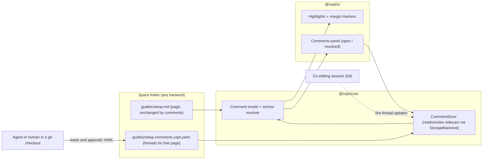
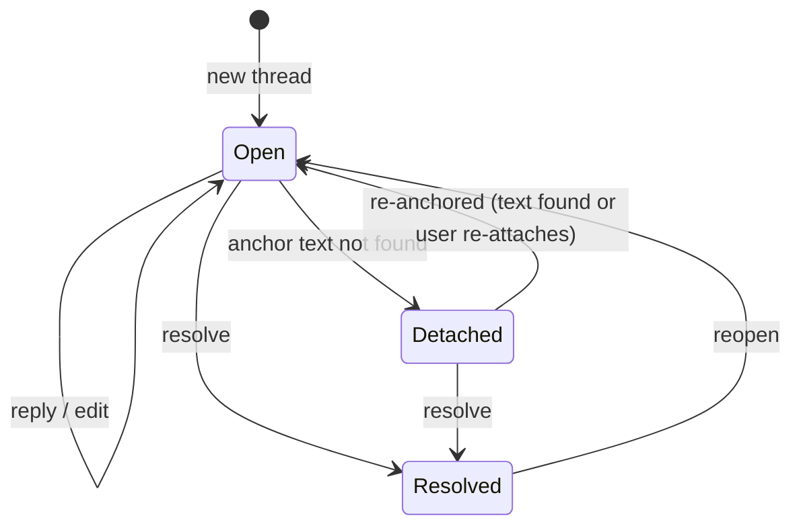

# Requirements: Notion parity and comment threads

**Status:** Draft, 2026-10-06 · **Area ID prefix:** `REQ-NTN` · **Owner:** nsheaps

Cept aims to support Notion's features as far as its file-based design allows. That goal is where the database requirements come from ([08 Editor](08-editor.md#req-edt-006--database-engine-crud-filter-sort-group-formula-relations-rollups)). This area does two things:

1. It keeps a **parity table**: each Notion feature mapped to the requirement that covers it, in this area or another, with its current state.
2. It specifies **comment threads**, which the owner wants implemented next. The owner wants to leave comments on pages and have an agent (Claude) read and answer them, instead of going back and forth in chat. That use case shapes the storage format: comments are plain YAML files inside the space, readable and writable from a git checkout.

**Related:**

- [README.md](README.md): index, traceability matrix, owner decisions
- [08-editor.md](08-editor.md): blocks, mentions, databases, wiki links, backlinks, graph (REQ-EDT)
- [03-spaces-and-storage.md](03-spaces-and-storage.md): spaces, `space.cept.ya?ml`, `.cept/` layout, backends (REQ-WS)
- [04-collaboration.md](04-collaboration.md): live co-editing, which must carry comments too (REQ-COL)
- [02-static-rendering.md](02-static-rendering.md): static output, which leaves comments out (REQ-SSG)
- [09-remotes-and-auth.md](09-remotes-and-auth.md): signed-in identity used as comment author (REQ-AUTH)
- [01-browser-app-and-pwa.md](01-browser-app-and-pwa.md): app shell, sidebar, header (REQ-WEB)
- Original spec: [docs/SPECIFICATION.md](../../SPECIFICATION.md) §1 principle 4 ("Full Notion feature parity"), §4.6 (`.cept/comments/<page-id>.yaml`), §5 page features ("Comments — inline comments on any block, threaded replies, resolve/unresolve")

## Contents

1. [Scope and non-goals](#1-scope-and-non-goals)
2. [Requirements summary](#2-requirements-summary)
3. [Notion parity table](#3-notion-parity-table)
4. [Comment architecture](#4-comment-architecture)
5. [Requirements](#5-requirements)
6. [Conflicts and open questions](#6-conflicts-and-open-questions)
7. [Stale documentation](#7-stale-documentation)
8. [Cross-area dependencies](#8-cross-area-dependencies)

## 1. Scope and non-goals

**In scope**

- Tracking Notion parity across all areas (the parity table).
- Comment threads: anchoring, replies, resolve and reopen, authors, storage, UI, agent access, static and live behaviour, tests.
- Notion features that no other area covers: page moves in the sidebar, page icon and cover editing, templates in the UI, synced blocks, page history UI and Notion import.

**Non-goals (covered elsewhere)**

- Block types, mentions, databases, wiki links, backlinks and the graph: [08](08-editor.md). The parity table links to them and does not restate them.
- Live transport and CRDT: [04](04-collaboration.md).
- Notion's hosted features that a file-based app cannot copy directly: workspace-wide permissions, guests, notifications by email, Notion AI. These are recorded as gaps in the table, not requirements.

## 2. Requirements summary

| ID                                                                            | Requirement                                      | Priority    | Impl status | Docs status            | Docs accurate |
| ----------------------------------------------------------------------------- | ------------------------------------------------ | ----------- | ----------- | ---------------------- | ------------- |
| [REQ-NTN-001](#req-ntn-001--notion-parity-is-tracked-feature-by-feature)      | Notion parity is tracked feature by feature      | MUST        | partial     | documented-differently | stale         |
| [REQ-NTN-002](#req-ntn-002--comment-threads-anchored-to-text-in-a-page)       | Comment threads anchored to text in a page       | MUST (next) | not-started | documented-differently | stale         |
| [REQ-NTN-003](#req-ntn-003--page-level-comment-threads)                       | Page-level comment threads                       | MUST (next) | not-started | undocumented           | n/a           |
| [REQ-NTN-004](#req-ntn-004--replies-edits-resolve-and-reopen)                 | Replies, edits, resolve and reopen               | MUST (next) | not-started | documented-as-desired  | n/a           |
| [REQ-NTN-005](#req-ntn-005--comments-stored-as-plain-yaml-files-in-the-space) | Comments stored as plain YAML files in the space | MUST (next) | not-started | documented-differently | stale         |
| [REQ-NTN-006](#req-ntn-006--agent-readable-comment-format-and-workflow)       | Agent-readable comment format and workflow       | MUST (next) | not-started | undocumented           | n/a           |
| [REQ-NTN-007](#req-ntn-007--comment-author-identity)                          | Comment author identity                          | MUST (next) | not-started | undocumented           | n/a           |
| [REQ-NTN-008](#req-ntn-008--comments-ui-in-the-editor)                        | Comments UI in the editor                        | MUST (next) | not-started | undocumented           | n/a           |
| [REQ-NTN-009](#req-ntn-009--comments-in-static-and-read-only-views)           | Comments in static and read-only views           | SHOULD      | not-started | undocumented           | n/a           |
| [REQ-NTN-010](#req-ntn-010--comments-sync-and-merge-cleanly)                  | Comments sync and merge cleanly                  | MUST (next) | not-started | undocumented           | n/a           |
| [REQ-NTN-011](#req-ntn-011--comment-tests)                                    | Comment tests                                    | MUST (next) | not-started | undocumented           | n/a           |
| [REQ-NTN-012](#req-ntn-012--move-and-reorder-pages-in-the-sidebar)            | Move and reorder pages in the sidebar            | SHOULD      | partial     | documented-as-desired  | n/a           |
| [REQ-NTN-013](#req-ntn-013--page-icon-and-cover-can-be-set-in-the-ui)         | Page icon and cover can be set in the UI         | SHOULD      | partial     | documented-as-desired  | n/a           |
| [REQ-NTN-014](#req-ntn-014--templates-usable-from-the-ui)                     | Templates usable from the UI                     | SHOULD      | stubbed     | documented-as-desired  | stale         |
| [REQ-NTN-015](#req-ntn-015--synced-blocks)                                    | Synced blocks                                    | MAY         | stubbed     | documented-as-desired  | n/a           |
| [REQ-NTN-016](#req-ntn-016--page-history-ui)                                  | Page history UI                                  | SHOULD      | stubbed     | documented-as-desired  | stale         |
| [REQ-NTN-017](#req-ntn-017--import-from-notion)                               | Import from Notion                               | SHOULD      | partial     | documented-as-desired  | n/a           |

"MUST (next)" marks the comment work the owner wants implemented next. Status vocabulary: see [README §1](README.md#status-vocabulary).

## 3. Notion parity table

Status is checked against the code on 2026-10-06. "Wired" means the feature is reachable in the running app, not only present as a component or library.

| Notion feature                                                       | Cept state today                                                                                                                        | Requirement                                                                                                                                                                |
| -------------------------------------------------------------------- | --------------------------------------------------------------------------------------------------------------------------------------- | -------------------------------------------------------------------------------------------------------------------------------------------------------------------------- |
| Block editor (text, headings, lists, quotes, code, dividers)         | Wired (TipTap, [CeptEditor.tsx](../../../packages/ui/src/components/editor/CeptEditor.tsx))                                             | [REQ-EDT-001](08-editor.md#req-edt-001--fully-wysiwyg-block-editor-in-the-app)                                                                                             |
| Callouts, toggles, columns, images, embeds, bookmarks, math, mermaid | Wired as editor extensions ([extensions/](../../../packages/ui/src/components/editor/extensions)); Markdown round-trip partly divergent | [REQ-EDT-002](08-editor.md#req-edt-002--rich-custom-blocks-are-editable-in-wysiwyg-mode), [REQ-EDT-024](08-editor.md#req-edt-024--toggle-block-encoding-is-gfm-compatible) |
| Slash menu                                                           | Wired; not every block is listed                                                                                                        | [REQ-EDT-003](08-editor.md#req-edt-003--slash-menu-exposes-all-supported-blocks)                                                                                           |
| `@` mentions (page, person, date)                                    | Extension exists ([mention.ts](../../../packages/ui/src/components/editor/extensions/mention.ts)) but is not loaded by `CeptEditor`     | [REQ-EDT-004](08-editor.md#req-edt-004--inline-mentions-pagepersondate)                                                                                                    |
| Databases: table, board, list, calendar, gallery (+ map)             | View components exist ([database/](../../../packages/ui/src/components/database)); not rendered from real data                          | [REQ-EDT-008](08-editor.md#req-edt-008--database-views-rendered-from-real-data)                                                                                            |
| Database timeline view                                               | Missing (only a template mentions it)                                                                                                   | Gap: add to [REQ-EDT-008](08-editor.md#req-edt-008--database-views-rendered-from-real-data) when databases are wired                                                       |
| Properties, filters, sorts, groups, formulas, relations, rollups     | Engine in core ([database/](../../../packages/core/src/database)) with tests                                                            | [REQ-EDT-006](08-editor.md#req-edt-006--database-engine-crud-filter-sort-group-formula-relations-rollups)                                                                  |
| Inline and linked databases                                          | Extension and `LinkedDatabaseView` exist; stubbed                                                                                       | [REQ-EDT-009](08-editor.md#req-edt-009--inline-and-linked-database-blocks-in-pages)                                                                                        |
| Page links and backlinks                                             | No `[[wiki-link]]` support; graph types mention backlinks only                                                                          | [REQ-EDT-017](08-editor.md#req-edt-017--wiki-link-crosslinks-between-files), [REQ-EDT-021](08-editor.md#req-edt-021--backlinks-panel)                                      |
| Nested pages and sidebar tree                                        | Wired ([Sidebar.tsx](../../../packages/ui/src/components/sidebar/Sidebar.tsx)); move limited to "move to root"                          | [REQ-NTN-012](#req-ntn-012--move-and-reorder-pages-in-the-sidebar)                                                                                                         |
| Breadcrumbs                                                          | Wired ([Breadcrumbs.tsx](../../../packages/ui/src/components/topbar/Breadcrumbs.tsx))                                                   | Covered; no separate requirement                                                                                                                                           |
| Quick find / search                                                  | Wired (`SearchPanel`, index queried in [App.tsx](../../../packages/ui/src/components/App.tsx) around line 776) and command palette      | Covered; no separate requirement                                                                                                                                           |
| Page icon and cover                                                  | Rendered by [PageHeader.tsx](../../../packages/ui/src/components/page-header/PageHeader.tsx) when set; no UI sets them                  | [REQ-NTN-013](#req-ntn-013--page-icon-and-cover-can-be-set-in-the-ui)                                                                                                      |
| Comments and discussions                                             | Missing                                                                                                                                 | [REQ-NTN-002](#req-ntn-002--comment-threads-anchored-to-text-in-a-page) to [REQ-NTN-011](#req-ntn-011--comment-tests)                                                      |
| Templates                                                            | Engine and built-ins in core ([templates/](../../../packages/core/src/templates)); no UI uses them                                      | [REQ-NTN-014](#req-ntn-014--templates-usable-from-the-ui)                                                                                                                  |
| Synced blocks                                                        | `syncedBlock` type in the model and parser; no editor extension                                                                         | [REQ-NTN-015](#req-ntn-015--synced-blocks)                                                                                                                                 |
| Page history                                                         | [HistoryViewer.tsx](../../../packages/ui/src/components/git/HistoryViewer.tsx) exists; not mounted in the app                           | [REQ-NTN-016](#req-ntn-016--page-history-ui)                                                                                                                               |
| Import from Notion                                                   | Wired: ZIP import in [ImportDialog.tsx](../../../packages/ui/src/components/import-export/ImportDialog.tsx) via `importNotionZip`       | [REQ-NTN-017](#req-ntn-017--import-from-notion)                                                                                                                            |
| Real-time co-editing and presence                                    | Not working (see 04)                                                                                                                    | [REQ-COL-001](04-collaboration.md#req-col-001--co-editing-available-for-shared-spaces)                                                                                     |
| Publish to web                                                       | Not built                                                                                                                               | [REQ-SSG-001](02-static-rendering.md#req-ssg-001--static-rendered-browser-component-exists)                                                                                |
| Permissions, guests, email notifications, Notion AI                  | Out of scope for a file-based app; access comes from the backend (for example repo permissions)                                         | Gap, not planned                                                                                                                                                           |

## 4. Comment architecture



A thread is anchored by quoting the text it refers to, not by IDs written into the Markdown. When the page changes, the anchor resolver finds the quote again. If it cannot, the thread is shown as **detached** at page level and is never dropped.



## 5. Requirements

### REQ-NTN-001 — Notion parity is tracked feature by feature

- **Statement:** Cept MUST support Notion's features as far as its file-based design allows. Every Notion feature MUST appear in the parity table (§3), mapped to a requirement or recorded as a gap with a reason.
- **Priority:** MUST
- **Source:** owner, 2026-10-06: "We need to support notion features to the best we can, that's where the 'database' requirement comes from."
- **Acceptance criteria:**
  - Each row of §3 links to a requirement ID or says "gap" with a reason.
  - When a feature ships or a requirement changes status, the row is updated in the same change.
- **Current state:** **partial.** Many building blocks exist (editor extensions, database engine and views, search, sidebar, import), but several are not wired into the app. See §3.
- **Docs state:** documented-differently, stale. [SPECIFICATION.md](../../SPECIFICATION.md) §1 principle 4 lists parity goals. [vs-notion.md](../../content/comparison/vs-notion.md) claims built-in templates and full Git version history, neither of which is reachable in the app (REQ-NTN-014, REQ-NTN-016).
- **Gap:** Keep §3 current; fix the claims in `vs-notion.md`.

### REQ-NTN-002 — Comment threads anchored to text in a page

- **Statement:** A user MUST be able to select text in a page and start a comment thread on it. The thread MUST stay attached to that text as the page is edited, by the page's own author, by co-editors, or outside Cept (for example in a text editor or a git merge).
- **Priority:** MUST (next)
- **Source:** owner, 2026-10-06 ("we need to support comment threads as well … close to one of the next things we implement").
- **Acceptance criteria:**
  - Selecting text and choosing "Comment" (toolbar button or `Mod-Alt-M`) opens a new thread on that selection.
  - The anchor stores the quoted text plus a little context before and after it, and the heading path it sits under. It does not store editor positions or IDs inside the Markdown.
  - After edits elsewhere in the page, the thread highlights the same text.
  - If the quoted text itself changes, the resolver accepts a close match; if none is found, the thread becomes **detached** and is listed at page level with its last quote. A detached thread can be re-attached to a new selection.
  - Overlapping threads on the same text are allowed.
- **Current state:** **not-started.** No comment code exists in [packages/core](../../../packages/core/src) or [packages/ui](../../../packages/ui/src) (only Markdown HTML-comment handling in the parser).
- **Docs state:** documented-differently, stale. [SPECIFICATION.md](../../SPECIFICATION.md) §5 says "inline comments on any block" and §4.6 keys comments by page ID; neither says how anchors survive edits.
- **Gap:** Comment model and anchor resolver in core; selection command in the editor.

### REQ-NTN-003 — Page-level comment threads

- **Statement:** A user MUST be able to start a thread on the page as a whole, not tied to any text.
- **Priority:** MUST (next)
- **Source:** Notion parity (page discussions); also the natural home for detached threads (REQ-NTN-002).
- **Acceptance criteria:**
  - The page header has a "Comment on page" action.
  - Page-level and detached threads appear at the top of the comments panel.
- **Current state:** **not-started.**
- **Docs state:** undocumented.
- **Gap:** Same model as REQ-NTN-002 with an empty anchor.

### REQ-NTN-004 — Replies, edits, resolve and reopen

- **Statement:** A thread MUST hold an ordered list of comments. Users MUST be able to reply, edit or delete their own comments, and resolve or reopen a thread.
- **Priority:** MUST (next)
- **Source:** Notion parity; [SPECIFICATION.md](../../SPECIFICATION.md) §5 ("threaded replies, resolve/unresolve").
- **Acceptance criteria:**
  - Replies are flat (one level), in time order, as in Notion.
  - Comment bodies are Markdown (inline formatting, links, code). They are stored as text, not rendered HTML.
  - Editing sets an `edited` timestamp. Deleting leaves a tombstone so replies keep their context.
  - Resolving records who resolved it and when; reopening clears that. Resolved threads keep all comments.
- **Current state:** **not-started.**
- **Docs state:** documented-as-desired (SPECIFICATION §5, one line).
- **Gap:** All of it.

### REQ-NTN-005 — Comments stored as plain YAML files in the space

- **Statement:** Comments MUST be stored as plain YAML files inside the space, through the `StorageBackend`, so they travel with the space on every backend (browser, local folder, git, and later gdrive and sftp). Adding or changing a comment MUST NOT change the page's Markdown file.
- **Priority:** MUST (next)
- **Source:** owner use case (comments readable from a git checkout); [REQ-WS-008](03-spaces-and-storage.md#req-ws-008--common-extensible-storagebackend-interface).
- **Proposed layout:** a sidecar next to each page: `guides/setup.md` → `guides/setup.comments.cept.yaml`. The `.cept.yaml` suffix matches `space.cept.yaml` (D-1). Moving or renaming a page in Cept moves its sidecar too. An alternative is `.cept/comments/<page-id>.yaml` as in SPECIFICATION §4.6; see §6 question 1.
- **Proposed format:**

  ```yaml
  version: 1
  page: setup.md
  threads:
    - id: t-01hz3k
      status: open # open | resolved
      anchor:
        quote: 'run mise install'
        prefix: 'First, '
        suffix: ' in the repo root'
        headings: ['Setup', 'Tools']
      comments:
        - id: c-01hz3m
          author: { name: Nate Heaps, id: 'github:nsheaps' }
          created: 2026-10-06T21:04:00Z
          body: |
            Should this mention `mise trust` first?
        - id: c-01hz4a
          author: { name: Claude, id: 'agent:claude' }
          created: 2026-10-06T21:30:00Z
          body: Yes, added a step before it.
  ```

- **Acceptance criteria:**
  - Comments round-trip on every backend that is wired (browser, local folder, git): create, reload, all fields intact.
  - A page with no threads has no sidecar file.
  - Moving, renaming or deleting a page in Cept moves, renames or deletes its sidecar in the same operation. Deleting asks first if open threads exist.
  - Sidecars are hidden from the sidebar page tree.
  - The schema is documented and versioned (`version: 1`).
- **Current state:** **not-started.**
- **Docs state:** documented-differently, stale. [SPECIFICATION.md](../../SPECIFICATION.md) §4.6 puts threads in `.cept/comments/<page-id>.yaml`, but pages have no stable ID in their file today (pages are `pages/page-<timestamp>.md`; see [README §2](README.md#2-cept-today)).
- **Gap:** Owner choice of layout (§6 question 1), then a `CommentStore` in core.

### REQ-NTN-006 — Agent-readable comment format and workflow

- **Statement:** An agent (or a person) with only a checkout of the space MUST be able to find open threads, read the text they refer to, and reply, by editing the YAML files. Cept MUST pick up those replies the next time it syncs.
- **Priority:** MUST (next)
- **Source:** owner, 2026-10-06: "so I can leave comments and ask you to check them for feedback rather than back and forth here."
- **Acceptance criteria:**
  - A short guide in `docs/content/guides/` explains the format, how to find open threads (for example `grep -l "status: open" -r --include='*.comments.cept.yaml'`), and how to append a reply.
  - Hand-written replies that follow the guide (new comment appended, unique `id`, ISO timestamp) load without errors. Small mistakes (missing `id`, missing timestamp) are repaired on load with a warning, not rejected.
  - A YAML file that cannot be parsed never deletes threads: Cept shows an error for that page and leaves the file alone.
  - Agent authors use `id: "agent:<name>"` so the UI can mark them.
  - Later (not required now): `cept comments list|reply` in the CLI ([05](05-cli-and-daemon.md)).
- **Current state:** **not-started.**
- **Docs state:** undocumented.
- **Gap:** Guide, lenient loader, tests with hand-edited fixtures.

### REQ-NTN-007 — Comment author identity

- **Statement:** Every comment MUST record an author with a display name and a stable ID. When the user is signed in to a remote, the ID comes from that account; otherwise from a local display name set once in settings.
- **Priority:** MUST (next)
- **Source:** Notion parity; [09 Remotes and auth](09-remotes-and-auth.md).
- **Acceptance criteria:**
  - Signed in with GitHub: `id: "github:<login>"`. Google: `id: "google:<email-hash>"` (no raw email in the file).
  - Not signed in: the app asks for a display name the first time the user comments, and uses `id: "local:<random>"`, stored in settings.
  - Users can edit or delete only comments whose author ID matches theirs. This is a UI rule, not security; anyone with write access to the files can change them.
- **Current state:** **not-started.** The GitHub auth code exists but sign-in is not working end to end (see [REQ-AUTH-002](09-remotes-and-auth.md#req-auth-002--github-sign-in-via-a-github-app)).
- **Docs state:** undocumented.
- **Gap:** Identity helper shared with collaboration presence.

### REQ-NTN-008 — Comments UI in the editor

- **Statement:** The editor MUST show where comments are and let users read and write them without leaving the page.
- **Priority:** MUST (next)
- **Source:** Notion parity.
- **Acceptance criteria:**
  - Anchored text is highlighted; a margin marker shows the number of comments.
  - Clicking a highlight or marker opens the thread in a side panel. The panel lists all threads in document order, with filters for open, resolved and detached.
  - Users can reply, edit, delete, resolve and reopen from the panel.
  - The sidebar page tree shows a count of open threads per page.
  - Works at phone width (the panel becomes a bottom sheet) and by keyboard alone.
- **Current state:** **not-started.**
- **Docs state:** undocumented.
- **Gap:** TipTap decoration plugin for highlights; panel component.

### REQ-NTN-009 — Comments in static and read-only views

- **Statement:** Static output MUST leave comments out unless a render option includes them. Read-only views (the read-only docs site, a public repo without write access) MUST NOT offer to add comments.
- **Priority:** SHOULD
- **Source:** derived from [02 Static rendering](02-static-rendering.md) and [REQ-WS-008](03-spaces-and-storage.md#req-ws-008--common-extensible-storagebackend-interface) capabilities.
- **Acceptance criteria:**
  - `cept render` does not copy `*.comments.cept.yaml` to the output by default.
  - The comment actions are hidden when the backend reports no write capability.
- **Current state:** **not-started.**
- **Docs state:** undocumented.
- **Gap:** Render filter; capability check in the UI.

### REQ-NTN-010 — Comments sync and merge cleanly

- **Statement:** Comments MUST sync with the space like any other file, and concurrent comments from different people MUST NOT be lost. When co-editing is active, new comments MUST appear for other participants without a reload.
- **Priority:** MUST (next) for file sync; SHOULD for live updates (depends on [04](04-collaboration.md)).
- **Source:** derived from the owner's use case (comments added in the app and by an agent in git at the same time).
- **Acceptance criteria:**
  - Writes are append-friendly: new threads and comments are added at the end of their list, and every item has its own ID, so two people appending at once produce a simple git merge.
  - When a git sync hits a conflict in a sidecar, Cept merges the two versions by thread and comment ID (union; for the same comment the later `edited` wins) instead of asking the user.
  - With co-editing, thread changes go through the same session as page edits.
- **Current state:** **not-started.** Sync itself is not wired yet (see [REQ-WS-014](03-spaces-and-storage.md#req-ws-014--git-backed-space-write-commit-pushpull-sync)).
- **Docs state:** undocumented.
- **Gap:** ID-based merge function in core; hook into sync conflict handling.

### REQ-NTN-011 — Comment tests

- **Statement:** The comment feature MUST ship with unit tests for the model, anchor resolver, loader and merge, and an e2e test that adds, replies to, resolves and reloads a thread.
- **Priority:** MUST (next)
- **Source:** repo rules ([CLAUDE.md](../../../CLAUDE.md) testing requirements); [REQ-ENG-008](10-engineering-and-ci.md#req-eng-008--pr-unit-tests-scoped-to-affected-projects).
- **Acceptance criteria:**
  - Anchor tests cover: edits before and after the quote, a changed quote (close match), a deleted quote (detached), repeated text (prefix and suffix pick the right one).
  - Loader tests use hand-edited fixtures, including a malformed one.
  - The e2e test captures a screenshot of the comments panel for the docs.
- **Current state:** **not-started.**
- **Docs state:** undocumented.
- **Gap:** All of it.

### REQ-NTN-012 — Move and reorder pages in the sidebar

- **Statement:** Users SHOULD be able to move a page under any other page, and reorder siblings, from the sidebar (drag and drop, and a "Move to…" picker).
- **Priority:** SHOULD
- **Source:** Notion parity.
- **Acceptance criteria:**
  - Dragging a page onto another nests it; dragging between pages reorders.
  - "Move to…" offers a searchable page picker. Keyboard users can move pages without dragging.
  - With a folder layout (D-3), moving a page moves its file, child folder and comment sidecar.
- **Current state:** **partial.** The tree renders and the context menu offers "Duplicate" and "Move…" (which calls `onMoveToRoot`, so it can only move to the top level) ([PageContextMenu.tsx](../../../packages/ui/src/components/sidebar/PageContextMenu.tsx)). No drag and drop.
- **Docs state:** documented-as-desired (SPECIFICATION §5 page nesting).
- **Gap:** Move-to picker, drag and drop, file moves.

### REQ-NTN-013 — Page icon and cover can be set in the UI

- **Statement:** Users SHOULD be able to set, change and remove a page's icon (emoji or image) and cover image from the page header.
- **Priority:** SHOULD
- **Source:** Notion parity; SPECIFICATION §5 ("Page icon", "Page cover").
- **Acceptance criteria:**
  - Hovering the header shows "Add icon" and "Add cover".
  - Values are stored in the page's front matter; images go to the space's assets folder.
  - The sidebar shows the page icon.
- **Current state:** **partial.** [PageHeader.tsx](../../../packages/ui/src/components/page-header/PageHeader.tsx) renders `icon` and `cover` when present; nothing in the UI sets them.
- **Docs state:** documented-as-desired.
- **Gap:** Pickers and front-matter writes.

### REQ-NTN-014 — Templates usable from the UI

- **Statement:** Users SHOULD be able to create a page or database from a template, and save a page as a template.
- **Priority:** SHOULD
- **Source:** Notion parity; SPECIFICATION §1 principle 4.
- **Acceptance criteria:**
  - "New page" offers built-in and space templates.
  - Space templates are stored as files in the space (location set with the `.cept/` layout, [REQ-WS-018](03-spaces-and-storage.md#req-ws-018--cept-metadata-directory-conventions)).
- **Current state:** **stubbed.** The template engine and built-ins exist with tests in [core/src/templates](../../../packages/core/src/templates); no `.tsx` file uses them.
- **Docs state:** documented-as-desired, stale. [vs-notion.md](../../content/comparison/vs-notion.md) lists "Built-in + custom" templates as a feature.
- **Gap:** UI entry points.

### REQ-NTN-015 — Synced blocks

- **Statement:** Users MAY place the same block content on several pages, with edits in one place showing everywhere.
- **Priority:** MAY
- **Source:** Notion parity.
- **Acceptance criteria:**
  - A synced block is stored once (in its source page) and referenced from the others; the Markdown of referencing pages stays readable (fallback text plus a reference).
- **Current state:** **stubbed.** `syncedBlock` is a block type in [models/index.ts](../../../packages/core/src/models/index.ts) and has a case in the Markdown parser; there is no editor extension.
- **Docs state:** documented-as-desired (SPECIFICATION block list).
- **Gap:** Encoding decision, extension, resolver.

### REQ-NTN-016 — Page history UI

- **Statement:** Users SHOULD be able to see a page's history, view a diff and restore an earlier version, on backends that keep history (git).
- **Priority:** SHOULD
- **Source:** Notion parity; SPECIFICATION §5 ("Page history — powered by Git log").
- **Acceptance criteria:**
  - "Page history" appears in the page menu only when the backend has the history capability.
  - Restoring creates a new version; it never rewrites history.
- **Current state:** **stubbed.** [HistoryViewer.tsx](../../../packages/ui/src/components/git/HistoryViewer.tsx) exists but is not mounted in [App.tsx](../../../packages/ui/src/components/App.tsx).
- **Docs state:** documented-as-desired, stale. [vs-notion.md](../../content/comparison/vs-notion.md) promises unlimited Git version history.
- **Gap:** Mount the viewer behind a capability check; restore action.

### REQ-NTN-017 — Import from Notion

- **Statement:** Users SHOULD be able to import a Notion export (ZIP of Markdown and CSV) into a space, keeping page nesting, databases and attachments.
- **Priority:** SHOULD
- **Source:** Notion parity; [from-notion.md](../../content/migration/from-notion.md).
- **Acceptance criteria:**
  - Nesting, database rows (CSV) and images survive the import; a report lists anything skipped.
  - The imported layout follows the space folder layout (D-3).
- **Current state:** **partial.** [ImportDialog.tsx](../../../packages/ui/src/components/import-export/ImportDialog.tsx) calls `importNotionZip` from core, which has tests ([notion-importer.ts](../../../packages/core/src/importers/notion-importer.ts)). Database fidelity and the target layout are not checked by any e2e test.
- **Docs state:** documented-as-desired.
- **Gap:** E2e test with a sample export; align output with the space layout.

## 6. Conflicts and open questions

1. **Comment file location.** Proposed: a sidecar per page (`setup.comments.cept.yaml`). It moves with the page, is easy to find in a checkout, and diffs per page. Its cost is one extra file next to commented pages. SPECIFICATION §4.6 uses `.cept/comments/<page-id>.yaml`. That keeps folders clean but needs a stable page ID in every page's front matter and an extra lookup to find a page's comments. Owner to choose.
2. **Anchors in the Markdown or not.** The proposal keeps the Markdown untouched and anchors by quote. Writing invisible markers (HTML comments) into the Markdown would make anchors exact but would change the page file on every comment and show up in diffs. Recommendation: quotes only.
3. **Notifications.** Notion notifies on replies and mentions. Cept has no server. Options: none (v1), an in-app "new since last visit" badge, or later via the daemon. Recommendation: in-app badge only.
4. **Comment bodies as Markdown.** Proposed yes (inline formatting and links), stored as text. Mentions in comments wait for REQ-EDT-004.

## 7. Stale documentation

| Document                                                                      | Problem                                                                                                    |
| ----------------------------------------------------------------------------- | ---------------------------------------------------------------------------------------------------------- |
| [docs/content/comparison/vs-notion.md](../../content/comparison/vs-notion.md) | Claims "Built-in + custom" templates and full Git version history; neither is reachable in the app.        |
| [docs/SPECIFICATION.md](../../SPECIFICATION.md) §4.6                          | Comment storage keyed by page ID that pages do not have; superseded by REQ-NTN-005 once the owner chooses. |

## 8. Cross-area dependencies

| This area needs                                     | From                    | Requirement(s)                                                                                                                                                                                                                                                                                                                                                                                                   |
| --------------------------------------------------- | ----------------------- | ---------------------------------------------------------------------------------------------------------------------------------------------------------------------------------------------------------------------------------------------------------------------------------------------------------------------------------------------------------------------------------------------------------------- |
| File access on every backend, write capability flag | Spaces and storage      | [REQ-WS-008](03-spaces-and-storage.md#req-ws-008--common-extensible-storagebackend-interface)                                                                                                                                                                                                                                                                                                                    |
| Folder layout so sidecars sit next to pages         | Spaces and storage      | [REQ-WS-001](03-spaces-and-storage.md#req-ws-001--space-is-a-folder-in-a-filesystem)                                                                                                                                                                                                                                                                                                                             |
| Sync and conflict handling                          | Spaces and storage, CLI | [REQ-WS-014](03-spaces-and-storage.md#req-ws-014--git-backed-space-write-commit-pushpull-sync), [REQ-CLI-004](05-cli-and-daemon.md)                                                                                                                                                                                                                                                                              |
| Signed-in identity                                  | Remotes and auth        | [REQ-AUTH-002](09-remotes-and-auth.md#req-auth-002--github-sign-in-via-a-github-app)                                                                                                                                                                                                                                                                                                                             |
| Live updates                                        | Collaboration           | [REQ-COL-001](04-collaboration.md#req-col-001--co-editing-available-for-shared-spaces)                                                                                                                                                                                                                                                                                                                           |
| Comments left out of static output                  | Static rendering        | [REQ-SSG-001](02-static-rendering.md#req-ssg-001--static-rendered-browser-component-exists)                                                                                                                                                                                                                                                                                                                      |
| Databases, mentions, wiki links, backlinks          | Editor                  | [REQ-EDT-006](08-editor.md#req-edt-006--database-engine-crud-filter-sort-group-formula-relations-rollups) to [REQ-EDT-009](08-editor.md#req-edt-009--inline-and-linked-database-blocks-in-pages), [REQ-EDT-004](08-editor.md#req-edt-004--inline-mentions-pagepersondate), [REQ-EDT-017](08-editor.md#req-edt-017--wiki-link-crosslinks-between-files), [REQ-EDT-021](08-editor.md#req-edt-021--backlinks-panel) |
