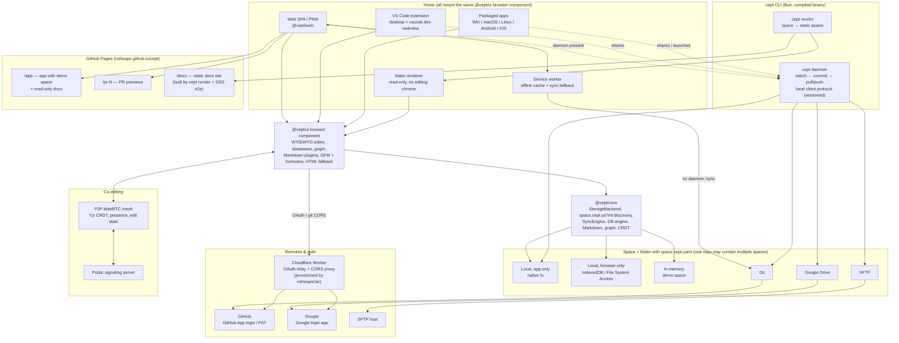
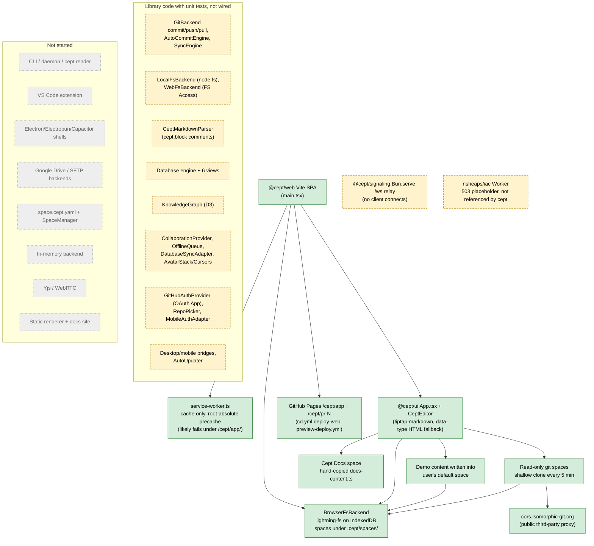

# Cept requirements

**Status:** Draft, 2026-10-06 · **Scope:** the whole product · **Owner:** nsheaps

This directory holds Cept's formal requirements. They restate the owner's target design for Cept as numbered, testable requirements. Each one is checked against three things as of the date above: the code on `main`, the open pull requests, and the current documentation. This README is the index. Each per-area file has the requirement text, acceptance criteria, evidence, an architecture section with diagrams, conflicts, stale docs and cross-area dependencies.

> These requirements describe the **target**. Most of Cept does not meet them yet. Where an existing document (`docs/SPECIFICATION.md`, `TASKS.md`, the roadmap) disagrees with a requirement here, the requirement records the conflict. The owner decides it; see [§6](#6-conflicts-and-owner-decisions-needed).

> **Current build-out scope:** see [../scope.md](../scope.md) for which requirements are in scope now, which are deferred, and the open scope questions.

## Contents

1. [How to read these specs](#1-how-to-read-these-specs)
2. [Cept today](#2-cept-today)
3. [Component overview](#3-component-overview)
4. [Architecture](#4-architecture)
5. [Traceability matrix](#5-traceability-matrix)
6. [Conflicts and owner decisions needed](#6-conflicts-and-owner-decisions-needed)
7. [Stale documentation](#7-stale-documentation)
8. [Relationship to existing documents](#8-relationship-to-existing-documents)
9. [Open pull requests](#9-open-pull-requests)

## 1. How to read these specs

### Area files

| #   | Area                                                                          | File                                                                 | ID prefix  |
| --- | ----------------------------------------------------------------------------- | -------------------------------------------------------------------- | ---------- |
| 01  | Browser app, service worker & PWA (incl. demo space, GitHub Pages app deploy) | [01-browser-app-and-pwa.md](01-browser-app-and-pwa.md)               | `REQ-WEB`  |
| 02  | Static rendered component, static sites and the Cept docs site                | [02-static-rendering.md](02-static-rendering.md)                     | `REQ-SSG`  |
| 03  | Spaces (`space.cept.ya?ml`, multi-space per repo) & storage backends          | [03-spaces-and-storage.md](03-spaces-and-storage.md)                 | `REQ-WS`   |
| 04  | Co-editing & P2P WebRTC collaboration                                         | [04-collaboration.md](04-collaboration.md)                           | `REQ-COL`  |
| 05  | CLI, sync daemon & `render` command                                           | [05-cli-and-daemon.md](05-cli-and-daemon.md)                         | `REQ-CLI`  |
| 06  | VS Code extension (desktop and web)                                           | [06-vscode-extension.md](06-vscode-extension.md)                     | `REQ-VSC`  |
| 07  | Packaged apps (Windows, macOS, Linux, Android, iOS)                           | [07-native-apps.md](07-native-apps.md)                               | `REQ-APP`  |
| 08  | Editor: WYSIWYG, databases, Markdown plugins, GFM, graph, HTML fallback       | [08-editor.md](08-editor.md)                                         | `REQ-EDT`  |
| 09  | Remotes & authentication (GitHub App, Google, PAT, Cloudflare proxy)          | [09-remotes-and-auth.md](09-remotes-and-auth.md)                     | `REQ-AUTH` |
| 10  | Monorepo, toolchain & CI/CD                                                   | [10-engineering-and-ci.md](10-engineering-and-ci.md)                 | `REQ-ENG`  |
| 11  | Notion parity and comment threads                                             | [11-notion-parity-and-comments.md](11-notion-parity-and-comments.md) | `REQ-NTN`  |

### ID scheme

Requirement IDs are `REQ-<AREA>-NNN`, for example `REQ-WS-006`. IDs are stable: a removed requirement keeps its number and is marked withdrawn, and new requirements take the next free number. Commits, PRs, tests and `TASKS.md` entries should cite these IDs. Priorities use RFC 2119 words: **MUST**, **SHOULD** and **MAY**.

### Status vocabulary

Every requirement carries three statuses.

| Dimension      | Value                    | Meaning                                                                                                               |
| -------------- | ------------------------ | --------------------------------------------------------------------------------------------------------------------- |
| Implementation | `implemented`            | Works in the running product on `main` and meets the acceptance criteria.                                             |
|                | `partial`                | Some acceptance criteria are met in the running product; others are missing.                                          |
|                | `stubbed`                | Code exists but does not reach users: not wired into the app, UI-only, types-only, or a CI job that produces nothing. |
|                | `not-started`            | No code.                                                                                                              |
|                | `divergent`              | Built, but differently from the requirement (for example IndexedDB where in-memory is required).                      |
|                | `deferred`               | Requirement explicitly deferred by owner decision; will not be implemented in the near term.                          |
|                | `decided`                | Owner decision recorded; requirement updated to reflect the decision (not an implementation status).                  |
| Documentation  | `documented-as-desired`  | Some project doc describes the behaviour the way the requirement does.                                                |
|                | `documented-differently` | Docs describe a different design (for example Electron where the requirement says "Bun/TS where possible").           |
|                | `undocumented`           | No doc covers it.                                                                                                     |
| Docs accuracy  | `accurate`               | What the docs say about today's state is true.                                                                        |
|                | `stale`                  | The docs claim something that is not true today (usually "Done" for work that is not wired).                          |
|                | `n/a`                    | Nothing documented to be accurate or not.                                                                             |

Evidence is cited as repo-relative paths (with line numbers where useful), PR numbers, issue numbers or `TASKS.md` task IDs. Anything not checked is marked _unverified_.

## 2. Cept today

Cept is a Bun, TypeScript and Nx monorepo for a Notion-like editor whose pages are stored as Markdown files. Today it ships as **one product: a browser single-page app**. That app is deployed to GitHub Pages at `nsheaps.github.io/cept/app/`, with per-PR previews at `/cept/pr-N/`. Everything else in the target design is either library code that the app never calls, or does not exist yet.

**What works.**

- **Editor.** A real TipTap 3 WYSIWYG editor (`packages/ui/src/components/editor/CeptEditor.tsx`). It has a slash menu, drag handles, GFM tables and task lists, code highlighting, callouts, toggles, columns, images, embeds and bookmarks.
- **Saving.** Pages are saved as Markdown through the third-party `tiptap-markdown` extension. Blocks that have no Markdown form fall back to `<div data-type="…">` HTML.
- **Storage.** Everything is stored in the browser in IndexedDB (lightning-fs, `BrowserFsBackend`). One backend instance holds every "space" under `.cept/spaces/<id>/`. Pages are flat `pages/page-<timestamp>.md` files, and the page tree is kept in `.cept/workspace-state.json` (legacy code name).
- **Read-only Git spaces.** You can add a public Git repo as a read-only space. It is shallow-cloned through the public `cors.isomorphic-git.org` proxy and re-cloned every 5 minutes. Nothing is ever committed or pushed.
- **Bundled docs.** The app includes a read-only "Cept Docs" space. Its pages are hand-copied TypeScript constants in `packages/ui/src/components/docs/docs-content.ts`, and they have drifted from `docs/content/`.
- **Engineering.** Nx, Bun and strict TypeScript work. CI is split into reusable `_*.yml` workflows. Release tags come from release-it with conventional commits, and GitHub Pages deploys happen on `v*` tags.

**What exists only as tested library code** (exported from `@cept/core` or `@cept/ui`, but nothing in the app uses it):

- the Git engine (`GitBackend` commit, push and pull; `AutoCommitEngine`; `SyncEngine`);
- the local-folder backends (`LocalFsBackend` on `node:fs`, `WebFsBackend` on the File System Access API);
- the Markdown parser `CeptMarkdownParser` with `cept:block` comments;
- the database engine and its six views;
- the D3 knowledge graph;
- mentions and inline databases;
- the CRDT session, offline queue and database-sync classes;
- the presence avatars and cursors;
- `GitHubAuthProvider` (an OAuth App client) and `RepoPicker`;
- the desktop and mobile bridges and the auto-updater.

`TASKS.md` marks much of this "done" in Phases 2–7 and 10. Its own continuation tasks (P2–P8, unchecked) say the same work is not wired.

**What is broken.**

- **PWA install and offline.** The service worker precaches `/`, `/index.html` and `/manifest.json` at the origin root, but the app lives under `/cept/app/`. The manifest's `start_url` is `/` and its icons are missing. Install and offline are therefore very likely broken in production. This was inferred from 404s on those URLs and not tested in a browser.
- **Service worker sync.** The service worker does not sync anything, although its header comment says it does.
- **Demo.** The demo writes sample pages into the user's real IndexedDB default space and renames it "Demo Space". It does not use in-memory storage. The documented `?demo` URL parameter and the `CEPT_DEMO_MODE` flag do not exist.
- **Native builds.** The `cd.yml` desktop and mobile jobs pass green but produce no artifacts. Every recent GitHub Release has zero assets.
- **CI.** The e2e and screenshot jobs fail on the open Renovate PRs, and those jobs gate `_tag-release`. The last release is v0.7.31 (2026-08-23). Whether `main` itself is red is unverified.

**What does not exist at all:**

- a CLI, a sync daemon or a local daemon API;
- a `render` static-site command or any static or SSR output;
- a docs site (the `@cept/docs` build is `echo`);
- a VS Code extension;
- an Electron or Electrobun main process, or a Capacitor project;
- Google Drive and SFTP backends;
- `space.cept.yaml` and nested spaces;
- Yjs or any WebRTC code;
- a Cept-side link to the Cloudflare proxy (the nsheaps/iac Worker deploys as a 503 placeholder);
- mise tasks, a format autofix job, `nx affected` scoping, Nx module-boundary tags and security scanning.

**Docs.** The user-facing roadmap (`docs/content/reference/roadmap.md`), `README.md`, `CHANGELOG.md` 0.1.0 and the comparison pages present many unwired features as available. These include databases, the graph, wiki-links, mermaid live preview, collaboration, local folders, Git sync and desktop and mobile apps. `docs/SPECIFICATION.md` is internally consistent, but it differs from the owner's design in a few basic ways:

- It says "client-only, no daemon", where the owner wants a CLI daemon.
- It calls for an OAuth App, where the owner wants a GitHub App plus Google sign-in and PATs.
- It uses `.cept/config.yaml`, where the owner wants `space.cept.yaml`.
- It specifies a WebSocket relay, where the owner wants P2P WebRTC.
- It says Starlight/VitePress docs, where the owner wants docs built by Cept's own static generator.

**By the numbers.** Of 207 requirements, 7 are implemented, 56 partial, 32 stubbed, 89 not started, 21 divergent and 2 deferred.

## 3. Component overview

Counts are requirements per area by implementation status (generated from the area summary tables).

| Component                                               | Area spec                              | Requirements | Implemented | Partial | Stubbed | Not started | Divergent | Deferred |
| ------------------------------------------------------- | -------------------------------------- | ------------ | ----------- | ------- | ------- | ----------- | --------- | -------- |
| Browser component, service worker, PWA, demo, Pages app | [01](01-browser-app-and-pwa.md)        | 23           | 2           | 15      | 1       | 3           | 2         | 0        |
| Static rendered component & docs site                   | [02](02-static-rendering.md)           | 18           | 0           | 6       | 0       | 9           | 3         | 0        |
| Spaces & storage backends                               | [03](03-spaces-and-storage.md)         | 22           | 1           | 6       | 4       | 6           | 3         | 2        |
| Co-editing (P2P WebRTC)                                 | [04](04-collaboration.md)              | 13           | 0           | 1       | 4       | 6           | 2         | 0        |
| CLI & sync daemon                                       | [05](05-cli-and-daemon.md)             | 14           | 0           | 0       | 3       | 11          | 0         | 0        |
| VS Code extension                                       | [06](06-vscode-extension.md)           | 16           | 0           | 1       | 0       | 15          | 0         | 0        |
| Packaged native apps                                    | [07](07-native-apps.md)                | 21           | 0           | 2       | 7       | 11          | 1         | 0        |
| Editor, databases, Markdown, graph                      | [08](08-editor.md)                     | 25           | 1           | 9       | 4       | 6           | 5         | 0        |
| Remotes & auth                                          | [09](09-remotes-and-auth.md)           | 18           | 0           | 5       | 6       | 5           | 2         | 0        |
| Monorepo, toolchain & CI/CD                             | [10](10-engineering-and-ci.md)         | 20           | 3           | 7       | 0       | 7           | 3         | 0        |
| Notion parity and comment threads                       | [11](11-notion-parity-and-comments.md) | 17           | 0           | 4       | 3       | 10          | 0         | 0        |
| **Total**                                               |                                        | **207**      | **7**       | **56**  | **32**  | **89**      | **21**    | **2**    |

How each handler requirement maps to areas:

| Owner requirement                                                     | Requirements                                       |
| --------------------------------------------------------------------- | -------------------------------------------------- |
| Browser component (UI)                                                | REQ-WEB-001…004                                    |
| Service worker handles syncing                                        | REQ-WEB-005…008 (sync itself: REQ-WEB-007)         |
| Static rendered browser component (public site, "sans interface")     | REQ-SSG-001…006, 010…012                           |
| Space = folder in some filesystem                                     | REQ-WS-001, 007, 008, 018, 019                     |
| Nested spaces (deferred, D-3)                                         | REQ-WS-005, 006                                    |
| Storage: local (app only), local (browser only), git, gdrive, sftp    | REQ-WS-009…016, 017; REQ-WEB-023; REQ-APP-009      |
| `space.cept.ya?ml` defines space root                                 | REQ-WS-002…004                                     |
| Co-editing over public P2P WebRTC, sharing edit stats and reconciling | REQ-COL-001…013                                    |
| CLI with sync daemon                                                  | REQ-CLI-001…009, 012                               |
| CLI render static site command                                        | REQ-CLI-010; REQ-SSG-007…009                       |
| VS Code plugin: same browser component, shares daemon, desktop + web  | REQ-VSC-001…016                                    |
| PWA: shares local daemon, else service worker                         | REQ-WEB-009, 010; REQ-CLI-007                      |
| Packaged app for Windows/macOS/Linux/Android/iOS                      | REQ-APP-001…021                                    |
| Fully WYSIWYG                                                         | REQ-EDT-001…005                                    |
| Databases, storage in multiple formats                                | REQ-EDT-006…009                                    |
| Markdown plugins via fenced annotations (` ```mermaid `)              | REQ-EDT-010…013                                    |
| GFM, footnotes for repeated info                                      | REQ-EDT-014…016                                    |
| Graph with crosslinks, browsable like Obsidian                        | REQ-EDT-017…021                                    |
| Fallback to HTML where storage lacks support                          | REQ-EDT-022…024                                    |
| Auth: GitHub App, Google login, GitHub PAT                            | REQ-AUTH-001…007, 010…018                          |
| Cloudflare OAuth proxy Worker via nsheaps/iac                         | REQ-AUTH-008, 009                                  |
| Docs site is a static deployment that e2e-tests static generation     | REQ-SSG-013…016; REQ-CLI-011; REQ-ENG-016          |
| Demo space with in-memory storage                                     | REQ-WEB-012…014                                    |
| GitHub Pages: just the app, demo space + read-only docs               | REQ-WEB-015…021; REQ-ENG-014, 015                  |
| CI autofix (formatting)                                               | REQ-ENG-006, 007                                   |
| CI unit tests scoped to the PR                                        | REQ-ENG-008; REQ-VSC-014; REQ-CLI-014; REQ-APP-019 |
| Monorepo with Nx + mise like other nsheaps repos                      | REQ-ENG-001…005, 011                               |
| Bun/TS where possible                                                 | REQ-ENG-010; REQ-APP-007                           |
| Notion parity and comment threads                                     | REQ-NTN-001…017                                    |

## 4. Architecture

### 4.1 Target architecture

Every host mounts the same browser component, `@cept/ui`. Hosts never talk to storage directly. They go through a `StorageBackend` that is either local to the host or provided by the shared local daemon. Remote sync is done by the daemon when it is present, and by the service worker when it is not.



### 4.2 What exists and is wired today

Solid boxes are code that runs in production. Dashed boxes are code that exists but is not reachable from the running app. Grey boxes do not exist.



The area files have more detailed diagrams in each of their "Architecture" sections.

## 5. Traceability matrix

Every requirement, linked to its section in the area file. Priority, statuses and anchors come from the area summary tables, and the anchors were checked against the actual headings.

| ID                                                                                                                   | Requirement                                                                  | Priority    | Implementation | Documentation          | Docs accuracy |
| -------------------------------------------------------------------------------------------------------------------- | ---------------------------------------------------------------------------- | ----------- | -------------- | ---------------------- | ------------- |
| [REQ-WEB-001](01-browser-app-and-pwa.md#req-web-001--shared-browser-ui-component)                                    | Shared browser UI component mounted by every host                            | MUST        | partial        | documented-as-desired  | stale         |
| [REQ-WEB-002](01-browser-app-and-pwa.md#req-web-002--ui-free-of-platform-imports)                                    | UI free of platform imports                                                  | MUST        | partial        | documented-as-desired  | accurate      |
| [REQ-WEB-003](01-browser-app-and-pwa.md#req-web-003--ui-talks-to-storage-only-through-the-injected-backend)          | UI uses storage only through the injected backend                            | MUST        | divergent      | documented-as-desired  | stale         |
| [REQ-WEB-004](01-browser-app-and-pwa.md#req-web-004--web-spa-boots-fully-functional-on-browser-only-storage)         | Web SPA boots on browser-only storage                                        | MUST        | partial        | documented-as-desired  | stale         |
| [REQ-WEB-005](01-browser-app-and-pwa.md#req-web-005--service-worker-registered-with-correct-scope)                   | Service worker registered at base path                                       | MUST        | partial        | documented-as-desired  | accurate      |
| [REQ-WEB-006](01-browser-app-and-pwa.md#req-web-006--service-worker-caches-app-shell-for-offline-use)                | Service worker precaches app shell for offline use                           | MUST        | partial        | documented-as-desired  | stale         |
| [REQ-WEB-007](01-browser-app-and-pwa.md#req-web-007--service-worker-handles-syncing)                                 | Service worker handles syncing                                               | MUST        | not-started    | documented-differently | stale         |
| [REQ-WEB-008](01-browser-app-and-pwa.md#req-web-008--service-worker-update-flow)                                     | Service worker update flow                                                   | SHOULD      | partial        | documented-as-desired  | stale         |
| [REQ-WEB-009](01-browser-app-and-pwa.md#req-web-009--installable-pwa-manifest)                                       | Installable PWA manifest                                                     | MUST        | partial        | documented-as-desired  | stale         |
| [REQ-WEB-010](01-browser-app-and-pwa.md#req-web-010--pwa-shares-local-daemon-when-present)                           | PWA shares local daemon when present                                         | MUST        | not-started    | documented-differently | accurate      |
| [REQ-WEB-011](01-browser-app-and-pwa.md#req-web-011--offline-editing-of-browser-space)                               | Offline editing of browser space                                             | MUST        | partial        | documented-as-desired  | stale         |
| [REQ-WEB-012](01-browser-app-and-pwa.md#req-web-012--demo-space-uses-in-memory-file-storage)                         | Demo space on in-memory storage                                              | MUST        | divergent      | documented-differently | stale         |
| [REQ-WEB-013](01-browser-app-and-pwa.md#req-web-013--demo-entry-points)                                              | Demo entry points (landing, URL, build flag)                                 | SHOULD      | partial        | documented-differently | stale         |
| [REQ-WEB-014](01-browser-app-and-pwa.md#req-web-014--demo-reset)                                                     | Demo reset                                                                   | SHOULD      | partial        | documented-as-desired  | accurate      |
| [REQ-WEB-015](01-browser-app-and-pwa.md#req-web-015--github-pages-deployment-of-just-the-app)                        | GitHub Pages deployment of just the app                                      | MUST        | implemented    | documented-as-desired  | stale         |
| [REQ-WEB-016](01-browser-app-and-pwa.md#req-web-016--pages-deployment-configured-for-demo-space)                     | Pages deployment opens the demo space                                        | MUST        | partial        | documented-differently | stale         |
| [REQ-WEB-017](01-browser-app-and-pwa.md#req-web-017--read-only-docs-in-the-pages-deployment)                         | Read-only docs in the Pages deployment                                       | MUST        | partial        | documented-as-desired  | stale         |
| [REQ-WEB-018](01-browser-app-and-pwa.md#req-web-018--bundled-docs-generated-from-docscontent)                        | Bundled docs generated from `docs/content`                                   | SHOULD      | not-started    | undocumented           | n/a           |
| [REQ-WEB-019](01-browser-app-and-pwa.md#req-web-019--pr-preview-deployments)                                         | PR preview deployments                                                       | SHOULD      | partial        | documented-as-desired  | stale         |
| [REQ-WEB-020](01-browser-app-and-pwa.md#req-web-020--per-deployment-storage-isolation)                               | Per-deployment storage isolation                                             | MUST        | partial        | undocumented           | n/a           |
| [REQ-WEB-021](01-browser-app-and-pwa.md#req-web-021--spa-deep-link-fallback-on-pages)                                | SPA deep-link fallback on Pages                                              | MUST        | implemented    | documented-differently | stale         |
| [REQ-WEB-022](01-browser-app-and-pwa.md#req-web-022--automated-tests-for-swpwa-on-the-built-bundle)                  | Automated SW/PWA tests on the built bundle                                   | MUST        | partial        | undocumented           | n/a           |
| [REQ-WEB-023](01-browser-app-and-pwa.md#req-web-023--browser-only-local-folder-spaces)                               | Browser-only local folder spaces                                             | SHOULD      | stubbed        | documented-differently | stale         |
| [REQ-SSG-001](02-static-rendering.md#req-ssg-001--static-rendered-browser-component-exists)                          | Static rendered browser component exists                                     | MUST        | partial        | documented-differently | accurate      |
| [REQ-SSG-002](02-static-rendering.md#req-ssg-002--static-renderer-shipped-as-its-own-build-artifact)                 | Static renderer shipped as its own build artifact                            | MUST        | not-started    | documented-as-desired  | accurate      |
| [REQ-SSG-003](02-static-rendering.md#req-ssg-003--full-block-fidelity-in-static-output)                              | Full block fidelity in static output                                         | MUST        | partial        | documented-as-desired  | accurate      |
| [REQ-SSG-004](02-static-rendering.md#req-ssg-004--static-rendering-shares-the-editors-rendering-pipeline)            | Static rendering shares the editor's rendering pipeline                      | MUST        | divergent      | undocumented           | n/a           |
| [REQ-SSG-005](02-static-rendering.md#req-ssg-005--navigation-cross-links-and-deep-links-in-static-site)              | Navigation, cross-links and deep links in static site                        | MUST        | partial        | documented-as-desired  | accurate      |
| [REQ-SSG-006](02-static-rendering.md#req-ssg-006--seo-friendly-pre-rendered-html)                                    | SEO-friendly pre-rendered HTML                                               | MUST        | not-started    | documented-as-desired  | stale         |
| [REQ-SSG-007](02-static-rendering.md#req-ssg-007--cli-render-static-site-command)                                    | CLI "render static site" command                                             | MUST        | not-started    | undocumented           | n/a           |
| [REQ-SSG-008](02-static-rendering.md#req-ssg-008--static-render-output-contract)                                     | Static render output contract                                                | MUST        | not-started    | undocumented           | n/a           |
| [REQ-SSG-009](02-static-rendering.md#req-ssg-009--render-input-is-a-space-root)                                      | Render input is a space root                                                 | MUST        | not-started    | undocumented           | n/a           |
| [REQ-SSG-010](02-static-rendering.md#req-ssg-010--embeddable-script-tag--runtime-renderer)                           | Embeddable script tag / runtime renderer                                     | SHOULD      | not-started    | documented-as-desired  | accurate      |
| [REQ-SSG-011](02-static-rendering.md#req-ssg-011--custom-domain-for-published-sites)                                 | Custom domain for published sites                                            | SHOULD      | not-started    | documented-as-desired  | stale         |
| [REQ-SSG-012](02-static-rendering.md#req-ssg-012--read-only-public-viewing-of-git-backed-spaces)                     | Read-only public viewing of Git-backed spaces                                | MUST        | partial        | documented-as-desired  | accurate      |
| [REQ-SSG-013](02-static-rendering.md#req-ssg-013--cept-docs-site-is-generated-by-cepts-own-static-site-generation)   | Cept docs site generated by Cept's own SSG                                   | MUST        | divergent      | documented-differently | stale         |
| [REQ-SSG-014](02-static-rendering.md#req-ssg-014--docs-site-deployed-as-a-static-site)                               | Docs site deployed as a static site                                          | MUST        | not-started    | documented-differently | stale         |
| [REQ-SSG-015](02-static-rendering.md#req-ssg-015--docs-site-deployment-e2e-tests-static-site-generation)             | Docs site deployment e2e-tests static site generation                        | MUST        | not-started    | undocumented           | n/a           |
| [REQ-SSG-016](02-static-rendering.md#req-ssg-016--single-source-of-truth-for-docs-content)                           | Single source of truth for docs content                                      | MUST        | divergent      | undocumented           | n/a           |
| [REQ-SSG-017](02-static-rendering.md#req-ssg-017--pr-previews-of-static-output)                                      | PR previews of static output                                                 | SHOULD      | partial        | documented-differently | accurate      |
| [REQ-SSG-018](02-static-rendering.md#req-ssg-018--static-output-works-on-subpath-static-hosting)                     | Static output works on subpath static hosting                                | MUST        | partial        | undocumented           | n/a           |
| [REQ-WS-001](03-spaces-and-storage.md#req-ws-001--space-is-a-folder-in-a-filesystem)                                 | Space is a folder in a filesystem; folder hierarchy mirrors page tree        | MUST        | divergent      | documented-differently | stale         |
| [REQ-WS-002](03-spaces-and-storage.md#req-ws-002--spaceceptyaml--spaceceptyml-marks-the-space-root)                  | `space.cept.yaml` / `space.cept.yml` marks the space root                    | MUST        | not-started    | documented-differently | n/a           |
| [REQ-WS-003](03-spaces-and-storage.md#req-ws-003--both-yaml-and-yml-extensions-accepted)                             | Both `.yaml` and `.yml` accepted, with defined precedence                    | MUST        | not-started    | undocumented           | n/a           |
| [REQ-WS-004](03-spaces-and-storage.md#req-ws-004--spaceceptyaml-schema)                                              | Versioned, documented `space.cept.yaml` minimal schema (name, slug, version) | MUST        | not-started    | documented-differently | stale         |
| [REQ-WS-005](03-spaces-and-storage.md#req-ws-005--nested-spaces-inside-a-parent-space-deferred)                      | Nested spaces inside a parent space                                          | MAY         | deferred       | undocumented           | n/a           |
| [REQ-WS-006](03-spaces-and-storage.md#req-ws-006--nesting-depth-limit-deferred)                                      | Nesting depth limit                                                          | MAY         | deferred       | undocumented           | n/a           |
| [REQ-WS-007](03-spaces-and-storage.md#req-ws-007--per-space-backend-selection)                                       | Each space bound to its own backend; several open at once                    | MUST        | divergent      | documented-differently | stale         |
| [REQ-WS-008](03-spaces-and-storage.md#req-ws-008--common-extensible-storagebackend-interface)                        | Common, extensible `StorageBackend`; capability-gated features               | MUST        | partial        | documented-as-desired  | stale         |
| [REQ-WS-009](03-spaces-and-storage.md#req-ws-009--local-app-only-native-filesystem-backend)                          | Local (app only) native filesystem backend                                   | MUST        | stubbed        | documented-as-desired  | stale         |
| [REQ-WS-010](03-spaces-and-storage.md#req-ws-010--native-fs-backend-detects-external-edits)                          | Native-fs backend detects external edits                                     | MUST        | stubbed        | documented-as-desired  | accurate      |
| [REQ-WS-011](03-spaces-and-storage.md#req-ws-011--local-browser-only-indexeddb-storage)                              | Local (browser only) IndexedDB storage                                       | MUST        | implemented    | documented-as-desired  | stale         |
| [REQ-WS-012](03-spaces-and-storage.md#req-ws-012--local-browser-only-real-folder-access-via-file-system-access-api)  | Local (browser only) real folder via File System Access API                  | SHOULD      | stubbed        | documented-differently | stale         |
| [REQ-WS-013](03-spaces-and-storage.md#req-ws-013--git-backed-space-cloneread-from-remote)                            | Git-backed space: clone and read                                             | MUST        | partial        | documented-as-desired  | stale         |
| [REQ-WS-014](03-spaces-and-storage.md#req-ws-014--git-backed-space-write-commit-pushpull-sync)                       | Git-backed space: write, commit, push/pull                                   | MUST        | stubbed        | documented-as-desired  | stale         |
| [REQ-WS-015](03-spaces-and-storage.md#req-ws-015--google-drive-backend)                                              | Google Drive backend                                                         | MUST        | not-started    | undocumented           | n/a           |
| [REQ-WS-016](03-spaces-and-storage.md#req-ws-016--sftp-backend)                                                      | SFTP backend, served through app or daemon                                   | MUST        | not-started    | undocumented           | n/a           |
| [REQ-WS-017](03-spaces-and-storage.md#req-ws-017--backend-availability-matrix-per-platform)                          | Backend availability matrix per platform; UI offers only available ones      | SHOULD      | partial        | documented-differently | stale         |
| [REQ-WS-018](03-spaces-and-storage.md#req-ws-018--cept-metadata-directory-conventions)                               | Documented `.cept/` metadata layout                                          | MUST        | partial        | documented-differently | stale         |
| [REQ-WS-019](03-spaces-and-storage.md#req-ws-019--opening-an-existing-folder-is-non-destructive)                     | Opening an existing folder is non-destructive                                | MUST        | divergent      | documented-as-desired  | accurate      |
| [REQ-WS-020](03-spaces-and-storage.md#req-ws-020--backend-upgradeswitch-path)                                        | Backend upgrade/switch path                                                  | SHOULD      | partial        | documented-as-desired  | accurate      |
| [REQ-WS-021](03-spaces-and-storage.md#req-ws-021--detect-git-in-an-opened-folder)                                    | Detect `.git/` in an opened folder                                           | SHOULD      | not-started    | documented-as-desired  | accurate      |
| [REQ-WS-022](03-spaces-and-storage.md#req-ws-022--consistent-terminology-space-adopted-d-1)                          | "space" is the canonical term (D-1 decided)                                  | MUST        | partial        | documented-differently | stale         |
| [REQ-COL-001](04-collaboration.md#req-col-001--co-editing-available-for-shared-spaces)                               | Co-editing available for shared spaces                                       | MUST        | stubbed        | documented-differently | stale         |
| [REQ-COL-002](04-collaboration.md#req-col-002--crdt-based-reconciliation-of-text-edits-yjs)                          | CRDT-based reconciliation of text edits (Yjs)                                | MUST        | not-started    | documented-as-desired  | stale         |
| [REQ-COL-003](04-collaboration.md#req-col-003--public-peer-to-peer-webrtc-transport)                                 | Public peer-to-peer WebRTC transport                                         | MUST        | divergent      | documented-differently | accurate      |
| [REQ-COL-004](04-collaboration.md#req-col-004--public-signaling-endpoint-available-by-default)                       | Public signaling endpoint available by default                               | MUST        | not-started    | documented-as-desired  | accurate      |
| [REQ-COL-005](04-collaboration.md#req-col-005--signaling-server-runnable)                                            | Signaling server runnable                                                    | MUST        | partial        | documented-as-desired  | stale         |
| [REQ-COL-006](04-collaboration.md#req-col-006--signaling-room-auth)                                                  | Signaling room auth                                                          | SHOULD      | not-started    | documented-as-desired  | accurate      |
| [REQ-COL-007](04-collaboration.md#req-col-007--sharing-edit-stats-between-peers)                                     | Sharing edit stats between peers                                             | MUST        | not-started    | undocumented           | n/a           |
| [REQ-COL-008](04-collaboration.md#req-col-008--presence-and-awareness-avatars-remote-cursors)                        | Presence and awareness (avatars, remote cursors)                             | MUST        | stubbed        | documented-as-desired  | stale         |
| [REQ-COL-009](04-collaboration.md#req-col-009--offline-editing-with-reconnect-sync)                                  | Offline editing with reconnect sync                                          | MUST        | stubbed        | documented-as-desired  | stale         |
| [REQ-COL-010](04-collaboration.md#req-col-010--real-time-sync-of-database-tableboard-changes)                        | Real-time sync of database (table/board) changes                             | MUST        | stubbed        | documented-as-desired  | stale         |
| [REQ-COL-011](04-collaboration.md#req-col-011--collaboration-not-tied-to-git-backend)                                | Collaboration not tied to Git backend                                        | SHOULD      | divergent      | documented-differently | accurate      |
| [REQ-COL-012](04-collaboration.md#req-col-012--collaboration-e2e-test-coverage)                                      | Collaboration e2e test coverage                                              | MUST        | not-started    | documented-as-desired  | accurate      |
| [REQ-COL-013](04-collaboration.md#req-col-013--user-facing-collaboration-guide)                                      | User-facing collaboration guide                                              | MUST        | not-started    | undocumented           | stale         |
| [REQ-CLI-001](05-cli-and-daemon.md#req-cli-001--cept-cli-executable)                                                 | `cept` CLI executable (own Nx project, compiled binary)                      | MUST        | not-started    | undocumented           | n/a           |
| [REQ-CLI-002](05-cli-and-daemon.md#req-cli-002--long-running-sync-daemon)                                            | Long-running sync daemon (`cept daemon start/stop/status`)                   | MUST        | not-started    | documented-differently | stale         |
| [REQ-CLI-003](05-cli-and-daemon.md#req-cli-003--watch-to-commit-pipeline)                                            | Watch-to-commit pipeline                                                     | MUST        | stubbed        | documented-differently | stale         |
| [REQ-CLI-004](05-cli-and-daemon.md#req-cli-004--pullpush-sync-loop-with-conflict-handling)                           | Pull/push sync loop with conflict handling                                   | MUST        | stubbed        | documented-differently | stale         |
| [REQ-CLI-005](05-cli-and-daemon.md#req-cli-005--daemon-supports-all-remote-kinds)                                    | Daemon supports git, Google Drive and SFTP remotes                           | MUST        | stubbed        | undocumented           | n/a           |
| [REQ-CLI-006](05-cli-and-daemon.md#req-cli-006--local-client-protocol-for-daemon-sharing)                            | Versioned local client protocol for daemon sharing                           | MUST        | not-started    | undocumented           | n/a           |
| [REQ-CLI-007](05-cli-and-daemon.md#req-cli-007--daemon-discovery-and-fallback-from-pwabrowser)                       | Daemon discovery and fallback from PWA/browser                               | MUST        | not-started    | documented-differently | stale         |
| [REQ-CLI-008](05-cli-and-daemon.md#req-cli-008--daemon-security-for-localhost-api)                                   | Daemon security for the localhost API                                        | MUST        | not-started    | undocumented           | n/a           |
| [REQ-CLI-009](05-cli-and-daemon.md#req-cli-009--space-discovery-in-the-daemon)                                       | Space discovery in the daemon                                                | MUST        | not-started    | undocumented           | n/a           |
| [REQ-CLI-010](05-cli-and-daemon.md#req-cli-010--cept-render-static-site-command)                                     | `cept render` static site command                                            | MUST        | not-started    | documented-differently | stale         |
| [REQ-CLI-011](05-cli-and-daemon.md#req-cli-011--render-command-exercised-by-cept-docs-site-e2e)                      | Docs site built by `cept render` (serves as e2e)                             | MUST        | not-started    | documented-differently | stale         |
| [REQ-CLI-012](05-cli-and-daemon.md#req-cli-012--cli-one-shot-syncstatus-commands)                                    | One-shot `cept sync` / `cept status`                                         | SHOULD      | not-started    | undocumented           | n/a           |
| [REQ-CLI-013](05-cli-and-daemon.md#req-cli-013--mcp-server-surface-existing-plan)                                    | MCP server hosted by CLI/daemon                                              | SHOULD      | not-started    | documented-differently | accurate      |
| [REQ-CLI-014](05-cli-and-daemon.md#req-cli-014--clidaemon-ci-coverage)                                               | CLI/daemon CI coverage incl. binary smoke test                               | MUST        | not-started    | undocumented           | n/a           |
| [REQ-VSC-001](06-vscode-extension.md#req-vsc-001--vs-code-extension-package-in-the-monorepo)                         | VS Code extension package in the monorepo                                    | MUST        | not-started    | undocumented           | n/a           |
| [REQ-VSC-002](06-vscode-extension.md#req-vsc-002--cept-custom-editor-for-space-markdown-files)                       | Cept custom editor for space Markdown files                                  | MUST        | not-started    | undocumented           | n/a           |
| [REQ-VSC-003](06-vscode-extension.md#req-vsc-003--reuse-the-same-browser-component-ceptui-in-the-webview)            | Reuse the same browser component (`@cept/ui`) in the webview                 | MUST        | not-started    | undocumented           | n/a           |
| [REQ-VSC-004](06-vscode-extension.md#req-vsc-004--embeddable-ceptui-with-injected-host-backend)                      | Embeddable `@cept/ui` with injected host backend                             | MUST        | partial        | documented-differently | stale         |
| [REQ-VSC-005](06-vscode-extension.md#req-vsc-005--two-way-live-sync-between-webview-and-textdocument)                | Two-way live sync between webview and `TextDocument`                         | MUST        | not-started    | undocumented           | n/a           |
| [REQ-VSC-006](06-vscode-extension.md#req-vsc-006--live-render-read-only-preview-mode)                                | Live render (read-only preview) mode                                         | MUST        | not-started    | undocumented           | n/a           |
| [REQ-VSC-007](06-vscode-extension.md#req-vsc-007--webview-storagebackend-adapter-over-vscodeworkspacefs)             | Webview `StorageBackend` adapter over `vscode.workspace.fs`                  | MUST        | not-started    | undocumented           | n/a           |
| [REQ-VSC-008](06-vscode-extension.md#req-vsc-008--share-the-local-cept-daemon-when-available)                        | Share the local Cept daemon when available                                   | MUST        | not-started    | documented-differently | stale         |
| [REQ-VSC-009](06-vscode-extension.md#req-vsc-009--daemon-less-fallback)                                              | Daemon-less fallback                                                         | MUST        | not-started    | undocumented           | n/a           |
| [REQ-VSC-010](06-vscode-extension.md#req-vsc-010--full-support-for-vs-code-for-the-web)                              | Full support for VS Code for the Web                                         | MUST        | not-started    | undocumented           | n/a           |
| [REQ-VSC-011](06-vscode-extension.md#req-vsc-011--full-support-for-vs-code-desktop)                                  | Full support for VS Code desktop                                             | MUST        | not-started    | undocumented           | n/a           |
| [REQ-VSC-012](06-vscode-extension.md#req-vsc-012--space-root-detection)                                              | Space root detection (`space.cept.ya?ml`)                                    | MUST        | not-started    | documented-differently | stale         |
| [REQ-VSC-013](06-vscode-extension.md#req-vsc-013--webview-platform-constraints)                                      | Webview platform constraints (CSP, no service worker, theming)               | MUST        | not-started    | undocumented           | n/a           |
| [REQ-VSC-014](06-vscode-extension.md#req-vsc-014--automated-extension-tests-in-ci)                                   | Automated extension tests in CI (desktop and web hosts, Nx-affected)         | MUST        | not-started    | undocumented           | n/a           |
| [REQ-VSC-015](06-vscode-extension.md#req-vsc-015--extension-packaging-and-publishing)                                | Extension packaging and publishing (Marketplace and Open VSX)                | SHOULD      | not-started    | undocumented           | n/a           |
| [REQ-VSC-016](06-vscode-extension.md#req-vsc-016--extension-user-and-developer-documentation)                        | Extension user and developer documentation                                   | MUST        | not-started    | undocumented           | n/a           |
| [REQ-APP-001](07-native-apps.md#req-app-001--windows-packaged-app)                                                   | Windows packaged app                                                         | MUST        | not-started    | documented-as-desired  | stale         |
| [REQ-APP-002](07-native-apps.md#req-app-002--macos-packaged-app)                                                     | macOS packaged app                                                           | MUST        | not-started    | documented-as-desired  | stale         |
| [REQ-APP-003](07-native-apps.md#req-app-003--linux-packaged-app)                                                     | Linux packaged app                                                           | MUST        | not-started    | documented-as-desired  | stale         |
| [REQ-APP-004](07-native-apps.md#req-app-004--android-packaged-app)                                                   | Android packaged app                                                         | MUST        | not-started    | documented-as-desired  | stale         |
| [REQ-APP-005](07-native-apps.md#req-app-005--ios-packaged-app)                                                       | iOS packaged app                                                             | MUST        | not-started    | documented-as-desired  | stale         |
| [REQ-APP-006](07-native-apps.md#req-app-006--native-shells-reuse-the-single-browser-component)                       | Native shells reuse the single browser component                             | MUST        | stubbed        | documented-as-desired  | stale         |
| [REQ-APP-007](07-native-apps.md#req-app-007--desktop-shell-runtime-selection-bunts-where-possible)                   | Desktop shell runtime selection (Bun/TS where possible)                      | MUST        | not-started    | documented-differently | stale         |
| [REQ-APP-008](07-native-apps.md#req-app-008--unified-native-bridge-abstraction)                                      | Unified native bridge abstraction                                            | SHOULD      | divergent      | documented-differently | stale         |
| [REQ-APP-009](07-native-apps.md#req-app-009--app-only-local-space-storage)                                           | App-only local space storage                                                 | MUST        | stubbed        | documented-differently | stale         |
| [REQ-APP-010](07-native-apps.md#req-app-010--packaged-app-integrates-with-the-local-sync-daemon)                     | Packaged app integrates with the local sync daemon                           | SHOULD      | not-started    | undocumented           | n/a           |
| [REQ-APP-011](07-native-apps.md#req-app-011--release-pipeline-builds-per-platform-artifacts)                         | Release pipeline builds per-platform artifacts                               | MUST        | stubbed        | documented-differently | stale         |
| [REQ-APP-012](07-native-apps.md#req-app-012--artifacts-attached-to-github-releases)                                  | Artifacts attached to GitHub Releases                                        | MUST        | stubbed        | documented-as-desired  | accurate      |
| [REQ-APP-013](07-native-apps.md#req-app-013--code-signing-and-notarization)                                          | Code signing and notarization                                                | MUST        | not-started    | documented-as-desired  | stale         |
| [REQ-APP-014](07-native-apps.md#req-app-014--desktop-auto-update)                                                    | Desktop auto-update                                                          | MUST        | stubbed        | documented-as-desired  | stale         |
| [REQ-APP-015](07-native-apps.md#req-app-015--distribution-channels)                                                  | Distribution channels                                                        | MUST        | not-started    | documented-differently | accurate      |
| [REQ-APP-016](07-native-apps.md#req-app-016--native-oauth-via-deep-link-for-packaged-apps)                           | Native OAuth via deep link for packaged apps                                 | MUST        | stubbed        | documented-as-desired  | stale         |
| [REQ-APP-017](07-native-apps.md#req-app-017--desktop-os-integration-deep-links-tray-menus)                           | Desktop OS integration (deep links, tray, menus)                             | SHOULD      | stubbed        | documented-as-desired  | accurate      |
| [REQ-APP-018](07-native-apps.md#req-app-018--nxmise-targets-for-native-builds)                                       | Nx/mise targets for native builds                                            | MUST        | partial        | documented-differently | stale         |
| [REQ-APP-019](07-native-apps.md#req-app-019--pr-time-validation-of-packaging)                                        | PR-time validation of packaging                                              | SHOULD      | not-started    | undocumented           | n/a           |
| [REQ-APP-020](07-native-apps.md#req-app-020--mobile-specific-ui-polish)                                              | Mobile-specific UI polish                                                    | MUST        | partial        | undocumented           | n/a           |
| [REQ-APP-021](07-native-apps.md#req-app-021--native-app-versions-track-releases)                                     | Native app versions track releases                                           | MUST        | not-started    | undocumented           | n/a           |
| [REQ-EDT-001](08-editor.md#req-edt-001--fully-wysiwyg-block-editor-in-the-app)                                       | Fully WYSIWYG block editor in the app                                        | MUST        | implemented    | documented-as-desired  | accurate      |
| [REQ-EDT-002](08-editor.md#req-edt-002--rich-custom-blocks-are-editable-in-wysiwyg-mode)                             | Rich custom blocks are editable in WYSIWYG mode                              | MUST        | partial        | documented-differently | stale         |
| [REQ-EDT-003](08-editor.md#req-edt-003--slash-menu-exposes-all-supported-blocks)                                     | Slash menu exposes all supported blocks                                      | MUST        | partial        | documented-as-desired  | stale         |
| [REQ-EDT-004](08-editor.md#req-edt-004--inline-mentions-pagepersondate)                                              | Inline mentions (@page/@person/@date)                                        | SHOULD      | stubbed        | documented-as-desired  | stale         |
| [REQ-EDT-005](08-editor.md#req-edt-005--pages-persist-as-markdown-with-lossless-wysiwyg-round-trip)                  | Pages persist as Markdown with lossless WYSIWYG round-trip                   | MUST        | divergent      | documented-differently | stale         |
| [REQ-EDT-006](08-editor.md#req-edt-006--database-engine-crud-filter-sort-group-formula-relations-rollups)            | Database engine (CRUD, filter, sort, group, formula, relations, rollups)     | MUST        | partial        | documented-as-desired  | stale         |
| [REQ-EDT-007](08-editor.md#req-edt-007--database-storage-in-multiple-formats)                                        | Database storage in multiple formats                                         | MUST        | partial        | documented-differently | n/a           |
| [REQ-EDT-008](08-editor.md#req-edt-008--database-views-rendered-from-real-data)                                      | Database views rendered from real data                                       | MUST        | stubbed        | documented-as-desired  | stale         |
| [REQ-EDT-009](08-editor.md#req-edt-009--inline-and-linked-database-blocks-in-pages)                                  | Inline and linked database blocks in pages                                   | SHOULD      | stubbed        | documented-as-desired  | stale         |
| [REQ-EDT-010](08-editor.md#req-edt-010--markdown-plugins-via-fenced-code-annotations)                                | Markdown plugins via fenced-code annotations                                 | MUST        | divergent      | documented-as-desired  | stale         |
| [REQ-EDT-011](08-editor.md#req-edt-011--fenced-annotation-blocks-serialize-back-to-fenced-code)                      | Fenced annotation blocks serialize back to fenced code                       | MUST        | divergent      | documented-differently | stale         |
| [REQ-EDT-012](08-editor.md#req-edt-012--math-rendering-block-and-inline)                                             | Math rendering (block and inline)                                            | SHOULD      | partial        | documented-as-desired  | stale         |
| [REQ-EDT-013](08-editor.md#req-edt-013--extensible-annotationplugin-registry)                                        | Extensible annotation/plugin registry                                        | SHOULD      | not-started    | documented-differently | n/a           |
| [REQ-EDT-014](08-editor.md#req-edt-014--github-flavored-markdown-core-syntax)                                        | GitHub Flavored Markdown core syntax                                         | MUST        | partial        | documented-as-desired  | accurate      |
| [REQ-EDT-015](08-editor.md#req-edt-015--gfm-footnotes)                                                               | GFM footnotes                                                                | MUST        | not-started    | undocumented           | n/a           |
| [REQ-EDT-016](08-editor.md#req-edt-016--footnotes-for-repeated-information)                                          | Footnotes for repeated information                                           | MUST        | not-started    | undocumented           | n/a           |
| [REQ-EDT-017](08-editor.md#req-edt-017--wiki-link-crosslinks-between-files)                                          | `[[wiki-link]]` crosslinks between files                                     | MUST        | not-started    | documented-as-desired  | stale         |
| [REQ-EDT-018](08-editor.md#req-edt-018--graph-builder-extracts-crosslinks-from-space-files)                          | Graph builder extracts crosslinks from space files                           | MUST        | not-started    | documented-as-desired  | stale         |
| [REQ-EDT-019](08-editor.md#req-edt-019--browsable-obsidian-style-graph-view-in-the-app)                              | Browsable Obsidian-style graph view in the app                               | MUST        | stubbed        | documented-as-desired  | stale         |
| [REQ-EDT-020](08-editor.md#req-edt-020--single-consistent-graph-data-model)                                          | Single consistent graph data model                                           | SHOULD      | divergent      | documented-differently | stale         |
| [REQ-EDT-021](08-editor.md#req-edt-021--backlinks-panel)                                                             | Backlinks panel                                                              | SHOULD      | not-started    | documented-as-desired  | accurate      |
| [REQ-EDT-022](08-editor.md#req-edt-022--html-fallback-for-blocks-with-no-markdown-representation)                    | HTML fallback for blocks with no Markdown representation                     | MUST        | partial        | documented-as-desired  | accurate      |
| [REQ-EDT-023](08-editor.md#req-edt-023--unknown-raw-html-and-unsupported-syntax-preserved-without-data-loss)         | Unknown/raw HTML and unsupported syntax preserved without data loss          | MUST        | partial        | undocumented           | n/a           |
| [REQ-EDT-024](08-editor.md#req-edt-024--toggle-block-encoding-is-gfm-compatible)                                     | Toggle block encoding is GFM-compatible                                      | SHOULD      | divergent      | documented-differently | stale         |
| [REQ-EDT-025](08-editor.md#req-edt-025--editor-area-acceptance-tests-bound-and-running)                              | Editor-area acceptance tests bound and running                               | MUST        | partial        | documented-as-desired  | stale         |
| [REQ-AUTH-001](09-remotes-and-auth.md#req-auth-001--provider-abstraction-for-all-remote-kinds)                       | Provider abstraction covers all remote kinds (git, gdrive, sftp)             | MUST        | partial        | documented-differently | stale         |
| [REQ-AUTH-002](09-remotes-and-auth.md#req-auth-002--github-sign-in-via-a-github-app)                                 | GitHub sign-in via a GitHub App (user-to-server)                             | MUST        | divergent      | documented-differently | stale         |
| [REQ-AUTH-003](09-remotes-and-auth.md#req-auth-003--browser-token-exchange-without-a-client-secret)                  | Browser code exchange with PKCE and a relay, no client secret                | MUST        | not-started    | undocumented           | n/a           |
| [REQ-AUTH-004](09-remotes-and-auth.md#req-auth-004--github-device-flow-for-headless-clients)                         | GitHub device flow for the CLI and daemon                                    | MUST        | partial        | undocumented           | n/a           |
| [REQ-AUTH-005](09-remotes-and-auth.md#req-auth-005--github-personal-access-token-entry)                              | GitHub personal access token entry                                           | MUST        | stubbed        | documented-differently | stale         |
| [REQ-AUTH-006](09-remotes-and-auth.md#req-auth-006--google-sign-in-for-google-drive-remotes)                         | Google login app for Google Drive remotes                                    | MUST        | not-started    | undocumented           | n/a           |
| [REQ-AUTH-007](09-remotes-and-auth.md#req-auth-007--sftp-remote-credentials)                                         | SFTP remote credentials (password or key)                                    | MUST        | not-started    | undocumented           | n/a           |
| [REQ-AUTH-008](09-remotes-and-auth.md#req-auth-008--cloudflare-oauth-and-cors-proxy-provisioned-through-nsheaps-iac) | Cloudflare OAuth and CORS proxy Worker via nsheaps/iac                       | MUST        | stubbed        | undocumented           | n/a           |
| [REQ-AUTH-009](09-remotes-and-auth.md#req-auth-009--configurable-first-party-proxy-instead-of-a-public-cors-proxy)   | Configurable first-party proxy, no third-party proxy                         | MUST        | divergent      | undocumented           | n/a           |
| [REQ-AUTH-010](09-remotes-and-auth.md#req-auth-010--authenticated-git-transport)                                     | Authenticated Git clone, fetch, pull and push                                | MUST        | partial        | documented-as-desired  | stale         |
| [REQ-AUTH-011](09-remotes-and-auth.md#req-auth-011--anonymous-read-only-access-to-public-remotes)                    | Anonymous read-only access to public remotes                                 | SHOULD      | partial        | documented-as-desired  | stale         |
| [REQ-AUTH-012](09-remotes-and-auth.md#req-auth-012--secure-persistent-token-storage-per-platform)                    | Secure, persistent token storage on each platform                            | MUST        | stubbed        | documented-as-desired  | accurate      |
| [REQ-AUTH-013](09-remotes-and-auth.md#req-auth-013--account-and-sign-in-ui)                                          | Sign-in, account display and sign-out UI                                     | MUST        | stubbed        | documented-differently | stale         |
| [REQ-AUTH-014](09-remotes-and-auth.md#req-auth-014--repo-listing-and-creation-after-sign-in)                         | Repo listing and creation after sign-in                                      | SHOULD      | stubbed        | documented-as-desired  | accurate      |
| [REQ-AUTH-015](09-remotes-and-auth.md#req-auth-015--automatic-token-refresh)                                         | Automatic refresh of expiring tokens                                         | MUST        | not-started    | undocumented           | n/a           |
| [REQ-AUTH-016](09-remotes-and-auth.md#req-auth-016--native-oauth-for-packaged-apps)                                  | Native OAuth via system browser and redirect for packaged apps               | MUST        | stubbed        | documented-differently | stale         |
| [REQ-AUTH-017](09-remotes-and-auth.md#req-auth-017--shared-credentials-through-the-local-daemon)                     | Shared credentials through the local daemon                                  | SHOULD      | not-started    | undocumented           | n/a           |
| [REQ-AUTH-018](09-remotes-and-auth.md#req-auth-018--no-secrets-in-client-bundles-or-the-repo)                        | No secrets in client bundles or the repo                                     | MUST        | partial        | documented-as-desired  | accurate      |
| [REQ-ENG-001](10-engineering-and-ci.md#req-eng-001--monorepo-orchestrated-by-nx)                                     | Monorepo orchestrated by Nx with standard targets on every package           | MUST        | partial        | documented-as-desired  | stale         |
| [REQ-ENG-002](10-engineering-and-ci.md#req-eng-002--nx-project-tags-and-module-boundary-enforcement)                 | Nx tags + enforce-module-boundaries lint                                     | SHOULD      | not-started    | documented-differently | stale         |
| [REQ-ENG-003](10-engineering-and-ci.md#req-eng-003--mise-pins-all-tools-exactly)                                     | mise pins all tools exactly                                                  | MUST        | divergent      | documented-differently | stale         |
| [REQ-ENG-004](10-engineering-and-ci.md#req-eng-004--mise-tasks-are-the-single-entry-point-for-ci-and-local)          | mise tasks are the single entry point for CI and local                       | MUST        | not-started    | undocumented           | n/a           |
| [REQ-ENG-005](10-engineering-and-ci.md#req-eng-005--reusable-workflow-structure)                                     | Reusable `_*.yml` workflow structure                                         | SHOULD      | implemented    | documented-differently | stale         |
| [REQ-ENG-006](10-engineering-and-ci.md#req-eng-006--automated-formatting-fixes-in-ci)                                | Automated formatting fixes committed by CI                                   | MUST        | not-started    | documented-differently | stale         |
| [REQ-ENG-007](10-engineering-and-ci.md#req-eng-007--lint-covers-every-auto-checkable-file-type)                      | Lint covers every auto-checkable file type                                   | SHOULD      | partial        | undocumented           | n/a           |
| [REQ-ENG-008](10-engineering-and-ci.md#req-eng-008--pr-unit-tests-scoped-to-affected-projects)                       | PR unit tests scoped to affected projects                                    | MUST        | not-started    | documented-as-desired  | stale         |
| [REQ-ENG-009](10-engineering-and-ci.md#req-eng-009--typecheck-and-build-per-project)                                 | Typecheck and build per project with real artifacts                          | MUST        | partial        | documented-differently | stale         |
| [REQ-ENG-010](10-engineering-and-ci.md#req-eng-010--base-implementation-in-bun-and-typescript-strict)                | Bun + TypeScript strict baseline                                             | MUST        | implemented    | documented-as-desired  | accurate      |
| [REQ-ENG-011](10-engineering-and-ci.md#req-eng-011--dependencies-declared-per-package)                               | Dependencies declared per package                                            | SHOULD      | divergent      | undocumented           | n/a           |
| [REQ-ENG-012](10-engineering-and-ci.md#req-eng-012--automated-versionrelease-flow-from-conventional-commits)         | Automated version/release flow from conventional commits                     | MUST        | partial        | undocumented           | n/a           |
| [REQ-ENG-013](10-engineering-and-ci.md#req-eng-013--dependency-updates-via-renovate)                                 | Dependency updates via Renovate, validated by full CI                        | MUST        | partial        | documented-as-desired  | accurate      |
| [REQ-ENG-014](10-engineering-and-ci.md#req-eng-014--pr-preview-deployments-of-the-app)                               | PR preview deployments of the app                                            | MUST        | implemented    | documented-as-desired  | stale         |
| [REQ-ENG-015](10-engineering-and-ci.md#req-eng-015--github-pages-production-deployment-of-the-app)                   | GitHub Pages deployment of the app (demo + read-only docs)                   | MUST        | partial        | documented-differently | stale         |
| [REQ-ENG-016](10-engineering-and-ci.md#req-eng-016--docs-site-built-and-deployed-as-a-static-site-by-ci)             | Docs site built by Cept's static render and deployed by CI                   | MUST        | not-started    | documented-differently | stale         |
| [REQ-ENG-017](10-engineering-and-ci.md#req-eng-017--e2e-and-screenshot-automation-healthy-and-gating)                | E2E and screenshot automation healthy and gating                             | MUST        | partial        | documented-as-desired  | n/a           |
| [REQ-ENG-018](10-engineering-and-ci.md#req-eng-018--security-scanning-in-ci)                                         | Security scanning in CI                                                      | SHOULD      | not-started    | undocumented           | n/a           |
| [REQ-ENG-019](10-engineering-and-ci.md#req-eng-019--git-workflow-matches-repo-rulesets)                              | Git workflow docs match repo rulesets                                        | MUST        | divergent      | documented-differently | stale         |
| [REQ-ENG-020](10-engineering-and-ci.md#req-eng-020--ci-checks-gate-merges-to-main)                                   | CI checks gate merges to `main` (including Renovate automerge)               | MUST        | not-started    | undocumented           | n/a           |
| [REQ-NTN-001](11-notion-parity-and-comments.md#req-ntn-001--notion-parity-is-tracked-feature-by-feature)             | Notion parity is tracked feature by feature                                  | MUST        | partial        | documented-differently | stale         |
| [REQ-NTN-002](11-notion-parity-and-comments.md#req-ntn-002--comment-threads-anchored-to-text-in-a-page)              | Comment threads anchored to text in a page                                   | MUST (next) | not-started    | documented-differently | stale         |
| [REQ-NTN-003](11-notion-parity-and-comments.md#req-ntn-003--page-level-comment-threads)                              | Page-level comment threads                                                   | MUST (next) | not-started    | undocumented           | n/a           |
| [REQ-NTN-004](11-notion-parity-and-comments.md#req-ntn-004--replies-edits-resolve-and-reopen)                        | Replies, edits, resolve and reopen                                           | MUST (next) | not-started    | documented-as-desired  | n/a           |
| [REQ-NTN-005](11-notion-parity-and-comments.md#req-ntn-005--comments-stored-as-plain-yaml-files-in-the-space)        | Comments stored as plain YAML files in the space                             | MUST (next) | not-started    | documented-differently | stale         |
| [REQ-NTN-006](11-notion-parity-and-comments.md#req-ntn-006--agent-readable-comment-format-and-workflow)              | Agent-readable comment format and workflow                                   | MUST (next) | not-started    | undocumented           | n/a           |
| [REQ-NTN-007](11-notion-parity-and-comments.md#req-ntn-007--comment-author-identity)                                 | Comment author identity                                                      | MUST (next) | not-started    | undocumented           | n/a           |
| [REQ-NTN-008](11-notion-parity-and-comments.md#req-ntn-008--comments-ui-in-the-editor)                               | Comments UI in the editor                                                    | MUST (next) | not-started    | undocumented           | n/a           |
| [REQ-NTN-009](11-notion-parity-and-comments.md#req-ntn-009--comments-in-static-and-read-only-views)                  | Comments in static and read-only views                                       | SHOULD      | not-started    | undocumented           | n/a           |
| [REQ-NTN-010](11-notion-parity-and-comments.md#req-ntn-010--comments-sync-and-merge-cleanly)                         | Comments sync and merge cleanly                                              | MUST (next) | not-started    | undocumented           | n/a           |
| [REQ-NTN-011](11-notion-parity-and-comments.md#req-ntn-011--comment-tests)                                           | Comment tests                                                                | MUST (next) | not-started    | undocumented           | n/a           |
| [REQ-NTN-012](11-notion-parity-and-comments.md#req-ntn-012--move-and-reorder-pages-in-the-sidebar)                   | Move and reorder pages in the sidebar                                        | SHOULD      | partial        | documented-as-desired  | n/a           |
| [REQ-NTN-013](11-notion-parity-and-comments.md#req-ntn-013--page-icon-and-cover-can-be-set-in-the-ui)                | Page icon and cover can be set in the UI                                     | SHOULD      | partial        | documented-as-desired  | n/a           |
| [REQ-NTN-014](11-notion-parity-and-comments.md#req-ntn-014--templates-usable-from-the-ui)                            | Templates usable from the UI                                                 | SHOULD      | stubbed        | documented-as-desired  | stale         |
| [REQ-NTN-015](11-notion-parity-and-comments.md#req-ntn-015--synced-blocks)                                           | Synced blocks                                                                | MAY         | stubbed        | documented-as-desired  | n/a           |
| [REQ-NTN-016](11-notion-parity-and-comments.md#req-ntn-016--page-history-ui)                                         | Page history UI                                                              | SHOULD      | stubbed        | documented-as-desired  | stale         |
| [REQ-NTN-017](11-notion-parity-and-comments.md#req-ntn-017--import-from-notion)                                      | Import from Notion                                                           | SHOULD      | partial        | documented-as-desired  | n/a           |

## 6. Conflicts and owner decisions needed

These are deduplicated across the area files. The requirement IDs record what is affected. Rows marked **Decided** have owner direction recorded; rows without that marker still need a decision. "Proposed" is what the requirements currently assume for undecided rows.

| # | Decision | Owner requirement | What existing docs/code say | Proposed | Affects |
| ---- | ------------------------------- | ------------------------------------------------------------------------------- | --------------------------------------------------------------------------------------------------------------------------------------------------------------------------------------------------------------------------------------------------------- | -------------------------------------------------------------------------------------------------------------------------------------------------------------------------------------------------------------------------------------------------------------------------------------------------------------- | ----------------------------------------------------------- | ------ | --------------------- |
| D-1 | **"Workspace" vs "space"** | Workspaces | Code and UI say "space" (`SpaceManager`, `AddSpaceWizardModal`, PR #67 "remote spaces"); `@cept/core` and SPECIFICATION say "workspace". | **Decided:** "space" is the canonical user-facing term; rename to "space" in all docs and UI; requirement IDs (REQ-WS-NNN) stay stable; protected code identifiers (`WorkspaceConfig`, `workspace-state.json`, `cept-workspace`, `vscode.workspace`) are not renamed. | REQ-WS-022 and every area |
| D-2 | **Space root marker** | `space.cept.ya?ml` defines the root | SPEC §4.6 / App. F and `initialize()` use `.cept/config.yaml` (which nothing reads); PR #67 adds per-folder `.cept.yaml` (`hide:` only); issue #58 proposes `.cept/space-config.json`; issue #62 proposes `.cept.yaml`. That is four competing locations. | **Decided:** `space.cept.ya?ml` at the space root; one git repo may contain multiple spaces in sub-folders; a space is addressed by (backend location + subfolder path); `.cept/` keeps derived state only; per-folder `.cept.yaml` is an open question (Q13 in 03-spaces-and-storage.md). | REQ-WS-002…004, 018; REQ-SSG-009; REQ-CLI-009; REQ-VSC-012 |
| D-3 | **Folder layout** | Space = a folder | Pages stored flat as `pages/page-<ts>.md`, tree in JSON; all spaces nested in one backend. | **Decided:** Nesting deferred; `space.cept.yaml` minimal schema: `name`, `slug` (lowercase `[a-z0-9-]`, 1–63 chars), `version` only; discovery does not descend into a found space; a nested marker is reported as a warning. | REQ-WS-001, 005, 006 |
| D-4 | **Daemon vs "client-only"** | CLI daemon shared by PWA, VS Code and apps | SPECIFICATION §1.2 principle 1 and README: "Client-only … no daemon". | **Decided (with D-5):** Service worker = offline caching + queued-write flushing only (SW terminates in ~30 s; no `RTCPeerConnection` in SW); live sync leadership runs in a SharedWorker (one per origin), falling back to a leader tab via Web Locks + BroadcastChannel; `SyncEngine` lives in `@cept/core`. | REQ-CLI-002, 006…008; REQ-WEB-010; REQ-VSC-008; REQ-APP-010 |
| D-5 | **Who syncs** | Service worker handles syncing (when there is no daemon) | SPEC §8.3 gives the SW only offline duties and puts sync in a main-thread engine; today nobody syncs. | **Decided (with D-4):** See D-4. SW handles offline caching and queued-write flushing only; SharedWorker owns the sync loop; `SyncEngine` in `@cept/core`; proposed refinement pending owner ack on SharedWorker fallback detail. | REQ-WEB-007; REQ-CLI-004, 007; REQ-WS-014 |
| D-6 | **Collaboration transport** | Public P2P WebRTC | SPEC makes WebSocket the default and WebRTC "future"; `@cept/signaling` is a central WebSocket relay that forwards document content. | WebRTC data channels; the signaling server only brokers peers (no content); a public endpoint is on by default. | REQ-COL-003…006 |
| D-7 | **Collaboration scope** | Co-editing is its own component | SPEC, CLAUDE.md and `git-backend.ts:37` tie collaboration to the Git backend. | Collaboration does not depend on the backend; capability gating is per space. | REQ-COL-011; REQ-WS-008 |
| D-8 | **GitHub auth model** | GitHub App login + PAT + Google login | SPEC §7.1, CLAUDE.md rule 7 and `github.ts`: GitHub OAuth App with `repo` scope; a direct code exchange that cannot work from a browser. | GitHub App user-to-server tokens with PKCE through a relay (github2 is the reference); PAT as an alternative; Google OAuth for Drive. | REQ-AUTH-001…007 |
| D-9 | **CORS / OAuth proxy** | Cloudflare Worker via nsheaps/iac | The app hardcodes `cors.isomorphic-git.org`; the iac Worker deploys as a 503 placeholder, and `auth.nsheaps.dev` has no Worker route. | A first-party, configurable proxy URL injected at build time; never a public third-party proxy. | REQ-AUTH-008, 009 |
| D-10 | **Static rendering model** | CLI `render` produces uploadable static assets; the docs site is built this way | The roadmap and `continue.md` describe a runtime drop-in `<script>` ("zero build"); P8.6 adds an SSR model. | Build-time prerender through `cept render` (hydration optional); the `<script>` embed is secondary (MAY). | REQ-SSG-001…010; REQ-CLI-010 |
| D-11 | **Static component chrome** | "sans interface" | The roadmap: "full Cept UI in read-only mode (sidebar, search…)". | Content-first with minimal navigation; no editing chrome. | REQ-SSG-001, 005 |
| D-12 | **Docs site technology** | Docs site built by Cept's own SSG, as an e2e test | SPEC §11.1 and CLAUDE.md: Starlight or VitePress; reality: hand-copied TS constants; PR #67: runtime git clone. | `cept render docs/content` → `/cept/docs/`, with `docs/content` as the single source; the in-app docs come from it. | REQ-SSG-013…016; REQ-WEB-017, 018; REQ-ENG-016 |
| D-13 | **Demo storage** | In-memory file storage | SPEC §5.10.7 / T0.12: IndexedDB with `CEPT_DEMO_MODE`; reality: hostname detection, writes into the user's default space. | A shipped `MemoryBackend`; the demo never touches persisted data. | REQ-WEB-012…014; REQ-WS-008 |
| D-14 | **Extended-block encoding** | Fenced annotations (` ```mermaid `), GFM, footnotes, HTML fallback | SPEC §4.2 and CLAUDE.md rule 9: `<!-- cept:block -->` comments; `markdown-extensions.md` and the editor: `data-type` HTML; toggles as `> summary` blockquotes. | Fenced code for annotation plugins; plain GFM where it exists; `data-type` HTML only as the fallback. Retire `cept:block` (or keep it read-only). | REQ-EDT-005, 010, 011, 022…024 |
| D-15 | **One Markdown pipeline** | Same browser component everywhere | The app uses `tiptap-markdown`; `CeptMarkdownParser` in core is unused; the exporter has its own regex converter. | One parser and serializer, shared by the editor, the static renderer, export and the daemon. | REQ-EDT-005; REQ-SSG-004 |
| D-16 | **Database storage formats** | Storage in multiple formats | SPEC §4.3, `database-engine.md` and CLAUDE.md rule 10: YAML in `.cept/databases/` only. | A pluggable format layer (YAML default; at least one more format, such as CSV or Markdown front matter). | REQ-EDT-007 |
| D-17 | **Desktop runtime** | Packaged app; "Bun/TS where possible" | SPEC, CLAUDE.md and README: Electrobun (macOS) + Electron (Win/Linux). | **Decided:** Electrobun on all desktop OSes (macOS, Windows, Linux); Electron removed; mobile = Capacitor (iOS, Android). | REQ-APP-007 |
| D-18 | **Native bridge** | One shared browser component | SPEC §8.5: one `NativeShell`; code: separate `PlatformBridge` and `MobileBridge`. | One bridge interface that also covers the VS Code webview host. | REQ-APP-008; REQ-VSC-004 |
| D-19 | **Mobile local storage** | Local (app only) on every packaged app | `platform-support.md`: Local Folder not available on mobile. | Capacitor filesystem backend on mobile. | REQ-APP-009; REQ-WS-009, 017 |
| D-20 | **Backend list** | local-app, local-browser, git, gdrive, sftp | `StorageBackend.type` is closed to `browser\|local\|git`; the UI advertises S3 as "coming soon"; issues #55 and #56 ask for S3 and URL backends. | An open, extensible type id; S3 and URL backends are backlog items (MAY), not part of the owner's list. | REQ-WS-008, 015, 016 |
| D-21 | **Git workflow** | Monorepo like other nsheaps repos (PRs, rulesets) | CLAUDE.md and SPEC: "commit directly to `main`, no PRs"; `.github/settings.yml` enforces `require-pr` and reviews; `.claude/rules/pr-management.md` says use draft PRs. | **Decided:** Docs-only changes pushed directly to `main` without review; functional changes (code, CI) go through small, reviewable PRs; update CLAUDE.md accordingly. | REQ-ENG-019, 020 |
| D-22 | **Toolchain pins** | Match other nsheaps repos | `.mise.toml` floats `bun = "1"`, `node = "24"`; SPEC says node 22; no mise tasks. | Exact pins; mise tasks are the single CI/local entry point (qontacts pattern). | REQ-ENG-003, 004 |
| D-23 | **Platform code in core** | Bun/TS, clean layering | CLAUDE.md rule 1 is broken: `core/storage/local-fs.ts` imports `node:fs` (Vite stubs it). Rules 3, 4 and 5 are broken: `App.tsx` uses `instanceof BrowserFsBackend` and imports `isomorphic-git` directly. | Move node-only backends to a platform package; gate by capabilities; isolate git transport. Enforce with Nx tags. | REQ-WEB-002, 003; REQ-VSC-004, 010; REQ-ENG-002 |
| D-24 | **Weakened CI gates** | Full CI | `cd.yml` native jobs use `if-no-files-found: warn`, `continue-on-error` and `\|\| true`, so they ship nothing while staying green. | **Decided:** Scoped to Electrobun/Capacitor artifact jobs only; fail or emit `::warning::` when expected artifacts are missing; no `continue-on-error` or `                                                                                                                                                    |                                                             | true`. | REQ-APP-011, 012, 019 |
| D-25 | **TASKS.md as source of truth** | Requirements validated against reality | Phase 2–10 tasks (T0.12, T2.9–T2.11, T3.9–T4.12, T5.1–T5.8, T6.1–T6.5, T7.1–T7.6, T9.1, T10.1–T10.3, P2.7) are checked but not delivered; continuation tasks P2–P8 contradict them. | Uncheck or annotate them, and cite REQ IDs from TASKS.md. | All areas |

## 7. Stale documentation

These are the docs that are inaccurate today, deduplicated across areas. The full lists, with more line references, are in each area file's "Stale documentation" section.

| Document (path)                                                                                    | What is wrong                                                                                                                                                                                                                                                                                                     | Requirements                                                                                                                  |
| -------------------------------------------------------------------------------------------------- | ----------------------------------------------------------------------------------------------------------------------------------------------------------------------------------------------------------------------------------------------------------------------------------------------------------------- | ----------------------------------------------------------------------------------------------------------------------------- |
| `README.md:3,16,17,22-30,61-62,71`                                                                 | Says "backed by Git", "point Cept at any directory", automatic multi-device sync, real-time CRDT collaboration, 6 database views, a knowledge graph, mermaid live preview and desktop/mobile shells; none of these are available. Deploy badge points at a nonexistent `release-web.yml` (`README.md:8`).         | REQ-WS-009, 014; REQ-COL-001; REQ-EDT-008, 019; REQ-APP-001…005; REQ-ENG-015                                                  |
| `CLAUDE.md`                                                                                        | Package table (`@cept/docs` Starlight/VitePress; `@cept/desktop` Electrobun/Electron; `@cept/mobile` Capacitor); `bun run dev:desktop`; `nx affected`; "ESLint + Prettier"; "commit directly to `main`"; architecture rules 1, 3, 4, 5 presented as enforced.                                                     | REQ-SSG-014; REQ-APP-006, 018; REQ-ENG-001, 006, 008, 019                                                                     |
| `CONTRIBUTING.md:36,49-50,59`                                                                      | Lint "ESLint + Prettier"; shell descriptions; "rules enforced in CI".                                                                                                                                                                                                                                             | REQ-ENG-002, 006; REQ-APP-007                                                                                                 |
| `CHANGELOG.md:556-560` (0.1.0)                                                                     | Claims Yjs collaboration, presence, offline queue, desktop/mobile apps, an auto-updater and release workflows.                                                                                                                                                                                                    | REQ-COL-001…009; REQ-APP-011, 014                                                                                             |
| `TASKS.md`                                                                                         | Checked but not delivered: T0.1 (partially), T0.12, T2.9–T2.11, T3.9–T3.12, T4.1–T4.12, T5.1–T5.3, T5.8, T6.1–T6.5, T7.1–T7.6, T9.1, T10.1–T10.3, P2.7. P5.8 is unchecked though `signaling-server/src/server.ts` exists.                                                                                         | All areas                                                                                                                     |
| `docs/SPECIFICATION.md`                                                                            | §1.2 "no daemon"; §4.2 `cept:block` encoding; §4.6 / App. F layout and config schema; §5.10.7 / §9.1.1 `CEPT_DEMO_MODE`; §6.6 WebSocket relay; §7.1 OAuth App; §8.3 deploy URL and `sw.ts`; §8.5 `NativeShell`; §9.2–9.6 nonexistent workflows (`release-*.yml`, `docs.yml`), node 22; §11.1 Starlight/VitePress. | REQ-CLI-002; REQ-EDT-011; REQ-WS-002, 018; REQ-WEB-012; REQ-COL-003; REQ-AUTH-002; REQ-APP-008, 011; REQ-ENG-003; REQ-SSG-013 |
| `docs/content/reference/roadmap.md`                                                                | Says localStorage (it is IndexedDB); "Done" for PWA, local folder backend, Git backend, multi-space, database views, formulas, relations, knowledge graph, graph filters, wiki-links and mermaid live preview; "Planned" for the signaling server, which exists; monorepo setup "Done" overstates Nx.             | REQ-WEB-006, 009; REQ-WS-009, 011, 013; REQ-EDT-008, 010, 017, 019; REQ-COL-005; REQ-ENG-001                                  |
| `docs/content/getting-started/quick-start.md:11,13,22,55-64`                                       | Says localStorage; documents a `?demo` URL parameter that does not exist; says "Authenticate with GitHub … space will sync automatically", but sync is not wired.                                                                                                                                                 | REQ-WS-011; REQ-WEB-013; REQ-AUTH-013; REQ-CLI-004                                                                            |
| `docs/content/getting-started/introduction.md:3,8,9,29`                                            | Says it supports real-time collaboration, that changes sync when back online, and that every change is a Git commit. None of this is true today.                                                                                                                                                                  | REQ-COL-001; REQ-WEB-007; REQ-CLI-003                                                                                         |
| `docs/content/guides/features.md:47,112,118-141`                                                   | `/database` slash command (does not exist); "Browser (localStorage)"; graph and database sections presented as available.                                                                                                                                                                                         | REQ-EDT-003, 008, 019; REQ-WS-011                                                                                             |
| `docs/content/guides/platform-support.md:10-14,25-30,50-56,76`                                     | Overstates installability and offline use; "Desktop: Yes" for Local Folder; no VS Code, gdrive or sftp in the matrix.                                                                                                                                                                                             | REQ-WEB-009, 011; REQ-WS-017; REQ-VSC-016                                                                                     |
| `docs/content/guides/markdown-extensions.md`                                                       | Fenced ` ```mermaid ` and `$$` math are documented, but the editor does not parse them.                                                                                                                                                                                                                           | REQ-EDT-010, 012                                                                                                              |
| `docs/content/comparison/vs-notion.md`, `vs-obsidian.md`                                           | Claim built-in databases, a knowledge graph and Git-based collaboration.                                                                                                                                                                                                                                          | REQ-EDT-008, 019; REQ-COL-003                                                                                                 |
| `docs/specs/storage-backends.md`, `markdown-parser.md`, `database-engine.md`, `knowledge-graph.md` | Still Draft; they cover 3 backends only, describe a parser the editor does not use, say "18 property types" (the code has 20), and their test plans name `.feature` files that are missing or have no step definitions.                                                                                           | REQ-WS-008; REQ-EDT-005, 006, 025                                                                                             |
| `docs/src/index.ts`                                                                                | `DOC_PAGES` lists 13+ pages that do not exist (`installation`, `collaboration`, `git-sync`, …).                                                                                                                                                                                                                   | REQ-SSG-016                                                                                                                   |
| `docs/package.json`                                                                                | `build`/`dev` are `echo` stubs.                                                                                                                                                                                                                                                                                   | REQ-SSG-014; REQ-ENG-016                                                                                                      |
| `packages/ui/src/components/docs/docs-content.ts`                                                  | Hand-copied docs that claim to be generated at build time; they have drifted from `docs/content` (roadmap rows, Planned vs Done).                                                                                                                                                                                 | REQ-WEB-018; REQ-SSG-016                                                                                                      |
| `packages/ui/src/components/docs/live-docs-content.ts`, `scripts/generate-live-docs.sh`            | Describe a "Docs (Live)" feature that no workflow ever runs.                                                                                                                                                                                                                                                      | REQ-SSG-017                                                                                                                   |
| `packages/web/src/service-worker.ts:1-7,147`                                                       | Says "background sync" and "changes will sync when reconnected"; no sync exists.                                                                                                                                                                                                                                  | REQ-WEB-007                                                                                                                   |
| `packages/web/public/manifest.json`                                                                | `start_url: "/"`, missing icons, description says "backed by Git … Collaborative".                                                                                                                                                                                                                                | REQ-WEB-009                                                                                                                   |
| `packages/desktop/src/index.ts:4`                                                                  | Claims an Electrobun bridge exists.                                                                                                                                                                                                                                                                               | REQ-APP-007, 008                                                                                                              |
| `packages/core/src/crdt/offline-queue.ts`                                                          | Header says "optionally persisted"; no persistence code.                                                                                                                                                                                                                                                          | REQ-COL-009                                                                                                                   |
| `.claude/prompts/continue.md:35,55,124,143,187`                                                    | Out of date: says `BrowserFsBackend` is not wired and that there is no signaling entry point.                                                                                                                                                                                                                     | REQ-WS-011; REQ-COL-005                                                                                                       |
| `nsheaps/iac` `cloudflare-apps/TASKS.md`                                                           | Assumes a GitHub OAuth App.                                                                                                                                                                                                                                                                                       | REQ-AUTH-002, 008                                                                                                             |

## 8. Relationship to existing documents

| Document                                                                                                                                           | Relationship                                                                                                                                                                                                                                                                                                                                                                                                                                                                                                               |
| -------------------------------------------------------------------------------------------------------------------------------------------------- | -------------------------------------------------------------------------------------------------------------------------------------------------------------------------------------------------------------------------------------------------------------------------------------------------------------------------------------------------------------------------------------------------------------------------------------------------------------------------------------------------------------------------- |
| [`docs/SPECIFICATION.md`](../../SPECIFICATION.md)                                                                                                  | **Partly superseded.** It stays the detailed design reference for areas these requirements do not cover (block catalogue, search, templates, keyboard shortcuts). Where it conflicts with a requirement here (see [§6](#6-conflicts-and-owner-decisions-needed)), the requirement wins once the owner confirms the decision. Sections to rewrite: §1.2 (client-only), §4.2 / §4.6 / App. F (encoding, layout, config), §6.6 (relay), §7.1 (auth), §8–§9 (platforms, workflows), §11 (docs site).                           |
| [`docs/specs/*.md`](../) (feature specs: `storage-backends`, `markdown-parser`, `database-engine`, `knowledge-graph`, `search`, `template-system`) | **Complemented.** These are per-feature detailed designs (written from [`TEMPLATE.md`](../TEMPLATE.md)) and all are still Draft. The requirements here are the acceptance bar the specs must meet. `storage-backends.md` must grow to cover gdrive, sftp, in-memory, `space.cept.yaml` and nesting (REQ-WS-\*). `markdown-parser.md` must name a single pipeline (REQ-EDT-005). `database-engine.md` must cover multiple formats (REQ-EDT-007). `search.md` and `template-system.md` have no requirements in this set yet. |
| [`TASKS.md`](../../../TASKS.md)                                                                                                                    | **Execution plan, to be aligned.** It tracks work, not requirements. Its Phase 0–10 checkmarks overstate delivery (see [§7](#7-stale-documentation)); its continuation tasks P2–P8 mostly agree with these findings. New or reopened tasks should cite REQ IDs. Nothing in TASKS covers the CLI/daemon, the VS Code extension, gdrive/sftp, `space.cept.yaml` or nesting, so these need new tasks.                                                                                                                         |
| [`docs/content/reference/roadmap.md`](../../content/reference/roadmap.md)                                                                          | **User-facing status, to be corrected.** It should report status that matches the traceability matrix ([§5](#5-traceability-matrix)) and link to specs. Today it marks many unwired features "Done".                                                                                                                                                                                                                                                                                                                       |
| [`docs/content/**`](../../content/)                                                                                                                | **User docs.** These are the source for the docs site and the in-app docs (REQ-SSG-016, REQ-WEB-018). Behaviour changes made to meet a requirement update them in the same PR.                                                                                                                                                                                                                                                                                                                                             |
| `CLAUDE.md`, `CONTRIBUTING.md`, `README.md`                                                                                                        | **Developer and agent docs.** Must be updated to match D-1, D-4, D-12, D-17, D-21 and D-22 once decided.                                                                                                                                                                                                                                                                                                                                                                                                                   |
| [`.claude/prompts/init.md`](../../../.claude/prompts/init.md), [`continue.md`](../../../.claude/prompts/continue.md)                               | **Historical bootstrap prompts.** `init.md` duplicates SPECIFICATION (same conflicts). `continue.md` is partly out of date. Neither is a source of requirements.                                                                                                                                                                                                                                                                                                                                                           |

## 9. Open pull requests

Status as of 2026-10-06.

| PR                                               | State | Summary                                                                                                                                                                                                                                                                                                                 | Requirements touched                                                                          | Notes                                                                                                                                                                                                                                                                                                                                                           |
| ------------------------------------------------ | ----- | ----------------------------------------------------------------------------------------------------------------------------------------------------------------------------------------------------------------------------------------------------------------------------------------------------------------------- | --------------------------------------------------------------------------------------------- | --------------------------------------------------------------------------------------------------------------------------------------------------------------------------------------------------------------------------------------------------------------------------------------------------------------------------------------------------------------- |
| [#67](https://github.com/nsheaps/cept/pull/67)   | open  | fix: remote spaces, content browsing, docs as a real remote space (#66, #68). Adds `docs-loader.ts` (clones `docs/content` from GitHub at runtime and falls back to the bundled copy), per-folder `.cept.yaml` (`hide:`), a NotFound page, and changes to `git-space.ts`, `SpaceManager.ts`, `router.ts` and `App.tsx`. | REQ-WEB-003, 017, 018; REQ-SSG-012, 013, 016; REQ-WS-002, 013; REQ-AUTH-009, 011; REQ-VSC-004 | Improves the read-only docs and remote browsing. Moves _away_ from several requirements: it adds another concrete-backend import in the UI (D-23), hardcodes the public CORS proxy again (D-9), adds a fourth config-file convention (D-2), and makes docs a runtime clone rather than SSG output (D-12). Recommend resolving D-2, D-9 and D-12 before merging. |
| [#69](https://github.com/nsheaps/cept/pull/69)   | draft | Licenses, privacy and terms in the About tab.                                                                                                                                                                                                                                                                           | None directly (UI content)                                                                    | Should not conflict with these requirements. Its legal text should mention P2P signaling, the Cloudflare proxy and Google/GitHub auth once those exist (REQ-COL-004, REQ-AUTH-008).                                                                                                                                                                             |
| [#37](https://github.com/nsheaps/cept/pull/37)   | draft | Design style guide plus an inline color-swatch editor extension.                                                                                                                                                                                                                                                        | REQ-EDT-001, 002 (adds an editor extension); REQ-EDT-005 (needs a Markdown round-trip)        | The new extension must follow the single serializer decision (D-15).                                                                                                                                                                                                                                                                                            |
| [#24](https://github.com/nsheaps/cept/pull/24)   | draft | Space import and export as ZIP, plus desktop and mobile viewport screenshots.                                                                                                                                                                                                                                           | REQ-WS-001, 020, 022; REQ-SSG-008 (export format overlap); REQ-APP-020                        | Uses the "space" term (D-1). The ZIP layout should match the target folder plus `space.cept.yaml` layout (D-2, D-3).                                                                                                                                                                                                                                            |
| [#283](https://github.com/nsheaps/cept/pull/283) | open  | Renovate: `nsheaps/agents` digest bump.                                                                                                                                                                                                                                                                                 | REQ-ENG-013, 017, 020                                                                         | `test-e2e` and screenshots fail here, which shows the e2e gate is unhealthy (REQ-ENG-017), not that the PR is wrong.                                                                                                                                                                                                                                            |
| [#246](https://github.com/nsheaps/cept/pull/246) | open  | Renovate: TypeScript v7.                                                                                                                                                                                                                                                                                                | REQ-ENG-010, 013, 017                                                                         | Lint, e2e and screenshots fail. Needs a code fix for TS 7 or a hold; TS-strict is a MUST (REQ-ENG-010).                                                                                                                                                                                                                                                         |

Related open issues include #40–#45 (space management broken; REQ-WS-007, 020, 022), #55 and #56 (S3 and URL backends; D-20), #58 and #62 (space and folder config files; D-2) and #27 (desktop runtime choice; D-17). Searches for collaboration, CLI, daemon, VS Code and static-site issues returned nothing.
